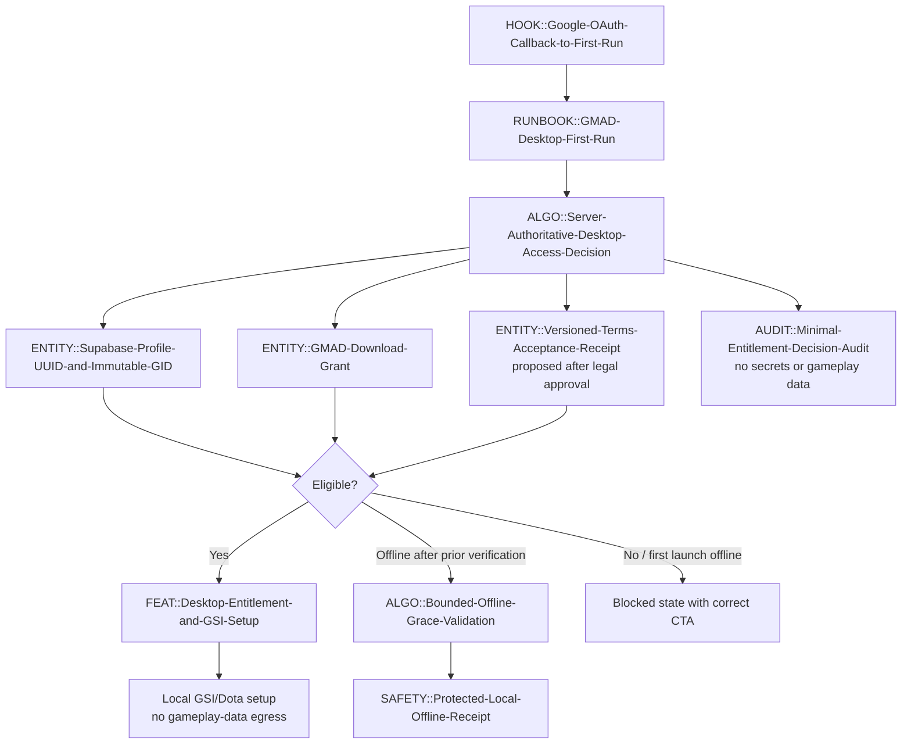

# GENESIS BLOCK — G-Maiden First-Run-to-Ready Workflow

> **Status:** Candidate design only. This block models the intended implementation boundary after
> legal approval of CR-021 and approval of CR-022. It neither declares a deployed endpoint nor
> authorizes code, schema, Supabase, landing, or production changes.

```yaml
core:
  module:
    id: "[[MOD::GMAD-Desktop-First-Run-Handoff]]"
    version: "0.1.0b"
    phase: "C-3 design approval"
    context_scaling_tier: "H3"
    cluster: "Closed-Beta-Access-Cluster"
    domain: "Account-Identity-and-Entitlement"
    layer: "Module"
    role: "orchestrator"
    status: "CANDIDATE"

  feature:
    id: "[[FEAT::Desktop-Entitlement-and-GSI-Setup]]"
    version: "0.1.0b"
    context_scaling_tier: "H3"
    cluster: "Closed-Beta-Access-Cluster"
    domain: "Desktop-Onboarding"
    layer: "Feature"
    role: "worker"
    status: "CANDIDATE"

  algorithm:
    - id: "[[ALGO::Server-Authoritative-Desktop-Access-Decision]]"
      version: "0.1.0b"
      context_scaling_tier: "H1"
      cluster: "Closed-Beta-Access-Cluster"
      domain: "Authorization"
      layer: "Logic"
      role: "authorizer"
      status: "PROPOSED"
    - id: "[[ALGO::Bounded-Offline-Grace-Validation]]"
      version: "0.1.0b"
      context_scaling_tier: "H1"
      cluster: "Closed-Beta-Access-Cluster"
      domain: "Local-Entitlement"
      layer: "Logic"
      role: "validator"
      status: "PROPOSED"

  framework:
    id: "[[FRAMEWORK::CR-021-Legal-Consent-Gate]]"
    version: "0.1.0b"
    context_scaling_tier: "H4"
    cluster: "Legal-Privacy-Access-Cluster"
    domain: "Legal-and-Privacy"
    layer: "Standard"
    role: "gatekeeper"
    status: "CANDIDATE"

  runbook:
    id: "[[RUNBOOK::GMAD-Desktop-First-Run]]"
    version: "0.1.0b"
    context_scaling_tier: "H2"
    cluster: "Closed-Beta-Access-Cluster"
    domain: "Desktop-Onboarding"
    layer: "Process"
    role: "guide"
    status: "CANDIDATE"

  concept:
    id: "[[CONCEPT::Verified-Account-to-Local-Ready-Path]]"
    version: "0.1.0b"
    context_scaling_tier: "H2"
    cluster: "Closed-Beta-Access-Cluster"
    domain: "Product-Access"
    layer: "Strategy"
    role: "objective"
    status: "CANDIDATE"

  params:
    id: "[[PARAMS::Desktop-Entitlement-Decision]]"
    version: "0.1.0b"
    context_scaling_tier: "H0"
    cluster: "Closed-Beta-Access-Cluster"
    domain: "Authorization"
    layer: "Data-Packet"
    role: "messenger"
    status: "PROPOSED"

  entity:
    - id: "[[ENTITY::Supabase-Profile-UUID-and-Immutable-GID]]"
      version: "1.0.2"
      context_scaling_tier: "H2"
      cluster: "GID-Security-Cluster"
      domain: "Account-Identity"
      layer: "Storage"
      role: "identity-source"
      status: "IMPLEMENTED"
    - id: "[[ENTITY::GMAD-Download-Grant]]"
      version: "0.2.2b"
      context_scaling_tier: "H2"
      cluster: "Closed-Beta-Access-Cluster"
      domain: "Entitlement"
      layer: "Storage"
      role: "authorization-source"
      status: "IMPLEMENTED"
    - id: "[[ENTITY::Versioned-Terms-Acceptance-Receipt]]"
      version: "0.1.0b"
      context_scaling_tier: "H2"
      cluster: "Legal-Privacy-Access-Cluster"
      domain: "Consent"
      layer: "Private-Storage"
      role: "authorization-source"
      status: "PROPOSED"

  flow:
    id: "[[FLOW::Landing-to-Desktop-Ready]]"
    version: "0.1.0b"
    context_scaling_tier: "H3"
    cluster: "Closed-Beta-Access-Cluster"
    domain: "Desktop-Onboarding"
    layer: "Execution"
    role: "pipeline"
    status: "CANDIDATE"

  safety:
    id: "[[SAFETY::Protected-Local-Offline-Receipt]]"
    version: "0.1.0b"
    context_scaling_tier: "H1"
    cluster: "Closed-Beta-Access-Cluster"
    domain: "Local-Entitlement"
    layer: "Confidentiality-and-Integrity"
    role: "guardian"
    status: "PROPOSED"

  guardrail:
    - id: "[[GUARD::Google-OAuth-Only-Identity]]"
      version: "1.0.2"
      context_scaling_tier: "H2"
      cluster: "GID-Security-Cluster"
      domain: "Authentication"
      layer: "Access-Control"
      role: "authorizer"
      status: "IMPLEMENTED"
    - id: "[[GUARD::No-Typed-GID-Steam-Or-Signed-URL-Authorization]]"
      version: "0.1.0b"
      context_scaling_tier: "H2"
      cluster: "Closed-Beta-Access-Cluster"
      domain: "Authorization"
      layer: "Access-Control"
      role: "inspector"
      status: "CANDIDATE"
    - id: "[[GUARD::Local-Only-Gameplay-Data]]"
      version: "1.0.0"
      context_scaling_tier: "H2"
      cluster: "Local-Gateway-Cluster"
      domain: "Privacy"
      layer: "Data-Boundary"
      role: "guardian"
      status: "IMPLEMENTED"

  audit:
    id: "[[AUDIT::Minimal-Entitlement-Decision-Audit]]"
    version: "0.1.0b"
    context_scaling_tier: "H1"
    cluster: "Closed-Beta-Access-Cluster"
    domain: "Security-Audit"
    layer: "Audit"
    role: "auditor"
    status: "PROPOSED"

  hook:
    id: "[[HOOK::Google-OAuth-Callback-to-First-Run]]"
    version: "1.0.0"
    context_scaling_tier: "H0"
    cluster: "GID-Security-Cluster"
    domain: "Authentication"
    layer: "Trigger"
    role: "listener"
    status: "IMPLEMENTED-NEEDS-SEC001-F6-REVIEW"

  tech_stack:
    id: "[[STACK::Tauri-React-Supabase-Google-OAuth]]"
    version: "1.0.0"
    context_scaling_tier: "H4"
    cluster: "G-Maiden-Desktop-Cluster"
    domain: "Infrastructure"
    layer: "Foundation"
    role: "foundation"
    status: "IMPLEMENTED"

  protocol:
    id: "[[PROTOCOL::Google-OAuth-PKCE-and-Protected-HTTPS-Entitlement]]"
    version: "0.1.0b"
    context_scaling_tier: "H1"
    cluster: "Closed-Beta-Access-Cluster"
    domain: "Communication"
    layer: "Protocol"
    role: "transport"
    status: "CANDIDATE"

  api:
    id: "[[API::get-gmad-desktop-entitlement]]"
    version: "0.1.0b"
    context_scaling_tier: "H1"
    cluster: "Closed-Beta-Access-Cluster"
    domain: "Authorization"
    layer: "Interface"
    role: "interface"
    status: "PROPOSED"
```

## Execution flow



## Data packet boundary

`PARAMS::Desktop-Entitlement-Decision` may contain only a server-derived decision:

```text
state, current_user_gid, current_terms_version, grant_status, checked_at,
offline_receipt_id, offline_receipt_expiry, correlation_id
```

It must not accept or return a typed GID, Steam ID, email, signed URL, installer URL, authorization
code, JWT, refresh token, raw match state, CV detection, or G-Log record.

## Batch planning

| Batch | Candidate atoms | Approval boundary |
| --- | --- | --- |
| 1 — legal and policy | `FRAMEWORK`, Terms receipt `ENTITY`, consent guardrail | Counsel and owner approval first |
| 2 — server decision | `ALGO`, `API`, grant/profile/receipt resolvers, `AUDIT` | Private schema/RLS/negative tests approved |
| 3 — desktop security | OAuth `HOOK` review, `SAFETY`, offline algorithm | SEC-001 F5/F6 review and local-storage design approved |
| 4 — first-run UX | `MODULE`, `FEATURE`, `RUNBOOK`, `FLOW` | State-machine, copy, and accessibility review approved |
| 5 — local readiness | GSI/Dota setup handoff | UAT matrix and no-egress verification pass |

## Non-negotiable guardrails

1. Google OAuth is the sole primary sign-in for landing and desktop.
2. UUID is the internal identity; GID is immutable display identity only.
3. A signed download URL and installer are never desktop credentials.
4. A first launch cannot unlock offline; a later offline grace is candidate-only and bounded.
5. Match state, CV detection, and G-Log remain local-only by default.
6. No GID/password, email/password, Steam login, or GID/Steam recovery is introduced.

## CHANGELOG

| Version | Date | Status | Summary | Commit Hash | Agent |
| --- | --- | --- | --- | --- | --- |
| 1.2.0b | 2026-07-21 | approved-pending-legal | Replaced unnecessary reader-facing GMAD naming with G-Maiden while preserving technical atom identifiers. | null | ATHER |
| 1.1.0b | 2026-07-21 | approved-pending-legal | Owner approved the workflow design; execution remains blocked by CR-021 legal approval. | null | ATHER |
| 1.0.0b | 2026-07-21 | candidate | Renamed the artifact and title to state the owned workflow explicitly: GMAD First-Run-to-Ready. | null | ATHER |
| 0.1.0b | 2026-07-21 | candidate | Initial Genesis Block for CR-022: atom composition, execution flow, data boundary, batch planning, and C-3 guardrails. | null | ATHER |
