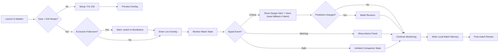

# G-Maiden UI Sitemap / User Flow / Design Board

> Product-specific design map for `G-Maiden`, the player-facing AI companion.
> Family overview: [product-family-design-map.md](product-family-design-map.md)

---

## 1. Product Boundary

`G-Maiden` คือระบบ AI companion สำหรับผู้เล่นระหว่างเล่น Dota 2
หน้าที่หลักคือช่วยเตือน, แนะนำ, พูดด้วยเสียง, และเก็บ match memory แบบ local-first
โดยไม่แย่งสมาธิจากการเล่นจริง

| Boundary | Decision |
| --- | --- |
| Primary user | Player |
| Primary job | Real-time guidance without losing focus |
| Product mood | Intimate, reactive, companion, in-game |
| Data density | Low to medium |
| Character role | Core companion presence |
| Not this | Operator graph builder, approval system, agent workflow admin |

## 2. Sitemap

```mermaid
flowchart TD
  A["G-Maiden"] --> B["Live Overlay"]
  A --> C["Companion Control"]
  A --> D["Match Memory"]
  A --> E["Persona / Voice"]
  A --> F["Settings"]

  B --> B1["Danger Alert"]
  B --> B2["Advice Panel"]
  B --> B3["G-Meter (risk gauge)"]
  B --> B4["Voice Toast (silent fallback)"]
  B --> B5["Companion Stage"]
  B --> B6["Enemy Missing Tracker"]
  B --> B7["Stat Modules (clock / KDA / gold / GPM / XPM / NW / score / HP-mana)"]
  B --> B8["Belief Revision"]
  B --> B9["Stream-safe Mode"]

  C --> C1["Status Overview"]
  C --> C2["Overlay UI Editor (drag + grid magnet + HUD ref preview)"]
  C --> C3["GSI Setup"]
  C --> C4["Module Health"]
  C --> C5["Voice Packs (bundle: upload clip/banner → active pack, activate = in-game voice, Show-on-overlay preview)"]
  C --> C6["Calibration Mode (QA audit)"]
  C --> C7["Sensitivity (Low / Med / High)"]
  C --> C8["UI Tier Picker (Lite / Full)"]
  C --> C9["Exclusive Fullscreen Warning"]
  C --> C10["Account / GID (opt-in sign-in, public OpenDota profile)"]

  D --> D1["Match Timeline"]
  D --> D2["Local Logs"]
  D --> D3["Post-match Review"]
  D --> D4["Improvement Notes"]

  E --> E1["Maiden Presence"]
  E --> E2["Voice Style"]
  E --> E3["Mood / Alert Tone"]
  E --> E4["Character Skin Future"]

  F --> F1["Overlay Position / Layout"]
  F --> F2["Privacy Local-only"]
  F --> F3["Motion Intensity"]
  F --> F4["Performance Governor"]
```

> Live Overlay (B) ของ Full tier ประกอบด้วย 12 modules ที่วาง/สเกลแยกอิสระจาก
> saved layout (peripheral-first; ค่า default แสดงเฉพาะ core modules — stat chips
> ปิดไว้เพราะ Dota แสดงอยู่แล้ว ให้ผู้เล่นเปิดเฉพาะที่ต้องการ)

## 3. User Flow

## 4. Presentation Board

### Direction

`Maiden Blue Quiet Luxury Gaming / Esport`

### Visual Priorities

- Realistic MOBA/Dota-like female support companion presence
- Dark smoked glass with Maiden blue edge light
- Low-noise overlay that never feels like a full dashboard during combat
- Soft live wallpaper and subtle character motion
- Voice, alert, and belief revision states that feel alive but not noisy
- Continuous risk gradient (no raw probability numbers shown in-game)

### Screen Directions

#### Companion Control

Player-facing control surface for setup, companion presence, overlay layout editor,
voice packs, privacy, match memory, sensitivity, calibration, and performance governor.

#### Live Overlay

In-game, peripheral-first HUD direction. Lite tier (default) ใช้ single-stack panel
ที่ stable; Full tier (opt-in) เปิด 12 modules ที่วางอิสระตาม saved layout

## 5. Component Notes

| Component | Purpose | UI notes |
| --- | --- | --- |
| `OverlayAlertBanner` | Critical danger and gank warnings | Top-center, short pulse, strong contrast, no long text. **Announcer pack banner layer:** เมื่อ event ยิงและ pack ที่ active map รูปไว้ ระบบ render banner image ของ pack บน overlay (`packBanner` ใน `App.tsx` ผ่าน event `announcer-banner`) — มี priority เหนือ lettered kill-banner ในตัว (แทนที่ card เดิม) |
| `AdvicePanel` | Maiden guidance during match | Small portrait, waveform, confidence, dismiss state |
| `GMeter` | Continuous risk gauge (G-Sentry missing + G-Signal alert) | 4-segment LED (ปลอดภัย/ระวัง/เสี่ยง/อันตราย); ไม่แสดง % — มีแต่ gradient |
| `VoiceToast` | On-screen mirror of last voice event | Silent fallback when voice pack ยังไม่มา; auto-dismiss |
| `CompanionStage` | Character presence module | Maiden portrait — Crystal Maiden stylized SVG กำลังจะมา; ตอนนี้ใช้ badge เป็น placeholder |
| `VoiceChip` | Voice/listening state | Compact, icon + text, never color-only |
| `VoicePackCard` | จัดการ voice pack แบบ **bundle** (AudioSettings.tsx) | pack = bundle: upload clip/banner เข้า pack ที่ active; activate → resolve เสียง announcer ในเกม; ปุ่ม "Play preview" (เสียง) + "Show on overlay" (`preview_announcer_event` → emit `announcer-banner` → banner+เสียงบน overlay จริงโดยไม่ต้องเข้าเกม) |
| `PrivacyChip` | Local-only assurance | Visible but quiet, stronger in settings/control |
| `LayoutEditor` | Drag editor สำหรับ Full tier (C2) | 16:9 preview, magnet grid SNAP=5, HUD reference background, per-module scale, hover-solo focus เพื่อ spotlight module เดียว |
| `SensitivityPicker` | Low / Med / High (G-Signal danger threshold) | Mirror ลง backend ผ่าน Tauri command `set_cv_signal_sensitivity`; thresholds 0.85 / 0.65 / 0.50 |
| `MotionIntensity` | User control over motion | Low / Medium / High with reduced-motion fallback |
| `PerformanceGovernor` | Protect FPS/CPU/RAM | Can degrade blur, particles, and animation |
| `ExclusiveFullscreenWarning` | Detect + warn เมื่อ Dota อยู่ใน Exclusive | Surfaced จาก `exclusive_fullscreen_active()`; แนะนำเปลี่ยนเป็น Borderless |
| `CalibrationToggle` | QA audit mode | Off by default; เปิดแล้วเก็บ screenshot + GIF clip + `audit.jsonl` ลง local เท่านั้น |
| `AccountGidPanel` (C10) | Optional Google sign-in, GID display, linked Steam/public OpenDota profile + baselines | Opt-in per ADR-11; sign-in card + GID codec `G-[Gen][Payload][Checksum]`; match/CV/G-Log stay local — see ADR-14 |

## 6. Acceptance Criteria

- [ ] G-Maiden remains player-facing and does not include operator/admin graph workflows.
- [ ] Live overlay is peripheral-first and low-noise.
- [ ] Companion control can show richer glass/character visuals than the overlay.
- [ ] Screen direction images resolve from this document.
- [ ] Motion supports alert state and companion presence without harming performance.
- [ ] Lite tier remains the stable default; Full tier is opt-in.
- [ ] Each Full module is independently positionable + scalable from a saved layout.
- [ ] G-Meter shows a continuous risk gradient (no % numbers).
- [ ] Voice events have an on-screen toast fallback when no clip plays.
- [ ] Calibration mode is off by default and writes evidence only locally.
- [ ] Exclusive Fullscreen is detected and warns the user to switch to Borderless.

---

## CHANGELOG

| Version | Date | Status | Summary | Commit Hash | Agent |
|---------|------|--------|---------|-------------|-------|
| 0.1.0b | 2026-06-24 | candidate | Initial G-Maiden-specific sitemap, user flow, presentation board, screen directions, and component notes. | pending | ATHER |
| 0.2.0 | 2026-06-26 | accepted | Reflect shipped Full overlay (12 modules), LayoutEditor (grid + HUD ref + solo focus), G-Meter, Voice Packs (Thai default), Calibration mode, Sensitivity picker, NW item derivation, Exclusive Fullscreen guard. | pending | Opus |
