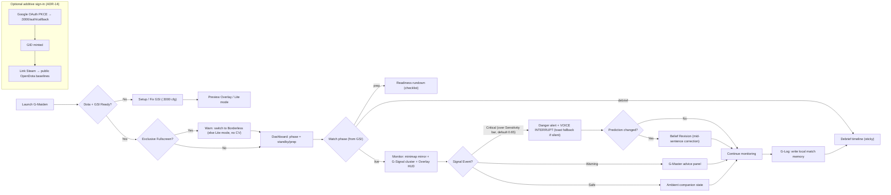
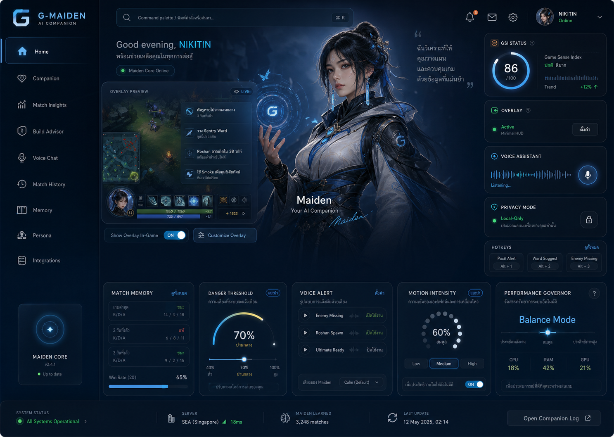
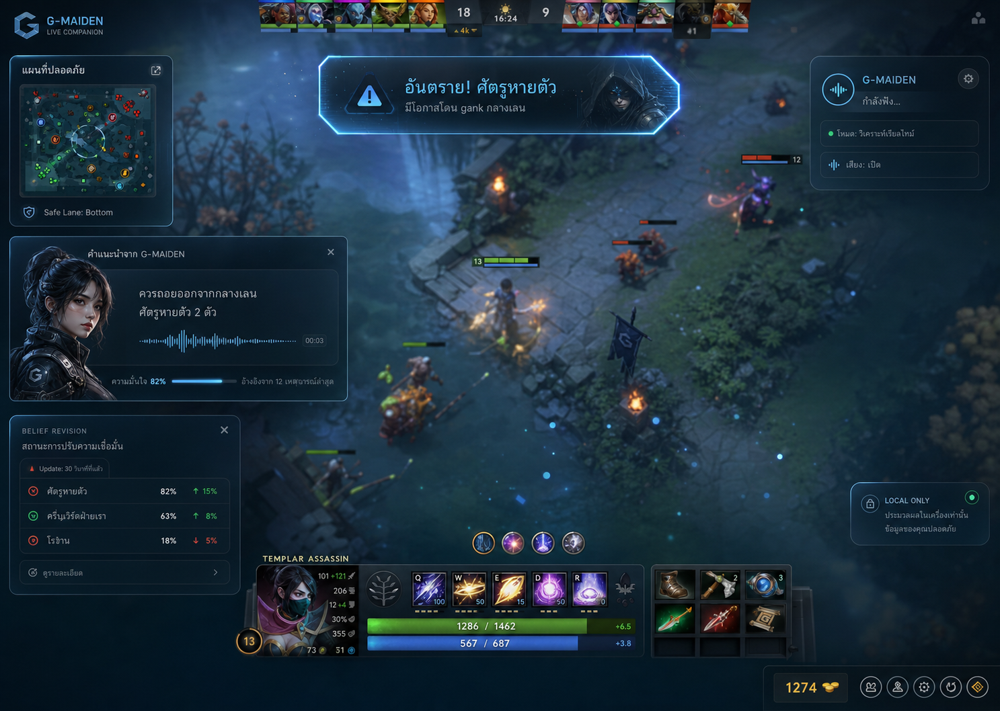

> **Geometry clarification (2026-07-19):** "fixed 1280×720 panel-world canvas" ในเอกสารนี้หมายถึง
> panel-local clip world — Deck stage จริงคือ **1420×760** (scaled-to-fit; ขอบต่างเป็น effects
> expansion zone) ดู [[03-layout]] STAGE-LOCK invariant.

# G-Maiden UI Sitemap / User Flow / Design Board

> Product-specific design map for `G-Maiden`, the player-facing AI companion.
> Family overview: [[product-family-design-map]]
>
> **Layering (read this first):** the **Deck / navigation** layer's authoritative SSOT is
> [[05-sitemap-ia|docs/design-system/05-sitemap-ia.md]] (CR-013 ONE CANVAS).
> This board is the higher-level **product-boundary + user-flow + Overlay** map; it stays
> authoritative for the **Overlay (Combat HUD)** layer (§5) and the presentation direction.
> Feature → file → status lives in [`PROJECT_FEATURE_MAP.md`](../../PROJECT_FEATURE_MAP.md).

---

## 1. Product Boundary

`G-Maiden` คือระบบ AI companion สำหรับผู้เล่นระหว่างเล่น Dota 2
หน้าที่หลักคือช่วยเตือน, แนะนำ, พูดด้วยเสียง, และเก็บ match memory แบบ local-first
โดยไม่แย่งสมาธิจากการเล่นจริง

| Boundary | Decision |
| --- | --- |
| Primary user | Player |
| Primary job | Real-time guidance without losing focus |
| Product mood | Intimate, reactive, companion, in-game |
| Data density | Low to medium |
| Character role | Core companion presence |
| Not this | Operator graph builder, approval system, agent workflow admin |

## 2. Sitemap (ONE CANVAS, [[CR-013-one-canvas-sitemap-gstore-ios-settings|CR-013]])

G-Maiden มี **สองหน้าต่าง** (routing ใน [`src/src/App.tsx`](file:///g:/G-Maiden/src/src/App.tsx)): **Control** (Command Deck — หน้าต่างหลัก)
และ **Overlay** (Combat HUD — โปร่ง click-through บนเกม). Deck คือ **ONE CANVAS 7 หน้า**
(single source [`src/src/shortcuts.ts`](file:///g:/G-Maiden/src/src/shortcuts.ts) [`PAGES`](file:///g:/G-Maiden/src/src/shortcuts.ts#L72), `Ctrl+1..7`); Build ยุบเข้า Live, History ยุบเข้า Insights.

```mermaid
flowchart TD
  A["G-Maiden"] --> CTRL["Control — Command Deck (7 pages, Ctrl+1..7)"]
  A --> OV["Overlay — Combat HUD (transparent, over game)"]

  CTRL --> P1["1 · Dashboard (phase-aware)"]
  CTRL --> P2["2 · Live  [สด | บิลด์]"]
  CTRL --> P3["3 · Voice (packs)"]
  CTRL --> P4["4 · G-Store  [ร้านค้า | กระเป๋า | คลัง | บันทึก]"]
  CTRL --> P5["5 · Insights  [ภาพรวม | ประวัติ]"]
  CTRL --> P6["6 · Account (GID)"]
  CTRL --> P7["7 · Settings (iOS split, 7 categories)"]

  P1 --> PH["Phase axis: standby → prep → live → debrief"]
  P1 --> AR["Audio rail (volume + ANN/SIGNAL) — not nav"]

  P7 --> S1["ทั่วไป"] & S2["Overlay"] & S3["เสียง & เตือน"] & S4["AI (G-Master)"]
  P7 --> S5["โมดูล & CV"] & S6["ความเป็นส่วนตัว"] & S7["ระบบ"]

  OV --> B1["Danger Alert / gank banner"]
  OV --> B2["Advice Panel (G-Master)"]
  OV --> B3["G-Meter (risk gauge)"]
  OV --> B4["Voice Toast + announcer pack banner"]
  OV --> B5["Companion Stage"]
  OV --> B6["Enemy Missing Tracker"]
  OV --> B7["Buyback / G-Revive verdict"]
  OV --> B8["Stat Modules — toggleable (clock/KDA/gold/GPM/XPM/NW/score/HP-mana)"]
  OV --> B9["Belief Revision"]

  CROSS["Maiden Line — command palette Ctrl+K (cross-cuts all axes)"]
```

**Three axes, never mix** ([[05-sitemap-ia]] §2):
1. **Sidebar FAB** = the only real nav → switches page (`PAGES`, `Ctrl+1..7`).
2. **Audio rail** (replaces old P1–P5 anchor rail) = **not nav** → master volume + ANN/SIGNAL on Dashboard.
3. **Phase axis** = **not nav, does not move layout** → Dashboard sector content swaps by match state.

> **สถานะ (v0.13.0, 2026-07-19): Lite/Full ถูกยุบรวมเป็น overlay เดียว** — สวิตช์ Lite/Full ถูกเอาออก,
> `uiMode` ถูกบังคับเป็น `'full'` เสมอ. ทุกโมดูล (kill card, banner, low-HP warning, volume rail,
> standby chip, stats) เป็น**โมดูลอิสระ**ที่เปิด/ปิด, ย่อ-ขยาย, และวาง/สเกลแยกอิสระจาก saved layout
> ผ่าน Layout Editor ได้เหมือนกันหมด (peripheral-first; default แสดงเฉพาะ core — stat chips ปิดไว้
> เพราะ Dota แสดงอยู่แล้ว).

## 3. User Flow

Global hotkeys (unchanged): **Ctrl+Alt+S** (hide/show overlay), **Alt+↑/↓** (volume ±10%), **Alt+M** (mute toggle).

## 4. Presentation Board

### Direction

`Maiden Blue Quiet Luxury Gaming / Esport` — COLD BOOTH broadcast language ([[CR-011-cold-booth-ux-direction|CR-011]]).

### Visual Priorities

- Realistic MOBA/Dota-like female support companion presence
- Dark smoked glass with Maiden blue edge light (COLD BOOTH sector frame + instrument matte)
- Low-noise overlay that never feels like a full dashboard during combat
- Soft live wallpaper and subtle character motion
- Voice, alert, and belief revision states that feel alive but not noisy
- Continuous risk gradient (no raw probability numbers shown in-game)

### Screen Directions

#### Command Deck (Control)

The player-facing control surface — now the **ONE CANVAS deck** of 7 nav pages (broadcast "booth"),
not a single control screen. Each page is a fixed 1280×720 panel-world canvas (§2.2 laws). Dashboard
is phase-aware; setup/health/privacy/updates live under Settings' iOS split view.

#### Live Overlay

In-game, peripheral-first HUD direction. **v0.13.0: merged into one positionable overlay** — no
more Lite/Full switch; every module is independently toggle/resize/drag-positioned via the
Layout Editor.

## 5. Overlay Component Notes (Combat HUD — authoritative here)

> Contract: [[07-combat-hud|docs/design-system/07-combat-hud.md]].
> The Overlay window is separate from the Deck and may use the legacy `C` inline palette.

| Component | Purpose | UI notes |
| --- | --- | --- |
| `OverlayAlertBanner` | Critical danger / gank warnings | Top-center, short pulse, strong contrast. **Announcer pack banner layer:** เมื่อ event ยิงและ pack ที่ active map รูปไว้ → render banner image ของ pack ([`packBanner`](file:///g:/G-Maiden/src/src/App.tsx) ใน [`App.tsx`](file:///g:/G-Maiden/src/src/App.tsx) ผ่าน event `announcer-banner`) — priority เหนือ lettered kill-banner (แทน card เดิม) |
| `AdvicePanel` | Maiden guidance (G-Master) | Small portrait, waveform, confidence, dismiss state; 20s auto-dismiss |
| `GMeter` | Continuous risk gauge (G-Sentry missing + G-Signal alert) | 4-segment LED (ปลอดภัย/ระวัง/เสี่ยง/อันตราย); ไม่แสดง % — gradient only |
| `VoiceToast` | On-screen mirror of last voice event | Silent fallback when voice pack ยังไม่มา; auto-dismiss |
| `BuybackVerdict` | G-Revive buyback advice | Verdict + narrative on death |
| `CompanionStage` | Character presence module | Crystal Maiden stylized SVG กำลังมา; ตอนนี้ badge placeholder |
| `VoicePackCard` | จัดการ voice pack แบบ **bundle** ([`AudioSettings.tsx`](file:///g:/G-Maiden/src/src/AudioSettings.tsx)) | upload clip/banner → active pack; activate → resolve เสียงในเกม; "Play preview" + "Show on overlay" ([`preview_announcer_event`](file:///g:/G-Maiden/src-tauri/src/main.rs) → `announcer-banner`) |
| ~~`LayoutEditor`~~ | **ลบแล้ว 2026-08-11** — ย้ายไป G-AnnStudio **Overlay Lab** (`packages/ann-studio/src/src/components/OverlayLab.tsx`) | Lab วาดโมดูลขนาดจริงทับภาพ HUD ของ Dota, เตือนเมื่อทับโซนเกม, ตรวจทั้งจอในเกมและก่อนเกม แล้ว Sync กลับผ่าน `sync_overlay_layout` → event `overlay-layout-sync`; `Settings.layout` ยังเป็นแหล่งความจริงเดิม |
| `SensitivityPicker` | G-Signal danger threshold | Mirror → [`set_cv_signal_sensitivity`](file:///g:/G-Maiden/src-tauri/src/main.rs); thresholds 0.85 / 0.65 / 0.50 |
| `MotionIntensity` | Motion control | Low / Medium / High + reduced-motion fallback |
| `PerformanceGovernor` | Protect FPS/CPU/RAM | Degrades blur / particles / animation; quality tiers cinematic/balanced/eco |
| `ExclusiveFullscreenWarning` | Detect + warn เมื่อ Dota อยู่ใน Exclusive | จาก [`exclusive_fullscreen_active()`](file:///g:/G-Maiden/src-tauri/src/setup.rs#L72); แนะนำ Borderless (else Lite mode = ไม่มี CV) |
| `CalibrationToggle` | QA audit mode | Off by default; screenshot + GIF + `audit.jsonl` local only |

> **Deck components** (nav rail, ON AIR utterance console, phase chip, DeckTabs, Maiden Line,
> Settings split view, G-Store tabs) are documented in [[05-sitemap-ia|05-sitemap-ia.md]] + [[04-components|04-components.md]]
> and mapped in `PROJECT_FEATURE_MAP.md` — they are not re-listed here to keep one SSOT each.

## 6. Acceptance Criteria

- [ ] G-Maiden remains player-facing and does not include operator/admin graph workflows.
- [ ] Deck is ONE CANVAS: **R1** no page-level scrollbar (only bounded sub-regions scroll); **R2** overflow → `DeckTabs` tab or `rowsThatFit()` pagination (never stretch/shrink font); **R3** COLD BOOTH `--g-*` tokens only on Deck surfaces (legacy `C` hex = Overlay only).
- [ ] Nav is a single source: [`PAGES`](file:///g:/G-Maiden/src/src/shortcuts.ts#L72) ([`shortcuts.ts`](file:///g:/G-Maiden/src/src/shortcuts.ts)) drives rail + `Ctrl+1..7` + Maiden Line + sheet — no drift.
- [ ] Phase axis (standby→prep→live→debrief) swaps Dashboard content **without moving geometry**.
- [ ] Live overlay is peripheral-first and low-noise; one merged overlay (no Lite/Full tier as of v0.13.0).
- [ ] Every module is independently positionable + scalable from a saved layout.
- [ ] G-Meter shows a continuous risk gradient (no % numbers).
- [ ] Voice events have an on-screen toast fallback when no clip plays.
- [ ] Calibration mode is off by default and writes evidence only locally.
- [ ] Exclusive Fullscreen is detected and warns the user to switch to Borderless.
- [ ] Screen direction images resolve from this document.

---

## CHANGELOG

| Version | Date | Status | Summary | Commit Hash | Agent |
|---------|------|--------|---------|-------------|-------|
| 0.1.0b | 2026-06-24 | candidate | Initial G-Maiden-specific sitemap, user flow, presentation board, screen directions, component notes. | pending | ATHER |
| 0.2.0 | 2026-06-26 | accepted | Reflect shipped Full overlay (12 modules), LayoutEditor, G-Meter, Voice Packs (Thai default), Calibration, Sensitivity picker, NW item derivation, Exclusive Fullscreen guard. | pending | Opus |
| 0.3.0 | 2026-07-17 | accepted | **CR-013 ONE CANVAS refresh.** Rebuild sitemap to 7-page deck (Build→Live tab, History→Insights tab, new G-Store, Account as page, Settings iOS split view); add phase axis + Maiden Line + 3 axes + R1/R2/R3 laws; add sign-in flow; scope this board to Overlay + product-boundary and cross-ref `05-sitemap-ia.md` (Deck SSOT) + `PROJECT_FEATURE_MAP.md`. | pending | Opus |
| 0.3.1 | 2026-07-19 | accepted | **v0.13.0 overlay merge.** Lite/Full tier split removed (Lite/Full switch gone, `uiMode` forced `'full'`); every overlay module (kill card, banner, low-HP warning, volume rail, standby chip, stats) is now independently positionable via Layout Editor — updated §2 sitemap note, §4 Live Overlay direction, §5 `LayoutEditor` row, and acceptance criteria accordingly. | pending | docs-accuracy-pass |
| 0.3.2 | 2026-07-19 | + geometry clarification banner (panel-world ≠ stage; stage = 1420×760) — design-doc audit |
| 0.3.3 | 2026-07-19 | link/metadata sweep (G1.5) — wikilink/symbol-link fixes only, no content change |
