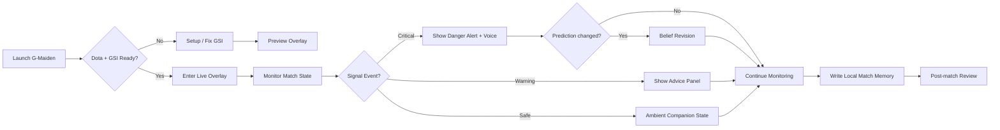

# G-Maiden UI Sitemap / User Flow / Design Board

> Product-specific design map for `G-Maiden`, the player-facing AI companion.
> Family overview: [product-family-design-map.md](product-family-design-map.md)

---

## 1. Product Boundary

`G-Maiden` คือระบบ AI companion สำหรับผู้เล่นระหว่างเล่น Dota 2
หน้าที่หลักคือช่วยเตือน, แนะนำ, พูดด้วยเสียง, และเก็บ match memory แบบ local-first
โดยไม่แย่งสมาธิจากการเล่นจริง

| Boundary | Decision |
| --- | --- |
| Primary user | Player |
| Primary job | Real-time guidance without losing focus |
| Product mood | Intimate, reactive, companion, in-game |
| Data density | Low to medium |
| Character role | Core companion presence |
| Not this | Operator graph builder, approval system, agent workflow admin |

## 2. Sitemap

```mermaid
flowchart TD
  A["G-Maiden"] --> B["Live Overlay"]
  A --> C["Companion Control"]
  A --> D["Match Memory"]
  A --> E["Persona / Voice"]
  A --> F["Settings"]

  B --> B1["Danger Alert"]
  B --> B2["Advice Panel"]
  B --> B3["Resource HUD"]
  B --> B4["Belief Revision"]
  B --> B5["Stream-safe Mode"]

  C --> C1["Status Overview"]
  C --> C2["Overlay Preview"]
  C --> C3["GSI Setup"]
  C --> C4["Module Health"]

  D --> D1["Match Timeline"]
  D --> D2["Local Logs"]
  D --> D3["Post-match Review"]
  D --> D4["Improvement Notes"]

  E --> E1["Maiden Presence"]
  E --> E2["Voice Style"]
  E --> E3["Mood / Alert Tone"]
  E --> E4["Character Skin Future"]

  F --> F1["Overlay Position"]
  F --> F2["Privacy Local-only"]
  F --> F3["Motion Intensity"]
  F --> F4["Performance Governor"]
```

## 3. User Flow

## 4. Presentation Board

### Direction

`Maiden Blue Quiet Luxury Gaming / Esport`

### Visual Priorities

- Realistic MOBA/Dota-like female support companion presence
- Dark smoked glass with Maiden blue edge light
- Low-noise overlay that never feels like a full dashboard during combat
- Soft live wallpaper and subtle character motion
- Voice, alert, and belief revision states that feel alive but not noisy

### Screen Directions

#### Companion Control

Player-facing control surface for setup, companion presence, overlay preview, voice, privacy, match memory, and performance governor.

#### Live Overlay

In-game, peripheral-first HUD direction. The overlay should stay light, readable, and avoid blocking core gameplay zones.

## 5. Component Notes

| Component | Purpose | UI notes |
| --- | --- | --- |
| `OverlayAlertBanner` | Critical danger and gank warnings | Top-center, short pulse, strong contrast, no long text |
| `AdvicePanel` | Maiden guidance during match | Small portrait, waveform, confidence, dismiss state |
| `VoiceChip` | Voice/listening state | Compact, icon + text, never color-only |
| `PrivacyChip` | Local-only assurance | Visible but quiet, stronger in settings/control |
| `CompanionStage` | Character presence | Realistic portrait/live wallpaper, not blocking controls |
| `MotionIntensity` | User control over motion | Low / Medium / High with reduced-motion fallback |
| `PerformanceGovernor` | Protect FPS/CPU/RAM | Can degrade blur, particles, and animation |

## 6. Acceptance Criteria

- [ ] G-Maiden remains player-facing and does not include operator/admin graph workflows.
- [ ] Live overlay is peripheral-first and low-noise.
- [ ] Companion control can show richer glass/character visuals than the overlay.
- [ ] Screen direction images resolve from this document.
- [ ] Motion supports alert state and companion presence without harming performance.

---

## CHANGELOG

| Version | Date | Status | Summary | Commit Hash | Agent |
|---------|------|--------|---------|-------------|-------|
| 0.1.0b | 2026-06-24 | candidate | Initial G-Maiden-specific sitemap, user flow, presentation board, screen directions, and component notes. | pending | ATHER |
