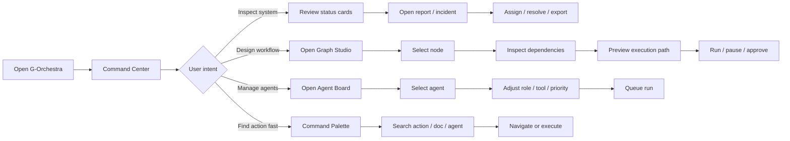
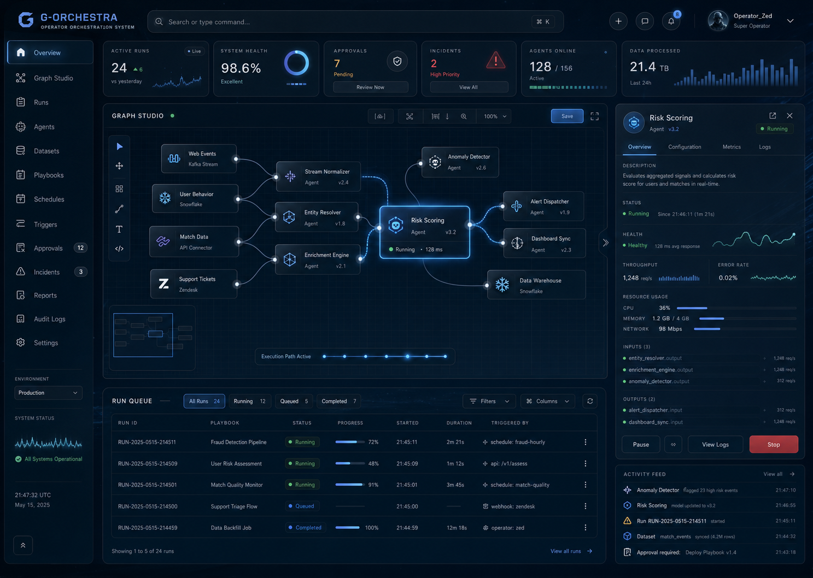

# G-Orchestra UI Sitemap / User Flow / Design Board

> Product-specific design map for `G-Orchestra`, the operator / builder orchestration system.
> Family overview: [product-family-design-map.md](product-family-design-map.md)

---

## 1. Product Boundary

`G-Orchestra` คือระบบ orchestration สำหรับ operator, builder, หรือ creator
ที่ต้องจัดการ agents, workflows, graph, runs, reports, approvals, และ automation state
ระบบนี้แยกจาก `G-Maiden` แต่ใช้ shared theme เดียวกัน

| Boundary | Decision |
| --- | --- |
| Primary user | Operator / builder / creator |
| Primary job | Coordinate agents, graph, runs, approvals, and reports |
| Product mood | Command, orchestration, builder, control room |
| Data density | Medium to high |
| Character role | Ambient brand presence only |
| Not this | Player live overlay, voice companion, in-game warning HUD |

## 2. Sitemap

```mermaid
flowchart TD
  A["G-Orchestra"] --> B["Command Center"]
  A --> C["Graph Studio"]
  A --> D["Agent Board"]
  A --> E["Run Queue"]
  A --> F["Reports / Incidents"]
  A --> G["Approval Center"]
  A --> H["Workspace Settings"]

  B --> B1["Workspace Status"]
  B --> B2["Active Runs"]
  B --> B3["System Health"]
  B --> B4["Command Palette"]

  C --> C1["Node Graph"]
  C --> C2["Workflow Mapping"]
  C --> C3["Dependency Path"]
  C --> C4["Node Inspector"]

  D --> D1["Agent Cards"]
  D --> D2["Roles / Skills"]
  D --> D3["Tool Access"]
  D --> D4["Cooldown / Availability"]

  E --> E1["Kanban Board"]
  E --> E2["Task Detail Drawer"]
  E --> E3["Execution Timeline"]
  E --> E4["Retry / Pause / Resume"]

  F --> F1["Incident Report"]
  F --> F2["Telemetry Chart"]
  F --> F3["Export / Share"]
  F --> F4["Audit Trail"]

  G --> G1["Pending Decisions"]
  G --> G2["Access / Share Modal"]
  G --> G3["Run Approval"]
  G --> G4["Billing / Cost Review Future"]
```

## 3. User Flow

## 4. Presentation Board

### Direction

`Maiden Blue Quiet Luxury Gaming / Esport`, adapted into an operator command system.

### Visual Priorities

- Graph and workflow hierarchy are the main focus
- Denser glass panels than G-Maiden, but still calm and readable
- Maiden blue/cyan traces for active execution paths
- Operator-grade command palette, inspector, run queue, approval surface
- Ambient brand avatar/silhouette only; character should not compete with graph/data

### Screen Direction

#### Graph Command Center

Operator-facing orchestration surface. Graph, run queue, inspector, approvals, and incidents are the primary hierarchy.

## 5. Component Notes

| Component | Purpose | UI notes |
| --- | --- | --- |
| `CommandPalette` | Fast navigation and action execution | Top-level primary control, keyboard-first |
| `GraphNode` | Workflow unit / agent / dataset / action | Blue active edge, status icon + text, not color-only |
| `GraphPath` | Execution path preview | Soft cyan pulse, clear selected path, reduced-motion fallback |
| `InspectorDrawer` | Selected node/agent detail | Right side, tabs for overview/config/metrics/logs |
| `RunQueue` | Active and historical runs | Table layout, progress, status, duration, trigger source |
| `ApprovalModal` | Human decision point | Strong scrim, clear approve/reject, audit trail hint |
| `IncidentCard` | Operational alert | Severity, owner, timestamp, action path |

## 6. Acceptance Criteria

- [ ] G-Orchestra remains operator-facing and does not include live in-game companion HUD.
- [ ] Graph Studio, Run Queue, and Inspector are the core hierarchy.
- [ ] Screen direction image resolves from this document.
- [ ] The shared Maiden theme is visible without making the product feel like G-Maiden.
- [ ] Motion communicates orchestration state, execution path, drawer expansion, and approval focus.

---

## CHANGELOG

| Version | Date | Status | Summary | Commit Hash | Agent |
|---------|------|--------|---------|-------------|-------|
| 0.1.0b | 2026-06-24 | candidate | Initial G-Orchestra-specific sitemap, user flow, presentation board, screen direction, and component notes. | pending | ATHER |
