# G-Maiden Current First-Run User Flow Walkthrough

> เอกสารนี้เป็น evidence walkthrough ของ surface ปัจจุบันสำหรับ flow
> `invitation -> landing -> terms/privacy -> desktop sign-in -> entitlement states -> account/setup -> dashboard`
> โดยแยกชัดเจนว่า screenshot ไหนเป็น production page จริง, ไหนเป็น current desktop surface จริง,
> ไหนเป็น current state harness จาก logic ปัจจุบัน, ไหนเป็น runtime window จริงบนเครื่องนี้,
> และไหนยังต้องใช้ entitled session จริงจึงจะเก็บหลักฐานต่อได้

## 1. ขอบเขตและระดับหลักฐาน

| ระดับหลักฐาน | ความหมาย |
| --- | --- |
| `mailbox transcript render` | render จาก mailbox record จริงที่อ่านได้จาก Gmail tool; ใช้ยืนยันเนื้อหาอีเมล แต่ไม่ใช่ Gmail UI screenshot |
| `production browser` | จับภาพจาก production URL ที่ใช้งานอยู่จริง |
| `current web build` | จับภาพจาก UI ปัจจุบันของ desktop flow ที่ render จาก current source/build |
| `current component surface` | จับภาพจาก component ปัจจุบันโดย mount ตรงเพื่อดูหน้าจอจริงของหน้า Account/Dashboard; ไม่ใช่หลักฐานว่า entitlement ผ่านแล้ว |
| `current state harness` | จับภาพจาก state simulation ที่ใช้ branch/copy/CTA ของ gate ปัจจุบันเพื่อยืนยัน UX แต่ยังไม่ใช่ proof จาก backend production state |
| `runtime window capture` | จับภาพจากหน้าต่าง executable/runtime ที่กำลังรันอยู่จริงบนเครื่องนี้; ใช้ยืนยันสิ่งที่ runtime แสดง ณ เวลาจับภาพ แม้อาจ drift จาก current source |
| `not captured` | ยังไม่มีภาพหลักฐานจากเครื่องนี้ เพราะต้องใช้ invited / entitled session จริง หรือเป็น artifact นอก repo |

## 2. User flow ปัจจุบัน

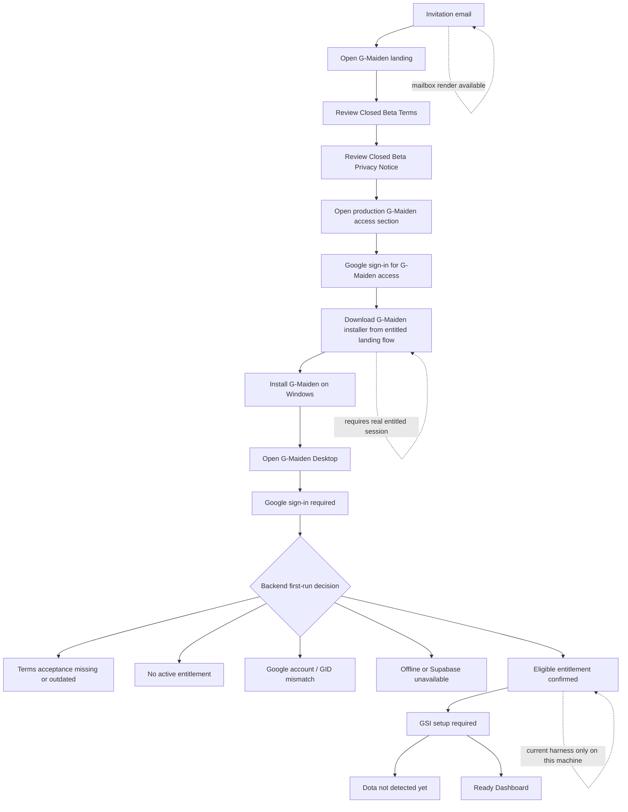

## 3. Step-by-step walkthrough

### 3.1 Invitation email

หลักฐาน: `mailbox transcript render`

รอบนี้มี mailbox record จริงของ invitation email แล้ว และ render เป็นภาพอ้างอิงเพื่อยืนยัน copy/CTA ของอีเมล โดยไม่แสร้งว่าเป็น Gmail UI screenshot

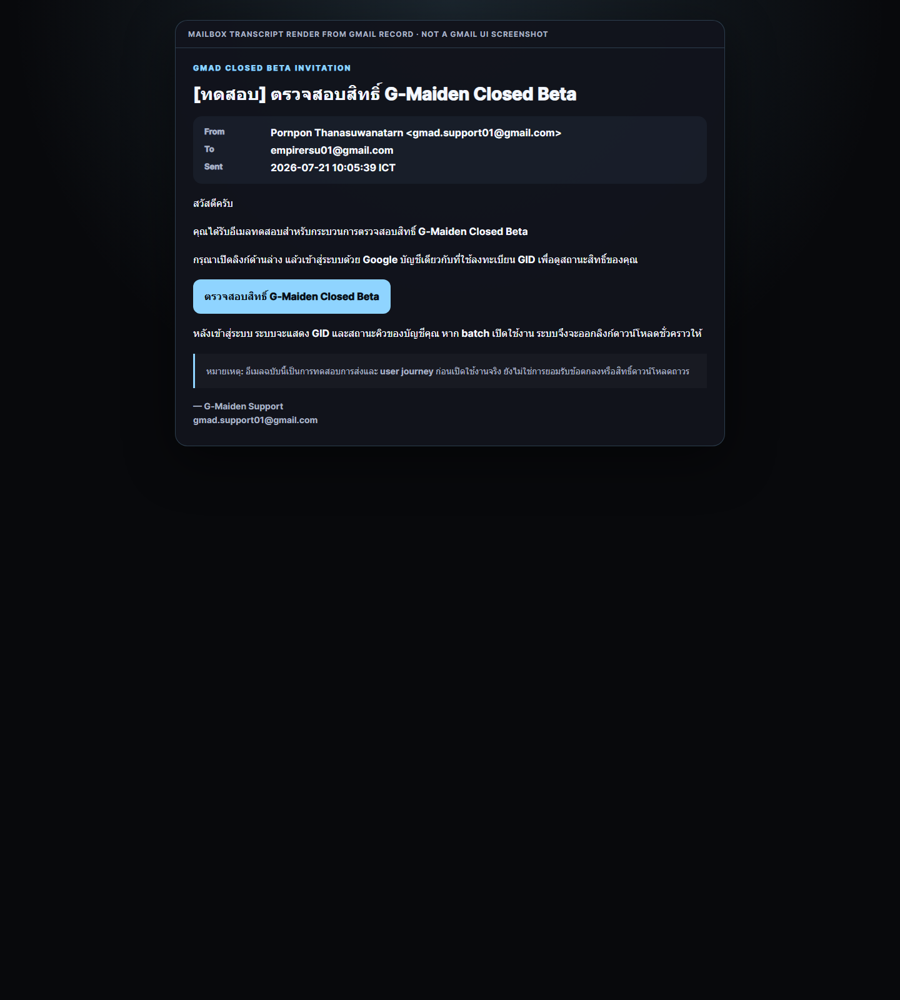

สิ่งที่ flow นี้ยืนยัน:
- email เป็นตัวพาผู้ใช้กลับมาที่ landing เท่านั้น
- email ไม่ใช่ bearer download credential
- email ไม่ใช่ desktop session credential
- copy ปัจจุบันของอีเมลชี้ไปที่ `https://g-maiden-landing.vercel.app/#gmad`

ข้อจำกัด:
- ภาพนี้เป็น mailbox transcript render จาก record จริง
- ยังไม่ใช่ screenshot จาก Gmail client UI

### 3.2 Landing entry

หลักฐาน: `production browser`

ภาพนี้คือหน้า landing production ปัจจุบันที่ผู้ใช้เห็นก่อนเข้าสู่ flow Closed Beta

หมายเหตุ:
ภาพนี้เป็น viewport ตอนต้นหน้าและยืนยัน visual entry + CTA ระดับบนของ production landing

### 3.2.1 G-Maiden landing section (signed-out)

หลักฐาน: `production browser`

นี่คือ production `#gmad` section ที่จับภาพตรงจาก landing ปัจจุบันในสถานะ signed-out เพื่อยืนยันว่า flow ดาวน์โหลดยังถูกผูกไว้กับการเข้าสู่ระบบ Google ก่อน

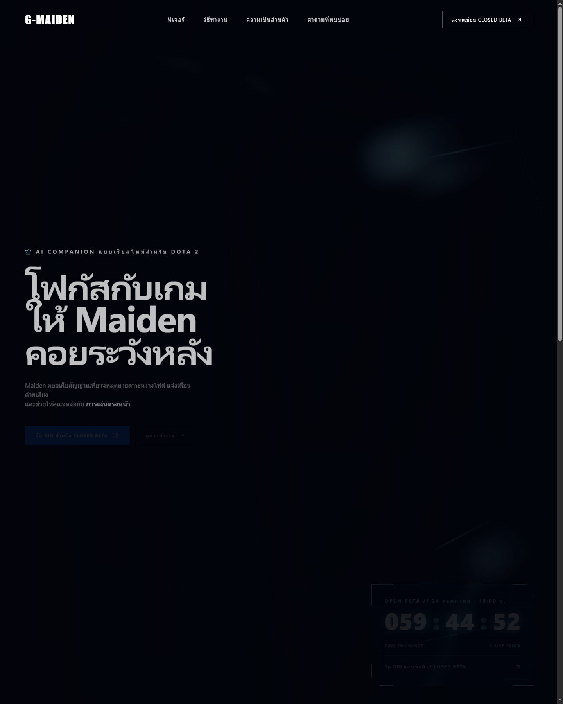

สิ่งที่ยืนยันได้จากภาพ:
- มี section `GMAD BETA ACCESS` บน production จริง
- เมื่อยังไม่ sign-in ระบบบอกให้เข้าสู่ระบบ Google ก่อน
- ไม่เปิดช่องให้กรอก GID เองเพื่อขอสิทธิ์ดาวน์โหลด

### 3.3 Closed Beta Terms

หลักฐาน: `production browser`

ผู้ใช้ต้องอ่าน Terms เวอร์ชันปัจจุบันก่อนผ่าน gate ดาวน์โหลด/ใช้งาน G-Maiden

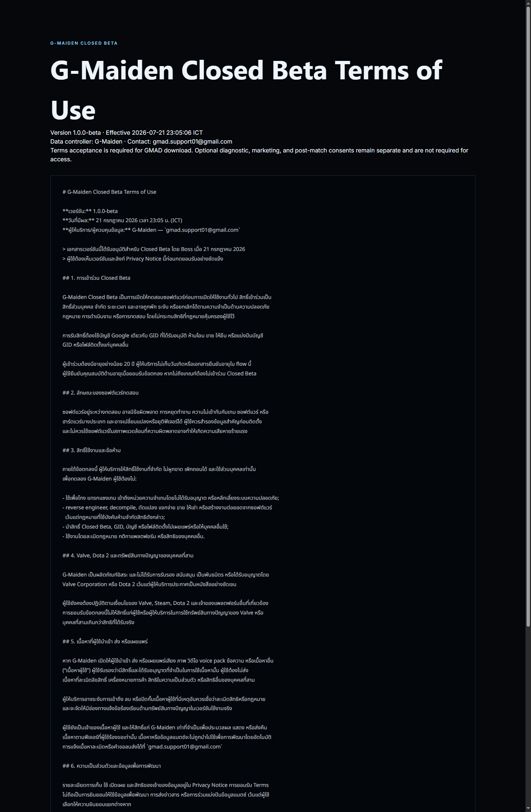

สิ่งที่ยืนยันได้จากภาพ:
- หน้า Terms production มี document title ชัดเจน
- แสดง version และ effective datetime
- แสดง data controller/contact ในหน้าเดียวกัน

ข้อเท็จจริงของ implementation ปัจจุบันที่ต้องแยกจากภาพ:
- production landing เปิด Terms และ Privacy เป็นคนละหน้า
- แต่ใน `available` state ของ `landing/src/App.tsx` ปัจจุบัน ใช้ required checkbox เดียวที่อ้างถึงการยอมรับ Terms และการรับทราบ Privacy พร้อมกัน
- รอบนี้ยังไม่มี screenshot ของ `available` state จริง เพราะต้องใช้ entitled session production

### 3.4 Closed Beta Privacy Notice

หลักฐาน: `production browser`

Privacy Notice เป็นเอกสารคู่กับ Terms สำหรับ flow ปัจจุบัน

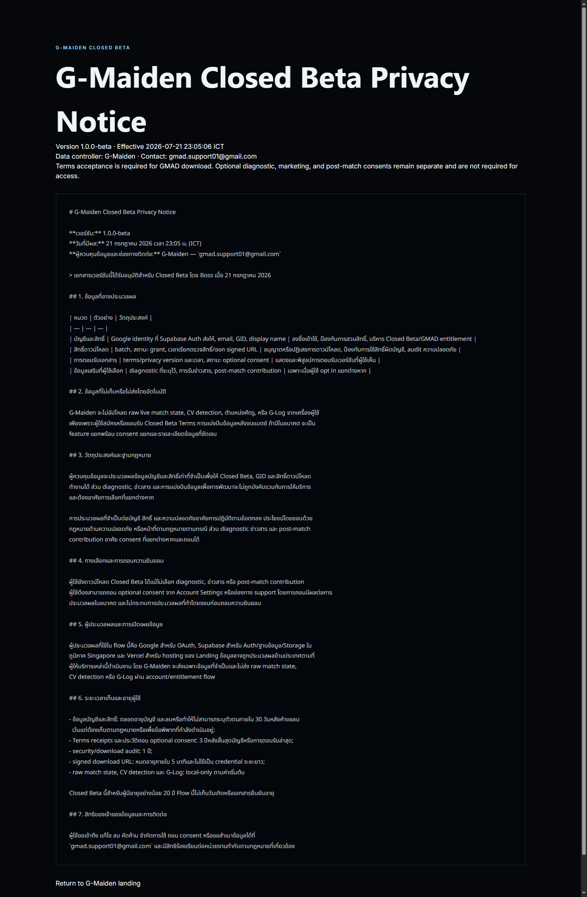

สิ่งที่ยืนยันได้จากภาพ:
- มีหน้า Privacy production แยกจาก Terms
- แสดง version และ effective datetime
- ย้ำว่า Terms acceptance เป็น required แต่ optional consent ต้องแยก

ข้อเท็จจริงของ implementation ปัจจุบันที่ต้องแยกจากภาพ:
- optional consents ใน landing available state ยังแยก checkbox ของตนเอง
- แต่ required acceptance ของ Terms/Privacy ยังถูกแสดงเป็น control เดียวใน flow ดาวน์โหลดปัจจุบัน

### 3.5 Desktop first-run gate

หลักฐาน: `current web build`

นี่คือ first-run gate ปัจจุบันของ G-Maiden desktop flow ที่บังคับ Google sign-in ก่อนเข้าหน้าใช้งาน

สิ่งที่ยืนยันได้จากภาพ:
- ใช้ข้อความ `GMAD CLOSED BETA`
- CTA หลักคือ `ดำเนินการต่อด้วย Google`
- ไม่มีช่องให้กรอก GID เอง

### 3.6 Account surface

หลักฐาน: `current component surface`

นี่คือหน้า Account ปัจจุบันของ desktop ซึ่งรวม sign-in, Steam link, และ profile surface ไว้ในหน้าเดียว

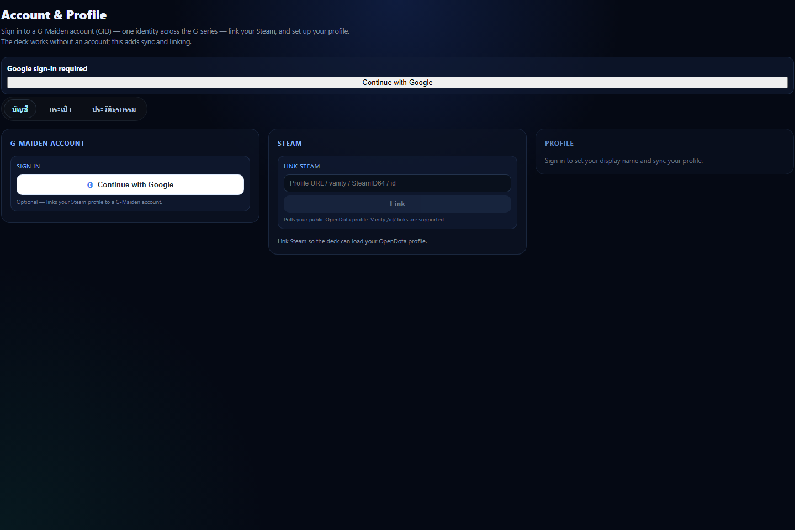

ข้อจำกัดของหลักฐานนี้:
- เป็น current component surface จริงจาก source ปัจจุบัน
- ไม่ใช่หลักฐานว่าบัญชีนี้ผ่าน entitlement แล้ว
- ใช้ยืนยัน layout และ copy ของหน้า Account ปัจจุบันเท่านั้น

### 3.7 Entitlement confirmed

หลักฐาน: `current state harness`

รอบนี้มีภาพ state จำลองจาก gate logic ปัจจุบันเพิ่มแล้ว เพื่อยืนยันว่าหน้าจอหลัง entitlement ผ่านควรพาผู้ใช้ไป setup ให้เร็วที่สุด และเมื่อ setup พร้อมต้องพาเข้า dashboard ต่อได้ทันที

กรณี entitlement ผ่านแล้วแต่ยังต้อง setup GSI/Dota:

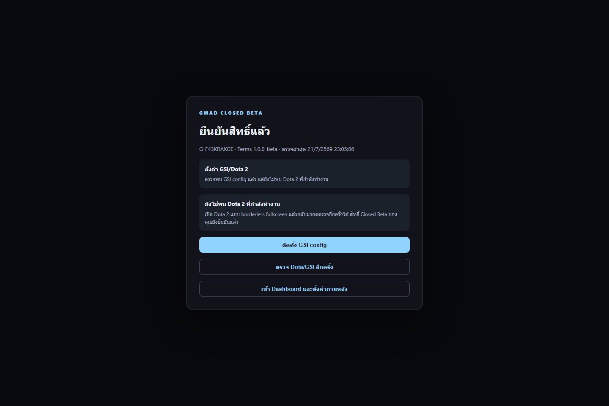

กรณี entitlement ผ่านแล้วและพร้อมเข้า dashboard:

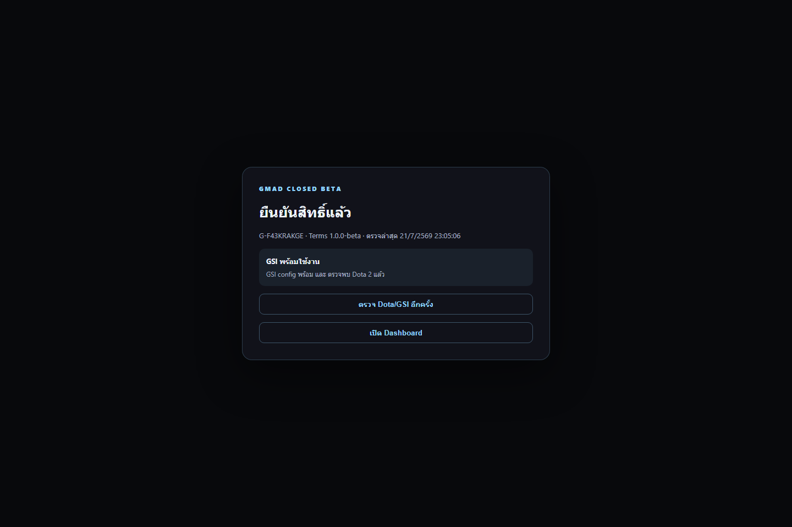

ข้อจำกัดของหลักฐานนี้:
- เป็น state simulation จาก branch/copy/CTA ของ `GmadFirstRunGate` ปัจจุบัน
- ใช้ยืนยัน UX และข้อความของ state `eligible`
- ยังไม่ใช่ production proof จาก granted session จริง

### 3.8 Blocked and recovery states

หลักฐาน: `current state harness`

รอบนี้เพิ่มภาพ state สำคัญที่ CR-022 ต้องออกแบบและตรวจให้ครบ แม้บนเครื่องนี้ยังไม่ได้ผูกกับ backend state production จริง

กำลัง sign-in:

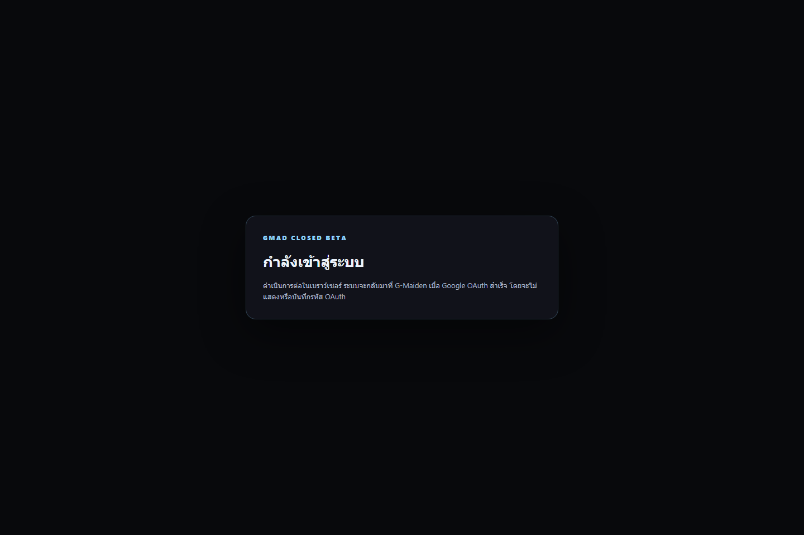

Terms acceptance missing or outdated:

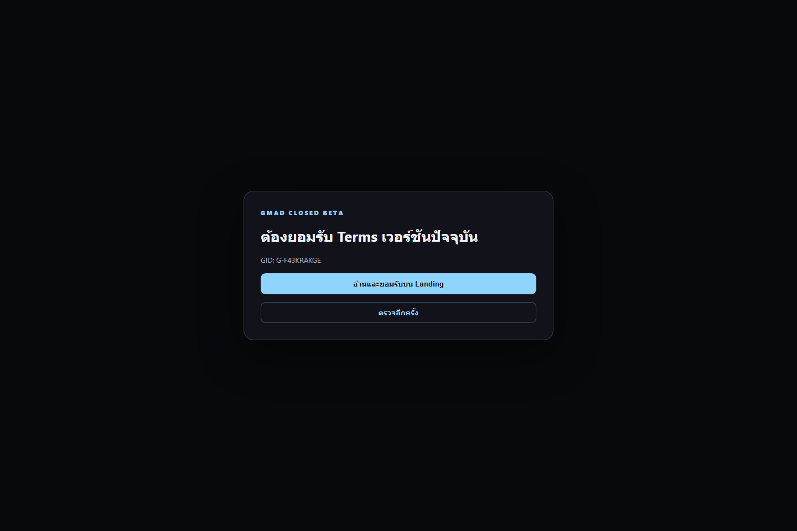

No active entitlement:

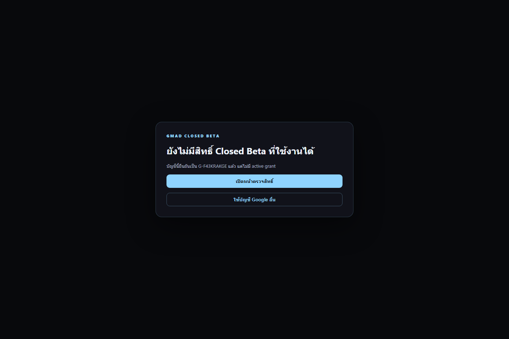

Google account / GID mismatch:

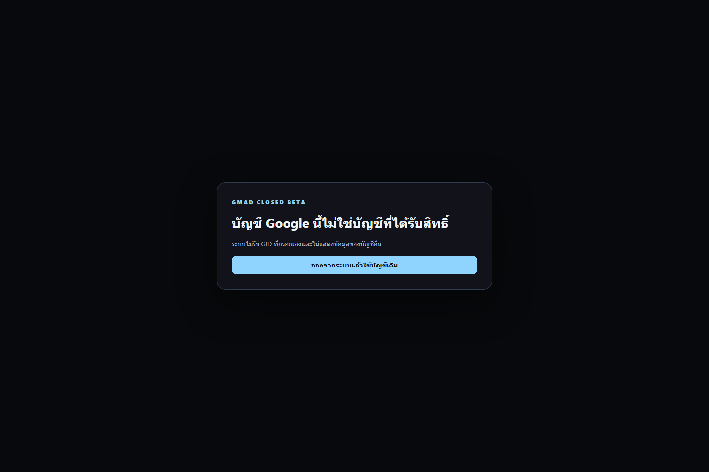

Offline / Supabase unavailable:

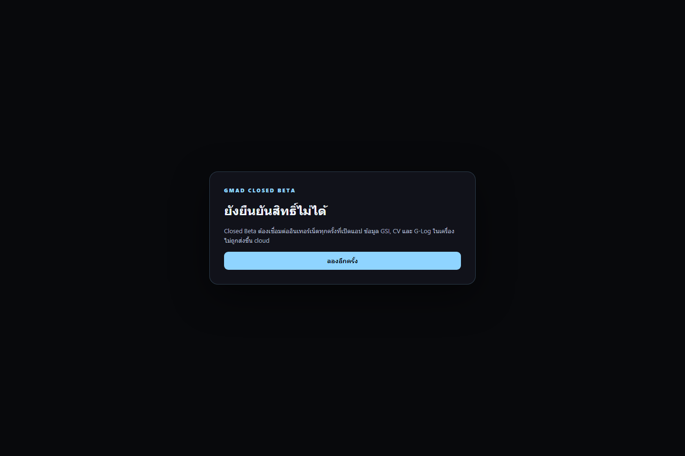

สิ่งที่ยืนยันได้จากภาพชุดนี้:
- first-run gate ปัจจุบันสามารถ map เป็น blocked states หลักของ CR-022 ได้ครบขึ้น
- CTA ของแต่ละ state แยกตามเหตุผลเชิงปฏิบัติ ไม่ใช่บอกลอย ๆ ว่าเข้าไม่ได้
- ไม่มี state ใดขอให้ user กรอก GID เอง

ข้อจำกัด:
- ทั้งหมดเป็น current state harness
- ยังไม่ใช่ screenshot จาก backend decision จริง

### 3.9 GSI / Dota setup และ Ready Dashboard

หลักฐาน: `current component surface`

ภาพนี้คือ Dashboard/booth ปัจจุบันของ desktop ซึ่งแสดง readiness posture, GSI offline state, และ command deck layout ปัจจุบัน

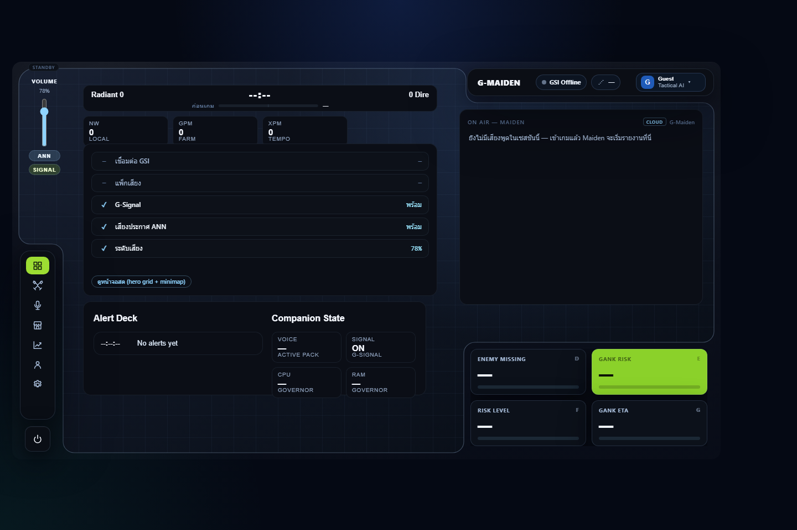

ข้อจำกัดของหลักฐานนี้:
- เป็น current dashboard surface จริงจาก component ปัจจุบัน
- ไม่ใช่ proof ว่า current session ผ่าน entitlement gate แล้ว
- ใช้ยืนยันหน้าปลายทางและ layout ที่ผู้ใช้จะเจอหลังเข้าใช้ระบบได้สำเร็จ

### 3.10 Runtime window observed on this machine

หลักฐาน: `runtime window capture`

รอบนี้มีการจับภาพจาก executable/runtime ที่กำลังรันอยู่จริงบนเครื่องนี้ด้วย ผลที่ได้คือหน้าต่าง `G-Maiden` แสดง landing/marketing shell มากกว่า first-run entitlement gate ที่ current source ระบุไว้

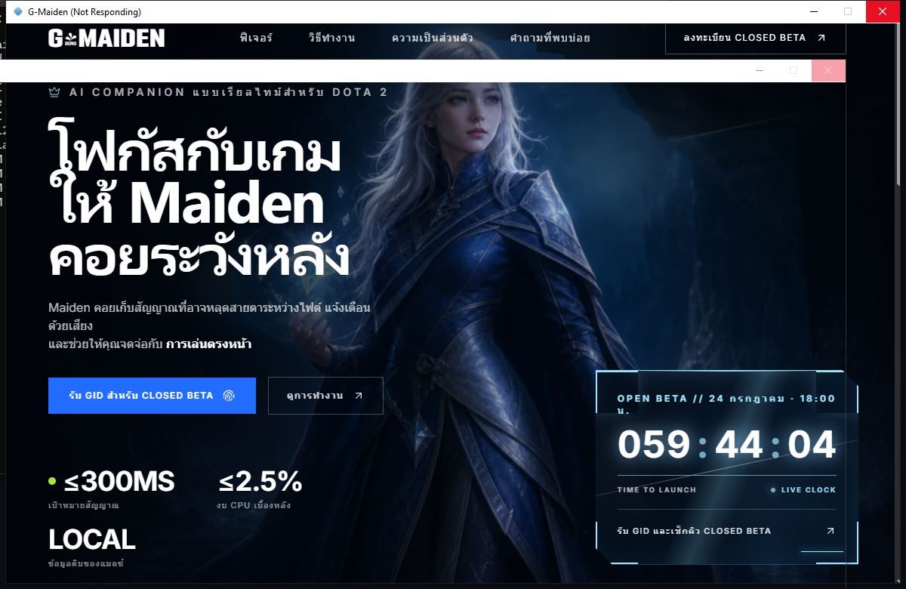

สิ่งที่ยืนยันได้จากภาพ:
- มี runtime window จริงที่เปิดอยู่บนเครื่องนี้
- runtime ที่รันอยู่ ณ เวลาจับภาพยังไม่ใช่หลักฐานของ CR-022 first-run unlock flow
- มีความเป็นไปได้ของ build/runtime drift ระหว่าง executable ที่กำลังเปิดอยู่กับ current source walkthrough

ผลต่อการเก็บหลักฐาน:
- ภาพนี้ใช้เป็น evidence ว่า runtime จริงบนเครื่องยังไม่ยืนยัน first-run contract
- จึงยังไม่สามารถนับเป็น proof ของ `eligible`, `terms_required`, `no_active_entitlement`, หรือ post-entitlement setup state จริงได้

## 4. สรุป flow ที่ยืนยันได้วันนี้

| Step | Surface ปัจจุบัน | Screenshot evidence | สถานะ |
| --- | --- | --- | --- |
| 1 | Invitation email | `01-invitation-email-render.png` | mailbox transcript render |
| 2 | Landing entry | `02-landing-gmad.png` | ยืนยันได้ |
| 3 | Landing `#gmad` signed-out section | `02b-landing-gmad-section-signedout.png` | ยืนยันได้ |
| 4 | Terms | `03-landing-terms.png` | ยืนยันได้ |
| 5 | Privacy Notice | `04-landing-privacy.png` | ยืนยันได้ |
| 6 | Desktop first-run sign-in gate | `web-home.png` | ยืนยันได้จาก current web build |
| 7 | Account surface | `05-desktop-account-current.png` | ยืนยัน layout/copy |
| 8 | Eligible + setup required | `12-desktop-eligible-setup-harness.png` | current state harness |
| 9 | Eligible + ready to open dashboard | `13-desktop-eligible-ready-harness.png` | current state harness |
| 10 | Blocked states | `07`-`11` harness images | current state harness |
| 11 | Dashboard target surface | `06-desktop-dashboard-current.png` | ยืนยันปลายทาง layout |
| 12 | Runtime window observed on this machine | `06b-desktop-runtime-window.png` | runtime drift evidence |

## 5. Evidence gap ที่ยังเหลือ

1. invitation email screenshot จาก Gmail client UI จริง หากต้องการระดับ UI evidence แทน mailbox transcript render
2. installer download success screenshot จาก entitled session จริง
3. desktop screenshots จาก backend state จริงสำหรับ `eligible`, `terms_required`, `no_active_entitlement`, `account_not_eligible`, `offline_or_unavailable`
4. post-entitlement GSI setup screenshot จาก granted production session จริง
5. runtime/build confirmation that the installed desktop binary on this machine matches the current CR-022 first-run source path

## CHANGELOG

| Version | Date | Status | Summary | Commit Hash | Agent |
| --- | --- | --- | --- | --- | --- |
| 0.4.0b | 2026-07-21 | candidate | Replaced unnecessary reader-facing GMAD naming with G-Maiden while preserving technical identifiers such as `#gmad`, filenames, and runtime literals. | null | ATHER |
| 0.3.0b | 2026-07-21 | candidate | Added mailbox invitation evidence, production `#gmad` signed-out evidence, and runtime-window drift evidence while preserving the real entitled-session gaps. | null | ATHER |
| 0.2.0b | 2026-07-21 | candidate | Added current-state harness screenshots for eligible, signing, terms-required, no-entitlement, mismatch, and offline branches while keeping production-proof gaps explicit. | null | ATHER |
| 0.1.0b | 2026-07-21 | candidate | Added an evidence-backed current walkthrough for the GMAD first-run flow with screenshot provenance and explicit evidence gaps. | null | ATHER |
