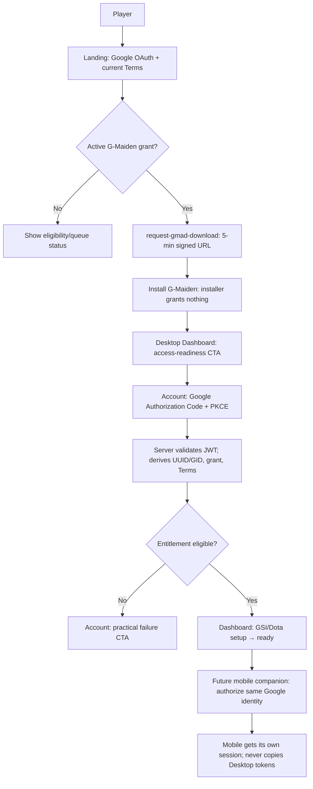
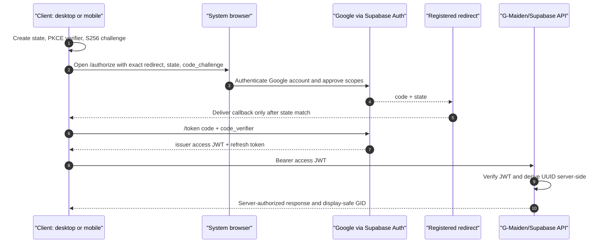
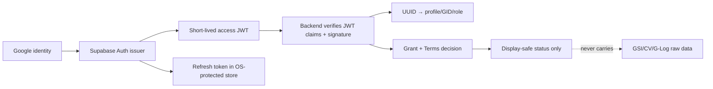

# OAuth 2.0, JWT, and Multi-Client Authorization Flows

## 1. Purpose and decision boundary

This C-3/HIGH design is the common authorization design for G-Maiden Landing, G-Maiden Desktop,
and a future mobile companion. It defines three flows: **user flow**, **OAuth 2.0 Device
Authorization Grant**, and **OAuth 2.0 Authorization Code + PKCE**. It does not authorize code,
schema, provider configuration, mobile development, new scopes, or deployment.

## 1.1 Selected high-assurance architecture

Boss selected the high-assurance target on 2026-07-21: **Supabase OAuth Server transaction boundary**
([[ADR-17-brokered-oauth-transaction-boundary|ADR-17]]). Desktop/Mobile are separately registered
PKCE public clients; Supabase owns authorization state, exact redirects, and issuer-issued tokens.
Existing Supabase social login remains legacy until hosted OAuth Server activation, client
registration, authorization UI, and security review pass. Do not implement a guessed custom `state`
or relax redirect allowlists.

Google OAuth is the only primary sign-in. The server-derived Supabase UUID is the authorization
subject; immutable GID is display-only. Password, email/password, GID/password, Steam sign-in, and
GID/Steam recovery are forbidden. The design never sends match state, CV detections, or G-Log to
the identity service by default.

## 2. Shared security contract

| Concern | Required rule |
| --- | --- |
| OAuth client | Every public client uses Authorization Code with PKCE (`S256`); a mobile or desktop binary has no client secret. |
| Desktop redirect | Registered only as `http://127.0.0.1:3000/auth/callback`, bound only to the numeric loopback IP. It uses system browser, high-entropy single-use state, and the original PKCE verifier; never `localhost`, LAN, wildcard, dynamic port, or custom scheme. |
| Future mobile redirect | Use a registered claimed HTTPS App/Universal Link redirect, exact-match only. A custom scheme is a fallback only after platform threat review; no wildcard redirects. |
| JWT | Supabase/issuer mints access and refresh tokens. Clients do not mint custom JWTs or treat decoded client claims as authorization truth. |
| Backend authorization | Validate signature/JWK, `iss`, `aud`, `exp`, `nbf`, and token type; derive `auth.users.id` server-side, then resolve profile/GID, role, grant, and Terms receipt. |
| Token handling | Never place authorization code, access JWT, refresh token, Google token, device code, or signed download URL in UI, logs, analytics, URL history, crash reports, or support tickets. |
| Local storage | Store session/refresh material only in OS-protected storage. SEC-001 F5 must close before production desktop/mobile persistence. |
| Authorization | A signed G-Maiden download URL is a five-minute artifact URL only. It is never a session, device credential, mobile handoff credential, or entitlement proof. |
| Local-only data | Identity calls carry identity/entitlement metadata only; raw GSI, CV, match state, and G-Log stay local. |

## 3. User flow — Landing to desktop to future mobile



The existing Command Deck layout stays unchanged: it may show a readiness row and route to the
Account page, but Account remains the complete OAuth/entitlement surface. On first launch offline,
the entitlement gate fails closed. After a server verification, only CR-022's bounded protected
offline receipt policy may permit local desktop operation; it does not create a transferable mobile
credential.

## 4. Authorization Code Flow + PKCE — primary flow

### 4.1 Applicability

Use this for Landing, Desktop, and the future interactive mobile app. Desktop uses the existing
loopback redirect. The mobile client opens the system browser and uses a platform-verified redirect
to resume the app. No embedded webview sign-in and no client secret are allowed.



### 4.2 Mandatory validation and failure handling

| Event | Required behavior |
| --- | --- |
| Callback state absent, wrong, expired, or already used | Ignore callback, clear pending transaction, show Retry; do not create a session. |
| PKCE exchange fails | Do not expose code/token; clear transaction and restart from system browser. |
| Redirect does not exact-match a registered URI | Reject at authorization server; no fallback redirect. |
| Access JWT expires | Refresh only through protected issuer session machinery; if refresh fails, return to Google OAuth. |
| Server denies entitlement | Preserve session but show Terms/grant/mismatch CTA; never accept user-entered GID. |
| Offline first launch | Explain that internet is required once; do not substitute cached identity or installer state. |

### 4.3 Legacy Desktop callback state binding

Before opening the system browser, Desktop extracts the issuer-created `state` from the returned
authorization URL and gives it to the native single-use callback gate together with its start time.
The callback supplies `code` and `state`; the gate atomically consumes the pending transaction and
emits the code only when the state matches exactly and the transaction is within its ten-minute TTL.
Missing, wrong, expired, or replayed state fails closed. The implementation does not override the
authorization server's `state`, log state/code, or treat the local gate as entitlement proof.

## 5. Device Authorization Flow — future pairing-only design

### 5.1 Scope and availability

Device Authorization Grant is **not** the normal mobile sign-in flow. It is reserved for a
future input-constrained pairing experience, for example Desktop shows a QR/user code and the
player confirms on their already signed-in mobile system browser. It is unavailable until the
Supabase OAuth Server formally supports the grant, supports required PKCE/security controls,
and a mobile threat model receives approval. Until then, use Authorization Code + PKCE only.

```mermaid
sequenceDiagram
  autonumber
  participant D as "Desktop pairing screen"
  participant AS as "Approved authorization server"
  participant M as "Player mobile system browser/app"
  participant API as "G-Maiden API"

  D->>AS: POST /device_authorization (client_id, scope)
  AS-->>D: device_code, user_code, verification_uri, interval, expires_in
  D-->>M: Show QR for verification_uri_complete or user_code (no token)
  M->>AS: Verify code; Google OAuth Authorization Code + PKCE
  AS-->>M: Confirmation only
  loop interval; honour slow_down and expiry
    D->>AS: POST /token (device_code)
    AS-->>D: authorization_pending / slow_down / approved / expired
  end
  D->>API: Bearer issuer access JWT after approval
  API->>API: Verify JWT; derive UUID and entitlement
  API-->>D: Pairing/entitlement result; no token sent to mobile
```

### 5.2 Device-flow controls

- The device code is opaque, short-lived, single-use, and never displayed or logged. The user code
  is short-lived, rate-limited, and is not a password or recovery factor.
- QR contains only a verification URI (and, when supported, a short-lived user-code handoff), never
  a JWT, refresh token, signed URL, GID, email, entitlement receipt, or device code.
- Poll no more often than issuer `interval`; obey `slow_down`; stop on expiry, denial, window close,
  or user cancellation. The Desktop treats `authorization_pending` as progress, not failure.
- Pairing proves a session for the requesting device only. It must not copy refresh tokens between
  Desktop and Mobile, mint a new GID, alter role/grant, or bypass current Terms acceptance.
- Revoking a session, changing Google identity, or uninstalling a client invalidates its local
  protected material; the other client remains an independently authorized session.

## 6. JWT and client-session model



JWT is proof of an authenticated session, not an entitlement itself. Every privileged endpoint,
including `request-gmad-download` and proposed `get-gmad-desktop-entitlement`, re-evaluates its
own server-side authorization decision. Access-token claims must not replace database/RLS checks.
Refresh token rotation, session revocation, device/session management, token TTL, audiences, and
JWK rotation require issuer capability confirmation and security approval before implementation.

## 7. Future mobile connection contract

| Topic | Contract |
| --- | --- |
| Identity | Mobile uses the same Google account and issuer UUID, then receives the same immutable display GID; it never asks to type/import GID. |
| Transport | TLS only, issuer/API host allowlist, certificate/platform validation, and authorization header over authenticated API calls. |
| Authorization | Mobile requests only scopes/features it needs. It cannot use Desktop's installer URL, offline receipt, local GSI port, filesystem, CV pipeline, or G-Log. |
| Pairing | QR/user code coordinates an approved device flow only; it is not a bearer-link, account recovery mechanism, or device trust bypass. |
| Privacy | Mobile is not a default sync target for gameplay data. Any post-match sharing remains a separate explicit opt-in under ADR-11/ADR-16. |
| Entitlement | A Mobile session may read its own safe entitlement status, but cannot alter grants, Terms receipts, roles, or another device's session. |

## 8. UAT and approval gates

| ID | Scenario | Expected result |
| --- | --- | --- |
| AUTH-01 | Desktop Auth Code + PKCE, same Google account | State and PKCE exchange succeeds; API derives UUID/GID; desktop entitlement is evaluated server-side. |
| AUTH-02 | Replayed/wrong OAuth state | No session, no token exposure, actionable retry. |
| AUTH-03 | JWT is expired, wrong audience, wrong issuer, or bad signature | API rejects before any profile/grant read. |
| AUTH-04 | Mobile uses its own Authorization Code + PKCE session | Same UUID/GID may resolve; no Desktop token/receipt/installer URL transfer. |
| AUTH-05 | Device flow unsupported by issuer | Pairing UI is absent/disabled; app retains Authorization Code + PKCE flow. |
| AUTH-06 | Device flow approved; user cancels or code expires | Poll stops; no session or pairing side effect. |
| AUTH-07 | QR/signed URL/token copied to another device | No durable access is granted; each client must create its own authorized session. |
| AUTH-08 | Offline fresh Desktop/Mobile launch | No entitlement unlock from cached GID, installer state, or user code. |

Desktop legacy-flow verification on 2026-07-21 covers issuer-state extraction, missing/malformed/
undersized/oversized state rejection, exact native state matching, single-use consumption, expiry,
and callback replay rejection. It does not prove hosted OAuth Server activation or complete the
CR-022 entitlement gate.

Before implementation, obtain approval for: OAuth provider support and redirect registration;
PKCE/state/secure-store design; JWT issuer/audience/JWK validation; refresh/session revocation;
mobile threat model and deep-link ownership; Device Grant rate limits; Terms/privacy/data-controller
requirements; and any requested scope beyond identity. All changes remain subject to ADR-14,
SEC-001, CR-021, and CR-022.

## Changelog

| Version | Date | Status | Summary | Agent |
| --- | --- | --- | --- | --- |
| 0.1.0b | 2026-07-21 | candidate | Initial C-3/HIGH multi-client OAuth 2.0, PKCE, JWT, Device Authorization, and future mobile connection design. | ATHER |
| 0.2.0b | 2026-07-21 | beta | Recorded Boss's high-assurance decision: ADR-17 Supabase OAuth Server transaction boundary; legacy social login remains until hosted capability and security gates pass. | ATHER |
| 0.2.1b | 2026-07-21 | beta | Corrected residual broker terminology to issuer/Supabase OAuth Server terminology. | ATHER |
| 0.3.0b | 2026-07-21 | beta | Applied the ADR-17 RFC 8252 Desktop fixed-loopback and future Mobile claimed-HTTPS redirect decisions. | ATHER |
| 0.3.1b | 2026-07-21 | beta | Documented the implemented legacy Desktop issuer-state binding and callback fail-closed behavior. | ATHER |
| 0.3.3b | 2026-07-21 | beta | Replaced unnecessary reader-facing GMAD naming with G-Maiden while preserving technical identifiers and API names. | ATHER |
| 0.3.2b | 2026-07-21 | beta | Added bounded-state verification evidence and kept hosted OAuth Server plus CR-022 entitlement completion explicitly open. | ATHER |
