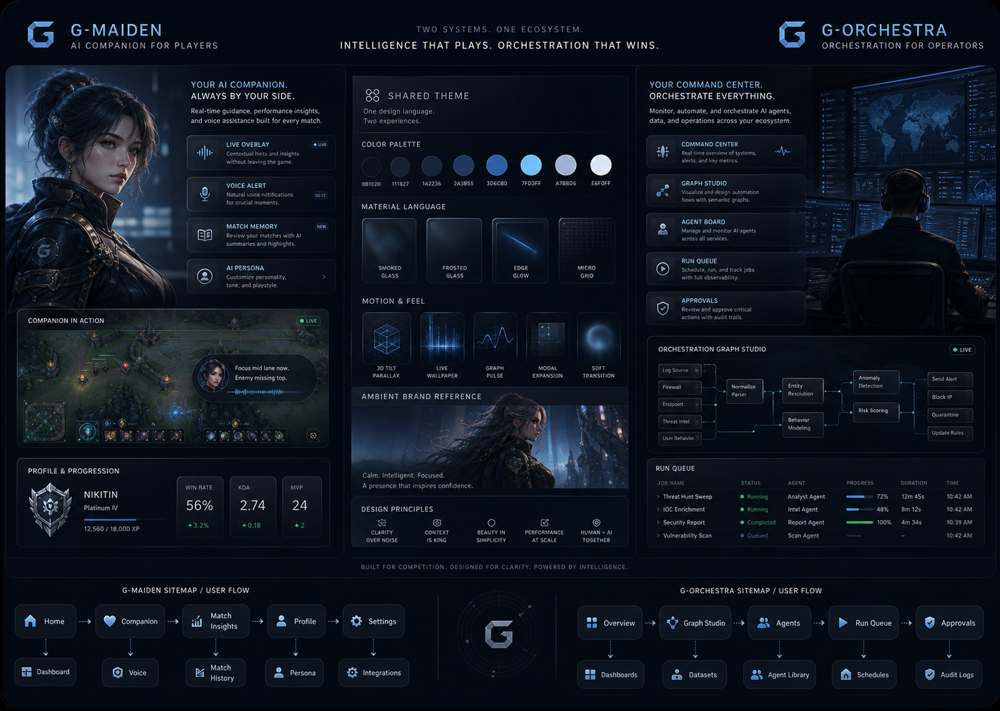

# G-Maiden + G-Orchestra Product Family Design Map

> Family overview for two separate products that share one visual universe:
> **Maiden Blue Quiet Luxury Gaming / Esport**.

---

## 1. Purpose

เอกสารนี้เป็น overview ระดับ product family เท่านั้น
เพื่อยืนยันว่า `G-Maiden` และ `G-Orchestra` เป็นคนละระบบ
แต่ใช้ shared visual language เดียวกัน

- `G-Maiden` = player-facing AI companion system สำหรับผู้เล่นระหว่างเล่น Dota 2
- `G-Orchestra` = operator / builder orchestration system สำหรับจัดการ agents, workflows, tasks, reports, approvals
- Shared theme = glassmorphism, quiet luxury gaming, esport, Maiden blue, cool premium, realistic MOBA companion presence

Rule: `G-Orchestra` is not a sub-page of `G-Maiden`. It is a sister product/control system that shares the same family identity.

## 2. Child Docs

Use these child documents for product-specific sitemap, user flow, screen direction, and component notes.

| Product | Doc | Wikilink |
| --- | --- | --- |
| `G-Maiden` | [g-maiden-ui-sitemap-flow-board.md](g-maiden-ui-sitemap-flow-board.md) | `[[g-maiden-ui-sitemap-flow-board]]` |
| `G-Orchestra` | [g-orchestra-ui-sitemap-flow-board.md](g-orchestra-ui-sitemap-flow-board.md) | `[[g-orchestra-ui-sitemap-flow-board]]` |

## 3. Product Boundary

| Product | Primary user | Primary job | UX density | Character role |
| --- | --- | --- | --- | --- |
| `G-Maiden` | Player | Receive real-time guidance without losing focus | Low to medium | Core companion presence |
| `G-Orchestra` | Operator / builder / creator | Coordinate agents, graph, runs, approvals, reports | Medium to high | Ambient brand presence only |

## 4. Shared Presentation Board

### Direction Name

`Maiden Blue Quiet Luxury Gaming / Esport`

### Visual Intent

- Premium dark glass interface
- Cool blue luminance, not literal ice fantasy
- Realistic MOBA/Dota-like character presence
- Calm esport command-room mood
- Interactive surfaces with Framer Motion-like transitions
- 3D tilt cards and panels used selectively
- Live wallpaper as an ambient layer, not visual noise

### Shared Tokens

| Token | Value | Role |
| --- | --- | --- |
| `bg.obsidian` | `#060913` | Deep app base |
| `bg.navyGlass` | `#0B1220` | Main cool glass base |
| `bg.panel` | `rgba(13, 20, 34, 0.74)` | Frosted dark panel |
| `brand.maidenBlue` | `#64C7FF` | Primary accent |
| `brand.deepBlue` | `#226CFF` | Active command / focus |
| `brand.cyanMist` | `#9BE7FF` | Glow and graph trace |
| `lux.silver` | `#D8E6F2` | Quiet luxury text and trim |
| `state.success` | `#31D0A0` | Safe / completed |
| `state.warning` | `#FFB86B` | Caution |
| `state.danger` | `#FF5C7A` | Critical alert |

### Shared Motion Language

| Motion | G-Maiden | G-Orchestra |
| --- | --- | --- |
| `panel.enter` | Soft slide + fade for alerts | Drawer/modal expand from source |
| `card.tilt` | Control cards only | Agent cards, project cards, selected graph node |
| `graph.pulse` | Danger direction indicator | Execution path and dependency edge |
| `wallpaper.parallax` | Maiden ambient background | Command-room ambient background |
| `character.idle` | Breathing, eye glance, expression shift | Small ambient portrait or avatar state |
| `critical.pulse` | Strong but short | State badge or path warning only |

## 5. Avoid

- Literal ice shards / frozen fantasy overload
- One-note cyan screen everywhere
- Heavy neon green as primary brand
- Enterprise dashboard that feels dry
- Busy particles during combat or data-heavy work
- Character art that looks cartoon/mobile gacha instead of realistic MOBA

## 6. Acceptance Criteria

- [ ] Family overview clearly states that `G-Maiden` and `G-Orchestra` are separate products.
- [ ] Overview links to both child docs using Markdown links and wikilinks.
- [ ] Shared theme remains centralized here without duplicating each product sitemap.
- [ ] Child docs own product-specific sitemap, flow, screen direction, and component notes.

---

## CHANGELOG

| Version | Date | Status | Summary | Commit Hash | Agent |
|---------|------|--------|---------|-------------|-------|
| 0.2.0b | 2026-06-24 | candidate | Split product-specific sitemap and user-flow content into separate G-Maiden and G-Orchestra child docs; kept this file as family overview. | pending | ATHER |
| 0.1.0b | 2026-06-24 | candidate | Initial product-family sitemap, user flow, and shared presentation board for separate G-Maiden and G-Orchestra systems. | pending | ATHER |
