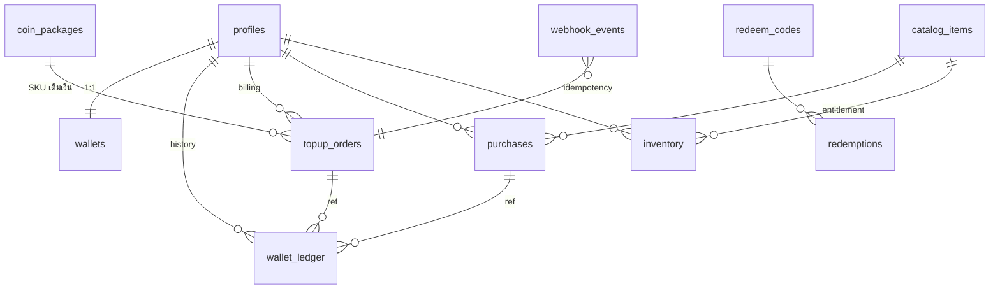
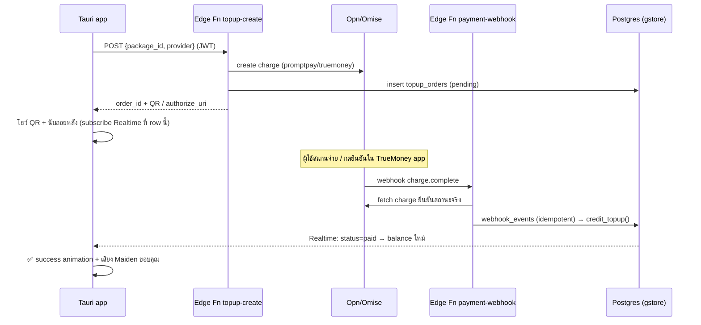

# CR-003: ระบบ Account (GID) เฟสแรก — Wallet · Inventory · History · Billing

ต่อยอด **ADR-14** (GID + Supabase `gstore` + Google OAuth ที่ ship แล้ว) ให้บัญชี GID มี
"เศรษฐกิจ" ขั้นต่ำที่พร้อมรองรับ **ADR-12 marketplace**: กระเป๋าเหรียญ (G-Coins),
คลังไอเทม (announcer packs เป็นสินค้าแรก), ประวัติธุรกรรม, และการเติมเงินผ่าน
**PromptPay QR / TrueMoney Wallet**

> โน้ตเชื่อมงานเดิม: หน้า Voice Packs ที่ port มาแล้วยิง `/api/*` ไปหา backend :4577
> ที่ไม่มีอยู่ (จด memory ไว้) — CR นี้คือคำตอบของ backend นั้น: **Supabase คือ backend
> ของ store/inventory** ไม่ต้องมี server :4577

---

## 1. ขอบเขตเฟสแรก (สำคัญที่สุดในเอกสารนี้)

### การตัดสินใจหลัก (mini-ADR)

| # | Decision | เหตุผล |
| --- | --- | --- |
| D1 | **G-Coins เป็น closed-loop currency**: เติมได้อย่างเดียว ใช้ได้เฉพาะในระบบ **ไม่คืนเงิน ไม่ถอน ไม่โอนให้ user อื่น** | เลี่ยงการเข้าข่าย e-money ตาม พ.ร.บ.ระบบการชำระเงิน 2560 (ต้องมี license จาก ธปท.) — payout ของ creator เป็นเรื่อง post-v1.0 ตาม ADR-12 |
| D2 | **ราคา/ยอดเงินเป็น integer เท่านั้น**: THB เก็บเป็น**สตางค์** (`amount_satang`), เหรียญเป็น `bigint` | ห้ามใช้ float กับเงินเด็ดขาด |
| D3 | **ทุก path ที่แตะเงินทำงานฝั่ง server เท่านั้น** — Supabase Edge Functions + plpgsql `SECURITY DEFINER`; client (Tauri) **อ่านได้อย่างเดียว** ผ่าน RLS | client ถูก reverse-engineer ได้เสมอ; ราคาอ่านจาก DB ฝั่ง server ไม่รับจาก client |
| D4 | **Ledger เป็น source of truth**: `wallet_ledger` append-only, `wallets.balance` เป็น cache ที่อัปเดตใน transaction เดียวกันเสมอ | ตรวจสอบย้อนหลัง/audit ได้, กู้ balance คืนจาก ledger ได้ทุกเมื่อ |
| D5 | **Payment gateway = Opn Payments (Omise)** ตัวเดียว ได้ทั้ง PromptPay QR + TrueMoney Wallet | เจ้าเดียวจบทั้ง 2 ช่องทาง, webhook ครบ, มี test mode; Stripe TH ไม่มี TrueMoney |
| D6 | **เติมเป็นแพ็คเกจเท่านั้น** (ไม่มี custom amount) ในเฟสแรก | ง่ายต่อ reconcile/กันโกง/ทำ bonus tier |
| D7 | สินค้าเฟสแรก = **official announcer packs เท่านั้น** (`creator_id = null`); creator upload/revenue-share = เฟสถัดไป | ตัด moderation + payout + KYC ออกจาก MVP |
| D8 | ยึดหลัก **additive** ตาม ADR-14: deck ใช้งานได้เต็มโดยไม่ sign-in; Wallet/Store เป็นส่วนเสริม | privacy-first ไม่เปลี่ยน — ข้อมูลแมตช์ยังอยู่ local 100% |

### In / Out of scope

**In:** wallet + ledger, เติมเงิน PromptPay/TrueMoney (sandbox → live), store catalog,
ซื้อ pack, inventory + ติดตั้ง/activate pack (ต่อกับระบบ announcer เดิม), ประวัติธุรกรรม +
ใบเสร็จอย่างง่าย, redeem code, welcome grant, ลบบัญชี (PDPA)

**Out (เฟสถัดไป):** creator upload/marketplace UGC, payout/ถอนเงิน, โอนเหรียญระหว่าง user,
บัตรเครดิต, subscription, ใบกำกับภาษีเต็มรูป, ระบบ refund อัตโนมัติ (เฟสแรก: manual adjust โดย admin)

---

## 2. Database design (Supabase `gstore`)

### 2.1 ER overview



- `profiles` (มีอยู่แล้วจาก ADR-14) — เพิ่มเฉพาะคอลัมน์ `role`
- ตารางใหม่ 10 ตาราง แบ่ง 4 กลุ่ม: **Wallet** (wallets, wallet_ledger) ·
  **Billing** (coin_packages, topup_orders, webhook_events) ·
  **Store/Inventory** (catalog_items, purchases, inventory) ·
  **Ops** (redeem_codes, redemptions, deletion_requests)

### 2.2 Migration SQL (ฉบับเต็ม)

```sql
-- ===== CR-003 Phase 1: wallet / billing / store / inventory =====

-- profiles: เพิ่ม role (ใช้คุม catalog admin + adjust)
alter table public.profiles
  add column if not exists role text not null default 'user'
  check (role in ('user','creator','admin'));

-- ---------- Wallet ----------
create table public.wallets (
  user_id        uuid primary key references public.profiles(id) on delete cascade,
  balance        bigint not null default 0 check (balance >= 0),
  lifetime_topup bigint not null default 0,
  lifetime_spend bigint not null default 0,
  updated_at     timestamptz not null default now()
);

-- append-only ledger — source of truth ของทุกความเคลื่อนไหว (นี่คือ "History")
create table public.wallet_ledger (
  id            bigint generated always as identity primary key,
  user_id       uuid not null references public.profiles(id) on delete cascade,
  entry_type    text not null check (entry_type in
                  ('topup','purchase','refund','grant','redeem','adjust')),
  amount        bigint not null check (amount <> 0),      -- + เข้า / - ออก
  balance_after bigint not null check (balance_after >= 0),
  ref_type      text,          -- 'topup_order' | 'purchase' | 'redeem_code' | 'admin'
  ref_id        text,
  note          text,
  created_at    timestamptz not null default now()
);
create index wallet_ledger_user_idx on public.wallet_ledger (user_id, created_at desc);

-- ---------- Billing ----------
create table public.coin_packages (
  id            text primary key,              -- 'coins_s' | 'coins_m' | 'coins_l'
  title         text not null,
  coins         bigint not null check (coins > 0),
  bonus_coins   bigint not null default 0,
  price_satang  integer not null check (price_satang > 0),  -- THB เป็นสตางค์
  active        boolean not null default true,
  sort          integer not null default 0
);

create table public.topup_orders (
  id                 uuid primary key default gen_random_uuid(),
  user_id            uuid not null references public.profiles(id) on delete cascade,
  package_id         text not null references public.coin_packages(id),
  coins              bigint  not null check (coins > 0),          -- snapshot ตอนสั่ง
  price_satang       integer not null check (price_satang > 0),   -- snapshot ตอนสั่ง
  provider           text not null check (provider in ('promptpay','truemoney')),
  provider_charge_id text unique,                                 -- Omise charge id
  status             text not null default 'pending' check (status in
                       ('pending','paid','failed','expired')),
  qr_image_uri       text,          -- PromptPay: download_uri ของ QR
  authorize_uri      text,          -- TrueMoney: redirect ไป app
  expires_at         timestamptz,
  paid_at            timestamptz,
  created_at         timestamptz not null default now(),
  updated_at         timestamptz not null default now()
);
create index topup_orders_user_idx on public.topup_orders (user_id, created_at desc);

-- กันประมวลผล webhook ซ้ำ (Omise ยิงซ้ำได้)
create table public.webhook_events (
  provider     text not null,
  event_id     text not null,
  payload      jsonb not null,
  processed_at timestamptz,
  created_at   timestamptz not null default now(),
  primary key (provider, event_id)
);

-- ---------- Store / Inventory ----------
create table public.catalog_items (
  id           uuid primary key default gen_random_uuid(),
  sku          text unique not null,           -- 'pack.maiden-classic'
  item_type    text not null default 'announcer_pack'
               check (item_type in ('announcer_pack','persona','advice_style')),
  title        text not null,
  description  text,
  price_coins  bigint not null check (price_coins >= 0),   -- 0 = ฟรี
  pack_id      text,            -- bundle id ใน voice-cache/packs/<id>/
  banner_url   text,            -- Supabase Storage public URL (ภาพโปรโมต)
  bundle_path  text,            -- path ใน Storage bucket 'packs' (private)
  creator_id   uuid references public.profiles(id),        -- null = official
  status       text not null default 'draft'
               check (status in ('draft','active','delisted')),
  created_at   timestamptz not null default now(),
  updated_at   timestamptz not null default now()
);

create table public.purchases (
  id          uuid primary key default gen_random_uuid(),
  user_id     uuid not null references public.profiles(id) on delete cascade,
  item_id     uuid not null references public.catalog_items(id),
  price_coins bigint not null check (price_coins >= 0),    -- snapshot ราคา ณ ตอนซื้อ
  created_at  timestamptz not null default now(),
  unique (user_id, item_id)                                 -- กันซื้อซ้ำระดับ DB
);

create table public.inventory (
  id          uuid primary key default gen_random_uuid(),
  user_id     uuid not null references public.profiles(id) on delete cascade,
  item_id     uuid not null references public.catalog_items(id),
  source      text not null check (source in ('purchase','grant','redeem','starter')),
  ref_id      text,
  acquired_at timestamptz not null default now(),
  unique (user_id, item_id)
);
create index inventory_user_idx on public.inventory (user_id);

-- ---------- Ops ----------
create table public.redeem_codes (
  code       text primary key,                 -- เก็บ UPPERCASE
  grant_type text not null check (grant_type in ('coins','item')),
  coins      bigint check (coins > 0),
  item_id    uuid references public.catalog_items(id),
  max_uses   integer not null default 1,
  used_count integer not null default 0 check (used_count <= max_uses),
  expires_at timestamptz,
  created_by uuid references public.profiles(id),
  created_at timestamptz not null default now(),
  check ((grant_type = 'coins' and coins is not null)
      or (grant_type = 'item'  and item_id is not null))
);

create table public.redemptions (
  code        text not null references public.redeem_codes(code),
  user_id     uuid not null references public.profiles(id) on delete cascade,
  redeemed_at timestamptz not null default now(),
  primary key (code, user_id)                  -- 1 โค้ด/1 คน
);

-- PDPA: คำขอลบบัญชี (ประมวลผลโดย job/manual ภายใน 30 วัน)
create table public.deletion_requests (
  user_id      uuid primary key references public.profiles(id) on delete cascade,
  requested_at timestamptz not null default now(),
  processed_at timestamptz
);
```

### 2.3 RLS + สิทธิ์ (หัวใจความปลอดภัย)

```sql
alter table public.wallets           enable row level security;
alter table public.wallet_ledger     enable row level security;
alter table public.coin_packages     enable row level security;
alter table public.topup_orders      enable row level security;
alter table public.webhook_events    enable row level security;
alter table public.catalog_items     enable row level security;
alter table public.purchases         enable row level security;
alter table public.inventory         enable row level security;
alter table public.redeem_codes      enable row level security;
alter table public.redemptions       enable row level security;
alter table public.deletion_requests enable row level security;

-- อ่านของตัวเองเท่านั้น
create policy "own read" on public.wallets        for select using (auth.uid() = user_id);
create policy "own read" on public.wallet_ledger  for select using (auth.uid() = user_id);
create policy "own read" on public.topup_orders   for select using (auth.uid() = user_id);
create policy "own read" on public.purchases      for select using (auth.uid() = user_id);
create policy "own read" on public.inventory      for select using (auth.uid() = user_id);
create policy "own read" on public.redemptions    for select using (auth.uid() = user_id);
create policy "own rw"   on public.deletion_requests
  for all using (auth.uid() = user_id) with check (auth.uid() = user_id);

-- catalog อ่านได้ทุกคน (รวม signed-out — โชว์ store ก่อน login ได้)
create policy "public read" on public.coin_packages for select using (active);
create policy "public read" on public.catalog_items for select using (status = 'active');

-- ไม่มี policy INSERT/UPDATE/DELETE ให้ authenticated เลย =
-- เขียนได้ทางเดียวคือ SECURITY DEFINER fn / service_role (Edge Function)
revoke insert, update, delete on public.wallets, public.wallet_ledger,
  public.topup_orders, public.purchases, public.inventory,
  public.coin_packages, public.catalog_items, public.redeem_codes,
  public.redemptions, public.webhook_events from anon, authenticated;
```

**RLS matrix (สรุปไว้ทวน)**

| ตาราง | SELECT | INSERT/UPDATE/DELETE |
| --- | --- | --- |
| `wallets`, `wallet_ledger`, `purchases`, `inventory`, `topup_orders`, `redemptions` | เจ้าของ row | ❌ client — ผ่าน fn/service_role เท่านั้น |
| `coin_packages`, `catalog_items` | ทุกคน (เฉพาะ active) | admin ผ่าน service_role |
| `webhook_events`, `redeem_codes` | ❌ client | service_role เท่านั้น |
| `deletion_requests` | เจ้าของ | เจ้าของ (insert เท่านั้น) |

### 2.4 ฟังก์ชันฝั่ง server (atomic ทั้งหมด)

```sql
-- ซื้อไอเทมด้วยเหรียญ — RPC เดียวจบใน 1 transaction
create or replace function public.purchase_item(p_item_id uuid)
returns public.purchases
language plpgsql security definer set search_path = public as $$
declare
  v_uid   uuid := auth.uid();
  v_item  catalog_items;
  v_bal   bigint;
  v_row   purchases;
begin
  if v_uid is null then raise exception 'not signed in'; end if;

  select * into v_item from catalog_items
   where id = p_item_id and status = 'active';
  if not found then raise exception 'item not available'; end if;

  -- ล็อกกระเป๋ากันซื้อพร้อมกัน (concurrent double-spend)
  select balance into v_bal from wallets where user_id = v_uid for update;
  if not found then raise exception 'no wallet'; end if;
  if v_bal < v_item.price_coins then raise exception 'insufficient balance'; end if;

  insert into purchases (user_id, item_id, price_coins)
  values (v_uid, p_item_id, v_item.price_coins)       -- unique(user_id,item_id) กันซื้อซ้ำ
  returning * into v_row;

  insert into inventory (user_id, item_id, source, ref_id)
  values (v_uid, p_item_id, 'purchase', v_row.id::text);

  update wallets
     set balance = balance - v_item.price_coins,
         lifetime_spend = lifetime_spend + v_item.price_coins,
         updated_at = now()
   where user_id = v_uid;

  insert into wallet_ledger (user_id, entry_type, amount, balance_after, ref_type, ref_id, note)
  values (v_uid, 'purchase', -v_item.price_coins, v_bal - v_item.price_coins,
          'purchase', v_row.id::text, v_item.title);
  return v_row;
end $$;

-- เครดิตเหรียญหลังจ่ายสำเร็จ — เรียกจาก webhook Edge Function (service_role) เท่านั้น
create or replace function public.credit_topup(p_order_id uuid)
returns void language plpgsql security definer set search_path = public as $$
declare
  v_order topup_orders;
  v_bal   bigint;
begin
  -- guard สถานะ = idempotent: ยิงซ้ำกี่ครั้งก็เครดิตครั้งเดียว
  update topup_orders set status = 'paid', paid_at = now(), updated_at = now()
   where id = p_order_id and status = 'pending'
  returning * into v_order;
  if not found then return; end if;

  select balance into v_bal from wallets where user_id = v_order.user_id for update;
  update wallets
     set balance = balance + v_order.coins,
         lifetime_topup = lifetime_topup + v_order.coins,
         updated_at = now()
   where user_id = v_order.user_id;

  insert into wallet_ledger (user_id, entry_type, amount, balance_after, ref_type, ref_id, note)
  values (v_order.user_id, 'topup', v_order.coins, v_bal + v_order.coins,
          'topup_order', v_order.id::text, v_order.provider);
end $$;

-- แลกโค้ด (โค้ดไม่เปิดให้ select — ตรวจในนี้)
create or replace function public.redeem_code(p_code text)
returns jsonb language plpgsql security definer set search_path = public as $$
-- ล็อก redeem_codes row → เช็ค expiry/max_uses → insert redemptions (PK กันแลกซ้ำ)
-- → grant coins (ledger 'redeem') หรือ item (inventory 'redeem') → used_count+1
... $$;

-- สร้าง wallet + welcome grant ตอน signup (ต่อท้าย trigger เดิมของ ADR-14)
-- insert into wallets(user_id) + grant เหรียญต้อนรับ (ledger 'grant', note 'welcome')
```

- คนสร้าง wallet คือ **trigger ตอน signup** (แก้ trigger `handle_new_user` เดิม) —
  ผู้ใช้เก่าที่มีอยู่แล้ว backfill ด้วย migration
- `grant authenticated` เฉพาะ `execute on function purchase_item, redeem_code`;
  `credit_topup` **ไม่ grant** ให้ authenticated (service_role เท่านั้น)

### 2.5 Edge Functions (Deno) — 3 ตัว

| Function | Auth | ทำอะไร |
| --- | --- | --- |
| `topup-create` | user JWT | รับ `{package_id, provider}` → อ่านราคาจาก `coin_packages` (ไม่รับราคาจาก client) → สร้าง Omise charge (source `promptpay` หรือ `truemoney`) → insert `topup_orders` → ตอบ `{order_id, qr_image_uri | authorize_uri, expires_at}` |
| `payment-webhook` | Omise (ตรวจด้วยการ **fetch charge กลับจาก Omise API** ด้วย secret key — ไม่เชื่อ payload ตรง ๆ) | insert `webhook_events` (PK กันซ้ำ; ชนแล้ว return 200 เฉย ๆ) → ถ้า charge `paid` → `credit_topup(order_id)`; ถ้า `failed/expired` → อัปเดตสถานะ order |
| `pack-download` | user JWT | เช็ค `inventory` ว่ามี item จริง → ออก **signed URL** (อายุ 5 นาที) ของ bundle ใน Storage bucket `packs` (private) |

### 2.6 ลำดับเหตุการณ์เติมเงิน (sequence)



- **PromptPay:** โชว์ QR ในแอป (โหลดภาพจาก `qr_image_uri`), อายุ ~15 นาที
- **TrueMoney:** เปิด `authorize_uri` ใน system browser (pattern เดียวกับ Google OAuth ที่มีอยู่) —
  ผู้ใช้ยืนยันใน TrueMoney แล้ว webhook เข้า → Realtime อัปเดตในแอปเอง ไม่ต้อง callback :3000
- fallback ถ้า Realtime หลุด: ปุ่ม "ตรวจสอบสถานะ" → `select` order ซ้ำ (RLS อ่านของตัวเองได้)

---

## 3. UX/UI

### 3.0 นโยบาย Desktop-first · No-Scroll (บังคับทุกหน้าในเอกสารนี้)

> อัปเดต 2026-07-04: แอปเป็น desktop-first แบบ Steam — ทำทุกอย่างจบในแอป **ห้ามมี
> page-level scroll**; ถ้าเนื้อหาไม่พอที่ ให้เพิ่มแท็บ ไม่ใช่เลื่อน (atom:
> `concept--noscroll-ui-policy`, บังคับด้วย `guard--e2e-no-scroll`)

- **นิยาม:** ห้าม scroll ระดับหน้า/ระดับ window เด็ดขาด — ข้อมูลที่โตไม่จำกัด (ledger,
  catalog) ใช้ **pagination ภายในกรอบความสูงคงที่** โดยจำนวนแถว/การ์ดต่อหน้า
  คำนวณจาก pure fn `rowsThatFit(viewportH, chromeH, rowH)` (`algo--fit-rows`) —
  ไม่ hardcode จำนวนแถว
- **Baseline:** หน้าต่าง logical ขั้นต่ำ **1280×800** ต้องแสดงครบที่ Windows DPI
  100% / 125% / 150% — e2e gate ตรวจ `scrollHeight <= clientHeight` ทุกแท็บ
  ทั้ง empty state และ data เต็ม
- **เพดานแท็บ:** top-level ≤ 7 แท็บ; เกินนั้นให้จัดกลุ่มเป็น sub-tab (กัน tab
  proliferation ซึ่งเป็นเทรดออฟหลักของแนวทางนี้)
- **ข้อความไทย:** ห้าม fixed px width กับ label — ใช้ clamp + ellipsis; เนื้อหาอ่านยาว
  (ToS, รายละเอียดแพ็ค) อนุญาต scroll เฉพาะใน reading pane ของมันเอง หรือเปิด
  external browser
- **Content budget ต่อแท็บ** (ที่ 1280×800/100%): Wallet = hero + ledger 3 แถว ·
  History = filter + ~8 แถว + pager · Store/Inventory = grid 2×3 + pager ·
  Top-up modal = 1 step ต่อจอ

### 3.1 ตำแหน่งใน nav (ต่อจากโครงเดิม)

Account & Profile page (มีอยู่แล้ว) ขยายเป็น **4 แท็บ**; ส่วน **Store** เข้าไปแทนที่หน้า
Voice Packs เดิมที่ยิง `/api/*` ค้าง:

```
Profile menu ─ Account & Steam ──► [ Account | Wallet | Inventory | History ]
Deck nav    ─ Voice Packs ───────► Store (catalog จาก Supabase — แก้ปัญหา :4577)
```

ภาษา UI: ไทยเป็นหลัก (ตาม persona Maiden) · design tokens ตามระบบเดิม — พื้น `#08090c`,
การ์ด frosted `rgba(18,20,28,0.72)`, accent ice-blue, ฟอนต์/ระยะตาม `design-system.md`

### 3.2 Wallet (รวม Billing)

```
┌─ WALLET ──────────────────────────────────────────────┐
│  ❄  2,450 G-Coins                    [ + เติมเหรียญ ]  │
│  เติมสะสม 3,000 · ใช้ไป 550                             │
├───────────────────────────────────────────────────────┤
│  ธุรกรรมล่าสุด (3 รายการ)                    ดูทั้งหมด → │
│  ↑ เติมเหรียญ (PromptPay)      +1,000     2 ก.ค. 19:02 │
│  ↓ ซื้อ Maiden Classic Pack      -550     2 ก.ค. 19:05 │
│  ★ เหรียญต้อนรับ Founder          +50     1 ก.ค. 10:11 │
└───────────────────────────────────────────────────────┘
```

**Top-up modal (3 steps ใน modal เดียว):**
1. **เลือกแพ็คเกจ** — การ์ด 3 ใบ (S/M/L) โชว์เหรียญ + โบนัส + ราคาบาท; แพ็ค M ติดป้าย "คุ้มสุด"
2. **เลือกช่องทาง** — ปุ่มใหญ่ 2 ปุ่ม: PromptPay (icon QR) / TrueMoney (icon wallet)
3. **จ่าย** — PromptPay: QR กลางจอ + เคาน์ต์ดาวน์ 15:00 + สถานะ "รอชำระ…" แบบ pulse ·
   TrueMoney: ข้อความ "เปิดแอป TrueMoney ในเบราว์เซอร์แล้ว…" + spinner
   - สำเร็จ (Realtime): เช็คแอนิเมชันน้ำแข็ง + ยอดเหรียญนับขึ้น + Maiden พูดขอบคุณ 1 ประโยค
   - หมดอายุ: QR จางลง + ปุ่ม "สร้าง QR ใหม่" · ล้มเหลว: แจ้งเหตุ + ปุ่มลองใหม่
   - ปิด modal ระหว่างรอได้ — มี badge "รอชำระ 1 รายการ" ค้างที่หัวการ์ด Wallet

### 3.3 Store (catalog)

- Grid การ์ดแพ็ค: **banner image** (จาก `banner_url` — ภาพเดียวกับที่ pack ใช้โชว์ overlay),
  ชื่อ, ราคาเหรียญ, ปุ่ม **ลองฟัง** (เล่น clip ตัวอย่าง 1 event) — preview ก่อนซื้อสำคัญมากกับสินค้าเสียง
- สถานะปุ่มซื้อ: `ซื้อ ❄550` → กดแล้ว confirm sheet เล็ก ("หัก 550 เหรียญ — ยืนยัน?") →
  ถ้าเหรียญไม่พอ: ปุ่มเป็น `เหรียญไม่พอ — เติมเลย` (ลิงก์เปิด top-up modal พร้อมคำนวณส่วนต่างให้)
- เป็นเจ้าของแล้ว: ป้าย `✓ เป็นเจ้าของ` แทนราคา
- **signed-out ดูได้ทั้งหน้า** (catalog เปิด public read) — ปุ่มซื้อกลายเป็น `เข้าสู่ระบบเพื่อซื้อ`
  ตามหลัก additive

### 3.4 Inventory

- Grid ของที่เป็นเจ้าของ; แต่ละใบ: banner, ชื่อ, source badge (ซื้อ/ของขวัญ/starter), วันที่ได้
- ปุ่มตามสถานะ local: `ติดตั้ง` (เรียก `pack-download` → ดาวน์โหลด → `POST /announcer/install`
  ที่ **:3000 endpoint เดิม** — ใช้ pipeline ติดตั้งเดียวกับ G-AnnStudio ทุกอย่าง) →
  `ใช้งาน` (activate ผ่านกลไก active pack ใน `voice_api.rs` เดิม) → `✓ กำลังใช้งาน`
- แถวบน: ช่อง **แลกโค้ด** (input + ปุ่มแลก) — ผลสำเร็จเด้งการ์ดใหม่เข้า grid ทันที

### 3.5 History (ประวัติธุรกรรม)

> แยกจาก match history เดิม (`HistoryPage` ของ deck) — อันนี้คือประวัติ "เงิน" อยู่ใต้ Account

- ลิสต์จาก `wallet_ledger` (paginate 20 รายการ), filter chips: ทั้งหมด · เติมเหรียญ · ซื้อ · รับฟรี
- แต่ละแถว: icon ประเภท, คำอธิบาย, `+/-เหรียญ` (สีเขียว/แดงอ่อน), balance หลังรายการ, เวลา
- แถว topup กดได้ → **ใบเสร็จอย่างง่าย**: เลขที่ order, ช่องทาง, ยอดบาท, เหรียญที่ได้, เวลา,
  provider ref + ปุ่ม copy — พอสำหรับ dispute เฟสแรก
- Empty state: "ยังไม่มีธุรกรรม — เริ่มจากเหรียญต้อนรับของคุณ ❄"

### 3.6 Account tab (ของเดิม + เพิ่ม)

- ของเดิม: AuthPanel, SteamLink, display name
- เพิ่ม: การ์ด GID (โชว์ `G-F…` + generation badge "Founder #1"), ส่วน **Danger zone**:
  ปุ่ม "ขอลบบัญชี" → confirm 2 ชั้น (พิมพ์ GID ยืนยัน) → insert `deletion_requests` +
  แจ้งว่า "ดำเนินการภายใน 30 วัน — ข้อมูลแมตช์ของคุณอยู่ในเครื่องคุณอยู่แล้ว ไม่เกี่ยวกับบัญชี"

### 3.7 ไฟล์ frontend ใหม่ (ประมาณการ)

| ไฟล์ | ทำอะไร |
| --- | --- |
| `src/src/wallet.ts` | `useWallet()` — balance + Realtime subscribe, `topup()`, `purchase()`, `redeem()` (เรียก RPC/Edge Fn) |
| `src/src/StorePage.tsx` | catalog grid + confirm ซื้อ + preview เสียง |
| `src/src/WalletTab.tsx` / `TopupModal.tsx` | ตาม §3.2 |
| `src/src/InventoryTab.tsx` | ตาม §3.4 — ต่อ `pack-download` → `/announcer/install` |
| `src/src/LedgerTab.tsx` | ตาม §3.5 |

---

## 4. User stories (พร้อม acceptance criteria)

| ID | Story | Acceptance criteria (Given/When/Then) |
| --- | --- | --- |
| **US-01** | ผู้ใช้ใหม่ sign-in ครั้งแรกแล้วได้ wallet + เหรียญต้อนรับ | Given ไม่เคยมีบัญชี · When sign-in Google สำเร็จ · Then มี `wallets` row, ledger มี `grant` "welcome", Wallet โชว์ยอด ≥ 0 ทันที |
| **US-02** | ผู้ใช้ดูยอดเหรียญปัจจุบันได้เสมอ | Given sign-in แล้ว · When เปิดแท็บ Wallet · Then เห็น balance ตรงกับ `wallets.balance` และอัปเดต realtime เมื่อมีธุรกรรมใหม่ |
| **US-03** | เติมเหรียญผ่าน PromptPay | Given เลือกแพ็ค M + PromptPay · When สแกนจ่ายสำเร็จ · Then ภายใน ~5 วิ order เป็น `paid`, balance เพิ่ม = coins+bonus, ledger มีแถว `topup`, มี success feedback |
| **US-04** | เติมเหรียญผ่าน TrueMoney | Given เลือกแพ็ค S + TrueMoney · When ยืนยันใน TrueMoney app · Then ผลเหมือน US-03 (ผ่าน webhook เดียวกัน) |
| **US-05** | QR หมดอายุแล้วเริ่มใหม่ได้ | Given เปิด QR ทิ้งไว้เกิน expiry · When ครบเวลา · Then order เป็น `expired`, เหรียญไม่เพิ่ม, ปุ่ม "สร้าง QR ใหม่" ออก order ใหม่ (order เก่าไม่ถูก reuse) |
| **US-06** | จ่ายเงินแล้วแต่ปิดแอปไปก่อน | Given จ่ายสำเร็จหลังปิดแอป · When เปิดแอปใหม่ · Then balance ถูกต้อง (webhook เครดิตให้โดยไม่ต้องมีแอปเปิด) และ history มีรายการครบ |
| **US-07** | ซื้อ announcer pack ด้วยเหรียญ | Given เหรียญพอ + ยังไม่เป็นเจ้าของ · When กดซื้อ + ยืนยัน · Then หักเหรียญราคา snapshot, ได้ `purchases` + `inventory`, ledger `purchase`, การ์ดเปลี่ยนเป็น "เป็นเจ้าของ" |
| **US-08** | เหรียญไม่พอต้องไม่ซื้อได้ | Given balance < ราคา · When พยายามซื้อ (รวม call RPC ตรง) · Then ถูกปฏิเสธทั้ง UI และ DB, balance ไม่เปลี่ยน, ไม่มี ledger ใหม่, UI เสนอเติมส่วนต่าง |
| **US-09** | ซื้อซ้ำถูกกัน | Given เป็นเจ้าของ item แล้ว · When call `purchase_item` ซ้ำ (เช่น 2 เครื่อง) · Then ล้มเหลวด้วย unique constraint — ไม่หักเหรียญรอบสอง |
| **US-10** | ติดตั้ง + ใช้งาน pack ที่ซื้อ | Given เป็นเจ้าของ · When กดติดตั้ง → ใช้งาน · Then bundle ลง `voice-cache/packs/<id>/` ผ่าน `/announcer/install`, pack กลายเป็น active, event ถัดไปใช้เสียง pack นี้ (contract เดิมของ `audio::play_random`) |
| **US-11** | คนไม่มีสิทธิ์ดาวน์โหลด bundle ไม่ได้ | Given ไม่มี item ใน inventory · When เรียก `pack-download` ตรง · Then 403, ไม่ได้ signed URL |
| **US-12** | ดูประวัติ + ใบเสร็จ | Given มีธุรกรรม >20 รายการ · When เปิด History + filter "เติมเหรียญ" · Then เห็นเฉพาะ topup, กดแถวได้ใบเสร็จที่มี provider ref |
| **US-13** | แลก redeem code | Given โค้ดถูกต้องยังไม่หมดอายุ/สิทธิ์ · When แลก · Then ได้เหรียญหรือ item ตามโค้ด, แลกซ้ำคนเดิมไม่ได้, โค้ดเกิน `max_uses` ไม่ได้ |
| **US-14** | ขอลบบัญชี (PDPA) | Given sign-in · When ยืนยันลบ 2 ชั้น · Then มี `deletion_requests`, UI แจ้งกรอบ 30 วัน; ระหว่างนั้น deck ยังใช้ได้แบบ signed-out ปกติ |
| **US-15** | Signed-out ยังใช้ deck ได้เต็ม | Given ไม่ sign-in · When เปิด Store · Then ดู catalog/preview ได้ แต่ปุ่มซื้อพาไป sign-in — ฟีเจอร์เกมทั้งหมดไม่ถูกล็อก |

---

## 5. E2E test plan

### 5.1 สภาพแวดล้อม

- **Supabase branch** (`gstore` dev branch) + seed: แพ็คเกจ 3 ตัว, catalog 2 pack (ฟรี 1/เสียเงิน 1), redeem code 2 ตัว, user ทดสอบ 2 คน
- **Omise test mode** — test secret key ใน Edge Fn env; PromptPay test charge สั่ง "จ่ายสำเร็จ"
  ได้ผ่าน API ⇒ E2E จำลองการสแกนจ่ายได้จริงโดยไม่ใช้เงิน
- **UI runner:** WebdriverIO + `tauri-driver` (Windows) สำหรับ journey จริง; vitest เดิมคุม unit
- **DB tests:** pgTAP ผ่าน `supabase test db` — เพิ่มเข้า CI คู่กับ `cargo test` / `tsc --noEmit`

### 5.2 Layer 1 — DB security & atomicity (pgTAP/SQL) *สำคัญสุด รันทุก CI*

| ID | สถานการณ์ | คาดหวัง |
| --- | --- | --- |
| DB-01 | authenticated พยายาม `update wallets set balance=…` / `insert wallet_ledger` ตรง ๆ | ถูกปฏิเสธ (ไม่มี policy/สิทธิ์) |
| DB-02 | user A `select` wallet/ledger/orders/inventory ของ user B | ได้ 0 แถว (RLS) |
| DB-03 | `purchase_item` ตอนเหรียญพอ | purchases+inventory+ledger ครบ 3, balance ลดถูกต้อง, `balance_after` ต่อเนื่อง |
| DB-04 | `purchase_item` ตอนเหรียญไม่พอ | exception, **ไม่มีแถวใดถูก insert** (rollback ทั้ง tx) |
| DB-05 | **concurrency:** 2 session ซื้อ item ราคา 60 พร้อมกัน ตอนมี 100 เหรียญ | สำเร็จอย่างมาก 1 รายการ (row lock + unique), balance ≥ 0 เสมอ |
| DB-06 | `credit_topup` ถูกเรียกซ้ำ 3 ครั้งบน order เดียว | เครดิตครั้งเดียว, ledger 1 แถว (status guard) |
| DB-07 | `redeem_code` ซ้ำคนเดิม / เกิน max_uses / หมดอายุ | ปฏิเสธทั้ง 3 แบบ, `used_count` ไม่เพี้ยน |
| DB-08 | ตรวจ invariant: `wallets.balance` = Σ`ledger.amount` ของทุก user หลังชุดทดสอบ | เท่ากันเป๊ะ |

### 5.3 Layer 2 — Edge Functions (integration, Deno test + Omise test mode)

| ID | สถานการณ์ | คาดหวัง |
| --- | --- | --- |
| EF-01 | `topup-create` ด้วย package จริง ×2 provider | ได้ charge + order `pending` + QR/authorize URI; ราคาใช้ค่าจาก DB แม้ client ส่งราคาปลอมมา |
| EF-02 | `topup-create` โดยไม่มี JWT / package ไม่ active | 401 / 400 |
| EF-03 | webhook ปลอม (charge id ไม่มีจริงใน Omise) | ไม่เครดิต — เพราะ verify ด้วยการ fetch charge กลับเสมอ |
| EF-04 | webhook event เดิมยิงซ้ำ 5 ครั้ง | 200 ทุกครั้ง แต่เครดิตครั้งเดียว (`webhook_events` PK) |
| EF-05 | webhook แจ้ง failed/expired | order เปลี่ยนสถานะ, ไม่มี ledger |
| EF-06 | `pack-download`: มีสิทธิ์ / ไม่มีสิทธิ์ / ไม่ส่ง JWT | signed URL ใช้ได้ / 403 / 401; URL หมดอายุใน 5 นาที |
| EF-07 | rate limit: `topup-create` >5 order pending/ชม./user | 429 |

### 5.4 Layer 3 — UI journeys (WebdriverIO + tauri-driver)

| ID | Journey | จุด assert หลัก |
| --- | --- | --- |
| E2E-01 | **Golden path:** sign-in → เห็น welcome coins → เติม PromptPay (สั่ง test-pay ผ่าน Omise API) → balance เด้ง realtime → ซื้อ pack → Inventory ติดตั้ง → activate → History มี 3 รายการ | ทุก state UI ตรง DB; `voice-cache/packs/<id>/manifest.json` โผล่จริงบนดิสก์ |
| E2E-02 | TrueMoney path (mock authorize) → webhook → success UI | สถานะไล่ pending→paid ถูกต้อง |
| E2E-03 | QR หมดอายุ (ย่น expiry ใน test) → UI เสนอสร้างใหม่ → จ่าย order ใหม่สำเร็จ | order เก่า `expired` ไม่ถูกเครดิตย้อน |
| E2E-04 | เหรียญไม่พอ → ปุ่มกลายเป็น "เติมเลย" → modal เปิด พร้อมแพ็คที่พอดีส่วนต่าง | ไม่มี RPC ถูกยิง |
| E2E-05 | แลกโค้ด item → การ์ดโผล่ใน Inventory ทันที → แลกซ้ำเจอ error สุภาพ | redemptions PK ทำงาน |
| E2E-06 | Signed-out: เปิด Store ดู/preview ได้ ซื้อไม่ได้; deck หลัก (GSI/overlay) ไม่ถูกกระทบ | additive ตาม ADR-14 |
| E2E-07 | ปิดแอประหว่างรอจ่าย → จ่าย → เปิดแอป | balance + history ถูกต้อง (US-06) |
| E2E-08 | ขอลบบัญชี 2 ชั้น → sign-out → ใช้ deck ต่อได้ | `deletion_requests` ถูก insert |

### 5.5 เกณฑ์ผ่านก่อน ship

Layer 1 + 2 **เขียวทั้งหมดใน CI ทุก commit**; Layer 3 รันก่อน tag release (Windows runner);
invariant DB-08 รันเป็น nightly กับข้อมูลจริงบน dev branch

---

## 6. ของแถมที่ "ควรมี" ในเฟสแรก (เหตุผลกำกับ)

1. **Welcome grant + redeem codes** — แก้ cold-start ของ ADR-12: แจกโค้ดให้ Founder cohort /
   แคสเตอร์ไทยชุดแรกโดยไม่ต้องรอ payment live-mode อนุมัติ (ระบบเศรษฐกิจใช้งานได้ตั้งแต่วันแรก
   แม้ gateway ยังไม่พร้อม)
2. **Feature flag `wallet_enabled`** (ตาราง config หรือ remote flag) — Omise live key ต้องมี
   **ทะเบียนพาณิชย์ + อนุมัติช่องทาง TrueMoney** ซึ่งกินเวลา; flag นี้ทำให้ ship UI ที่ปิด
   ปุ่มเติมเงินไว้ก่อนได้ โดย Store แบบ redeem/ฟรียังทำงาน
3. **`webhook_events` เก็บ payload ดิบ** — เป็นทั้ง idempotency key และหลักฐาน reconcile
   เวลามี dispute ("จ่ายแล้วเหรียญไม่เข้า" ตอบได้ใน 1 query)
4. **ใบเสร็จอย่างง่ายใน History** — ลด support load; ใบกำกับภาษีเต็มรูปยังไม่ต้อง (ดู §7)
5. **Danger zone / deletion request** — PDPA พร้อมตั้งแต่มีการเก็บเงินจริง ไม่ใช่ตามแก้ทีหลัง

## 7. ความเสี่ยง / ข้อกฎหมาย (ต้องรับทราบ ไม่ใช่ legal advice)

| ประเด็น | ท่าที่เลือก |
| --- | --- |
| **e-money license (ธปท.)** | D1 closed-loop: เหรียญไม่คืน/ไม่ถอน/ไม่โอน — โมเดลเดียวกับ game credits ทั่วไป; เขียนใน ToS ชัด ๆ ก่อนเปิดเติมเงินจริง |
| **Omise live mode** | ต้องมีนิติบุคคล/ทะเบียนพาณิชย์ + ขออนุมัติช่องทาง TrueMoney แยก — **เริ่มยื่นทันทีคู่ขนานกับ dev** (คือ critical path ที่ไม่ใช่โค้ด) |
| **VAT** | เกณฑ์จด VAT 1.8 ล้านบาท/ปี — เฟสแรกยังไม่ถึง แต่เก็บ `price_satang` + order ครบพอทำบัญชีย้อนหลัง |
| **PDPA** | เก็บเพิ่มจาก ADR-14 แค่ธุรกรรม (ไม่มีบัตร/ไม่มีเลขบัญชี — provider ถือเอง); มี deletion flow |
| **Refund dispute** | เฟสแรก: manual `adjust` โดย admin ผ่าน service_role + บันทึก ledger `refund` — นโยบาย "เหรียญไม่คืน แต่กรณีระบบผิดพลาดชดเชยเป็นเหรียญ" |

## 8. ลำดับการลงมือ (แนะนำ)

1. Migration + RLS + pgTAP (Layer 1 เขียวก่อนมี UI)
2. Edge Functions + Omise sandbox + Layer 2
3. `wallet.ts` + Wallet/History tabs (อ่านอย่างเดียวก่อน → เห็นข้อมูลจริงเร็ว)
4. Top-up modal + Realtime → Store/ซื้อ → Inventory/ติดตั้ง (ต่อ `/announcer/install` เดิม)
5. Redeem + deletion + Layer 3 E2E → ship หลัง flag (ปิดปุ่มเติมเงินจนกว่า live key พร้อม)

## Changelog

| Version | Date | Summary |
| --- | --- | --- |
| 0.1.0 | 2026-07-04 | Proposed — schema 10 ตาราง + RLS + RPC atomic, Opn/Omise (PromptPay+TrueMoney), UX 4 แท็บ + Store, 15 user stories, E2E 3 ชั้น |
| 0.2.0 | 2026-07-04 | เพิ่ม §3.0 นโยบาย desktop-first no-scroll (fit-budget + e2e gate) · แตกงานเป็น Genesis block `orchestration/gks/atoms.cr003.json` (51 atoms, 8 waves) + MASTERPLAN (`docs/product/MASTERPLAN-account-phase1.md`) |
