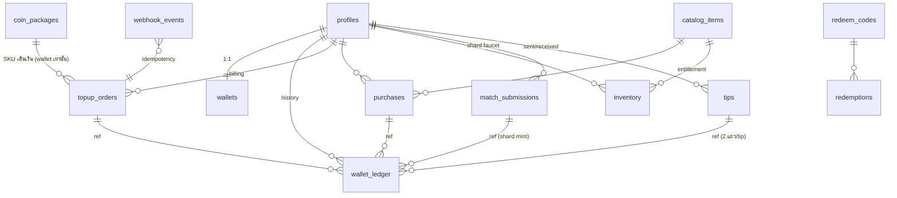
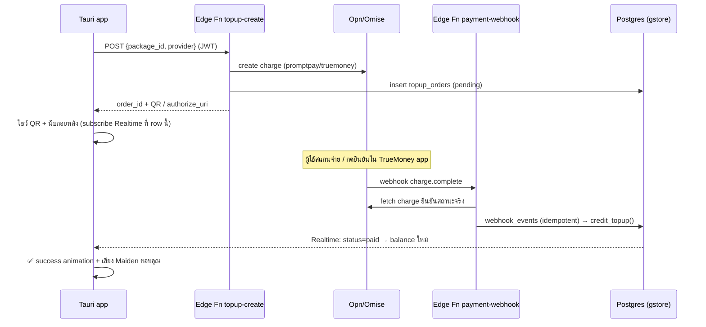

> ✅ **ADR-16 reconciliation applied 2026-07-11 (v0.3.0)** — this revision replaces the single
> `wallets.balance` design with the `shard`/`wallet` split ADR-16 §1/§7 requires. See §0 for what
> changed and why. Everything under §2 (schema/RLS/RPC/Edge Functions) supersedes the v0.1.0/0.2.0
> single-currency design below it in the changelog history.

# CR-003: ระบบ Account (GID) เฟสแรก — Wallet · Inventory · History · Billing

ต่อยอด **ADR-14** (GID + Supabase `gstore` + Google OAuth ที่ ship แล้ว) ให้บัญชี GID มี
"เศรษฐกิจ" ขั้นต่ำที่พร้อมรองรับ **ADR-12 marketplace**: กระเป๋าเหรียญ (G-Coins),
คลังไอเทม (announcer packs เป็นสินค้าแรก), ประวัติธุรกรรม, และการเติมเงินผ่าน
**PromptPay QR / TrueMoney Wallet**

> โน้ตเชื่อมงานเดิม: หน้า Voice Packs ที่ port มาแล้วยิง `/api/*` ไปหา backend :4577
> ที่ไม่มีอยู่ (จด memory ไว้) — CR นี้คือคำตอบของ backend นั้น: **Supabase คือ backend
> ของ store/inventory** ไม่ต้องมี server :4577

---

## 0. ADR-16 reconciliation (v0.3.0 — สิ่งที่เปลี่ยนจาก v0.2.0)

v0.1.0/0.2.0 (2026-07-04) ออกแบบ **สกุลเดียว** ("G-Coins," purchase-only, closed-loop) — ก่อน
ADR-16 (Accepted 2026-07-10) จะนิยาม **สองสกุลแยกขาด**. ผลคือ schema เดิม**ขัด**กับ ADR-16 §7
ตรง ๆ: ไม่มีคอลัมน์ `provenance`, ไม่มีทางแยก earned จาก purchased, และไม่มี faucet สำหรับ shard เลย

**สิ่งที่เปลี่ยนใน v0.3.0:**

| เดิม (v0.2.0) | ใหม่ (v0.3.0) | เหตุผล |
| --- | --- | --- |
| `wallets.balance` (ก้อนเดียว) | `wallets.shard_balance` + `wallets.wallet_balance` (แยกคอลัมน์) | ADR-16 §7 — แยก provenance ตั้งแต่ migration แรก, อ่าน balance เร็วโดยไม่ต้อง aggregate ledger |
| `wallet_ledger` ไม่มี currency | เพิ่ม `currency` check ('shard','wallet') ทุกแถว | ledger ยังเป็น source of truth (D4 เดิม) แต่ตอนนี้บอกได้ว่าแต่ละรายการเป็นสกุลไหน |
| `catalog_items.price_coins` ก้อนเดียว | `catalog_items.currency` + `price` แยกตามสกุล, constraint `currency='shard' → creator_id is null` | ADR-16 §6 catalog แยกเด็ดขาด + §1 shard ซื้อของ creator ไม่ได้ |
| ไม่มี faucet | ตาราง `match_submissions` (OpenDota-verified mint) + Edge Fn `match-share-submit` | ADR-16 §3 mint oracle ต้อง verify ภายนอกเสมอ, ห้าม mint จาก G-Log ในเครื่อง |
| ไม่มี tip | ตาราง `tips` + RPC `tip()` พร้อมเพดานรายวันเฉพาะ shard | ADR-16 §4 — tip ไม่ใช่ faucet, shard ที่รับได้ต้องมีเพดานต่อวัน |
| ไม่มี config ที่ tune ได้ | ตาราง `economy_config` (key/value) | เพดานรายวัน/วันหมดอายุ shard เป็นตัวเลขธุรกิจที่ยังไม่ตัดสินใจ (ดู Open ท้าย §2.2) — เก็บเป็น config ไม่ hardcode ใน migration |

**สิ่งที่ไม่เปลี่ยน:** Omise/PromptPay/TrueMoney flow (§2.5–2.6), UX shell 4 แท็บ + Store (§3),
no-scroll policy (§3.0), D2–D8 เดิม (ยกเว้น D1 ที่แก้เป็นสองสกุลใน §1), RLS pattern (`own read`
+ ไม่มี client INSERT/UPDATE/DELETE ที่ไหนเลย)

**Match_ref privacy (ADR-16 §5, บังคับใน schema นี้):** `match_submissions.match_ref` เก็บ
เฉพาะ `HMAC(server_key, match_id)` — `match_id` ดิบใช้ verify กับ OpenDota ใน Edge Function
แล้วทิ้ง ไม่เขียนลง DB ที่ไหนเลย

---

## 1. ขอบเขตเฟสแรก (สำคัญที่สุดในเอกสารนี้)

### การตัดสินใจหลัก (mini-ADR)

| # | Decision | เหตุผล |
| --- | --- | --- |
| D0 | **สองสกุลแยกขาด** ตาม ADR-16: `shard` (earned, verify ผ่าน OpenDota, ซื้อของ creator ไม่ได้, แปลงเงินไม่ได้, มีวันหมดอายุ) กับ `wallet` (purchased, G-Coins เดิม) | ADR-16 §1/§7 บังคับ — ใส่ทีหลังไม่ได้ (ดู §0) |
| D1 | **`wallet` เป็น closed-loop currency**: เติมได้อย่างเดียว ใช้ได้เฉพาะในระบบ **ไม่คืนเงิน ไม่ถอน ไม่โอนให้ user อื่น** (tip ด้วย wallet = ข้อยกเว้นเดียว, zero-sum). `shard` มีกฎเพิ่มตาม D0 | เลี่ยงการเข้าข่าย e-money ตาม พ.ร.บ.ระบบการชำระเงิน 2560 (ต้องมี license จาก ธปท.) — payout ของ creator เป็นเรื่อง post-v1.0 ตาม ADR-12 |
| D2 | **ราคา/ยอดเงินเป็น integer เท่านั้น**: THB เก็บเป็น**สตางค์** (`amount_satang`), เหรียญเป็น `bigint` | ห้ามใช้ float กับเงินเด็ดขาด |
| D3 | **ทุก path ที่แตะเงินทำงานฝั่ง server เท่านั้น** — Supabase Edge Functions + plpgsql `SECURITY DEFINER`; client (Tauri) **อ่านได้อย่างเดียว** ผ่าน RLS | client ถูก reverse-engineer ได้เสมอ; ราคาอ่านจาก DB ฝั่ง server ไม่รับจาก client |
| D4 | **Ledger เป็น source of truth**: `wallet_ledger` append-only (มี `currency` ต่อแถว), `wallets.shard_balance`/`wallet_balance` เป็น cache ที่อัปเดตใน transaction เดียวกันเสมอ | ตรวจสอบย้อนหลัง/audit ได้, กู้ balance คืนจาก ledger ได้ทุกเมื่อ (แยกได้ต่อสกุล) |
| D5 | **Payment gateway = Opn Payments (Omise)** ตัวเดียว ได้ทั้ง PromptPay QR + TrueMoney Wallet | เจ้าเดียวจบทั้ง 2 ช่องทาง, webhook ครบ, มี test mode; Stripe TH ไม่มี TrueMoney |
| D6 | **เติมเป็นแพ็คเกจเท่านั้น** (ไม่มี custom amount) ในเฟสแรก | ง่ายต่อ reconcile/กันโกง/ทำ bonus tier |
| D7 | สินค้าเฟสแรก = **official announcer packs เท่านั้น** (`creator_id = null`); creator upload/revenue-share = เฟสถัดไป | ตัด moderation + payout + KYC ออกจาก MVP |
| D8 | ยึดหลัก **additive** ตาม ADR-14: deck ใช้งานได้เต็มโดยไม่ sign-in; Wallet/Store เป็นส่วนเสริม | privacy-first ไม่เปลี่ยน — ข้อมูลแมตช์ยังอยู่ local 100% |

### In / Out of scope

**In:** wallet + ledger, เติมเงิน PromptPay/TrueMoney (sandbox → live), store catalog,
ซื้อ pack, inventory + ติดตั้ง/activate pack (ต่อกับระบบ announcer เดิม), ประวัติธุรกรรม +
ใบเสร็จอย่างง่าย, redeem code, welcome grant, ลบบัญชี (PDPA)

**Out (เฟสถัดไป):** creator upload/marketplace UGC, payout/ถอนเงิน, โอนเหรียญระหว่าง user,
บัตรเครดิต, subscription, ใบกำกับภาษีเต็มรูป, ระบบ refund อัตโนมัติ (เฟสแรก: manual adjust โดย admin)

---

## 2. Database design (Supabase `gstore`)

### 2.1 ER overview



- `profiles` (มีอยู่แล้วจาก ADR-14) — เพิ่มเฉพาะคอลัมน์ `role`
- ตารางใหม่ 13 ตาราง แบ่ง 5 กลุ่ม: **Wallet** (wallets, wallet_ledger) ·
  **Billing** (coin_packages, topup_orders, webhook_events — **wallet เท่านั้น**, ไม่มี Omise
  ฝั่ง shard) · **Shard faucet** (match_submissions, tips — ใหม่ใน v0.3.0) ·
  **Store/Inventory** (catalog_items, purchases, inventory) ·
  **Ops** (redeem_codes, redemptions, deletion_requests, economy_config — ใหม่ใน v0.3.0)

### 2.2 Migration SQL (ฉบับเต็ม)

```sql
-- ===== CR-003 Phase 1: wallet / billing / store / inventory =====

-- profiles: เพิ่ม role (ใช้คุม catalog admin + adjust)
alter table public.profiles
  add column if not exists role text not null default 'user'
  check (role in ('user','creator','admin'));

-- ---------- Wallet (ADR-16 §7: provenance แยกตั้งแต่ migration แรก) ----------
create table public.wallets (
  user_id              uuid primary key references public.profiles(id) on delete cascade,
  -- shard: earned เท่านั้น, mint ผ่าน mint_shard_from_match/tip เท่านั้น (ไม่มี client write)
  shard_balance        bigint not null default 0 check (shard_balance >= 0),
  lifetime_shard_earned bigint not null default 0,
  lifetime_shard_spent  bigint not null default 0,
  -- นับจาก entry ล่าสุดที่ credit shard เข้ามา (earn หรือ tip รับ); refresh ทุกครั้งที่ mint
  -- ตัวเลขวันดึงจาก economy_config('shard_expiry_days') ไม่ hardcode ที่นี่ (ดู Open ด้านล่าง)
  shard_expires_at      timestamptz,
  -- wallet: purchased เท่านั้น (เดิมชื่อ `balance` ใน v0.2.0)
  wallet_balance        bigint not null default 0 check (wallet_balance >= 0),
  lifetime_topup         bigint not null default 0,
  lifetime_spend          bigint not null default 0,
  updated_at             timestamptz not null default now()
);

-- append-only ledger — source of truth ของทุกความเคลื่อนไหว (นี่คือ "History")
create table public.wallet_ledger (
  id            bigint generated always as identity primary key,
  user_id       uuid not null references public.profiles(id) on delete cascade,
  -- ADR-16 §7: ทุกแถวต้องรู้ที่มา — ห้าม entry ที่ไม่รู้ว่าเป็น shard หรือ wallet
  currency      text not null check (currency in ('shard','wallet')),
  entry_type    text not null check (entry_type in
                  ('topup','purchase','refund','grant','redeem','adjust',
                   'earn_share','tip_sent','tip_received')),
  amount        bigint not null check (amount <> 0),      -- + เข้า / - ออก
  balance_after bigint not null check (balance_after >= 0),
  ref_type      text,          -- 'topup_order' | 'purchase' | 'redeem_code' | 'admin' | 'match_submission' | 'tip'
  ref_id        text,
  note          text,
  created_at    timestamptz not null default now(),
  -- currency ต้องสอดคล้องกับ entry_type (กันบั๊กชนิด "earn_share ที่บันทึกเป็น wallet")
  check (
    (currency = 'shard' and entry_type in ('earn_share','tip_sent','tip_received','purchase','adjust','grant','redeem'))
    or
    (currency = 'wallet' and entry_type in ('topup','purchase','refund','grant','redeem','adjust','tip_sent','tip_received'))
  )
);
create index wallet_ledger_user_idx on public.wallet_ledger (user_id, created_at desc);
create index wallet_ledger_currency_idx on public.wallet_ledger (user_id, currency, created_at desc);

-- ---------- Billing ----------
create table public.coin_packages (
  id            text primary key,              -- 'coins_s' | 'coins_m' | 'coins_l'
  title         text not null,
  coins         bigint not null check (coins > 0),
  bonus_coins   bigint not null default 0,
  price_satang  integer not null check (price_satang > 0),  -- THB เป็นสตางค์
  active        boolean not null default true,
  sort          integer not null default 0
);

create table public.topup_orders (
  id                 uuid primary key default gen_random_uuid(),
  user_id            uuid not null references public.profiles(id) on delete cascade,
  package_id         text not null references public.coin_packages(id),
  coins              bigint  not null check (coins > 0),          -- snapshot ตอนสั่ง
  price_satang       integer not null check (price_satang > 0),   -- snapshot ตอนสั่ง
  provider           text not null check (provider in ('promptpay','truemoney')),
  provider_charge_id text unique,                                 -- Omise charge id
  status             text not null default 'pending' check (status in
                       ('pending','paid','failed','expired')),
  qr_image_uri       text,          -- PromptPay: download_uri ของ QR
  authorize_uri      text,          -- TrueMoney: redirect ไป app
  expires_at         timestamptz,
  paid_at            timestamptz,
  created_at         timestamptz not null default now(),
  updated_at         timestamptz not null default now()
);
create index topup_orders_user_idx on public.topup_orders (user_id, created_at desc);

-- กันประมวลผล webhook ซ้ำ (Omise ยิงซ้ำได้)
create table public.webhook_events (
  provider     text not null,
  event_id     text not null,
  payload      jsonb not null,
  processed_at timestamptz,
  created_at   timestamptz not null default now(),
  primary key (provider, event_id)
);

-- ---------- Store / Inventory ----------
create table public.catalog_items (
  id           uuid primary key default gen_random_uuid(),
  sku          text unique not null,           -- 'pack.maiden-classic'
  item_type    text not null default 'announcer_pack'
               check (item_type in ('announcer_pack','persona','advice_style')),
  title        text not null,
  description  text,
  -- ADR-16 §6: catalog แยกเด็ดขาด — ของชิ้นหนึ่งขายด้วยสกุลเดียวเท่านั้น ไม่มี "ซื้อได้ทั้งสองทาง"
  currency     text not null check (currency in ('shard','wallet')),
  price        bigint not null check (price >= 0),         -- 0 = ฟรี; หน่วยตาม `currency`
  pack_id      text,            -- bundle id ใน voice-cache/packs/<id>/
  banner_url   text,            -- Supabase Storage public URL (ภาพโปรโมต)
  bundle_path  text,            -- path ใน Storage bucket 'packs' (private)
  creator_id   uuid references public.profiles(id),        -- null = official
  status       text not null default 'draft'
               check (status in ('draft','active','delisted')),
  created_at   timestamptz not null default now(),
  updated_at   timestamptz not null default now(),
  -- ADR-16 §1: shard ซื้อของ creator ไม่ได้ — ของ creator ต้องเป็น wallet เท่านั้น
  -- shard-priced items คือ prestige sink (§6): official-only, เงินซื้อไม่ได้เลย
  check (currency <> 'shard' or creator_id is null)
);

create table public.purchases (
  id          uuid primary key default gen_random_uuid(),
  user_id     uuid not null references public.profiles(id) on delete cascade,
  item_id     uuid not null references public.catalog_items(id),
  currency    text not null check (currency in ('shard','wallet')),  -- snapshot ตอนซื้อ
  price       bigint not null check (price >= 0),                   -- snapshot ราคา ณ ตอนซื้อ
  created_at  timestamptz not null default now(),
  unique (user_id, item_id)                                 -- กันซื้อซ้ำระดับ DB
);

create table public.inventory (
  id          uuid primary key default gen_random_uuid(),
  user_id     uuid not null references public.profiles(id) on delete cascade,
  item_id     uuid not null references public.catalog_items(id),
  source      text not null check (source in ('purchase','grant','redeem','starter')),
  ref_id      text,
  acquired_at timestamptz not null default now(),
  unique (user_id, item_id)
);
create index inventory_user_idx on public.inventory (user_id);

-- ---------- Ops ----------
create table public.redeem_codes (
  code       text primary key,                 -- เก็บ UPPERCASE
  grant_type text not null check (grant_type in ('coins','item')),
  coins      bigint check (coins > 0),
  item_id    uuid references public.catalog_items(id),
  max_uses   integer not null default 1,
  used_count integer not null default 0 check (used_count <= max_uses),
  expires_at timestamptz,
  created_by uuid references public.profiles(id),
  created_at timestamptz not null default now(),
  check ((grant_type = 'coins' and coins is not null)
      or (grant_type = 'item'  and item_id is not null))
);

create table public.redemptions (
  code        text not null references public.redeem_codes(code),
  user_id     uuid not null references public.profiles(id) on delete cascade,
  redeemed_at timestamptz not null default now(),
  primary key (code, user_id)                  -- 1 โค้ด/1 คน
);

-- PDPA: คำขอลบบัญชี (ประมวลผลโดย job/manual ภายใน 30 วัน)
create table public.deletion_requests (
  user_id      uuid primary key references public.profiles(id) on delete cascade,
  requested_at timestamptz not null default now(),
  processed_at timestamptz
);

-- ---------- Shard faucet (ADR-16 §3/§5 — ใหม่ใน v0.3.0) ----------
-- Mint oracle = OpenDota เท่านั้น. match_id ดิบใช้ verify ใน Edge Function แล้วทิ้ง —
-- ที่เก็บถาวรมีแค่ HMAC. ผู้ใช้ 2 คนในแมตช์เดียวกันได้ match_ref เดียวกัน (stitching, ADR-11 §3)
-- จึง unique ต่อ (user_id, match_ref) ไม่ใช่ต่อ match_ref เฉย ๆ
create table public.match_submissions (
  id            uuid primary key default gen_random_uuid(),
  user_id       uuid not null references public.profiles(id) on delete cascade,
  match_ref     text not null,                 -- HMAC(server_key, match_id) — ไม่ใช่ match_id ดิบ
  verified      boolean not null default false,
  shard_minted  bigint not null default 0 check (shard_minted >= 0),
  receipt_sig   text,                          -- ลายเซ็นเซิร์ฟเวอร์ส่งคืนผู้ใช้ (non-repudiation)
  submitted_at  timestamptz not null default now(),
  unique (user_id, match_ref)                  -- กัน mint ซ้ำแมตช์เดียวกัน (ADR-16 §5)
);
create index match_submissions_user_idx on public.match_submissions (user_id, submitted_at desc);

-- tip: ทั้ง shard และ wallet ผ่านตารางเดียว, กฎต่อสกุลบังคับใน RPC tip() ไม่ใช่ check constraint
-- (เพดาน "shard รับได้ต่อวัน" เป็น aggregate query ต่อ recipient — check constraint ทำไม่ได้)
create table public.tips (
  id          uuid primary key default gen_random_uuid(),
  from_user   uuid not null references public.profiles(id) on delete cascade,
  to_user     uuid not null references public.profiles(id) on delete cascade,
  currency    text not null check (currency in ('shard','wallet')),
  amount      bigint not null check (amount > 0),
  created_at  timestamptz not null default now(),
  check (from_user <> to_user)
);
create index tips_to_user_idx on public.tips (to_user, currency, created_at desc);

-- ---------- Ops: tunable economy parameters (ใหม่ใน v0.3.0) ----------
-- ตัวเลขธุรกิจ (เพดานรายวัน/วันหมดอายุ) ยังไม่ตัดสินใจ (ดู Open ท้าย §2.2) — เก็บเป็น
-- config แก้ผ่าน service_role ได้โดยไม่ต้อง migration ใหม่ทุกครั้งที่ tune
create table public.economy_config (
  key         text primary key,
  value       jsonb not null,
  updated_at  timestamptz not null default now()
);
-- seed ตอน migration แรก (ตัวเลขเริ่มต้น — Boss ปรับได้ก่อน launch จริง):
-- ('shard_daily_earn_cap', '500'), ('shard_daily_tip_receive_cap', '300'),
-- ('shard_expiry_days', '180')
```

### 2.3 RLS + สิทธิ์ (หัวใจความปลอดภัย)

```sql
alter table public.wallets            enable row level security;
alter table public.wallet_ledger      enable row level security;
alter table public.coin_packages      enable row level security;
alter table public.topup_orders       enable row level security;
alter table public.webhook_events     enable row level security;
alter table public.catalog_items      enable row level security;
alter table public.purchases          enable row level security;
alter table public.inventory          enable row level security;
alter table public.redeem_codes       enable row level security;
alter table public.redemptions        enable row level security;
alter table public.deletion_requests  enable row level security;
alter table public.match_submissions  enable row level security;
alter table public.tips               enable row level security;
alter table public.economy_config     enable row level security;

-- อ่านของตัวเองเท่านั้น
create policy "own read" on public.wallets        for select using (auth.uid() = user_id);
create policy "own read" on public.wallet_ledger  for select using (auth.uid() = user_id);
create policy "own read" on public.topup_orders   for select using (auth.uid() = user_id);
create policy "own read" on public.purchases      for select using (auth.uid() = user_id);
create policy "own read" on public.inventory      for select using (auth.uid() = user_id);
create policy "own read" on public.redemptions    for select using (auth.uid() = user_id);
create policy "own read" on public.match_submissions for select using (auth.uid() = user_id);
-- tip: เห็นได้ทั้งฝั่งส่งและฝั่งรับ (ไม่ใช่แค่เจ้าของ row เดียว)
create policy "own read" on public.tips
  for select using (auth.uid() = from_user or auth.uid() = to_user);
create policy "own rw"   on public.deletion_requests
  for all using (auth.uid() = user_id) with check (auth.uid() = user_id);

-- catalog อ่านได้ทุกคน (รวม signed-out — โชว์ store ก่อน login ได้)
create policy "public read" on public.coin_packages for select using (active);
create policy "public read" on public.catalog_items for select using (status = 'active');
-- economy_config: ตัวเลขเพดาน/วันหมดอายุต้องให้ client อ่านได้ (โชว์ "เหลือแชร์ได้อีก N วันนี้" ใน UI)
create policy "public read" on public.economy_config for select using (true);

-- ไม่มี policy INSERT/UPDATE/DELETE ให้ authenticated เลย =
-- เขียนได้ทางเดียวคือ SECURITY DEFINER fn / service_role (Edge Function)
revoke insert, update, delete on public.wallets, public.wallet_ledger,
  public.topup_orders, public.purchases, public.inventory,
  public.coin_packages, public.catalog_items, public.redeem_codes,
  public.redemptions, public.webhook_events, public.match_submissions,
  public.tips, public.economy_config from anon, authenticated;
```

**RLS matrix (สรุปไว้ทวน)**

| ตาราง | SELECT | INSERT/UPDATE/DELETE |
| --- | --- | --- |
| `wallets`, `wallet_ledger`, `purchases`, `inventory`, `topup_orders`, `redemptions`, `match_submissions` | เจ้าของ row | ❌ client — ผ่าน fn/service_role เท่านั้น |
| `tips` | ผู้ส่งหรือผู้รับ | ❌ client — ผ่าน RPC `tip()` เท่านั้น |
| `coin_packages`, `catalog_items`, `economy_config` | ทุกคน (เฉพาะ active/ทั้งหมดตามลำดับ) | admin ผ่าน service_role |
| `webhook_events`, `redeem_codes` | ❌ client | service_role เท่านั้น |
| `deletion_requests` | เจ้าของ | เจ้าของ (insert เท่านั้น) |

### 2.4 ฟังก์ชันฝั่ง server (atomic ทั้งหมด)

```sql
-- ซื้อไอเทมด้วย shard หรือ wallet (ตาม catalog_items.currency) — RPC เดียวจบใน 1 transaction
create or replace function public.purchase_item(p_item_id uuid)
returns public.purchases
language plpgsql security definer set search_path = public as $$
declare
  v_uid   uuid := auth.uid();
  v_item  catalog_items;
  v_bal   bigint;
  v_row   purchases;
begin
  if v_uid is null then raise exception 'not signed in'; end if;

  select * into v_item from catalog_items
   where id = p_item_id and status = 'active';
  if not found then raise exception 'item not available'; end if;

  -- ล็อกกระเป๋ากันซื้อพร้อมกัน (concurrent double-spend) — ล็อกทั้ง row เดียว ไม่ว่าจะจ่ายสกุลไหน
  select case v_item.currency when 'shard' then shard_balance else wallet_balance end
    into v_bal from wallets where user_id = v_uid for update;
  if not found then raise exception 'no wallet'; end if;
  if v_bal < v_item.price then raise exception 'insufficient balance'; end if;
  -- redundant กับ catalog_items check constraint แต่กันไว้อีกชั้นระดับ RPC (defense in depth)
  if v_item.currency = 'shard' and v_item.creator_id is not null then
    raise exception 'shard cannot purchase creator items';
  end if;

  insert into purchases (user_id, item_id, currency, price)
  values (v_uid, p_item_id, v_item.currency, v_item.price)   -- unique(user_id,item_id) กันซื้อซ้ำ
  returning * into v_row;

  insert into inventory (user_id, item_id, source, ref_id)
  values (v_uid, p_item_id, 'purchase', v_row.id::text);

  if v_item.currency = 'shard' then
    update wallets set shard_balance = shard_balance - v_item.price,
           lifetime_shard_spent = lifetime_shard_spent + v_item.price, updated_at = now()
     where user_id = v_uid;
  else
    update wallets set wallet_balance = wallet_balance - v_item.price,
           lifetime_spend = lifetime_spend + v_item.price, updated_at = now()
     where user_id = v_uid;
  end if;

  insert into wallet_ledger (user_id, currency, entry_type, amount, balance_after, ref_type, ref_id, note)
  values (v_uid, v_item.currency, 'purchase', -v_item.price, v_bal - v_item.price,
          'purchase', v_row.id::text, v_item.title);
  return v_row;
end $$;

-- เครดิตเหรียญหลังจ่ายสำเร็จ — เรียกจาก webhook Edge Function (service_role) เท่านั้น
-- wallet เท่านั้น (topup ผ่าน Omise จ่ายเงินจริง เข้าได้แค่ wallet_balance ไม่มีทางเข้า shard)
create or replace function public.credit_topup(p_order_id uuid)
returns void language plpgsql security definer set search_path = public as $$
declare
  v_order topup_orders;
  v_bal   bigint;
begin
  -- guard สถานะ = idempotent: ยิงซ้ำกี่ครั้งก็เครดิตครั้งเดียว
  update topup_orders set status = 'paid', paid_at = now(), updated_at = now()
   where id = p_order_id and status = 'pending'
  returning * into v_order;
  if not found then return; end if;

  select wallet_balance into v_bal from wallets where user_id = v_order.user_id for update;
  update wallets
     set wallet_balance = wallet_balance + v_order.coins,
         lifetime_topup = lifetime_topup + v_order.coins,
         updated_at = now()
   where user_id = v_order.user_id;

  insert into wallet_ledger (user_id, currency, entry_type, amount, balance_after, ref_type, ref_id, note)
  values (v_order.user_id, 'wallet', 'topup', v_order.coins, v_bal + v_order.coins,
          'topup_order', v_order.id::text, v_order.provider);
end $$;

-- Mint shard จากแมตช์ที่ verify แล้ว — เรียกจาก Edge Function `match-share-submit`
-- (service_role เท่านั้น; OpenDota verify ทำใน Edge Fn เพราะ plpgsql เรียก HTTP ออกไม่ได้)
-- ADR-16 §3: verify ไม่ได้ → ไม่ได้ shard (honest state) — Edge Fn ไม่เรียก fn นี้เลยถ้า verify fail
create or replace function public.mint_shard_from_match(
  p_user_id uuid, p_match_ref text, p_shard bigint, p_receipt_sig text
) returns public.match_submissions
language plpgsql security definer set search_path = public as $$
declare
  v_bal  bigint;
  v_cap  bigint;
  v_today_earned bigint;
  v_row  match_submissions;
begin
  if p_shard <= 0 then raise exception 'shard must be positive'; end if;

  -- เพดานรายวัน (ADR-16 §3 "เพดานต่อวันต่ำ") — อ่านจาก economy_config, ไม่ hardcode
  select (value #>> '{}')::bigint into v_cap from economy_config where key = 'shard_daily_earn_cap';
  select coalesce(sum(amount), 0) into v_today_earned from wallet_ledger
   where user_id = p_user_id and currency = 'shard' and entry_type = 'earn_share'
     and created_at >= date_trunc('day', now());
  if v_cap is not null and v_today_earned + p_shard > v_cap then
    raise exception 'daily shard earn cap reached';
  end if;

  -- unique(user_id, match_ref) กัน mint ซ้ำแมตช์เดียวกัน — insert ล้มเหลวถ้าเคยส่งแล้ว
  insert into match_submissions (user_id, match_ref, verified, shard_minted, receipt_sig)
  values (p_user_id, p_match_ref, true, p_shard, p_receipt_sig)
  returning * into v_row;

  select shard_balance into v_bal from wallets where user_id = p_user_id for update;
  update wallets
     set shard_balance = shard_balance + p_shard,
         lifetime_shard_earned = lifetime_shard_earned + p_shard,
         shard_expires_at = now() + (
           select ((value #>> '{}')::int || ' days')::interval
             from economy_config where key = 'shard_expiry_days'),
         updated_at = now()
   where user_id = p_user_id;

  insert into wallet_ledger (user_id, currency, entry_type, amount, balance_after, ref_type, ref_id, note)
  values (p_user_id, 'shard', 'earn_share', p_shard, v_bal + p_shard,
          'match_submission', v_row.id::text, 'match share verified');
  return v_row;
end $$;

-- Tip — ทั้ง shard และ wallet, zero-sum เสมอ; shard มีเพดาน "รับได้ต่อวัน" (ADR-16 §4, ไม่ใช่ decay)
create or replace function public.tip(p_to_user uuid, p_amount bigint, p_currency text)
returns public.tips
language plpgsql security definer set search_path = public as $$
declare
  v_uid uuid := auth.uid();
  v_bal bigint;
  v_cap bigint;
  v_today_received bigint;
  v_row tips;
begin
  if v_uid is null then raise exception 'not signed in'; end if;
  if p_amount <= 0 then raise exception 'amount must be positive'; end if;
  if v_uid = p_to_user then raise exception 'cannot tip yourself'; end if;
  if p_currency not in ('shard','wallet') then raise exception 'invalid currency'; end if;

  if p_currency = 'shard' then
    select (value #>> '{}')::bigint into v_cap from economy_config
     where key = 'shard_daily_tip_receive_cap';
    select coalesce(sum(amount), 0) into v_today_received from wallet_ledger
     where user_id = p_to_user and currency = 'shard' and entry_type = 'tip_received'
       and created_at >= date_trunc('day', now());
    if v_cap is not null and v_today_received + p_amount > v_cap then
      raise exception 'recipient daily shard tip cap reached';
    end if;
  end if;

  -- ล็อกกระเป๋าผู้ส่งกันยิงพร้อมกันเกินยอด
  select case p_currency when 'shard' then shard_balance else wallet_balance end
    into v_bal from wallets where user_id = v_uid for update;
  if v_bal < p_amount then raise exception 'insufficient balance'; end if;

  insert into tips (from_user, to_user, currency, amount)
  values (v_uid, p_to_user, p_currency, p_amount)
  returning * into v_row;

  if p_currency = 'shard' then
    update wallets set shard_balance = shard_balance - p_amount, updated_at = now() where user_id = v_uid;
    update wallets set shard_balance = shard_balance + p_amount, updated_at = now() where user_id = p_to_user;
  else
    update wallets set wallet_balance = wallet_balance - p_amount, updated_at = now() where user_id = v_uid;
    update wallets set wallet_balance = wallet_balance + p_amount, updated_at = now() where user_id = p_to_user;
  end if;

  insert into wallet_ledger (user_id, currency, entry_type, amount, balance_after, ref_type, ref_id)
  values (v_uid, p_currency, 'tip_sent', -p_amount, v_bal - p_amount, 'tip', v_row.id::text);
  -- balance_after ของผู้รับคำนวณแยก (ไม่ได้ล็อกกระเป๋าผู้รับใน select ด้านบน) — อ่านสดก่อน insert
  insert into wallet_ledger (user_id, currency, entry_type, amount, balance_after, ref_type, ref_id)
  select p_to_user, p_currency, 'tip_received', p_amount,
         (case p_currency when 'shard' then shard_balance else wallet_balance end), 'tip', v_row.id::text
    from wallets where user_id = p_to_user;
  return v_row;
end $$;

-- แลกโค้ด (โค้ดไม่เปิดให้ select — ตรวจในนี้) — grant เป็น wallet เสมอ (ของขวัญจากเรา ไม่ใช่ shard
-- ที่ต้อง verify จาก OpenDota — แจกเป็น shard จะเปิดช่องให้แจกโค้ดกลายเป็น faucet ปลอมตาม ADR-16 §3)
create or replace function public.redeem_code(p_code text)
returns jsonb language plpgsql security definer set search_path = public as $$
-- ล็อก redeem_codes row → เช็ค expiry/max_uses → insert redemptions (PK กันแลกซ้ำ)
-- → grant coins เข้า wallet_balance (ledger currency='wallet', entry_type='redeem') หรือ item
-- (inventory 'redeem') → used_count+1
... $$;

-- สร้าง wallet + welcome grant ตอน signup (ต่อท้าย trigger เดิมของ ADR-14)
-- insert into wallets(user_id) + grant เหรียญต้อนรับเข้า wallet_balance
-- (ledger currency='wallet', entry_type='grant', note='welcome')
```

**การกระจายสิทธิ์ RPC:** `grant execute on function purchase_item, tip, redeem_code to authenticated`.
`credit_topup` และ `mint_shard_from_match` **ไม่ grant ให้ authenticated เลย** — เรียกได้เฉพาะ
Edge Function ที่ถือ service_role key (`payment-webhook`, `match-share-submit` ตามลำดับ)

- คนสร้าง wallet คือ **trigger ตอน signup** (แก้ trigger `handle_new_user` เดิม) —
  ผู้ใช้เก่าที่มีอยู่แล้ว backfill ด้วย migration
- (ซ้ำกับย่อหน้า "การกระจายสิทธิ์ RPC" ด้านบน — ดูที่นั่นสำหรับรายการ grant ที่เป็นปัจจุบัน)

### 2.5 Edge Functions (Deno) — 4 ตัว

| Function | Auth | ทำอะไร |
| --- | --- | --- |
| `topup-create` | user JWT | รับ `{package_id, provider}` → อ่านราคาจาก `coin_packages` (ไม่รับราคาจาก client) → สร้าง Omise charge (source `promptpay` หรือ `truemoney`) → insert `topup_orders` → ตอบ `{order_id, qr_image_uri | authorize_uri, expires_at}` |
| `payment-webhook` | Omise (ตรวจด้วยการ **fetch charge กลับจาก Omise API** ด้วย secret key — ไม่เชื่อ payload ตรง ๆ) | insert `webhook_events` (PK กันซ้ำ; ชนแล้ว return 200 เฉย ๆ) → ถ้า charge `paid` → `credit_topup(order_id)`; ถ้า `failed/expired` → อัปเดตสถานะ order |
| `pack-download` | user JWT | เช็ค `inventory` ว่ามี item จริง → ออก **signed URL** (อายุ 5 นาที) ของ bundle ใน Storage bucket `packs` (private) |
| **`match-share-submit`** (ใหม่ v0.3.0) | user JWT | รับ `{match_id}` ดิบจาก client → HMAC ด้วย server-only key → `match_ref` (ไม่เขียน `match_id` ดิบลง DB ที่ไหนเลย, ADR-16 §5) → เรียก OpenDota API ยืนยัน: แมตช์มีจริง · `account_id` ของผู้ใช้อยู่ในแมตช์จริง (จาก GID→steamid64 link, ADR-14) · จบแมตช์แล้ว → คำนวณ shard จากผลงาน (MVP/สถิติสาธารณะ) → `mint_shard_from_match(...)` → เซ็น receipt → ตอบ `{shard_minted, receipt_sig}` หรือ `{shard_minted: 0, reason}` ถ้า verify ไม่ผ่าน (honest state, ADR-16 §3 ข้อ 4) |

### 2.6 ลำดับเหตุการณ์เติมเงิน (sequence)



- **PromptPay:** โชว์ QR ในแอป (โหลดภาพจาก `qr_image_uri`), อายุ ~15 นาที
- **TrueMoney:** เปิด `authorize_uri` ใน system browser (pattern เดียวกับ Google OAuth ที่มีอยู่) —
  ผู้ใช้ยืนยันใน TrueMoney แล้ว webhook เข้า → Realtime อัปเดตในแอปเอง ไม่ต้อง callback :3000
- fallback ถ้า Realtime หลุด: ปุ่ม "ตรวจสอบสถานะ" → `select` order ซ้ำ (RLS อ่านของตัวเองได้)

---

## 3. UX/UI

### 3.0 นโยบาย Desktop-first · No-Scroll (บังคับทุกหน้าในเอกสารนี้)

> อัปเดต 2026-07-04: แอปเป็น desktop-first แบบ Steam — ทำทุกอย่างจบในแอป **ห้ามมี
> page-level scroll**; ถ้าเนื้อหาไม่พอที่ ให้เพิ่มแท็บ ไม่ใช่เลื่อน (atom:
> `concept--noscroll-ui-policy`, บังคับด้วย `guard--e2e-no-scroll`)

- **นิยาม:** ห้าม scroll ระดับหน้า/ระดับ window เด็ดขาด — ข้อมูลที่โตไม่จำกัด (ledger,
  catalog) ใช้ **pagination ภายในกรอบความสูงคงที่** โดยจำนวนแถว/การ์ดต่อหน้า
  คำนวณจาก pure fn `rowsThatFit(viewportH, chromeH, rowH)` (`algo--fit-rows`) —
  ไม่ hardcode จำนวนแถว
- **Baseline:** หน้าต่าง logical ขั้นต่ำ **1280×800** ต้องแสดงครบที่ Windows DPI
  100% / 125% / 150% — e2e gate ตรวจ `scrollHeight <= clientHeight` ทุกแท็บ
  ทั้ง empty state และ data เต็ม
- **เพดานแท็บ:** top-level ≤ 7 แท็บ; เกินนั้นให้จัดกลุ่มเป็น sub-tab (กัน tab
  proliferation ซึ่งเป็นเทรดออฟหลักของแนวทางนี้)
- **ข้อความไทย:** ห้าม fixed px width กับ label — ใช้ clamp + ellipsis; เนื้อหาอ่านยาว
  (ToS, รายละเอียดแพ็ค) อนุญาต scroll เฉพาะใน reading pane ของมันเอง หรือเปิด
  external browser
- **Content budget ต่อแท็บ** (ที่ 1280×800/100%): Wallet = hero + ledger 3 แถว ·
  History = filter + ~8 แถว + pager · Store/Inventory = grid 2×3 + pager ·
  Top-up modal = 1 step ต่อจอ

### 3.1 ตำแหน่งใน nav (ต่อจากโครงเดิม)

Account & Profile page (มีอยู่แล้ว) ขยายเป็น **4 แท็บ**; ส่วน **Store** เข้าไปแทนที่หน้า
Voice Packs เดิมที่ยิง `/api/*` ค้าง:

```
Profile menu ─ Account & Steam ──► [ Account | Wallet | Inventory | History ]
Deck nav    ─ Voice Packs ───────► Store (catalog จาก Supabase — แก้ปัญหา :4577)
```

ภาษา UI: ไทยเป็นหลัก (ตาม persona Maiden) · design tokens ตามระบบเดิม — พื้น `#08090c`,
การ์ด frosted `rgba(18,20,28,0.72)`, accent ice-blue, ฟอนต์/ระยะตาม `design-system.md`

### 3.2 Wallet (รวม Billing) — v0.3.0: สองยอดแยกกัน

```
┌─ WALLET ──────────────────────────────────────────────┐
│  💎 1,200 Shard         🪙 2,450 G-Coins  [ + เติมเหรียญ ] │
│  แชร์แมตช์วันนี้ 300/500 · หมดอายุใน 172 วัน               │
│  เติมสะสม 3,000 · ใช้ไป 550                             │
├───────────────────────────────────────────────────────┤
│  ธุรกรรมล่าสุด (4 รายการ)                    ดูทั้งหมด → │
│  💎 แชร์แมตช์ (verified)         +150     2 ก.ค. 20:14 │
│  ↑ เติมเหรียญ (PromptPay)      +1,000     2 ก.ค. 19:02 │
│  ↓ ซื้อ Maiden Classic Pack      -550     2 ก.ค. 19:05 │
│  ★ เหรียญต้อนรับ Founder          +50     1 ก.ค. 10:11 │
└───────────────────────────────────────────────────────┘
```

- **Shard card** โชว์ "แชร์แมตช์วันนี้ N/cap" (อ่านจาก `economy_config.shard_daily_earn_cap` +
  aggregate ledger วันนี้) และวันหมดอายุที่เหลือ (`wallets.shard_expires_at`) — ความโปร่งใสตรงนี้
  สำคัญเพราะ shard หมดอายุจริง ผู้ใช้ต้องรู้ก่อนจะหาย
- ปุ่ม **"แชร์แมตช์ล่าสุด"** (ใหม่ v0.3.0) อยู่ข้าง Shard card — ยิง `match-share-submit` ด้วย
  `match_id` ล่าสุดจาก local match history (มีอยู่แล้วใน deck); verify ไม่ผ่าน → toast อธิบาย
  เหตุผล (private profile / ยังไม่ parse) ไม่ใช่ error ทึบ ๆ (honest-state ตาม ADR-16 §3 ข้อ 4)
- ปุ่ม **"ทิป"** บนแต่ละ transaction ที่มาจากผู้เล่นอื่น (ยังไม่มีในเฟสแรก — placeholder จน UI
  ค้นหา/เลือกผู้รับพร้อม; RPC `tip()` พร้อมใช้จาก §2.4)

**Top-up modal (3 steps ใน modal เดียว):**
1. **เลือกแพ็คเกจ** — การ์ด 3 ใบ (S/M/L) โชว์เหรียญ + โบนัส + ราคาบาท; แพ็ค M ติดป้าย "คุ้มสุด"
2. **เลือกช่องทาง** — ปุ่มใหญ่ 2 ปุ่ม: PromptPay (icon QR) / TrueMoney (icon wallet)
3. **จ่าย** — PromptPay: QR กลางจอ + เคาน์ต์ดาวน์ 15:00 + สถานะ "รอชำระ…" แบบ pulse ·
   TrueMoney: ข้อความ "เปิดแอป TrueMoney ในเบราว์เซอร์แล้ว…" + spinner
   - สำเร็จ (Realtime): เช็คแอนิเมชันน้ำแข็ง + ยอดเหรียญนับขึ้น + Maiden พูดขอบคุณ 1 ประโยค
   - หมดอายุ: QR จางลง + ปุ่ม "สร้าง QR ใหม่" · ล้มเหลว: แจ้งเหตุ + ปุ่มลองใหม่
   - ปิด modal ระหว่างรอได้ — มี badge "รอชำระ 1 รายการ" ค้างที่หัวการ์ด Wallet

### 3.3 Store (catalog)

- Grid การ์ดแพ็ค: **banner image** (จาก `banner_url` — ภาพเดียวกับที่ pack ใช้โชว์ overlay),
  ชื่อ, ราคา, ปุ่ม **ลองฟัง** (เล่น clip ตัวอย่าง 1 event) — preview ก่อนซื้อสำคัญมากกับสินค้าเสียง
- **แบดจ์สกุลเงิน** (ใหม่ v0.3.0) — การ์ดที่ `currency='shard'` (prestige, official-only) ติดป้าย
  `💎 แลกด้วย Shard เท่านั้น` มุมบนซ้าย; การ์ดที่ `currency='wallet'` ไม่มีแบดจ์ (ค่าเริ่ม, ซื้อด้วย
  G-Coins ปกติ) — สื่อสารให้ชัดว่านี่ไม่ใช่ของที่เงินซื้อได้ (ADR-16 §6 prestige sink)
- สถานะปุ่มซื้อ: `ซื้อ 💎550` หรือ `ซื้อ 🪙550` (ตาม currency) → กดแล้ว confirm sheet เล็ก
  ("หัก 550 [Shard/เหรียญ] — ยืนยัน?") → ถ้ายอดไม่พอ: ปุ่มเป็น `[Shard/เหรียญ]ไม่พอ` — สำหรับ
  wallet มีลิงก์ "เติมเลย" (เปิด top-up modal); **สำหรับ shard ไม่มีปุ่มเติม** (จะซื้อ shard ด้วยเงิน
  ไม่ได้ตาม ADR-16 §1 — ข้อความแทนคือ "แชร์แมตช์เพื่อได้ Shard เพิ่ม" ลิงก์ไปแท็บ Wallet)
- เป็นเจ้าของแล้ว: ป้าย `✓ เป็นเจ้าของ` แทนราคา
- **signed-out ดูได้ทั้งหน้า** (catalog เปิด public read) — ปุ่มซื้อกลายเป็น `เข้าสู่ระบบเพื่อซื้อ`
  ตามหลัก additive

### 3.4 Inventory

- Grid ของที่เป็นเจ้าของ; แต่ละใบ: banner, ชื่อ, source badge (ซื้อ/ของขวัญ/starter), วันที่ได้
- ปุ่มตามสถานะ local: `ติดตั้ง` (เรียก `pack-download` → ดาวน์โหลด → `POST /announcer/install`
  ที่ **:3000 endpoint เดิม** — ใช้ pipeline ติดตั้งเดียวกับ G-AnnStudio ทุกอย่าง) →
  `ใช้งาน` (activate ผ่านกลไก active pack ใน `voice_api.rs` เดิม) → `✓ กำลังใช้งาน`
- แถวบน: ช่อง **แลกโค้ด** (input + ปุ่มแลก) — ผลสำเร็จเด้งการ์ดใหม่เข้า grid ทันที

### 3.5 History (ประวัติธุรกรรม)

> แยกจาก match history เดิม (`HistoryPage` ของ deck) — อันนี้คือประวัติ "เงิน" อยู่ใต้ Account

- ลิสต์จาก `wallet_ledger` (paginate 20 รายการ), filter chips: ทั้งหมด · เติมเหรียญ · ซื้อ ·
  รับฟรี · **แชร์แมตช์** (ใหม่ v0.3.0, `entry_type='earn_share'`) · **ทิป** (`tip_sent`/`tip_received`)
- แต่ละแถว: icon ประเภท, คำอธิบาย, `+/-เหรียญ` (สีเขียว/แดงอ่อน), balance หลังรายการ, เวลา
- แถว topup กดได้ → **ใบเสร็จอย่างง่าย**: เลขที่ order, ช่องทาง, ยอดบาท, เหรียญที่ได้, เวลา,
  provider ref + ปุ่ม copy — พอสำหรับ dispute เฟสแรก
- Empty state: "ยังไม่มีธุรกรรม — เริ่มจากเหรียญต้อนรับของคุณ ❄"

### 3.6 Account tab (ของเดิม + เพิ่ม)

- ของเดิม: AuthPanel, SteamLink, display name
- เพิ่ม: การ์ด GID (โชว์ `G-F…` + generation badge "Founder #1"), ส่วน **Danger zone**:
  ปุ่ม "ขอลบบัญชี" → confirm 2 ชั้น (พิมพ์ GID ยืนยัน) → insert `deletion_requests` +
  แจ้งว่า "ดำเนินการภายใน 30 วัน — ข้อมูลแมตช์ของคุณอยู่ในเครื่องคุณอยู่แล้ว ไม่เกี่ยวกับบัญชี"

### 3.7 ไฟล์ frontend ใหม่ (ประมาณการ)

| ไฟล์ | ทำอะไร |
| --- | --- |
| `src/src/wallet.ts` | `useWallet()` — **shard_balance + wallet_balance แยกกัน**, Realtime subscribe, `topup()`, `purchase()`, `redeem()`, `tip()` (เรียก RPC/Edge Fn) |
| `src/src/StorePage.tsx` | catalog grid + currency badge (§3.3) + confirm ซื้อ + preview เสียง |
| `src/src/WalletTab.tsx` / `TopupModal.tsx` | ตาม §3.2 — สองยอด + shard daily-cap/expiry display |
| `src/src/InventoryTab.tsx` | ตาม §3.4 — ต่อ `pack-download` → `/announcer/install` |
| `src/src/LedgerTab.tsx` | ตาม §3.5 |
| `src/src/MatchShareCard.tsx` (ใหม่ v0.3.0) | ปุ่ม "แชร์แมตช์ล่าสุด" → `match-share-submit` → honest-state toast (verify ผ่าน/ไม่ผ่าน) |

---

## 4. User stories (พร้อม acceptance criteria)

| ID | Story | Acceptance criteria (Given/When/Then) |
| --- | --- | --- |
| **US-01** | ผู้ใช้ใหม่ sign-in ครั้งแรกแล้วได้ wallet + เหรียญต้อนรับ | Given ไม่เคยมีบัญชี · When sign-in Google สำเร็จ · Then มี `wallets` row (shard_balance=0, wallet_balance≥0), ledger มี `grant` "welcome" (`currency='wallet'`), Wallet โชว์ยอด ≥ 0 ทันที |
| **US-02** | ผู้ใช้ดูยอดทั้งสองสกุลปัจจุบันได้เสมอ | Given sign-in แล้ว · When เปิดแท็บ Wallet · Then เห็น `shard_balance` และ `wallet_balance` ตรงกับ DB แยกกันชัดเจน และอัปเดต realtime เมื่อมีธุรกรรมใหม่ |
| **US-03** | เติมเหรียญผ่าน PromptPay | Given เลือกแพ็ค M + PromptPay · When สแกนจ่ายสำเร็จ · Then ภายใน ~5 วิ order เป็น `paid`, `wallet_balance` เพิ่ม = coins+bonus (ไม่แตะ `shard_balance`), ledger มีแถว `currency='wallet', entry_type='topup'`, มี success feedback |
| **US-04** | เติมเหรียญผ่าน TrueMoney | Given เลือกแพ็ค S + TrueMoney · When ยืนยันใน TrueMoney app · Then ผลเหมือน US-03 (ผ่าน webhook เดียวกัน) |
| **US-05** | QR หมดอายุแล้วเริ่มใหม่ได้ | Given เปิด QR ทิ้งไว้เกิน expiry · When ครบเวลา · Then order เป็น `expired`, เหรียญไม่เพิ่ม, ปุ่ม "สร้าง QR ใหม่" ออก order ใหม่ (order เก่าไม่ถูก reuse) |
| **US-06** | จ่ายเงินแล้วแต่ปิดแอปไปก่อน | Given จ่ายสำเร็จหลังปิดแอป · When เปิดแอปใหม่ · Then balance ถูกต้อง (webhook เครดิตให้โดยไม่ต้องมีแอปเปิด) และ history มีรายการครบ |
| **US-07** | ซื้อ announcer pack ด้วย G-Coins (wallet item) | Given wallet_balance พอ + ยังไม่เป็นเจ้าของ · When กดซื้อ + ยืนยัน · Then หัก `wallet_balance` ราคา snapshot, ได้ `purchases`(currency='wallet') + `inventory`, ledger `purchase`, การ์ดเปลี่ยนเป็น "เป็นเจ้าของ" |
| **US-08** | ยอดไม่พอต้องไม่ซื้อได้ | Given balance สกุลที่ item ต้องการ < ราคา · When พยายามซื้อ (รวม call RPC ตรง) · Then ถูกปฏิเสธทั้ง UI และ DB, balance ไม่เปลี่ยน, ไม่มี ledger ใหม่, UI เสนอทางแก้ตามสกุล (wallet→เติมเลย, shard→แชร์แมตช์เพิ่ม) |
| **US-09** | ซื้อซ้ำถูกกัน | Given เป็นเจ้าของ item แล้ว · When call `purchase_item` ซ้ำ (เช่น 2 เครื่อง) · Then ล้มเหลวด้วย unique constraint — ไม่หักยอดรอบสอง |
| **US-10** | ติดตั้ง + ใช้งาน pack ที่ซื้อ | Given เป็นเจ้าของ · When กดติดตั้ง → ใช้งาน · Then bundle ลง `voice-cache/packs/<id>/` ผ่าน `/announcer/install`, pack กลายเป็น active, event ถัดไปใช้เสียง pack นี้ (contract เดิมของ `audio::play_random`) |
| **US-11** | คนไม่มีสิทธิ์ดาวน์โหลด bundle ไม่ได้ | Given ไม่มี item ใน inventory · When เรียก `pack-download` ตรง · Then 403, ไม่ได้ signed URL |
| **US-12** | ดูประวัติ + ใบเสร็จ | Given มีธุรกรรม >20 รายการ · When เปิด History + filter "เติมเหรียญ" · Then เห็นเฉพาะ topup, กดแถวได้ใบเสร็จที่มี provider ref |
| **US-13** | แลก redeem code | Given โค้ดถูกต้องยังไม่หมดอายุ/สิทธิ์ · When แลก · Then ได้ **wallet coins** หรือ item ตามโค้ด (redeem ไม่แจก shard เลย — ดู §2.4), แลกซ้ำคนเดิมไม่ได้, โค้ดเกิน `max_uses` ไม่ได้ |
| **US-14** | ขอลบบัญชี (PDPA) | Given sign-in · When ยืนยันลบ 2 ชั้น · Then มี `deletion_requests`, UI แจ้งกรอบ 30 วัน; ระหว่างนั้น deck ยังใช้ได้แบบ signed-out ปกติ |
| **US-15** | Signed-out ยังใช้ deck ได้เต็ม | Given ไม่ sign-in · When เปิด Store · Then ดู catalog/preview ได้ แต่ปุ่มซื้อพาไป sign-in — ฟีเจอร์เกมทั้งหมดไม่ถูกล็อก |
| **US-16** (ใหม่ v0.3.0) | แชร์แมตช์ที่ verify ผ่านได้ shard | Given เล่นจบแมตช์ + profile OpenDota เปิดสาธารณะ + ยังไม่เคยส่งแมตช์นี้ · When กด "แชร์แมตช์ล่าสุด" · Then `match-share-submit` verify ผ่าน OpenDota, `match_submissions` มีแถวใหม่ (unique user+match_ref), `shard_balance` เพิ่มตามผลงาน, ledger `earn_share`, ได้ receipt |
| **US-17** (ใหม่ v0.3.0) | แชร์แมตช์ที่ verify ไม่ผ่าน ไม่ได้ shard | Given profile OpenDota private หรือยังไม่ parse · When กดแชร์ · Then ได้ `shard_minted: 0` พร้อมเหตุผลที่อ่านเข้าใจได้ (ไม่ใช่ error ทึบ), ไม่มีแถว `match_submissions`/ledger ใหม่ (honest state) |
| **US-18** (ใหม่ v0.3.0) | แชร์แมตช์เดิมซ้ำไม่ได้ shard ซ้ำ | Given เคยแชร์แมตช์นี้จน mint สำเร็จแล้ว · When ส่ง `match_id` เดิมอีกครั้ง (เช่น กดปุ่มซ้ำ, retry) · Then `unique(user_id, match_ref)` ปฏิเสธ insert, ไม่มี shard เพิ่ม, UI แจ้ง "แมตช์นี้แชร์ไปแล้ว" |
| **US-19** (ใหม่ v0.3.0) | Shard ซื้อของ creator ไม่ได้ | Given มี catalog item ที่ `creator_id is not null` (สมมติเฟสถัดไป) · When ลองซื้อด้วย RPC ที่ระบุจ่าย shard ตรง ๆ · Then ถูกปฏิเสธที่ระดับ DB (`catalog_items` check constraint กันไม่ให้ item แบบนี้ตั้ง currency='shard' ตั้งแต่แรก — item creator ทุกชิ้นเป็น wallet-only โดยโครงสร้าง) |
| **US-20** (ใหม่ v0.3.0) | เพดาน shard ที่รับได้ต่อวันบังคับจริง | Given ผู้รับได้ shard จาก tip วันนี้ใกล้ `shard_daily_tip_receive_cap` · When มีคนพยายาม tip เพิ่มจนเกินเพดาน · Then RPC `tip()` ปฏิเสธ, ไม่มี ledger ใหม่ทั้งสองฝั่ง (atomic — ไม่ใช่หักผู้ส่งแล้วผู้รับไม่ได้) |
| **US-21** (ใหม่ v0.3.0) | Tip เป็น zero-sum เสมอ | Given ผู้ส่งมี shard/wallet พอ · When tip สำเร็จ · Then ผู้ส่งลด N พอดี ผู้รับเพิ่ม N พอดี (ไม่มี mint ใหม่เกิดขึ้น), ledger มี 2 แถว (`tip_sent`/`tip_received`) อ้าง `tips.id` เดียวกัน |

---

## 5. E2E test plan

### 5.1 สภาพแวดล้อม

- **Supabase branch** (`gstore` dev branch) + seed: แพ็คเกจ 3 ตัว, catalog 2 pack (ฟรี 1/เสียเงิน 1), redeem code 2 ตัว, user ทดสอบ 2 คน
- **Omise test mode** — test secret key ใน Edge Fn env; PromptPay test charge สั่ง "จ่ายสำเร็จ"
  ได้ผ่าน API ⇒ E2E จำลองการสแกนจ่ายได้จริงโดยไม่ใช้เงิน
- **UI runner:** WebdriverIO + `tauri-driver` (Windows) สำหรับ journey จริง; vitest เดิมคุม unit
- **DB tests:** pgTAP ผ่าน `supabase test db` — เพิ่มเข้า CI คู่กับ `cargo test` / `tsc --noEmit`

### 5.2 Layer 1 — DB security & atomicity (pgTAP/SQL) *สำคัญสุด รันทุก CI*

| ID | สถานการณ์ | คาดหวัง |
| --- | --- | --- |
| DB-01 | authenticated พยายาม `update wallets set shard_balance=…` / `insert wallet_ledger` ตรง ๆ | ถูกปฏิเสธ (ไม่มี policy/สิทธิ์) |
| DB-02 | user A `select` wallet/ledger/orders/inventory ของ user B | ได้ 0 แถว (RLS) |
| DB-03 | `purchase_item` ตอนยอดพอ (ทั้ง shard item และ wallet item) | purchases+inventory+ledger ครบ 3, balance สกุลที่ถูกต้องลด, สกุลอีกอันไม่แตะ, `balance_after` ต่อเนื่อง |
| DB-04 | `purchase_item` ตอนยอดไม่พอ | exception, **ไม่มีแถวใดถูก insert** (rollback ทั้ง tx) |
| DB-05 | **concurrency:** 2 session ซื้อ item ราคา 60 พร้อมกัน ตอนมี 100 shard/wallet | สำเร็จอย่างมาก 1 รายการ (row lock + unique), balance ≥ 0 เสมอ |
| DB-06 | `credit_topup` ถูกเรียกซ้ำ 3 ครั้งบน order เดียว | เครดิตครั้งเดียว, ledger 1 แถว `currency='wallet'` (status guard) |
| DB-07 | `redeem_code` ซ้ำคนเดิม / เกิน max_uses / หมดอายุ | ปฏิเสธทั้ง 3 แบบ, `used_count` ไม่เพี้ยน |
| DB-08 | ตรวจ invariant: `shard_balance`/`wallet_balance` แต่ละสกุล = Σ`ledger.amount` (filter `currency`) ของทุก user หลังชุดทดสอบ | เท่ากันเป๊ะทั้งสองสกุลแยกกัน |
| **DB-09** (ใหม่ v0.3.0) | `insert into catalog_items (currency='shard', creator_id=<not null>, ...)` ตรง ๆ | ถูกปฏิเสธด้วย check constraint (`currency <> 'shard' or creator_id is null`) — กันที่ schema ไม่ใช่แค่ RPC |
| **DB-10** (ใหม่ v0.3.0) | `mint_shard_from_match` เรียกซ้ำด้วย `match_ref` เดิม (คนละ call, service_role) | call ที่สองล้มเหลวด้วย `unique(user_id, match_ref)`, shard ไม่เพิ่มซ้ำ |
| **DB-11** (ใหม่ v0.3.0) | `mint_shard_from_match` เมื่อผู้ใช้แชร์ไปแล้ว = cap วันนี้ (`shard_daily_earn_cap`) | ล้มเหลวด้วย `daily shard earn cap reached`, ไม่มี insert |
| **DB-12** (ใหม่ v0.3.0) | `tip()` ยิงพร้อมกัน 2 ครั้งจนยอดผู้ส่งติดลบ / ผู้รับเกิน daily-tip-cap (shard) | สำเร็จอย่างมากเท่าที่ยอด/เพดานเหลือ, ไม่มี tx ไหนทำให้ `shard_balance < 0` หรือ cap ถูกละเมิด |
| **DB-13** (ใหม่ v0.3.0) | `authenticated` เรียก `mint_shard_from_match`/`credit_topup` ตรง (ไม่ผ่าน service_role) | ถูกปฏิเสธ — ไม่มี `grant execute` ให้ authenticated เลย |

### 5.3 Layer 2 — Edge Functions (integration, Deno test + Omise test mode)

| ID | สถานการณ์ | คาดหวัง |
| --- | --- | --- |
| EF-01 | `topup-create` ด้วย package จริง ×2 provider | ได้ charge + order `pending` + QR/authorize URI; ราคาใช้ค่าจาก DB แม้ client ส่งราคาปลอมมา |
| EF-02 | `topup-create` โดยไม่มี JWT / package ไม่ active | 401 / 400 |
| EF-03 | webhook ปลอม (charge id ไม่มีจริงใน Omise) | ไม่เครดิต — เพราะ verify ด้วยการ fetch charge กลับเสมอ |
| EF-04 | webhook event เดิมยิงซ้ำ 5 ครั้ง | 200 ทุกครั้ง แต่เครดิตครั้งเดียว (`webhook_events` PK) |
| EF-05 | webhook แจ้ง failed/expired | order เปลี่ยนสถานะ, ไม่มี ledger |
| EF-06 | `pack-download`: มีสิทธิ์ / ไม่มีสิทธิ์ / ไม่ส่ง JWT | signed URL ใช้ได้ / 403 / 401; URL หมดอายุใน 5 นาที |
| EF-07 | rate limit: `topup-create` >5 order pending/ชม./user | 429 |

### 5.4 Layer 3 — UI journeys (WebdriverIO + tauri-driver)

| ID | Journey | จุด assert หลัก |
| --- | --- | --- |
| E2E-01 | **Golden path:** sign-in → เห็น welcome coins → เติม PromptPay (สั่ง test-pay ผ่าน Omise API) → balance เด้ง realtime → ซื้อ pack → Inventory ติดตั้ง → activate → History มี 3 รายการ | ทุก state UI ตรง DB; `voice-cache/packs/<id>/manifest.json` โผล่จริงบนดิสก์ |
| E2E-02 | TrueMoney path (mock authorize) → webhook → success UI | สถานะไล่ pending→paid ถูกต้อง |
| E2E-03 | QR หมดอายุ (ย่น expiry ใน test) → UI เสนอสร้างใหม่ → จ่าย order ใหม่สำเร็จ | order เก่า `expired` ไม่ถูกเครดิตย้อน |
| E2E-04 | เหรียญไม่พอ → ปุ่มกลายเป็น "เติมเลย" → modal เปิด พร้อมแพ็คที่พอดีส่วนต่าง | ไม่มี RPC ถูกยิง |
| E2E-05 | แลกโค้ด item → การ์ดโผล่ใน Inventory ทันที → แลกซ้ำเจอ error สุภาพ | redemptions PK ทำงาน |
| E2E-06 | Signed-out: เปิด Store ดู/preview ได้ ซื้อไม่ได้; deck หลัก (GSI/overlay) ไม่ถูกกระทบ | additive ตาม ADR-14 |
| E2E-07 | ปิดแอประหว่างรอจ่าย → จ่าย → เปิดแอป | balance + history ถูกต้อง (US-06) |
| E2E-08 | ขอลบบัญชี 2 ชั้น → sign-out → ใช้ deck ต่อได้ | `deletion_requests` ถูก insert |

### 5.5 เกณฑ์ผ่านก่อน ship

Layer 1 + 2 **เขียวทั้งหมดใน CI ทุก commit**; Layer 3 รันก่อน tag release (Windows runner);
invariant DB-08 รันเป็น nightly กับข้อมูลจริงบน dev branch

---

## 6. ของแถมที่ "ควรมี" ในเฟสแรก (เหตุผลกำกับ)

1. **Welcome grant + redeem codes** — แก้ cold-start ของ ADR-12: แจกโค้ดให้ Founder cohort /
   แคสเตอร์ไทยชุดแรกโดยไม่ต้องรอ payment live-mode อนุมัติ (ระบบเศรษฐกิจใช้งานได้ตั้งแต่วันแรก
   แม้ gateway ยังไม่พร้อม)
2. **Feature flag `wallet_enabled`** (ตาราง config หรือ remote flag) — Omise live key ต้องมี
   **ทะเบียนพาณิชย์ + อนุมัติช่องทาง TrueMoney** ซึ่งกินเวลา; flag นี้ทำให้ ship UI ที่ปิด
   ปุ่มเติมเงินไว้ก่อนได้ โดย Store แบบ redeem/ฟรียังทำงาน
3. **`webhook_events` เก็บ payload ดิบ** — เป็นทั้ง idempotency key และหลักฐาน reconcile
   เวลามี dispute ("จ่ายแล้วเหรียญไม่เข้า" ตอบได้ใน 1 query)
4. **ใบเสร็จอย่างง่ายใน History** — ลด support load; ใบกำกับภาษีเต็มรูปยังไม่ต้อง (ดู §7)
5. **Danger zone / deletion request** — PDPA พร้อมตั้งแต่มีการเก็บเงินจริง ไม่ใช่ตามแก้ทีหลัง

## 7. ความเสี่ยง / ข้อกฎหมาย (ต้องรับทราบ ไม่ใช่ legal advice)

| ประเด็น | ท่าที่เลือก |
| --- | --- |
| **e-money license (ธปท.)** | D1 closed-loop: เหรียญไม่คืน/ไม่ถอน/ไม่โอน — โมเดลเดียวกับ game credits ทั่วไป; เขียนใน ToS ชัด ๆ ก่อนเปิดเติมเงินจริง |
| **Omise live mode** | ต้องมีนิติบุคคล/ทะเบียนพาณิชย์ + ขออนุมัติช่องทาง TrueMoney แยก — **เริ่มยื่นทันทีคู่ขนานกับ dev** (คือ critical path ที่ไม่ใช่โค้ด). **บล็อกเฉพาะ wallet (purchased) — shard ไม่เกี่ยวเลย** เพราะ mint จาก OpenDota ไม่ต้องมี payment gateway (ดู §0/§8) |
| **VAT** | เกณฑ์จด VAT 1.8 ล้านบาท/ปี — เฟสแรกยังไม่ถึง แต่เก็บ `price_satang` + order ครบพอทำบัญชีย้อนหลัง |
| **PDPA** | เก็บเพิ่มจาก ADR-14 แค่ธุรกรรม (ไม่มีบัตร/ไม่มีเลขบัญชี — provider ถือเอง); มี deletion flow. `match_submissions` เก็บ `match_ref` (HMAC) ไม่ใช่ match_id ดิบ ตาม ADR-16 §5 |
| **Refund dispute** | เฟสแรก: manual `adjust` โดย admin ผ่าน service_role + บันทึก ledger `refund` — นโยบาย "เหรียญไม่คืน แต่กรณีระบบผิดพลาดชดเชยเป็นเหรียญ" (ใช้ได้เฉพาะ wallet — shard ไม่มี "คืนเงิน" เพราะไม่มีเงินให้คืนตั้งแต่แรก) |
| **Valve ToS / maphack risk** (ADR-16 Prerequisite #1, ใหม่ v0.3.0) | 🔴 **ยังไม่เคลียร์** — สถานะทางกฎหมายกับ Valve เรื่องอ่าน minimap ด้วย CV ยังไม่ชัด (Valve เคยแบน 40k บัญชี + ฆ่า Overwolf). shard faucet (`match-share-submit`) ใช้ **GSI ของผู้เล่นเอง + OpenDota เท่านั้น ไม่แตะ CV** จึงไม่ชนความเสี่ยงนี้โดยตรง — แต่ **ต้องเคลียร์สถานะรวมของโปรเจกต์ก่อนเปิด ingestion เชิงพาณิชย์เต็มรูป** (ADR-11 §5) ไม่ใช่แค่ก่อนเปิด CR-003 |

## 8. ลำดับการลงมือ (แนะนำ)

**v0.3.0: shard (earned) กับ wallet (purchased) แยก sequencing กันได้ — shard ไม่ติด Omise**

1. Migration + RLS + pgTAP (Layer 1 เขียวก่อนมี UI) — **รวม shard tables ตั้งแต่รอบแรก** (ADR-16 §7 ใส่ทีหลังไม่ได้)
2. **Shard path ก่อน (ไม่ต้องรอ Omise):** Edge Fn `match-share-submit` + `mint_shard_from_match` +
   `MatchShareCard.tsx` → ทดสอบ US-16/17/18 จบได้ทั้งชุดโดยไม่มี payment gateway
3. Edge Functions ฝั่ง wallet (`topup-create`/`payment-webhook`) + Omise sandbox + Layer 2
   — **ขนานกับ #2 ได้ ไม่ต้องรอกัน** (คนละตารางคนละ RPC)
4. `wallet.ts` (สองยอด) + Wallet/History tabs (อ่านอย่างเดียวก่อน → เห็นข้อมูลจริงเร็ว)
5. Top-up modal + Realtime → Store/ซื้อ (ทั้ง shard-item และ wallet-item) → Inventory/ติดตั้ง
   (ต่อ `/announcer/install` เดิม)
6. Redeem + deletion + `tip()` + Layer 3 E2E → ship **shard MVP ก่อน** หลัง flag ปิดปุ่มเติมเงิน
   (feature flag `wallet_enabled` เดิมจาก §6.2) จนกว่า Omise live key พร้อม — ผู้ใช้แชร์แมตช์/ซื้อของ
   prestige ด้วย shard ได้ตั้งแต่วันแรก แม้ธุรกิจยังรอ Omise อนุมัติ

## Changelog

| Version | Date | Summary |
| --- | --- | --- |
| 0.1.0 | 2026-07-04 | Proposed — schema 10 ตาราง + RLS + RPC atomic, Opn/Omise (PromptPay+TrueMoney), UX 4 แท็บ + Store, 15 user stories, E2E 3 ชั้น |
| 0.2.0 | 2026-07-04 | เพิ่ม §3.0 นโยบาย desktop-first no-scroll (fit-budget + e2e gate) · แตกงานเป็น Genesis block `orchestration/gks/atoms.cr003.json` (51 atoms, 8 waves) + MASTERPLAN (`docs/product/MASTERPLAN-account-phase1.md`) |
| 0.3.0 | 2026-07-11 | **ADR-16 reconciliation** — แยก `wallets` เป็น shard_balance/wallet_balance, `wallet_ledger`/`purchases`/`catalog_items` เพิ่ม `currency`, ตารางใหม่ `match_submissions`/`tips`/`economy_config`, RPC ใหม่ `mint_shard_from_match`/`tip`, Edge Fn ใหม่ `match-share-submit`, catalog separation constraint (shard→creator_id null), 6 user stories ใหม่ (US-16–21), 5 DB test ใหม่ (DB-09–13), sequencing แยก shard (ไม่ติด Omise) จาก wallet (ติด Omise business registration) — `blocked_by` เปลี่ยนจาก "ADR-16 §7 unresolved" เป็น "resolved; เหลือแค่ Omise business registration บล็อกครึ่ง wallet เท่านั้น" |
