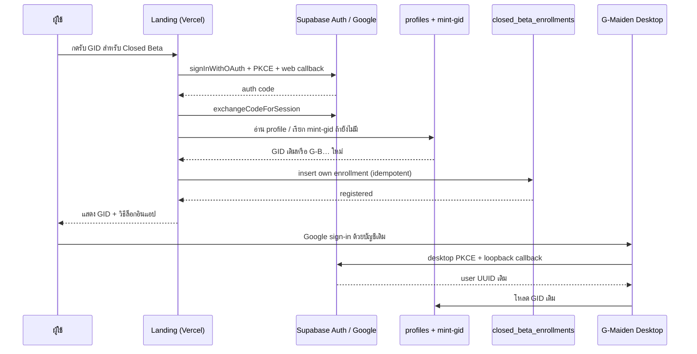

# CR-005 W1A — Dota hero motion + Closed Beta GID registration

> **Approval gate:** เอกสารนี้เป็นข้อเสนอเท่านั้น ห้ามแก้ production code, Supabase schema,
> OAuth redirect configuration, media asset หรือ Vercel deployment ก่อน Boss อนุมัติ

## 1. Task classification

| หัวข้อ | การจัดประเภท |
| --- | --- |
| Complexity | **C-3 — Architecture-Driven Implementation** |
| Change risk | **HIGH** |
| เหตุผล | เปลี่ยน copyrighted hero media + เพิ่ม public OAuth surface + schema/RLS + เชื่อมบัญชีเว็บกับ desktop app |

ลำดับเมื่ออนุมัติ: **Doc → Diagram → Asset proof → Schema/RLS tests → Code → Browser/Auth E2E → Deploy**

## 2. คำขอและขอบเขต

1. เปลี่ยนตัวละครในวิดีโอ hero ปัจจุบันจากตัวละครคล้าย Witcher/เต่าเป็นตัวละครที่สอดคล้องกับ Dota 2
2. คงภาพเคลื่อนไหวแบบ 3D cinematic loop ไว้
3. เพิ่ม CTA สำหรับลงทะเบียน **Closed Beta**
4. ผู้สมัครได้รับ/ใช้ **GID** จากระบบ `gstore` เดียวกับ G-Maiden desktop app

### [ASSUMPTIONS]

1. คำว่า “Gameden” หมายถึง **G-Maiden**
2. คำว่า “Ganka” หมายถึง **Kunkka**; cast ชั่วคราวจึงเป็น **Kunkka + Tiny** จนกว่า Boss ยืนยัน
3. “โมชั่น 3D” หมายถึงวิดีโอที่ render จากฉาก 3D แล้ว (`MP4/WebM`) แบบเดียวกับ asset ปัจจุบัน
   ไม่ได้หมายถึงโมเดล WebGL ที่ผู้ใช้หมุนกล้องได้แบบ interactive
4. Closed Beta ใช้ Google OAuth ตาม ADR-14 และต้องได้ identity เดียวกับการล็อกอินใน desktop app

หากข้อ 2 หรือ 3 ไม่ตรง ต้องแก้เอกสารก่อน implementation เพราะกระทบ asset pipeline และ performance โดยตรง

## 3. Repo truth ที่ตรวจพบ

- Landing ปัจจุบันอยู่ที่ `landing/` และใช้ remote MP4 เป็น full-screen background
- CTA `Join the beta` ปัจจุบันลิงก์ไป GitHub Releases; ยังไม่มี auth หรือ form submission
- GID ใช้ Supabase project `gstore` เดียวทั้ง ecosystem; internal identity คือ `auth.users.id`
- Desktop app ใช้ Google OAuth แบบ PKCE และ loopback callback `127.0.0.1:3000/auth/callback`
- GID mint ฝั่ง server ผ่าน Edge Function `mint-gid`; client ไม่มีสิทธิ์เขียน `gid_code`, `generation`,
  `cohort_seq` หรือ `role`
- GID codec รองรับ generation `B = Closed Beta` อยู่แล้ว แต่ ADR-14 ระบุว่า signup trigger เคย hardcode
  generation เป็น `F`; ต้องตรวจและแก้ live trigger ก่อนเปิด registration จริง

## 4. Hero media decision

### 4.1 สิ่งที่ทำได้ทางเทคนิค

ทำได้ และยังขยับแบบ 3D ได้ แต่ไม่ใช่การใช้ CSS หรือ ImageGen เปลี่ยนตัวละครภายใน MP4 เดิมแบบ frame-by-frame
ต้องสร้างฉาก/animation ใหม่ แล้ว render เป็นวิดีโอ loop ชุดใหม่

### 4.2 ทางเลือก

| Option | วิธี | ข้อดี | ข้อจำกัด | สถานะเสนอ |
| --- | --- | --- | --- | --- |
| A | โมเดล **Kunkka + Tiny ของ Valve** ผ่าน Dota 2 Workshop Tools / Source 2 Filmmaker แล้ว render ใหม่ | ตรงคำขอและ recognizable ที่สุด | ต้องผ่าน IP/legal gate ก่อนใช้บน product landing; ห้าม rip/distribute model files | รอ owner รับความเสี่ยง/ยืนยันสิทธิ์ |
| B | สร้างฮีโร่ต้นฉบับของ G-Maiden: sea captain + stone titan โดยไม่คัดลอก silhouette, costume, weapon, texture หรือชื่อ Valve | เป็นทรัพย์สินแบรนด์เองและใช้เชิงพาณิชย์ได้ง่ายกว่า | ไม่ใช่ Kunkka/Tiny โดยตรง | **แนะนำสำหรับ production** |
| C | ใช้ live WebGL (`GLB` + animation mixer) | interactive, เปลี่ยนกล้อง/แสง runtime ได้ | bundle/GPU/mobile cost สูง, QA มาก, ไม่จำเป็นต่อ ambient hero | ไม่แนะนำใน W1A |

Valve อนุญาตงานวิดีโอจาก game content ภายใต้นโยบายของตน แต่ข้อกำหนดทั่วไปจำกัด fan art/game content
ไว้ที่ non-commercial use และห้ามแจก game assets แยกต่างหาก ดังนั้น landing ที่ใช้โปรโมตผลิตภัณฑ์/รับสมัครบัญชี
ต้องมีการตัดสินใจด้านสิทธิ์อย่างชัดเจนก่อนเลือก Option A

### 4.3 Motion delivery contract

ใช้ pre-rendered 3D loop เพื่อคง performance model ของหน้าเดิม:

- master: 1920×1080 หรือสูงกว่า, 8–12 วินาที, seamless loop, 24/30fps
- delivery: `WebM` เป็น source แรก + `MP4/H.264` fallback + static poster
- เป้าหมาย transfer รวมของ first playable media: **≤ 8 MB** บน desktop และมี mobile crop ตรวจจริง
- muted, autoplay, loop, playsInline; ไม่มีเสียง/voice/music จากเกม
- `prefers-reduced-motion: reduce`: แสดง poster หรือหยุดวิดีโอหลัง frame แรก
- color grade ยังคง cold booth blue; ห้ามใช้ filter จนสี/identity ของฮีโร่ผิดจาก approved concept
- asset files ที่ส่งขึ้นเว็บเป็นวิดีโอ/poster เท่านั้น ไม่เผยแพร่ source game models

### 4.4 Shot direction (candidate)

- ฝั่งซ้าย: captain silhouette เคลื่อนเข้า foreground พร้อมอาวุธต่ำกว่าระดับข้อความ
- ฝั่งขวา: stone titan เปลี่ยนน้ำหนักตัว/หายใจ/เศษหินลอยเบา ๆ
- camera: slow dolly 2–3% + parallax; ไม่มีการต่อสู้รุนแรงหรือ flash ที่แย่ง focus จาก CTA
- text-safe zone ซ้ายกลางต้องคง contrast ตาม landing design system
- mobile crop ต้องเห็นอย่างน้อยหนึ่งตัวละครและไม่บัง CTA

## 5. Closed Beta + GID product contract

### 5.1 CTA และสถานะ

| ตำแหน่ง | Copy | ผลลัพธ์ |
| --- | --- | --- |
| Navbar | `ลงทะเบียน Closed Beta` | เปิด auth/registration surface |
| Hero primary | `รับ GID สำหรับ Closed Beta` | เริ่ม Google OAuth |
| Signed-in | `ลงทะเบียนแล้ว · {GID}` | แสดง GID และสถานะ ไม่เริ่ม OAuth ซ้ำ |
| Existing user | `เข้าสู่ระบบด้วย GID` | Google OAuth บัญชีเดิม แล้วโหลด GID เดิม |

ห้ามเรียกปุ่มว่า “รับสิทธิ์ทันที” หากยังไม่มี admission/invite policy จริง

### 5.2 Identity rules

1. `auth.users.id` เป็น identity จริง; GID เป็น immutable display handle ไม่ใช่ authorization token
2. เว็บต้องใช้ Google OAuth provider และ Supabase project เดียวกับ desktop app
3. ผู้ใช้ใหม่ในช่วง beta ได้ generation `B`
4. ผู้ใช้เดิม generation `F` ลงทะเบียน beta ได้โดย **ไม่เปลี่ยน GID เดิม**
5. เว็บห้าม generate, insert หรือ update `gid_code` เอง; เรียก server-authoritative `mint-gid` เท่านั้น
6. ผู้ใช้ล็อกอิน desktop app อีกครั้งด้วย Google account เดิม แล้วได้รับ UUID/GID เดิม
7. W1A ไม่ส่ง access token/refresh token จาก browser เข้า desktop app ผ่าน URL/deep link

### 5.3 Enrollment schema (candidate)

ใช้ตารางแยกจาก `profiles` เพื่อไม่เปลี่ยนความหมายของ identity:

```sql
public.closed_beta_enrollments
  user_id       uuid primary key references public.profiles(id) on delete cascade
  status        text not null default 'registered'
                check (status in ('registered', 'invited', 'revoked'))
  source        text not null default 'landing'
  registered_at timestamptz not null default now()
  updated_at    timestamptz not null default now()
```

- ไม่ duplicate `gid_code`; join ผ่าน `user_id`
- `authenticated`: `select` และ `insert` เฉพาะ row ของตัวเอง
- `anon`: ไม่มีสิทธิ์อ่าน/เขียน
- client ไม่มีสิทธิ์เปลี่ยน `status`; การเปลี่ยนเป็น `invited/revoked` เป็น server/admin operation
- migration ต้องมี explicit grants แยกจาก RLS และมี negative tests สำหรับ cross-user access

### 5.4 OAuth flow



Production URL และ preview URL ที่ใช้ทดสอบต้องอยู่ใน Supabase redirect allow list; callback ต้อง exchange code
บน browser/device เดียวกับที่เริ่ม PKCE flow

## 6. Security and privacy

- browser bundle ใช้ได้เฉพาะ Supabase publishable key; ห้ามมี `service_role` หรือ admin secret
- เปิด RLS และ explicit grants ก่อนให้ landing เรียกตารางใหม่
- ไม่เก็บ match state, CV, G-Log, Steam match detail หรือ telemetry ใน enrollment
- เก็บเฉพาะ identity ที่ ADR-14 อนุญาต + beta status/timestamp/source
- OAuth errors ต้องเป็น honest state; ห้ามแสดง GID placeholder เหมือน mint สำเร็จ
- ต้องทดสอบ duplicate click, OAuth cancel, expired/replayed code, missing profile, mint failure และ network retry
- ต้องมี privacy notice + account deletion path ที่อ้างระบบบัญชีจริงก่อน public recruitment

## 7. Implementation waves after approval

| Wave | Scope | Verify |
| --- | --- | --- |
| A | ยืนยัน hero/IP option + concept frame + mobile crop | Boss approve cast/composition/license path |
| B | ผลิตและ optimize 3D loop + poster | codec, file size, loop seam, reduced motion, visual QA |
| C | migration: beta generation + enrollment + grants/RLS | SQL/RLS positive + negative tests; existing F GID unchanged |
| D | landing Supabase client + web PKCE callback + CTA/states | OAuth E2E on localhost/preview/production |
| E | browser QA + code-doc alignment + Vercel deploy | build/typecheck, responsive QA, `codedoc-aligner`, production smoke |

แต่ละ wave ต้องผ่าน gate ก่อนเริ่ม wave ถัดไป โดยเฉพาะ C ต้องไม่ deploy ก่อนตรวจ live trigger ว่าไม่ mint `F`
ให้ signup ใหม่ทั้งหมด

## 8. Acceptance, success, exit criteria

### Acceptance criteria

- approved hero cast ปรากฏใน 3D motion loop และไม่มีตัวละคร Witcher/เต่าจาก asset เดิม
- motion อ่านเป็น 3D, loop ไม่สะดุด, ข้อความ/CTA อ่านได้ทั้ง desktop และ mobile
- CTA สมัคร Closed Beta ทำงานจริง ไม่ลิงก์ GitHub Releases และไม่มี inert control
- signup ใหม่ในช่วง beta ได้ `G-B…`; existing `G-F…` ไม่ถูกเปลี่ยน
- web และ desktop Google sign-in resolve ไปยัง `auth.users.id`/GID เดียวกัน
- RLS ปฏิเสธ anon และ cross-user reads/writes
- ไม่มี raw player/match data ออกจากเครื่อง

### Success criteria

- `landing` build/typecheck ผ่าน
- browser QA ผ่าน viewport `320×568`, `390×844`, `768×1024`, `1366×768`, `1440×900`
- OAuth E2E ผ่าน production callback และ cancel/retry/error states
- media ไม่ทำให้ layout shift และยังมี poster/fallback เมื่อโหลดวิดีโอไม่ได้
- accessibility: keyboard, focus, status announcement และ reduced-motion ผ่าน

### Exit criteria

- asset provenance/license decision ถูกบันทึก
- schema migration, grants, RLS policies และ tests อยู่ใน version control
- `codedoc-aligner` ผ่านหลัง code/docs update
- production smoke ผ่านบน Vercel URL จริง และ desktop login ยืนยัน GID เดียวกันด้วย test account
- แสดง version diff และไม่รวม dirty files นอก scope

## 9. Out of scope

- interactive WebGL hero selector หรือดาวน์โหลด source Dota models ให้ browser
- Discord/email/password provider (ADR-14 ยังคง Google-only)
- friend list, presence, chat หรือ G-Social W4–W5
- admin invite dashboard, email campaign หรือ automated approval workflow
- token bridge/deep-link ที่ส่ง browser session เข้า desktop app
- analytics/behavior tracking

## 10. Approved decisions

Boss อนุมัติให้ “ลุยให้จบ” เมื่อ 2026-07-20 โดยใช้ทางแนะนำ:

1. **Hero/IP:** Option B — original G-Maiden sea captain + stone titan
2. **Motion:** cinematic 2.5D camera + particle motion จาก approved 3D-rendered concept; reduced-motion เป็น static frame
3. **Closed Beta:** signup ใหม่ = generation `B`; ผู้ใช้ Founder/Public เดิมคง GID เดิม
4. **Identity:** Google OAuth/GID ชุดเดียวกับ desktop app; ไม่มี browser-to-desktop token bridge

## 11. Implementation evidence

- Landing: [`App.tsx`](file:///g:/G-Maiden/landing/src/App.tsx),
  [`beta.ts`](file:///g:/G-Maiden/landing/src/beta.ts), [`index.css`](file:///g:/G-Maiden/landing/src/index.css)
- Asset: [`g-maiden-sea-captain-stone-titan-v1.png`](file:///g:/G-Maiden/landing/assets/concepts/g-maiden-sea-captain-stone-titan-v1.png)
  (`206 KB` optimized from the approved concept)
- Schema/RLS: [`20260720183000_cr005_closed_beta_registration.sql`](file:///g:/G-Maiden/supabase/migrations/20260720183000_cr005_closed_beta_registration.sql)
  + [`20260720184500_cr005_beta_rls_initplan.sql`](file:///g:/G-Maiden/supabase/migrations/20260720184500_cr005_beta_rls_initplan.sql)
- Test contract: [`cr005_closed_beta_registration.sql`](file:///g:/G-Maiden/supabase/tests/cr005_closed_beta_registration.sql)
- Browser Edge Function regression: [`cors.test.ts`](file:///g:/G-Maiden/supabase/functions/mint-gid/cors.test.ts)
  verifies that preflight and JSON error responses retain the headers required by browser callers.
- Live `gstore`: migrations `cr005_closed_beta_registration` + `cr005_beta_rls_initplan` applied;
  behavior probe passed for own-row insert/select, cross-user denial and self-approval denial

## CHANGELOG

| Version | Date | Status | Summary | Commit Hash | Agent |
| --- | --- | --- | --- | --- | --- |
| 0.1.0b | 2026-07-20 | candidate | Initial W1A proposal for 3D hero replacement and shared-GID Closed Beta registration | — | ATHER |
| 0.2.0b | 2026-07-20 | beta | Boss approved recommended path; recorded implemented hero, OAuth/GID, live migration and RLS evidence | — | ATHER |
| 0.2.1b | 2026-07-21 | beta | Added CORS regression coverage for the server-authoritative GID mint path after the post-OAuth browser failure | — | ATHER |
