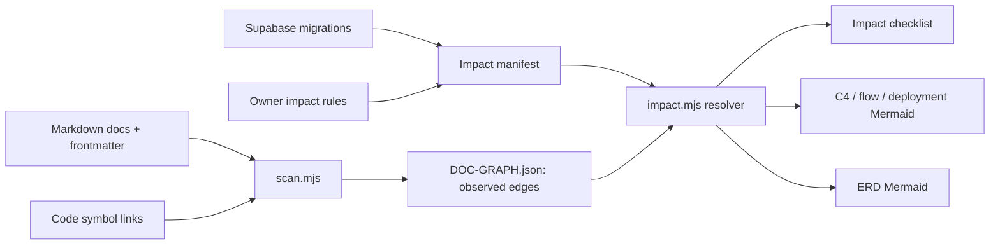

# CR-014 — Document Impact Map: G-Maiden Graph Adapter and ERD Baseline

## 1. Decision requested

Approve G-Maiden as the first project adapter for the approved RWANG Document Impact Map CR.
The adapter must consume the existing `docs/DOC-GRAPH.json` scanner output, add only
owner-declared metadata and mandatory-review edges, and produce evidence-labelled impact, C4, and
ERD Mermaid views. It must not replace `DOC-GRAPH.json`, alter `.rwang/registry.json` semantics,
or infer mandatory changes from a link alone.

## 2. Current evidence

- `tools/doc-graph/scan.mjs` writes nodes and edges of type `wikilink` and `symbol` to
  `docs/DOC-GRAPH.json`; it validates targets but does not classify domain/cluster/C4/data ownership.
- ADR-14 already symbol-links the GID account documents to `gid.ts`, `auth.ts`, `profile.ts`,
  `supabase.ts`, and `identity.rs`.
- Supabase migrations are authoritative schema evidence. `profiles`, `gid_counters`,
  `closed_beta_enrollments`, and the CR-003 account/economy tables have explicit primary/foreign
  keys and RLS policies. Current scanner output does not represent those relationships as ERD edges.

## 3. Architecture and ownership



| Artifact | Authority | Mutation policy |
|---|---|---|
| `docs/DOC-GRAPH.json` | generated observed graph | scanner owns it; adapter never hand-edits it |
| `docs/impact-map.yaml` | owner-declared metadata, impact rules, and schema facts | hand-edited, validated, versioned with its related CR/ADR |
| `tools/doc-graph/impact.mjs` | deterministic resolver/exporter | read-only against source docs/schema; writes only explicit generated report/view files |
| `.rwang/registry.json` | governed-artifact version/hash/drift | unchanged; RWANG reads adapter output but does not replace registry scope |

## 4. Metadata and edge contract

`docs/impact-map.yaml` is a project-local supplement, not a duplicate registry. It is stored as
JSON-compatible YAML in the first delivery slice so Node can parse it without a new runtime dependency.
It contains only
metadata that cannot be safely inferred from a generic link:

```yaml
version: "1"
nodes:
  - ref: "docs/architecture/adr/ADR-14-gid-account-identity.md"
    node_kind: "document"
    artifact_type: "adr"
    domain: "account-identity"
    cluster: "gid-security"
    system: "G-Maiden"
    bounded_context: "identity-access"
    layer: "security"
    c4_level: "container"
    lifecycle: "approved"
    owners: ["Boss"]
edges:
  - from: "docs/architecture/adr/ADR-14-gid-account-identity.md"
    to: "docs/audits/SEC-001-auth-identity-hardening.md"
    relation: "must_review_with"
    assertion: "declared"
    evidence: "Approved security impact rule"
```

Valid `node_kind`, `artifact_type`, `layer`, `c4_level`, relation, and assertion values are those
defined in `CR-RWANG-DOCUMENT-IMPACT-MAP`. The resolver rejects unknown values and reports absent
metadata as `unmapped`; it does not fill fields with LLM guesses.

### 4.1 Parent-contract normalization (v2)

The adapter pins `G:/Rwang/RWANG-PROMAX-skills/docs/CR--RWANG-DOCUMENT-IMPACT-MAP.md`
(`CR-RWANG-DOCUMENT-IMPACT-MAP`, `0.1.1b`) as its ontology source. `docs/impact-map.yaml` v2
normalizes legacy aliases at the manifest boundary: `change-request` becomes `cr`,
`architecture-decision` becomes `adr`, and non-document system nodes omit `artifact_type` rather
than inventing a new global type. Legacy presentation/policy layers normalize to `application` and
`product`; non-final lifecycle labels normalize to `proposed`. Legacy relation aliases normalize to
the closest approved relation and retain their original prose in `evidence`.

Every declared edge and ERD relationship carries `confidence` (`low`, `medium`, or `high`) plus
`evidence_reference.path` and positive `evidence_reference.line`. For owner-declared impact rules,
the reference points to the exact declaration in `docs/impact-map.yaml`; schema relationships point
to the FK line in their source migration. This is declaration provenance, not a claim that an
observed link is a mandatory dependency.

## 5. C4 and system-driven views

The first declared context/container nodes are bounded to evidence already present in G-Maiden:

| Node | C4 level | Evidence boundary |
|---|---|---|
| Player / Dota 2 | context actor/external system | local GSI input only |
| G-Maiden desktop app | container | Tauri + local Rust gateway + overlay |
| G-Maiden landing | container | Vercel-hosted browser surface |
| Supabase `gstore` | external system/datastore | Auth, Postgres, Edge Functions |
| Google OAuth | external identity provider | Google-only primary sign-in today |
| Steam/OpenDota | external systems | public profile lookup only |

Component/code views may include only nodes with symbol or code evidence. Flow, deployment, and
trust-boundary diagrams must declare their source edges and label `observed`, `declared`, or
`derived` in the legend.

The CLI accepts repeatable `--filter key=value` arguments for `domain`, `cluster`, `system`,
`bounded_context`, `layer`, and `c4_level`. Filters are exact-match and deterministic; unsupported
filter keys or views return a non-zero unavailable result.

## 6. ERD baseline

ERD is in scope because FK/RLS/data ownership are not represented in the current document graph.
Initial support is manifest-led, schema-evidenced, and limited to `public` schema migrations:

```yaml
entities:
  - name: "profiles"
    source: "supabase/migrations/20260704000000_adr14_gid_account_identity.sql"
    classification: "identity-pii"
    rls_reference: "supabase/migrations/20260704120000_sec001_identity_hardening.sql"
    owns_data: "identity-access"
relationships:
  - from: "closed_beta_enrollments.user_id"
    to: "profiles.id"
    cardinality: "0..1 to 1"
    relation: "foreign_key"
    assertion: "declared"
    source: "supabase/migrations/20260720183000_cr005_closed_beta_registration.sql"
```

The resolver validates that every declared schema source exists. It may render an entity only when
the source migration and the declared relationship agree. It must never extract or render production
rows, tokens, emails, phone numbers, match data, or secrets.

ERD cardinality is rendered from declared `0..1`, `1`, `many`, `0..many`, or `1..many` endpoints;
the resolver rejects another form. Mermaid comments retain only source migration, RLS reference,
classification, and ownership metadata. It also verifies the declared source column participates in
the FK, not merely that the target table is referenced somewhere in the migration.

## 7. Impact result contract

`impact.mjs` resolves a selected artifact or git diff to four groups:

| Group | Meaning |
|---|---|
| `must-review` | approved `must_review_with` declaration; owner must review before merge |
| `linked-context` | observed wikilink/symbol reference; review recommended, not automatically required |
| `unmapped` | changed node has no declared metadata or impact rule |
| `stale-link` | graph/manifest target no longer resolves or schema evidence contradicts a declared relation |

The output must include graph revision/hash and source line/path evidence for every relationship.

## 8. Delivery slices

1. **Contract + fixtures:** `impact-map.yaml` schema/validator, isolated fixture graph, one ADR-to-security
   impact rule, and one `profiles`/`closed_beta_enrollments` ERD relation.
2. **Resolver:** deterministic inbound/outbound traversal, diff input, evidence labels, and JSON report.
3. **Views:** Mermaid output for document impact, C4 context/container, and ERD. Unsupported views
   return explicit unavailable status.
4. **RWANG adapter:** `RWANG:impact` delegates to the project resolver only when the project declares
   this adapter; no hidden scan or write occurs.

## 9. Acceptance criteria

- Existing `scan.mjs` output remains backward compatible and the current doc-graph CI gate remains green.
- An ADR-14 fixture returns observed account code links as `linked-context` and the declared SEC-001
  relationship as `must-review`.
- An ERD fixture renders `profiles` and `closed_beta_enrollments` with its declared FK/cardinality,
  source migration, RLS reference, and identity classification.
- Invalid/sparse metadata, missing schema source, wrong FK source column, unsupported view/filter,
  or missing graph produces an explicit
  unavailable/incomplete result and non-zero validation exit; no guessed diagram is emitted.
- Every declared edge result includes confidence and source path/line evidence; C4 filtering is
  deterministic across all parent-contract filter fields.
- The generated report contains no raw player match, CV, account, or secret values.
- `RWANG:impact --changed` is read-only unless the user explicitly requests a graph refresh.

## 10. Risks and rollback

The main risk is treating an observed link as semantic dependency. The resolver mitigates this by
requiring assertion labels and reserving `must-review` for owner declarations. Rollback removes the
adapter/manifest from the project and leaves the existing scanner, generated graph, and `.rwang`
registry untouched.

## 11. Approval gate

Owner approval is required before creating `docs/impact-map.yaml`, `impact.mjs`, or any generated
diagram/report. Approval confirms: G-Maiden native `DOC-GRAPH.json` is the initial adapter format;
the metadata contract in section 4 is accepted; and the manifest-led ERD baseline is preferred over
a speculative SQL parser.

## CHANGELOG

| Version | Date | Status | Summary | Commit Hash | Agent |
|---|---|---|---|---|---|
| 0.2.0b | 2026-07-21 | beta | Normalized the live manifest to the approved parent ontology; added mandatory declaration provenance, cardinality/FK proof, and deterministic C4 filters. | null | ATHER |
| 0.1.1b | 2026-07-21 | approved | Owner approved the initial G-Maiden adapter format, metadata vocabulary, and manifest-led ERD baseline. | null | ATHER |
| 0.1.0b | 2026-07-21 | candidate | Technical design for the G-Maiden document-impact adapter, C4 metadata, and schema-evidenced ERD baseline. | null | ATHER |
