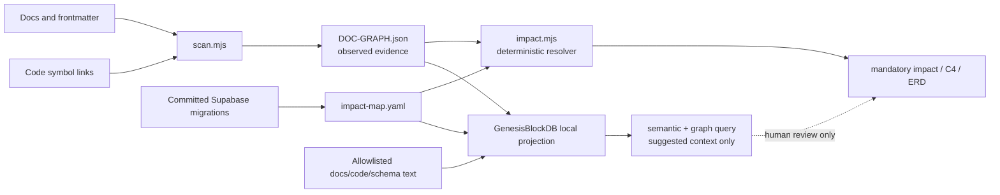

# CR-015 — GenesisBlockDB Local Document-Intelligence Projection

## 1. Decision requested

Approve a **local-only GenesisBlockDB projection** of G-Maiden's declared and observed
documentation graph. It augments, but never replaces, the deterministic document-impact adapter
approved in [CR-014](file:///g:/G-Maiden/docs/change%20request/CR-014-document-impact-map-gmaiden-adapter.md).

GenesisBlockDB is used here for its single embedded substrate: **SQLite persistence + property
graph traversal + vector retrieval**. The projection's purpose is to help contributors find
related requirements, contracts, migrations, and code evidence before changing a system.

## 2. Non-negotiable authority boundary

| Concern | Authoritative source | GenesisBlockDB role |
|---|---|---|
| Mandatory review | `docs/impact-map.yaml` declared `must_review_with` edges | indexed projection only |
| Observed links and symbols | `docs/DOC-GRAPH.json` | indexed projection only |
| Account identity / GID | Supabase `gstore`, ADR-14, SEC-001 | **out of scope** |
| Production schema and RLS | committed Supabase migrations | source artifact only; never connect to production |
| Match, CV, G-Log, credentials, tokens | local/runtime sources | **never ingest** |

Vector similarity is advisory. It may return `suggested_context` with a score and source evidence,
but it must never create `must_review`, an ERD relationship, an architecture edge, a migration, or
an automated documentation edit. Those require declared edges and source-backed validation under
CR-014.

## 3. Architecture



The local projection database is developer-tooling state, not an application runtime dependency.
It must live outside packaged application data (default: ignored `.cache/doc-intelligence/`), be
rebuildable from repository artifacts, and have no background process, network listener, or cloud
sync.

## 4. Ingestion contract

The adapter accepts only allowlisted repository artifacts:

- Markdown documentation and YAML/JSON metadata under `docs/`.
- `docs/DOC-GRAPH.json` and `docs/impact-map.yaml`.
- Referenced TypeScript/Rust source snippets and committed Supabase migration text needed as
  evidence for an explicit graph edge or schema relation.

Before embedding or persisting content, the ingester must reject or redact:

- `.env*`, keys, credentials, tokens, cookies, session/refresh tokens, and signing material;
- Supabase production exports, account rows, email addresses, phone numbers, or recovery data;
- GSI payloads, G-Log files, CV detections, match data, screenshots, and audio assets.

Each indexed record stores repository path, content hash, source revision, artifact category,
declared/observed assertion label, and source-line evidence. It must not store a raw working-tree
snapshot outside the local ignored cache.

## 5. Query and result contract

Initial commands are read-only and deterministic at their boundary:

```text
node tools/doc-graph/knowledge.mjs index --refresh
node tools/doc-graph/knowledge.mjs related --artifact <path-or-doc-id>
node tools/doc-graph/knowledge.mjs search --query <text>
node tools/doc-graph/knowledge.mjs status
```

`related` returns separately labelled sections:

| Section | Source | Merge meaning |
|---|---|---|
| `mandatory_review` | CR-014 resolver | required human review |
| `linked_context` | observed graph | recommended review |
| `semantic_suggestions` | GenesisBlockDB vector retrieval | advisory only |
| `evidence` | paths, graph/manifest revision, line ranges | audit trail |

If GenesisBlockDB is unavailable, stale, incompatible, or returns no results, `impact.mjs` and the
existing CI/document workflows continue unchanged. The command returns an explicit unavailable or
stale state; it must not fall back to an unlabelled heuristic.

## 6. C4 and ERD rules

GenesisBlockDB may accelerate traversal across declared C4/ERD metadata, but it does not become an
architecture authority:

- C4 nodes/relations render only from CR-014 metadata plus source-backed observed/declarative edges.
- ERD entities, keys, cardinality, RLS references, and classifications render only from the committed
  migration evidence and `impact-map.yaml` assertions.
- Semantic neighbours are shown outside formal Mermaid diagrams unless an owner explicitly promotes
  the relation into the manifest after review.

## 7. Delivery sequence

1. **Compatibility spike:** verify the current GenesisBlockDB local API/CLI/NAPI surface in
   `G:\GenesisBlock_Dev\GenesisBlock`; prove an embedded database can create, rebuild, query, and
   delete a disposable index without network access.
2. **Projection adapter:** add the allowlisted ingestion pipeline, stale/hash detection, and local
   cache lifecycle. No app-runtime code, Supabase schema, or landing behaviour changes.
3. **Read-only queries:** implement `related`, `search`, and `status`; keep CR-014 output as the
   only source for mandatory review and formal diagrams.
4. **Tests and review:** fixture-based tests must prove deterministic precedence, redaction,
   rebuildability, and failure isolation. Update the document impact map with the adapter's declared
   nodes/edges only after evidence exists.

## 8. Acceptance criteria

- A clean clone can build the local index from approved fixture/docs input and reproduce the same
  graph identifiers and deterministic results for a fixed source revision.
- `semantic_suggestions` never alter mandatory review, C4, or ERD output; a test fails if they do.
- Tests prove prohibited secrets/PII/match artifacts are rejected before persistence.
- Deleting the local cache and re-indexing restores operation without changing repository artifacts.
- No network connection, server, analytics, or production Supabase access is required or attempted.
- Existing `impact.mjs` tests and `DOC-GRAPH.json` validation remain green when the optional index
  is absent.
- The implementation reports source paths/hashes and freshness rather than claiming complete
  coverage from a similarity score.

## 9. Risks and rollback

| Risk | Mitigation | Rollback |
|---|---|---|
| Similarity is mistaken for a dependency | labelled advisory channel; deterministic precedence tests | remove local cache and adapter command |
| Sensitive local data enters the index | strict allowlist/rejection tests; no runtime data roots | delete ignored cache; rotate any accidentally indexed secret per incident process |
| Tooling adds build/runtime burden | dev-tool-only process, no packaged dependency | disable command without touching app runtime |
| GenesisBlockDB API drift | compatibility spike pins tested integration contract | retain CR-014 resolver as complete fallback |

## 10. Out of scope

- Replacing Supabase `gstore`, GID minting, Google OAuth, or account/recovery security controls.
- Indexing player data, match data, CV, G-Log, or user profiles.
- Modifying the live desktop critical path, overlay, landing registration flow, or any production
  database.
- Automatically writing documentation, migrations, C4/ERD declarations, or pull requests.

## 11. Approval gate

This is C-3 / MEDIUM work. Approval authorizes only the compatibility spike and local developer
tooling implementation described above. Before implementation, the owner must accept:

1. GenesisBlockDB is a projection/search accelerator, not a replacement authority.
2. The ingest allowlist and privacy exclusions in section 4.
3. The advisory-only semantic result contract in section 5.
4. The no-network/no-production-data acceptance criteria.

## CHANGELOG

| Version | Date | Status | Summary | Commit Hash | Agent |
|---|---|---|---|---|---|
| 0.1.0 | 2026-07-21 | draft | Initial C-3 proposal for local GenesisBlockDB graph/vector/SQLite projection over the CR-014 document-impact system. | null | ATHER |
