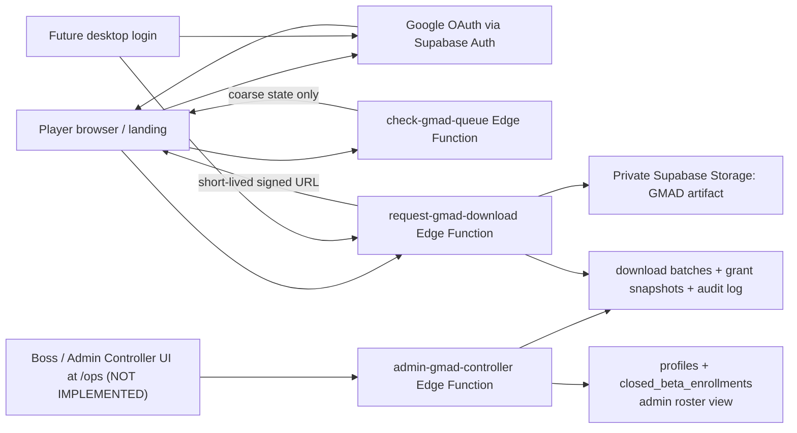

# CR-016 — GMAD Beta Download Access and Admin Controller

## 1. Decision requested

Implement the first controlled distribution path for **GMAD (G-Maiden)**:

1. A player signs in to the public landing with Google OAuth, receives/loads their immutable GID,
   and enters that GID in a queue-check field.
2. The landing reports only the caller's coarse download state. It never exposes the registration
   roster, another user's identity, a batch range, or a direct artifact URL.
3. Boss operates a separate, role-protected **Admin Controller** to see the closed-beta roster,
   create/publish/pause batches, and control GMAD availability.
4. A download is issued only after the server verifies both the Google session and the matching GID
   grant, then returns a short-lived signed URL for the private GMAD artifact.
5. The desktop app later signs in with the same Google account and resolves the same UUID/GID; it
   does not receive a browser session or download secret through a URL.

This CR supersedes the part of the verbal proposal that suggested placing operational data in the
landing. The roster and controller are backend/admin surfaces; the public landing is a consumer of
the minimum queue-check contract only.

## 2. Existing evidence and gap

| Existing capability | Evidence | Gap addressed here |
|---|---|---|
| Google OAuth + PKCE + immutable GID | ADR-14; `landing/src/beta.ts` | complete live UAT and attach download access |
| Server-authoritative GID mint | `mint-gid` Edge Function; SEC-001 | production CORS refinement must deploy before UAT |
| Closed beta enrollment | `closed_beta_enrollments` with own-row RLS | no admin roster, batch grant, or GMAD release access |
| Admin role exists | `profiles.role` is server-only under SEC-001 | no endpoint/dashboard yet consumes the role |
| Signed artifact pattern | `supabase/functions/pack-download/index.ts` | must create GMAD-specific access contract, not reuse ownership semantics |

There is currently no GitHub workflow that runs `supabase db push` or deploys Supabase Edge
Functions. A Git commit alone does **not** update the live `gstore` schema/functions. Production
deployment needs an explicit Supabase CLI workflow or a separately approved CI pipeline.

## 3. Scope and non-goals

### In scope

- Finish the landing Google OAuth/GID lifecycle, including deployed CORS preflight regression fix,
  Supabase redirect allow-list check, and real-account UAT.
- A GID queue-check sector on the landing.
- An Admin Controller at a separate `/ops` surface in the landing deployment, with all data/actions
  protected again by server-side admin role verification.
- Admin roster, batch rules, immutable grant snapshots, GMAD artifact release, short-lived signed
  download URLs, and audit logs.
- An explicit handoff contract for future desktop login/download entitlement.

### Out of scope

- Password login, GID/password login, phone/MFA/recovery, public profiles, friend graph, or email
  campaigns.
- Exposing roster data, email, UUID, batch ranges, direct Storage URLs, or service-role keys to a
  player browser.
- Any live match, CV, G-Log, Steam match, or gameplay data.
- Automatically granting download access from a GID string alone.

## 4. Architecture and trust boundaries

The browser can possess only the Supabase publishable key and its own Google-authenticated JWT.
Every admin action and download decision re-reads the caller from the JWT. `service_role` is used
only inside Edge Functions and never rendered, stored, or proxied to the browser.

## 5. Data contract

### 5.1 Existing enrollment remains authoritative

`closed_beta_enrollments` continues to record the player opt-in (`registered`, `invited`, or
`revoked`). The player retains own-row read/insert only. No new policy grants roster access to
`anon` or `authenticated`.

### 5.2 New tables

| Table | Purpose | Client access |
|---|---|---|
| `gmad_download_batches` | operator-defined batch: label, GMAD release identifier, GID start/end, lifecycle, published time | no direct browser table access |
| `gmad_download_grants` | immutable snapshot of eligible `user_id` values created when a batch publishes | player obtains only own entitlement through Edge Function |
| `gmad_download_audit` | server-written actions: batch create/publish/pause, entitlement check, signed-URL issue | no direct browser access |

Each batch records human-entered `gid_start`/`gid_end`, but publication must parse and validate the
GID checksum/generation and resolve a **snapshot** of currently eligible enrolled user IDs. It must
not use lexical string comparison at download time. A later registration must not silently enter an
already-published batch.

The Admin Controller roster is a server-side join of `profiles` and `closed_beta_enrollments`, with
the default columns: `gid_code`, generation, enrollment status, registered time, active batch label,
and download state. Email and UUID are hidden by default and require a separate approved support
case to reveal/export.

## 6. Roles and server operations

| Operation | Caller | Server enforcement | Returned data |
|---|---|---|---|
| `check-gmad-queue(gid)` | rate-limited landing browser | validates syntax; never grants access from input | `signed_out`, `not_registered`, `waiting`, `available`, `paused`, or `revoked` |
| `request-gmad-download(gid)` | signed-in landing/desktop user | session user ID must equal profile resolved by GID and have an active grant | short-lived signed URL and expiry only |
| `admin-gmad-controller` read/write | signed-in `profiles.role = admin` | user-scoped JWT verified, role re-read server-side, audit every mutation | roster/batch data needed for operation |

The queue check must rate-limit per IP/session and return a generic response for unknown or
non-matching GIDs to reduce enumeration. Download always requires the Google account that owns the
GID; GID is a display identifier, never a password or bearer token.

## 7. Admin Controller UX

The `/ops` route is not linked from public navigation. It renders nothing operational until the
server confirms `role = admin`.

1. **Roster:** filter/search by GID, generation, enrollment state, batch, and registration time;
   paginated server-side; default no email/UUID.
2. **Batch builder:** GMAD release identifier, label, `GID เริ่มต้น`, `GID สิ้นสุด`, preview of
   eligible count, and explicit `publish` confirmation.
3. **Batch control:** draft, published, paused, closed; pause immediately blocks new signed URLs
   without removing prior audit evidence.
4. **Audit:** actor, action, batch, timestamp, aggregate count, and request correlation ID; no
   token or signed URL stored.
5. **Artifact control:** GMAD file is placed in a private Supabase Storage bucket. Publishing
   references an immutable object version/checksum; replacing an artifact requires a new release
   or an explicit audited replacement action.

## 8. Landing and desktop contracts

### Landing

- The existing Google CTA continues to mint/read GID and idempotently enroll the player.
- New sector copy: `เช็กคิวดาวน์โหลด GMAD` with a GID input and an honest status state.
- A player may type a GID before login, but the only result is coarse queue information. The
  `ดาวน์โหลด GMAD` button requires Google login and matching ownership.
- Before implementation begins, deploy the existing `mint-gid` CORS correction and verify
  `Access-Control-Allow-Origin`, headers, and `Access-Control-Allow-Methods: POST, OPTIONS` from
  the public alias.

### Desktop handoff

- Desktop uses its existing Google OAuth callback and resolves the same UUID/GID via ADR-14.
- It calls the same entitlement endpoint; desktop never accepts a landing URL/session as proof.
- Whether the desktop downloads a GMAD installer or merely validates entitlement is an explicit
  later client decision. This CR builds the server contract so both clients receive the same answer.

## 9. Delivery order

1. **Repair UAT prerequisite:** deploy/test `mint-gid` CORS; verify Vercel public alias and
   Supabase redirect allow-list with a real test account.
2. **Schema/RLS:** migrations for batches, grants, and audit; negative RLS/role-escalation tests.
3. **Server layer:** Edge Functions for queue check, entitlement/download, and admin controller;
   deterministic tests for range decoding, snapshotting, pause/revoke, ownership mismatch, and
   URL expiry.
4. **Admin Controller:** minimal `/ops` UI with server-side pagination and batch operations.
5. **Landing sector:** GID input/state/download UI; browser UAT against a test GMAD object.
6. **Desktop contract:** add UI only after landing UAT validates the server contract.
7. **Deployment automation decision:** either document a controlled manual Supabase deploy runbook
   or separately approve GitHub Actions with protected secrets and `supabase db push`/function deploy.

## 10. Acceptance criteria

| ID | Criterion |
|---|---|
| AC-01 | Landing Google login on the public Vercel alias returns to the same page and shows the immutable GID/enrollment state. |
| AC-02 | Production `mint-gid` preflight includes origin, allowed headers, and `POST, OPTIONS`; regression test exists. |
| AC-03 | A non-admin browser cannot read roster, create/publish/pause a batch, insert a grant, or view an audit record. |
| AC-04 | An admin can view only the defined minimal roster fields and create a draft batch from validated GID bounds. |
| AC-05 | Publishing snapshots eligible enrolled users; a registration after publication is absent from that batch. |
| AC-06 | A typed GID alone never yields a download URL. A logged-in owner with an active grant receives a short-lived URL; another account, paused batch, revoked enrollment, and expired URL all fail. |
| AC-07 | GMAD artifact is private; no permanent public Storage URL exists. |
| AC-08 | Every admin mutation and URL issue is audited without logging secrets, JWTs, signed URLs, email, match, CV, or G-Log data. |
| AC-09 | Landing production build, migration/RLS tests, Edge Function tests, and manual UAT checklist pass before desktop work starts. |

## 11. Risks and rollback

| Risk | Mitigation | Rollback |
|---|---|---|
| GID enumeration | coarse response, rate limit, ownership check before URL | disable queue endpoint; keep enrollment unchanged |
| Admin privilege misuse | server-side role check, minimal roster, audit, no service role in browser | revoke role; pause all batches |
| Range logic grants wrong user | decode/validate GID and snapshot on publish; preview + tests | pause batch, revoke affected grants, reissue correct batch |
| Leaked artifact URL | private bucket and short expiry | pause/revoke; rotate object/release identifier |
| Git deployment drift | explicit deploy/runbook or separately approved CI | hold schema/function release; landing remains read-only |

## 12. Approval gate

Approval authorizes C-3 implementation only with these defaults:

1. Supabase private Storage + short-lived signed URL is the GMAD artifact channel.
2. `/ops` is a backend-controlled admin UI, not a public roster page.
3. `profiles.role = admin` is checked server-side for every admin operation; no role self-service.
4. Batch selection is entered as GID bounds but persisted as immutable user grant snapshots.
5. Supabase deployment remains manual until a separate CI/secrets proposal is approved.

## 13. Implementation status

Implementation is **partially** present in the working tree: the landing has a GMAD queue sector,
the schema/RLS migration and pgtap contract exist, and the three Edge Function contracts are ready.

**The `/ops` admin UI is not implemented.** Only its backend exists
(`supabase/functions/admin-gmad-controller/`). `landing/src/App.tsx` renders `LandingPage`
unconditionally with no router, and `landing/vercel.json` carries no rewrite — so there is no `/ops`
route to reach. CR-018 (ops-route SPA rewrite) is `status: historical`. Do not treat the controller
as operable from a browser until a UI and route ship.
The immediate login prerequisite is deployed: production `mint-gid` now returns the required CORS
origin, request headers, and `POST, OPTIONS` method header.

CR-017 reconciled migration history with an identical pre/post schema hash. CR-016 was then applied
to production: the private `gmad-releases` bucket and all three GMAD tables are live with RLS.
`check-gmad-queue`, `request-gmad-download`, and `admin-gmad-controller` are deployed to the
`gstore` project, and the landing deployment is live at `https://g-maiden-landing.vercel.app`.

Remaining UAT prerequisites are intentionally operational, not public bypasses:

- Upload a real GMAD artifact into the private `gmad-releases` bucket.
- Assign the intended operator's existing `profiles.role` to `admin` through the trusted backend
  controller/dashboard; the landing client cannot self-elevate.
- Run a signed-in owner journey (queue check → approved batch → signed URL) and an admin journey
  (draft → publish → pause/close). The pgTAP migration contract still requires a local database run.

## CHANGELOG

| Version | Date | Status | Summary | Commit Hash | Agent |
|---|---|---|---|---|---|
| 0.2.2b | 2026-07-21 | beta | CR-017 completed; production GMAD migration, private bucket, Edge Functions, and Vercel landing deployment verified. Signed-in and admin UAT remain. | null | ATHER |
| 0.2.1b | 2026-07-21 | beta | Added the approved private `gmad-releases` bucket declaration to the pending migration; schema has not yet been applied. | null | ATHER |
| 0.2.0b | 2026-07-21 | beta | Boss approved implementation; landing/ops/schema/Edge Function artifacts added locally, and production `mint-gid` CORS deployed. GMAD migration is blocked by reconciliable remote migration-history drift; artifact upload and UAT remain pending. | null | ATHER |
| 0.1.0 | 2026-07-21 | draft | Initial C-3 specification for GMAD beta queue, private download entitlement, and admin batch controller. | null | ATHER |
