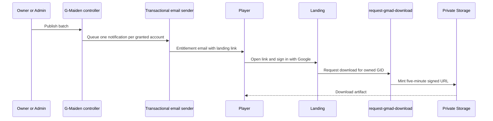

# CR-020 — G-Maiden Beta Notification and Open Beta Countdown

## Approval

Boss approved this scope on July 21, 2026. The approved launch time is **July 24, 2026 18:00 Asia/Bangkok**.

## Classification

| Area | Complexity | Risk |
| --- | --- | --- |
| Hero countdown, slogan, teaser slot, and Thai copy | C-2 | Medium |
| Automated entitlement notification | C-3 | High |

## Scope

1. Add a live hero countdown to `2026-07-24T18:00:00+07:00`, with an elapsed state of `Open Beta เปิดแล้ว`.
   The display uses hours, minutes, and seconds (`HH:MM:SS`) only: it must not show days or separate
   hour/day unit labels. On desktop it is a right-side **Launch Beacon**, not a card: the visible
   hierarchy is `OPEN BETA` → `HH:MM:SS` → `24 กรกฎาคม · 18:00 น.` → one dominant registration CTA.
   `OPEN BETA` must be visually larger and more legible than the previous implementation. It keeps
   open composition, luminous rails, diagonal scan light, and no enclosing rectangular panel.
2. Restore hero movement as an honest **2.5D pointer-parallax treatment**: the existing hero image,
   haze, and particles move at deliberately different, bounded rates in response to a fine-pointer
   cursor. It must retain ambient drift when no pointer is present and must be static for
   touch/coarse-pointer and `prefers-reduced-motion` users. This is not represented as a true 3D
   model: the current repository contains no GLB/GLTF/model asset or recoverable 3D interaction code.
   True 3D rotation is out of scope until a licensed model and performance budget are approved.
3. Re-compose the desktop Hero into three zones: left = brand/copy/register CTA, center = one
   teaser/demo frame at `16:9`, right = CM Hero visual pushed fully to the right with the Launch
   Beacon layered above the visual zone. The center frame is reserved space in the first viewport,
   not a separate section below the fold.
4. Lock the English slogan in the Hero copy to **`AI Voice Companion & Tactical Co-pilot`**.
5. Rename the G-Maiden access sector heading to `เช็กคิวดาวน์โหลด G-Maiden Closed Beta`.
6. Define an email that notifies a granted player and directs them to the existing landing entitlement flow.
7. Do not place a permanent artifact URL or Supabase signed URL in email. The recipient must sign in
   using the same Google account, then the existing `request-gmad-download` Function issues a
   five-minute signed URL only after ownership and grant checks.

## Hero composition and interaction contract

```text
desktop first viewport

left copy / primary register CTA     center teaser-demo 16:9      CM visual / launch event
G-Maiden                             [ teaser or demo frame ]      OPEN BETA
AI Voice Companion &                                                    52:48:12
Tactical Co-pilot                                                      24 กรกฎาคม · 18:00 น.
[ Receive GID for Closed Beta ]                                          [ Register for Closed Beta → ]
```

- The Launch Beacon CTA invokes the same `beta.register()` flow as the existing hero CTA; it does not
  claim that Open Beta is downloadable before launch.
- The center `16:9` teaser/demo frame is part of the first-viewport composition and must remain
  readable with controls, crop, and focus treatment that look intentional at desktop and tablet widths.
- The CM Hero visual is allowed to sit tighter to the right viewport edge than the current build as
  long as the face, torso, and silhouette remain readable and the Hero does not collide with the beacon.
- Pointer motion is decorative only. It must never prevent button focus, click, scrolling, or expose
  a different state from keyboard/touch users.
- Motion bounds are small enough to keep the character within its crop and avoid layout shift. The
  image remains a single raster source; depth is produced by image, haze, particle, and scan layers.
- The countdown must be readable without motion, and the date/time remains visible alongside the hour value.

## Notification contract



## Security and privacy rules

- Google OAuth is the primary account-verification mechanism; this flow does not add a second email-identity verification system.
- The email means "your entitlement is ready to check", not that its link is itself a bearer download credential.
- Store provider API keys only in server-side secrets. Do not expose recipient email, signed URLs, or API keys to the landing client or analytics.
- The eventual sender must support a verified sender domain and bounced/failed-delivery handling. Provider selection, rate limits, retry policy, unsubscribe classification, and audit schema require a follow-up implementation CR before email automation is enabled.

## Email copy

**Subject:** ยืนยันสิทธิ์ดาวน์โหลด G-Maiden Closed Beta

สวัสดีครับ

GID ของคุณได้รับสิทธิ์เข้าร่วม G-Maiden Closed Beta แล้ว

กรุณาเปิดลิงก์ด้านล่างเพื่อยืนยันสิทธิ์และรับลิงก์ดาวน์โหลด:

`https://g-maiden-landing.vercel.app/#gmad`

เข้าสู่ระบบด้วย Google บัญชีเดียวกับที่ใช้ลงทะเบียน GID ระบบจะตรวจสอบสิทธิ์ของบัญชีและออกลิงก์ดาวน์โหลดชั่วคราวให้เมื่อ batch เปิดใช้งาน

หากคุณไม่ได้ลงทะเบียน G-Maiden สามารถละเว้นอีเมลฉบับนี้ได้

— G-Maiden Support

## Acceptance criteria

| ID | Criterion |
| --- | --- |
| AC-01 | Hero displays a Thailand-time countdown and does not go negative after launch. |
| AC-01a | Countdown renders `HH:MM:SS`, with no day field, and remains legible as a right-side Hero HUD. |
| AC-01b | Countdown is visibly announced as `OPEN BETA`, has the dominant Hero type scale, and connects to one working GID CTA without a rectangular container. |
| AC-01c | Fine-pointer users see bounded multi-plane parallax; touch/coarse-pointer and reduced-motion users receive the same static, usable Hero without pointer motion. |
| AC-01d | Desktop first viewport preserves three clear Hero zones: left copy/CTA, center `16:9` teaser-demo, right CM visual + beacon. |
| AC-01e | The Hero slogan renders exactly as `AI Voice Companion & Tactical Co-pilot`. |
| AC-02 | G-Maiden heading uses the exact approved Closed Beta wording. |
| AC-03 | Email contains only the landing entitlement link, never a static artifact or signed URL. |
| AC-04 | A downloaded artifact still requires the existing signed-in, owned-GID, active-grant checks. |
| AC-05 | No automated mail sends until a provider, verified sender domain, secrets, and delivery controls are explicitly approved. |

## Out of scope

- Selecting or purchasing a sender domain.
- Sending production email automatically.
- Replacing Google OAuth with email/password or email-link account recovery.
- Changing G-Maiden batch/grant authorization.
- Procuring, licensing, or shipping a true 3D character model.

## CHANGELOG

| Version | Date | Status | Summary | Commit Hash | Agent |
| --- | --- | --- | --- | --- | --- |
| 0.4.0b | 2026-07-22 | beta | Approved Hero re-layout to left copy + center 16:9 teaser + right CM visual, promoted `OPEN BETA`, locked the slogan, and changed the countdown contract to `HH:MM:SS`. | null | ATHER |
| 0.3.1b | 2026-07-22 | beta | Normalized reader-facing naming from GMAD to G-Maiden while preserving technical function and anchor identifiers. | null | ATHER |
| 0.3.0b | 2026-07-21 | beta | Approved direction proposed: replace the countdown HUD card with a CTA-led Launch Beacon and restore honest 2.5D cursor parallax. | null | ATHER |
| 0.2.0b | 2026-07-21 | beta | Approved visual refinement: right-side non-rectangular HUD countdown using total hours, minutes, and seconds only. | null | ATHER |
| 0.1.0b | 2026-07-21 | beta | Approved scope for countdown, corrected GMAD copy, and a safe notification contract. | null | ATHER |
