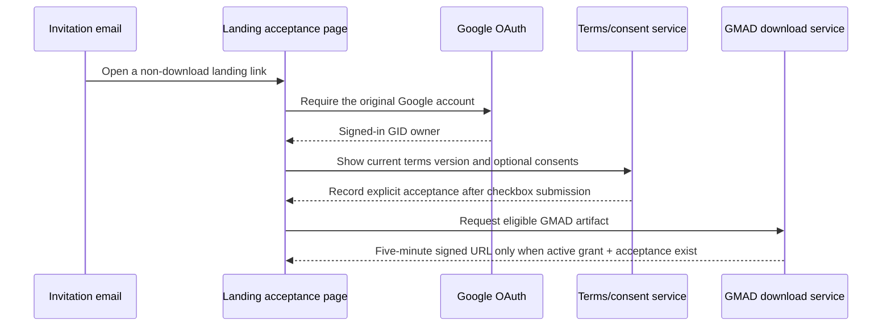

# CR-021 — Closed Beta Terms, Consent, and Entitlement Acceptance

> **Legal-review gate: CLOSED for Closed Beta implementation.** The owner reconfirmed approval on
> 2026-07-21 after the final controller, retention, age, liability, and jurisdiction decisions were
> recorded in the versioned Terms and Privacy Notice.

## Approval record

Boss confirmed legal/counsel approval at `2026-07-21T18:30:56+07:00` and reconfirmed the completed
legal gate at `2026-07-21T23:05:06+07:00`. The data controller is **G-Maiden**, support contact is
`gmad.support01@gmail.com`, minimum age is 20, receipt retention is 3 years, security audit retention
is 1 year, and Thai law/courts govern. The approved current Terms and Privacy Notice must be recorded
as server-side version/hash evidence before protected access.

## 1. Purpose

Require a signed-in GID owner to accept versioned Closed Beta Terms before the server permits a
GMAD download. The email is an invitation and route to the acceptance page; it is not a download
credential or proof of acceptance by itself.

The required web experience is a dedicated landing route (for example `/accept-beta`): Google
sign-in, current Terms and Privacy Notice links, an explicit required Terms checkbox, independent
optional consent controls, and one submit action. Only a server-confirmed current receipt changes
the page from `acceptance required` to the download-eligible state; the email itself carries no
acceptance token and no artifact URL.

## 2. Classification and risk

| Area | Classification | Risk |
| --- | --- | --- |
| Terms acceptance before entitlement | C-3 | High |
| Optional product-data consent | C-3 | High |
| Email invitation and acceptance audit | C-3 | High |

## 3. Required user journey



## 4. Consent boundary

| Item | Required to download? | Mechanism | Withdrawal |
| --- | --- | --- | --- |
| Closed Beta Terms of Use | Yes | Unticked checkbox, explicit submit | Stop using service; future access ends subject to terms/law |
| Privacy Notice acknowledgement | Yes | Link/read acknowledgement, not bundled as data consent | N/A; notice remains informational |
| Essential account and entitlement processing | Yes | Legal basis to be confirmed by counsel; do not label as optional consent if necessary to provide the service | Account deletion/support path |
| Diagnostic data for improvement | No | Separate unticked opt-in with exact data categories | Account Settings or support request; applies prospectively |
| Product/news email | No | Separate unticked marketing opt-in | One-click unsubscribe and Account Settings |
| Post-match data contribution | No | Separate per-feature opt-in; never implied by beta acceptance | Disable before future contribution |

## 5. Acceptance evidence and private storage contract

No browser-controlled field may establish acceptance. A server-side service must create an
append-only private receipt only after it rechecks the authenticated user and the submitted current
document version.

Minimum receipt fields (schema is deferred until legal approval):

```text
id, user_id, document_id, document_version, document_sha256,
accepted_at, source="landing", required_terms_accepted,
diagnostics_opt_in, marketing_opt_in, post_match_opt_in
```

- Receipts are private, RLS-protected, and visible only to the account owner through a narrow
  account-history view and to authorized support/legal operators.
- Do not place consent flags, raw email, tokens, IP address, browser fingerprint, signed URLs, or
  match/CV/G-Log data in `profiles`, public metadata, analytics, or client-writable storage.
- Retention period and whether a minimal security-log field is necessary require counsel approval.
- Revisions to required terms create a new document version/hash and require a fresh acceptance
  before the next protected action; historical receipts are preserved per the approved retention rule.

## 6. Authorization rule

`request-gmad-download` must require all of:

1. valid Google-authenticated session;
2. GID belonging to that session;
3. active GMAD grant; and
4. receipt accepting the currently required Closed Beta Terms version.

The email link and a previous signed URL never satisfy condition 4. A new signed URL remains valid
for five minutes only, as established by CR-016.

## 7. Required document pack

| Document | Purpose | Status |
| --- | --- | --- |
| `docs/product/closed-beta-terms-of-use-draft.md` | Beta licence, conduct, IP/UGC, service limits, termination, support | Draft for counsel |
| `docs/product/closed-beta-privacy-notice-draft.md` | Data categories, purposes, processors, rights, optional consents | Draft for counsel |
| Consent matrix in this CR | UI and data-contract boundary | Candidate |

## 8. Non-negotiable content rules

- Do not claim that a user checkbox removes G-Maiden's responsibility for its own infringing use of
  third-party rights. Product assets and product marketing require their own rights review.
- Users may be prohibited from submitting copyrighted audio, visual media, packs, or modifications
  they lack rights to use; their warranty, takedown process, and any indemnity wording must be
  counsel-approved and limited by applicable law.
- The product must not represent affiliation with, endorsement by, or authorization from Valve or
  Dota 2 without an actual written authorization.
- Terms acceptance must not force optional product-improvement or marketing consent.

## 9. Acceptance criteria for later implementation

| ID | Criterion |
| --- | --- |
| AC-01 | The user sees exact document titles, versions, effective dates, and stable links before accepting. |
| AC-02 | Required terms are an explicit unchecked action; optional purposes are separate, unchecked controls. |
| AC-03 | Server stores an immutable version/hash receipt only after a signed-in submit. |
| AC-04 | No accepted receipt, expired/revoked grant, mismatched GID, or missing session can receive a signed GMAD URL. |
| AC-05 | Account UI lets the user view acceptance history and withdraw each optional consent. |
| AC-06 | Privacy notice names the actual data controller, contact channel, subprocessors/transfer information, retention, and rights after counsel confirmation. |
| AC-07 | Counsel signs off before any production email, checkbox, schema, or download gate ships. |

## 10. Out of scope

- Legal advice or final legal language.
- Automated email provider selection and sender-domain setup.
- Collection of raw match, CV, or G-Log data.
- Public profile, MFA, recovery, or phone verification.

## CHANGELOG

| Version | Date | Status | Summary | Commit Hash | Agent |
| --- | --- | --- | --- | --- | --- |
| 0.3.0b | 2026-07-21 | beta | Closed the legal gate with final Terms/Privacy policy decisions and owner reconfirmation; implementation may proceed through the documented tests. | null | ATHER |
| 0.2.0b | 2026-07-21 | beta | Recorded counsel/owner approval, effective time, G-Maiden controller, and support contact. | null | ATHER |
| 0.1.0b | 2026-07-21 | candidate | First C-3 terms, optional-consent, and entitlement-acceptance contract; counsel review required. | null | ATHER |
