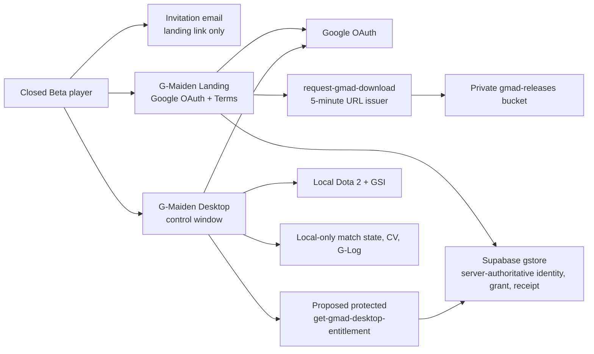
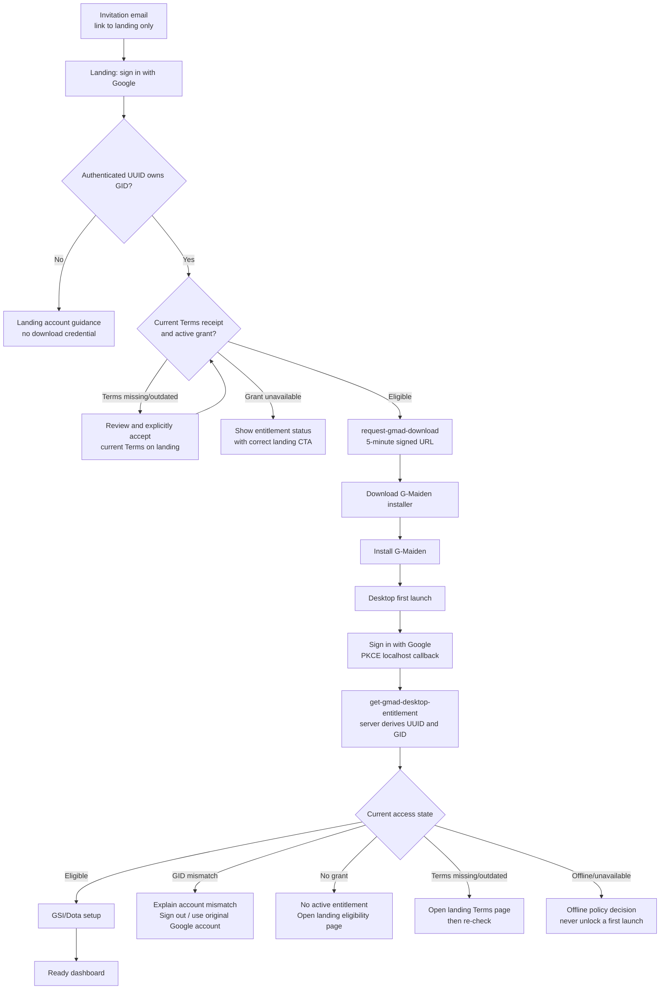
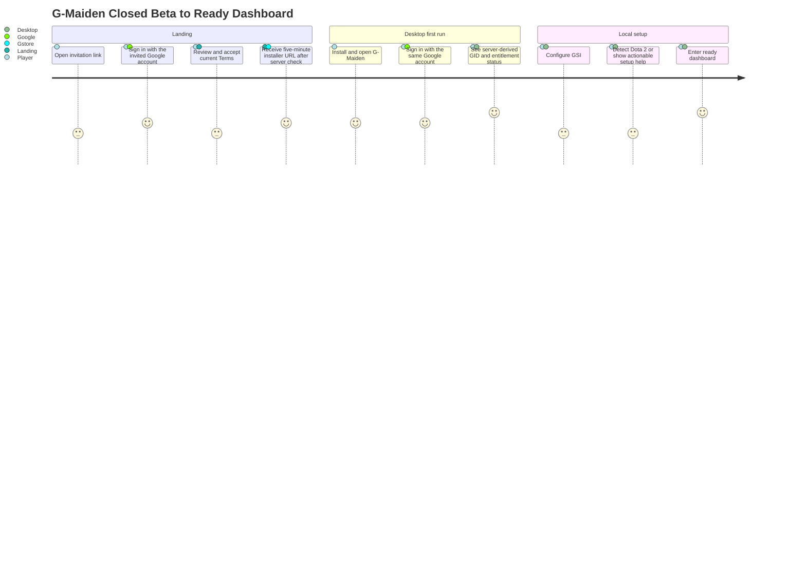
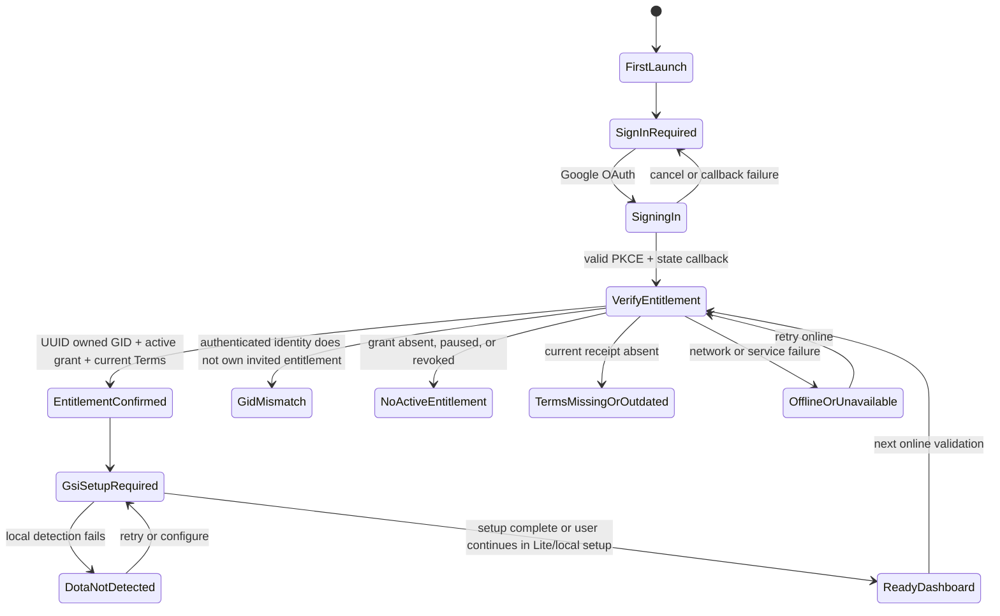
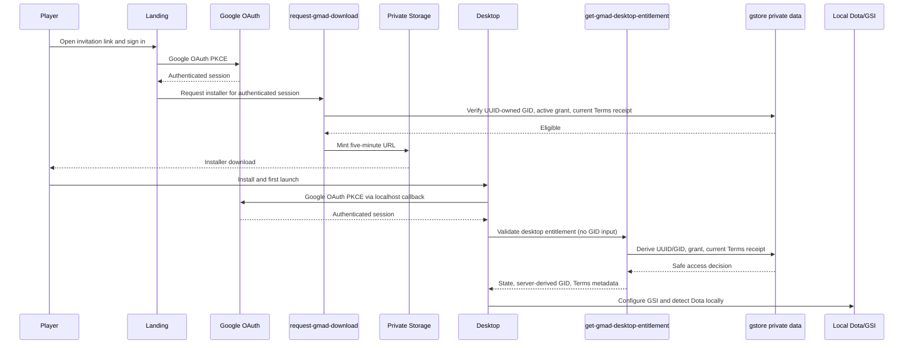
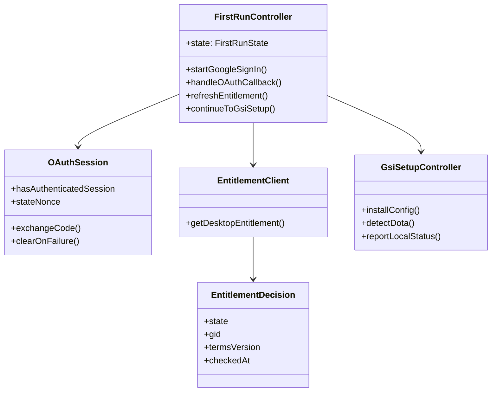

# CR-022 — G-Maiden Desktop First-Run, Entitlement and Account Handoff

> **Approval and legal gate:** Owner and counsel approval were recorded on 2026-07-21. Implementation
> is authorized behind the security, UAT, full CI-equivalent, and production-readiness gates in this CR.

## 1. Decision requested

Approve the first-run desktop handoff after the landing journey succeeds:

`invitation email -> landing Google sign-in -> current Terms acceptance -> active G-Maiden grant -> private installer download -> install -> desktop Google sign-in -> entitlement validation -> GSI/Dota setup -> dashboard`.

The desktop shall use **Google OAuth as its only primary sign-in** and resolve the authenticated
Supabase UUID to the server-owned immutable GID. It shall never accept a typed GID, a Steam ID,
a landing browser session, or a signed download URL as proof of identity or entitlement.

### Approval status

**Owner-approved on 2026-07-21.** This approval accepts the CR-022 design, diagrams, contract,
Genesis Block, and implementation sequencing. The separate CR-021 legal-review gate was closed and
reconfirmed at `2026-07-21T23:05:06+07:00`; implementation may now proceed phase-by-phase, while
production integration remains conditional on all security, UAT, and CI-equivalent gates passing.

## 2. Diagrams first

All diagrams below are a **candidate conceptual design**, not a declaration of current code,
database schema, Edge Function, or deployment behaviour.

### 2.1 Context diagram



### 2.2 Flow chart



### 2.3 User journey diagram



### 2.4 State diagram



### 2.5 Sequence diagram



### 2.6 Conceptual class diagram



## 3. Classification, assumptions, and boundaries

| Item | Decision |
| --- | --- |
| Complexity / risk | C-3 / HIGH: identity, entitlement, Terms receipt, local credential protection, and revocation |
| Internal identity | Supabase `auth.users.id` / `profiles.id` UUID; GID is display-only and immutable (ADR-14) |
| Primary sign-in | Google OAuth PKCE through the existing `127.0.0.1:3000/auth/callback` loopback route |
| Desktop access gate | Current authenticated UUID owns a profile/GID, has an active grant, and has a current required Terms receipt |
| Local-data boundary | Match state, CV detections, and G-Log remain local-only; this flow sends identity/entitlement metadata only |
| Explicit exclusions | No GID/password, email/password, email-link login, Steam login, or GID/Steam recovery credential |

### Assumptions to validate before implementation

1. CR-021’s receipt service and legal document versions are approved and deployed before a desktop
   entitlement gate can enforce them.
2. The existing Google OAuth callback is extended only with the SEC-001 F6 state-nonce protection
   if it has not already shipped; no second listener or redirect is introduced.
3. An entitlement check does not collect hardware fingerprint, match state, CV output, G-Log, IP,
   browser fingerprint, signed URL, refresh token, or raw Google identity data.

## 4. End-to-end flow notes

The email, landing link, installer, and signed Storage URL are delivery mechanisms only. They are
never forwarded to the desktop as a session, bearer token, entitlement receipt, or recovery factor.

## 5. Desktop information architecture and state machine

The first-run surface replaces neither the transparent overlay nor the normal Command Deck. It is
an account-and-setup gate in the **control** window only; the overlay remains unavailable until
the user reaches setup/ready state. It uses the existing premium-dark deck language and no claim
that the product improves play or guarantees gameplay outcomes.

| State | Screen content | Primary CTA | Exit / guard |
| --- | --- | --- | --- |
| `installed` | Installer completion page can say “Open G-Maiden”; it stores no entitlement secret. | Open G-Maiden | Begins `first_launch` |
| `first_launch` | Welcome, privacy-local statement, “Google is required to verify Closed Beta access.” | Continue with Google | No dashboard unlock |
| `sign_in_required` | Google account explanation; no GID input field. | Sign in with Google | OAuth begins |
| `signing_in` | Progress and cancel; do not display OAuth code/token. | Cancel | Callback must match PKCE/state |
| `entitlement_confirmed` | Server-derived GID, “Closed Beta active”, Terms version/effective date, last verified time. | Set up Dota 2 | Native verifier arms the process-local runtime only for `eligible` |
| `gid_mismatch` | “This Google account is not the account that owns the invited GID.” Show server-returned safe context only; never reveal another user’s GID/email. | Sign out and use another Google account | No access / no recovery path |
| `no_active_entitlement` | “No active Closed Beta entitlement for this account.” | Open landing eligibility | No access; do not offer a typed GID override |
| `terms_missing_or_outdated` | Current Terms version is required; explain that acceptance occurs on landing. | Review Terms on landing | Re-check entitlement after return; no desktop checkbox in this CR |
| `offline_or_unavailable` | Distinguish “cannot reach service” from “access denied”; preserve local settings/logs. | Retry | Every account-gated launch stays blocked |
| `gsi_setup_required` | Local setup checklist: install GSI cfg, select Dota location, launch Dota. | Configure GSI | Does not upload game data |
| `dota_not_detected` | “Dota 2 is not detected yet”; manual retry and setup help. | Retry detection | GSI setup remains available |
| `ready_dashboard` | Existing Command Deck and local controls; show account GID and entitlement status in Account page. | Start local setup / play | GSI/Dota absence never invalidates entitlement |

## 6. Desktop-to-backend contract

### 5.1 Server checks before the desktop unlocks

The desktop calls a protected server endpoint using the current Google-authenticated Supabase
session. The endpoint, not the client, shall:

1. validate the JWT and derive `user_id` from it;
2. load the profile for that UUID and derive its immutable GID server-side;
3. find an active, unpaused, unrevoked G-Maiden grant for that UUID;
4. require the latest server-written receipt for the currently required Terms document version/hash;
5. return only the caller’s safe access result and current document metadata; and
6. audit the decision without persisting JWTs, signed URLs, Google tokens, raw match/CV/G-Log data,
   or client-supplied identity claims.

**Unlock response (proposed):**

```text
eligible: boolean
state: eligible | no_active_entitlement | terms_required | account_not_eligible
gid: server-derived immutable display GID (only for the current user)
terms: { document_id, version, effective_at } | null
grant: { status, checked_at } | null
correlation_id: opaque diagnostic identifier
```

The Closed-Beta response has no `offline_receipt` field under the approved online-only policy.
The React UI is not the runtime trust boundary: Rust forwards the issuer access JWT directly to
the protected Function, accepts only `eligible` with a non-empty server-derived GID, then arms a
process-local authorization flag. Overlay visibility, GSI processing, and CV capture fail closed
while that flag is false. JWTs and Function responses are never written to disk or logs.

The function must ignore any `gid`, `email`, `steamid`, `download_url`, `signed_url`, or user ID
supplied by the client. `account_not_eligible` intentionally does not disclose another account’s
GID, enrollment, or grant state.

### 5.2 Endpoint decision

`request-gmad-download` remains the **only installer URL issuer**. It should not be reused for
desktop validation because its successful semantic result is a five-minute artifact URL and its
audit purpose is download issuance.

The approved implementation introduces one narrowly scoped protected Edge Function:

`get-gmad-desktop-entitlement`

It is read-only except for a minimal server-written entitlement-check audit and issues no
offline receipt. It reuses CR-016’s grant resolver and CR-021’s current-receipt
resolver rather than duplicating authorization logic. A shared server-only resolver is preferred
over calling one Edge Function from another or exposing tables to the desktop.

| Contract | Reused | New / reason |
| --- | --- | --- |
| Google session + UUID/GID ownership | ADR-14, SEC-001 | Reuse; desktop never submits ownership evidence |
| Active/pause/revoke grant decision | CR-016 | Reuse server-side resolver; no Storage URL is returned |
| Current Terms receipt decision | CR-021 | New only after legal-approved receipt schema/service exists |
| Desktop status | — | New `get-gmad-desktop-entitlement`; differs from installer download semantics |

## 7. Offline policy — online verification required

**First launch offline: deny access.** The user sees a plain “Internet connection is required to
verify Closed Beta access” screen with Retry. This prevents an installer file from becoming an
offline entitlement credential.

**Every account-gated launch requires an online entitlement check.** The highest-security policy was
selected: no offline entitlement receipt or grace period is issued in this Closed Beta. Local settings
and G-Log remain intact when verification is unavailable, but dashboard/overlay access stays locked.

| Control | Policy |
| --- | --- |
| Local receipt | None; GID, installer state, signed URL, cached response, or local setting never unlocks access |
| Device/reinstall | Every install/device validates the current Google session and entitlement online |
| Online refresh | Required on each account-gated launch and explicit Retry |
| Revocation | Server pause/revoke blocks the next launch/check immediately |
| Service failure | Label as unavailable rather than denied; preserve local settings/G-Log but keep gated UI locked |

This removes offline-receipt signing, copying, clock rollback, delayed revocation, and protected-store
failure from the Closed Beta attack surface. A future offline policy requires a new C-3 approval.

## 8. Implementation plan (after approval only)

| Phase | Work | Verification | Dependency |
| --- | --- | --- | --- |
| 0 | Counsel/owner closes legal open items and approves CR-021 + CR-022. | Recorded approval and final document IDs/hashes. | Legal gate |
| 1 | Threat model and schema/Function design for private Terms receipts and desktop entitlement status. | RLS, negative authorization, receipt-version, revoke/pause, and audit tests. | Phase 0 |
| 2 | Implement shared server-side entitlement resolver and `get-gmad-desktop-entitlement`; preserve CR-016 download endpoint. | Contract tests: UUID ownership, no grant, terms stale, pause/revoke, no URL in response. | Phase 1 |
| 3 | Implement hardened OAuth state handling and a native online entitlement gate; issue no offline receipt. | Callback replay/incorrect-state tests; native fail-closed/runtime-lock tests. | Phase 2, SEC-001 F5/F6 review |
| 4 | Build control-window first-run state machine and Account status surface; keep overlay hidden until native unlock. | TS tests for every state; accessibility/copy review; Tauri no-bundle smoke. | Phase 3 |
| 5 | Wire GSI/Dota setup handoff and run controlled UAT. | Matrix in section 9, full CI-equivalent gate, real non-production account journey. | Phase 4 |

No phase authorizes upload of match state, CV detection, or G-Log. Account status remains an
identity/entitlement feature, separate from post-match opt-in data contribution.

## 9. Risk assessment and mitigations

| Risk | Mitigation |
| --- | --- |
| User enters a different Google account on desktop | Server derives UUID/GID; clear mismatch UI, sign-out CTA, no typed GID override or recovery bypass |
| Installer or signed URL is shared | Installer grants nothing; desktop obtains a new authenticated entitlement decision |
| Old Terms accepted | Server compares current document ID/version/hash; desktop directs user to landing for fresh explicit acceptance |
| Cached/local state copied or tampered | No local entitlement receipt exists; native runtime requires a fresh online server decision on launch |
| Grant is revoked while offline | App remains locked offline; pause/revoke applies on the next mandatory online launch/check |
| OAuth callback injection/replay | PKCE plus SEC-001’s single-use state nonce; never log authorization code/token |
| Local/privacy boundary drifts | Contract rejects game payloads; tests verify no match/CV/G-Log fields or analytics are added |

## 10. UAT matrix

| ID | Scenario | Setup | Expected result |
| --- | --- | --- | --- |
| UAT-01 | Same Google account | Granted UUID, current Terms receipt, online | Shows server-derived GID and active entitlement; enters GSI setup then dashboard. |
| UAT-02 | Different Google account | Installer user signs into another Google UUID | `account_not_eligible`/mismatch guidance; no other GID, no dashboard, no typed-GID bypass. |
| UAT-03 | No grant | Valid Google user with no active grant | “No active entitlement”; landing eligibility CTA; no unlock. |
| UAT-04 | Grant paused/revoked | Previously eligible user, online after pause/revoke | Fresh validation blocks immediately; native runtime and overlay remain locked. |
| UAT-05 | New Terms version | Active grant but receipt is for earlier Terms | Terms-required screen with current version; landing acceptance then successful re-check. |
| UAT-06 | Signed URL expired | Landing-issued URL older than five minutes | Download fails safely; desktop neither consumes nor treats it as a credential. |
| UAT-07 | Offline first launch | Fresh install, no network | No unlock; clear internet-required screen and Retry. |
| UAT-08 | Offline after prior verification | Previously eligible session, next launch offline | No dashboard/overlay/GSI/CV unlock; retain local settings/G-Log; require online validation. |
| UAT-09 | Cached response/local state tampered | Local files or WebView state claim eligible | Native runtime remains locked because no server decision was received in this process. |
| UAT-10 | Reinstall/new device | New app data directory or Windows account | Google sign-in + online entitlement re-check required; no receipt migration exists. |
| UAT-11 | OAuth callback fail | Wrong/missing/replayed state, code exchange failure, or port route unavailable | No session created; actionable Retry; no token/code in UI/logs. |
| UAT-12 | Supabase unavailable | Timeout/5xx after a prior online validation | Clearly label service unavailable, not denial; keep dashboard/overlay/GSI/CV locked. |
| UAT-13 | GSI setup required | Entitlement confirmed, GSI absent | Shows local configuration path; no game data egress. |
| UAT-14 | Dota not detected | GSI configured but Dota process absent | Shows detection guidance/retry; entitlement remains confirmed and dashboard can remain in setup state. |

## 11. Legal approval record and production gate

### 2026-07-22 production-readiness audit

The CR-021 receipt, audit, and least-privilege migrations are applied to production. The four
JWT-protected Functions are active with `verify_jwt=true`: `accept-closed-beta-terms`,
`get-gmad-desktop-entitlement`, `request-gmad-download`, and `check-gmad-queue`. Anonymous and
invalid-JWT requests return `401`; CORS preflight returns `200`. The Landing production alias now
serves the approved Terms/Privacy content, avoids a signed-out Function request, and renders a
Google sign-in CTA without browser console errors. Starting sign-in from a clean browser reaches
Google Accounts through the configured Supabase callback and carries the production Landing return
URL; verification stopped before account selection or consent.

RWANG CodeDoc completed all three Mellum2 comparisons with exit code `0`, so the native entitlement
gate and this contract are aligned. Release readiness remains blocked only where real operational
evidence is absent: production currently has no signed G-Maiden artifact, published batch, or controlled
grant, so authenticated success, pause/revoke, stale-Terms, signed-URL-expiry, reinstall/new-device,
and same/different-account UAT must not be fabricated. No Desktop tag or installer release is
authorized until those fixtures exist and the full matrix is recorded.

Owner confirmation on 2026-07-21 records counsel/data-controller approval of the following policy
decisions. Production deployment still requires exact document/hash verification and UAT evidence:

1. final Closed Beta Terms text, document ID/version, effective date, and hash publication process;
2. final Privacy Notice, named data-controller legal identity, contact channel, processors/transfers,
   retention, and data-subject rights process;
3. receipt retention, access controls, deletion/archival rules, and whether any security-log metadata
   is necessary and lawful;
4. age threshold, parental-consent handling where applicable, and age-verification approach (or an
   explicit decision not to collect age data);
5. liability limitations, governing law, jurisdiction/dispute language, termination/revocation terms,
   and Valve/Dota 2 non-affiliation wording; and
6. the selected no-offline-grace policy and immediate next-online-check revocation behavior.

## 12. Acceptance criteria

| ID | Criterion |
| --- | --- |
| AC-01 | Desktop requires Google OAuth and derives identity/GID exclusively from the authenticated server-side UUID. |
| AC-02 | No typed GID, Steam ID, signed download URL, installer artifact, or landing browser session unlocks desktop access. |
| AC-03 | Only active grant + current server-written Terms receipt unlocks the first-run desktop flow. |
| AC-04 | Every account-gated launch while offline remains locked; no local receipt or grace period exists. |
| AC-05 | Pause/revoke blocks the next online validation and is communicated without exposing another user’s information. |
| AC-06 | Terms-required and no-entitlement states explain the practical next action without overclaiming gameplay benefit. |
| AC-07 | GSI/Dota setup starts immediately after entitlement succeeds and does not upload match state, CV detections, or G-Log. |
| AC-08 | All UAT cases in section 9, full CI-equivalent checks, and security/privacy review pass before release. |

## 13. Out of scope

- Any code, database migration, Edge Function, landing change, deployment, production email, or
  Terms checkbox before approval.
- Password, GID/password, email/password, Steam sign-in, recovery through GID/Steam, MFA/phone,
  public profiles, hardware fingerprinting, or device-license transfer.
- Cloud upload of raw match state, CV detections, G-Log, or gameplay analytics by default.

## CHANGELOG

| Version | Date | Status | Summary | Commit Hash | Agent |
| --- | --- | --- | --- | --- | --- |
| 0.8.1b | 2026-07-22 | beta | Added production Google OAuth-start evidence through the Supabase callback while stopping before account selection. | null | ATHER |
| 0.8.0b | 2026-07-22 | beta | Recorded production migrations, JWT Functions, Landing deployment/browser evidence, and CodeDoc exit 0; retained release block for absent signed artifact, published batch, controlled grant, and authenticated UAT. | null | ATHER |
| 0.7.1b | 2026-07-22 | beta | Recorded green local CI-equivalent/build/browser/migration-dry-run evidence and retained production block for indeterminate CodeDoc plus absent artifact/grant UAT fixtures. | null | ATHER |
| 0.7.0b | 2026-07-21 | beta | Defined the native Rust trust boundary: fresh JWT-backed server decision arms process-local GSI/CV/overlay; removed remaining offline-receipt/grace contradictions. | null | ATHER |
| 0.6.0b | 2026-07-21 | beta | Selected highest-security online verification on every gated launch; no offline receipt or grace period in Closed Beta. | null | ATHER |
| 0.5.0b | 2026-07-21 | beta | Recorded closure of the CR-021 legal gate and authorized phased implementation subject to security/UAT/CI gates. | null | ATHER |
| 0.4.0b | 2026-07-21 | beta | Owner approved the CR-022 design and Genesis Block; implementation remains blocked pending the separate CR-021 legal-review gate. | null | ATHER |
| 0.4.1b | 2026-07-21 | beta | Recorded live readiness audit: Desktop OAuth code gates pass, while hosted Terms/entitlement, Landing parity, first-run enforcement, and full UAT remain blocked. | null | ATHER |
| 0.3.1b | 2026-07-21 | candidate | Renamed the linked Genesis Block to state its GMAD First-Run-to-Ready workflow ownership. | null | ATHER |
| 0.3.0b | 2026-07-21 | candidate | Added the companion Genesis Block atom composition, execution boundary, and approval-batched implementation framing. | null | ATHER |
| 0.2.0b | 2026-07-21 | candidate | Moved the design review to a diagrams-first packet: context, flow, user journey, state, sequence, and conceptual class diagrams. | null | ATHER |
| 0.1.0b | 2026-07-21 | candidate | Initial C-3/HIGH design: desktop first-run state machine, server-authoritative entitlement contract, bounded offline policy, legal gate, and UAT matrix. | null | ATHER |
