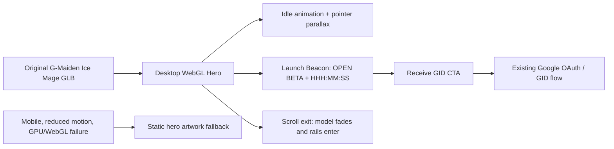

# CR-023 — G-Maiden Original 3D Hero and Scroll Narrative

## Decision requested

Create an original **G-Maiden Ice Mage** as the landing's primary character. Crystal Maiden is a
creative mood reference only; this change must not copy, extract, trace, name, or ship a Valve/Dota
character model, texture, animation, voice, logo, costume, weapon, or other protected asset.

**Approval:** Boss approved the 3D Hero and scroll-narrative direction on 2026-07-21. Character
appearance and production-use rights remain the next explicit asset gate.

## Classification

| Area | Complexity | Risk |
| --- | --- | --- |
| Original 3D character, public asset licence, WebGL runtime, fallback and scroll motion | C-3 | High |

The risk is asset-rights, public download weight, GPU capability, accessibility, and layout/runtime
change. It does not change GID, Google OAuth, queue, grant, or download authorization.

## Outcome

The initial Hero becomes an interactive cinematic scene on capable desktop devices. The model creates
presence; it never hides CTA text or turns scroll into a required interaction. The following feature
rails remain semantic HTML/CSS and use progressive scroll reveal rather than a full-page WebGL scene.
CR-023 does **not** change the launch schedule: the Launch Beacon continues to use CR-020's approved
`2026-07-24 18:00 Asia/Bangkok` Open Beta time.

## Original character brief

- A gentle adult ice mage associated with G-Maiden: midnight-blue and cold-silver functional cloak,
  compact asymmetric silhouette, a geometric frost-light focus, and an original emblem.
- Expression and stance: observant companion, guarding the player's back; no combat-prediction or
  hidden-information visual claim.
- Do not use Crystal Maiden's likeness, blue robe pattern, hair/face design, staff, crest, names,
  in-game render, animation, sound, or any extracted/reference game asset.
- Deliverable source ownership/licence must be recorded before production use. A generated concept
  image may guide the model but is not itself the shipping 3D asset.

## Approved semi-realistic art direction

Boss approved a move from the first primitive-stylized study to a **semi-realistic cinematic**
G-Maiden direction on 2026-07-21. This remains an original adult character with the same asset-rights
and non-affiliation rules. The target has human proportions, an expressive but non-identifying face,
layered hair, cloth folds, PBR-style cloth/metal/frost response, and an observant companion pose.
It is not photorealism for its own sake: the resulting reviewed landing asset must still meet the
existing 3 MB GLB / 2 MB texture transfer limits through baked maps and restrained geometry.

## Asset-source evidence

- The approved G-Maiden model sheet is stored as a review reference at
  `G:\G-Maiden-3D-Studio\workspace\gmaiden-ice-mage\source\reference\gmaiden-model-sheet-v1.png`.
- An original source scene exists at
  `G:\G-Maiden-3D-Studio\workspace\gmaiden-ice-mage\source\gmaiden-ice-mage-blockout-v1.blend`.
  It contains only a review-pending primitive blockout and the starting `root → spine → neck → head`
  armature; it is **not** a finished mesh, rig, animation, GLB, or licensed production asset.
- The Studio manifest records `state: blockout`, the `landing-hero-v1` budget target, and the need
  for review before export. No landing asset has been changed or published by this evidence step.
- A first viewable art prototype and its Blender source now exist at
  `G:\G-Maiden-3D-Studio\workspace\gmaiden-ice-mage\source\gmaiden-ice-mage-prototype-v1.blend`
  and `...\previews\gmaiden-ice-mage-prototype-v1.png`. It is a primitive-based original character
  study with no third-party model, crest, staff, texture, animation, voice, or GLB. It remains a
  human-review gate before any production mesh, rig, export, or landing integration.
- The semi-realistic cinematic visual target is stored at
  `G:\G-Maiden-3D-Studio\workspace\gmaiden-ice-mage\source\reference\gmaiden-cinematic-target-v2.png`.
  It is an original generated **concept reference only**: it sets material, silhouette, hair, pose,
  and lighting direction for the human-reviewed mesh work. It is not a 3D model, texture source,
  GLB, proof of exclusive rights, or a landing asset.
- The first cinematic base assembly exists as
  `source\gmaiden-ice-mage-cinematic-base-v2.blend` with a preview under `previews\`. It is a
  valid mesh/curve/armature construction study but does **not** meet the approved semi-realistic
  character-quality target. The root-cause record is
  `.brain\rca\2026-07-21-cinematic-base-realism-gap.md`; no export or landing integration is
  permitted from this source.

## Runtime and performance contract

1. Load the 3D runtime only after Hero visibility and only for `pointer: fine`, no
   `prefers-reduced-motion`, and a successful WebGL capability check. Use the existing static hero
   on mobile, coarse pointer, reduced motion, failed WebGL, or model load error.
2. Use one original GLB with one short baked idle clip. The model transfer budget is at most 3 MB;
   compressed texture transfer is at most 2 MB; no runtime model generation and no networked player
   telemetry.
3. Use `three` as the sole new runtime dependency, dynamically imported. No scroll-hijacking library,
   autoplay audio, camera access, or external 3D CDN is allowed.
4. Pointer input is sampled with `requestAnimationFrame`, has bounded rotation/translation, and is
   decorative only. It must not capture clicks, keyboard focus, or page scrolling.
5. Scroll progress changes only scene transforms/opacity. It cannot pin the page, block browser
   navigation, or prevent reaching the CTA/feature content.
6. The HTML heading, date/time, live countdown, and CTA remain outside the canvas, are readable with
   canvas disabled, and preserve the existing Google OAuth/GID behavior.

## Narrative layout

| Scroll range | Scene behaviour | Content priority |
| --- | --- | --- |
| Initial viewport | Model holds a gentle idle pose; pointer produces small depth response. | Product promise + Launch Beacon + GID CTA |
| Hero exit | Model drifts out and the beacon yields to the first rail; no abrupt canvas cut. | Feature 01 enters |
| Feature rails | CSS/HTML rail reveals and fine background light movement only. | Clear Thai feature explanation |
| Mobile/fallback | Static art with the same DOM order and CTA. | Readability, tap target, fast LCP |

## Acceptance criteria

| ID | Criterion |
| --- | --- |
| AC-01 | Shipping model and all textures/animations are original G-Maiden assets with recorded production-use rights; no Valve/Dota asset is used. |
| AC-02 | Fine-pointer desktop gets an idle animated 3D G-Maiden scene with bounded cursor response. |
| AC-03 | Countdown remains `OPEN / BETA` + total-hours `HHH:MM:SS` + launch date/time + working GID CTA, outside the canvas. |
| AC-04 | Mobile, coarse pointer, reduced-motion, WebGL failure, and model-load failure render a legible static Hero with no broken CTA or layout shift. |
| AC-05 | Model/textures meet the stated transfer budgets; no new analytics event or player data egress is added. |
| AC-06 | Scroll is passive and does not hijack navigation; keyboard and touch users reach all Hero and rail content. |
| AC-07 | Typecheck/build pass, desktop/mobile browser checks pass, and WebGL/fallback/reduced-motion states have captured evidence. |

## Out of scope

- Using a Valve/Dota/Crystal Maiden asset or claiming an affiliation with Valve.
- Account, Terms acceptance, entitlement, email, or download-flow changes.
- A WebGL remake of every landing section, cursor-dependent CTA, or sound playback.
- Desktop application/overlay changes.

## Approval gates

1. Approve this design/technical contract.
2. Approve original character concept and record its production-use rights.
3. Produce the model and its static fallback asset, then inspect them before implementation.
4. Implement the lazy WebGL Hero and scroll narrative; verify performance, fallback, accessibility,
   and visual fidelity before deployment.

## CHANGELOG

| Version | Date | Status | Summary | Commit Hash | Agent |
| --- | --- | --- | --- | --- | --- |
| 0.7.1b | 2026-07-21 | accepted | Added the pinned doc-graph `updated` and approval metadata and mapped the approved beta lifecycle to canonical `accepted`; no requirement changed. | null | ATHER |
| 0.7.0b | 2026-07-21 | beta | Recorded that the first cinematic base assembly is an editable technical study but does not meet the semi-realistic quality gate; blocked export and landing use pending an approved character-authoring route. | null | ATHER |
| 0.6.0b | 2026-07-21 | beta | Created and stored a semi-realistic cinematic concept reference for the approved original direction; explicitly kept it as non-shipping 2D reference material. | null | ATHER |
| 0.5.0b | 2026-07-21 | beta | Approved semi-realistic cinematic art direction for a new review-pending prototype while preserving original-asset, performance, and export gates. | null | ATHER |
| 0.4.0b | 2026-07-21 | beta | Generated and visually inspected a review-pending original G-Maiden art prototype plus preview render; it is not a production mesh, rig, export, or landing asset. | null | ATHER |
| 0.3.0b | 2026-07-21 | beta | Stored the approved model sheet in the G: Studio workspace and generated a review-pending Blender blockout with a minimal armature; no production asset or landing integration is claimed. | null | ATHER |
| 0.2.0b | 2026-07-21 | beta | Direction approved; moved to original-character concept and rights gate before 3D implementation. | null | ATHER |
| 0.1.0b | 2026-07-21 | candidate | Initial C-3 contract for an original G-Maiden Ice Mage 3D Hero, scroll narrative, performance and fallback rules. | null | ATHER |
