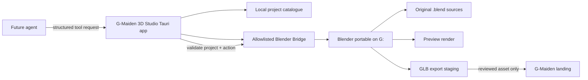

# CR-024 — G-Maiden 3D Studio and Portable Blender Toolchain

## Objective

Install Blender outside the system drive and create a separate desktop application, provisional name
**G-Maiden 3D Studio**, for managing original 3D assets and providing a safe local tool boundary for
future agents. This is not part of the game client and does not alter the G-Maiden runtime.

**Approval:** Boss approved execution on 2026-07-21.

## Implementation evidence

- Blender `4.5.12 LTS` is installed from the official Windows x64 ZIP at
  `G:\Tools\Blender\blender-4.5.12-windows-x64\blender.exe`; SHA-256 verified:
  `317ef64e7a2c3cc79ec810c766ae9828aff865bea78039dc695b3f1118c34b4f`.
- Its portable configuration directory exists at
  `G:\Tools\Blender\blender-4.5.12-windows-x64\portable\`.
- The Tauri v2 React Studio was bootstrapped at `G:\G-Maiden-3D-Studio\`; `pnpm build`,
  `cargo check`, and `pnpm tauri build --no-bundle` produced the unsigned smoke binary
  `src-tauri\target\release\g-maiden-3d-studio.exe`.
- The initial bridge has only `get_studio_status` and `create_empty_project`. The latter validates
  the project name, requires the exact configured G: Blender executable, and creates only
  `source/`, `exports/`, `previews/`, and a review-pending manifest beneath the Studio workspace.
- The first review-pending project is
  `G:\G-Maiden-3D-Studio\workspace\gmaiden-ice-mage\`. It contains the approved model-sheet
  reference, a `studio-project.json` manifest, and
  `source\gmaiden-ice-mage-blockout-v1.blend` generated with the fixed local blockout script.
  The scene is intentionally only a primitive blockout plus a minimal armature and is not an
  exportable or production-approved asset.
- The Studio now exposes a workspace-bounded `list_projects` command and renders its local
  project summaries. It reads only immediate workspace project manifests plus the presence of a
  `.blend` source; it accepts no project path, shell text, Blender Python, or publishing request.
- A fixed local Blender script generated the first review-pending source and preview under the
  `gmaiden-ice-mage` project. The preview was manually inspected as a stylized original character
  study. It has no GLB output, animation, production rights record, or deployment path enabled.
- The workspace also contains a semi-realistic generated concept reference used only to guide future
  original mesh work. It remains isolated under `source\reference\`, has no export path, and cannot
  be treated as a reviewed production asset.

## Classification

| Area | Complexity | Risk |
| --- | --- | --- |
| External executable installation, new Tauri desktop app, Blender automation boundary | C-3 | High |

## Installation contract

| Item | Proposed location | Rule |
| --- | --- | --- |
| Blender portable release | `G:\Tools\Blender\<version>\` | Download official Windows x64 ZIP, extract here, never install under C:. |
| Blender local configuration/extensions | `G:\Tools\Blender\<version>\portable\` | Keep user configuration and extensions on G: beside the executable. |
| 3D Studio source and workspace | `G:\G-Maiden-3D-Studio\` | Separate repository/worktree from G-Maiden. |
| Studio asset workspace | `G:\G-Maiden-3D-Studio\workspace\` | Original sources, generated previews, `.blend`, and export staging only. |

The current drive has 244.78 GiB free and neither proposed directory exists. Blender's official
portable ZIP layout supports keeping configuration next to its executable; use that mode rather than
the Windows installer. [Evidence: Blender Directory Layout, portable installation.]

## Product boundary

- The Studio is a local-first creative tool, not a general-purpose agent shell or autonomous model
  generator.
- Future agents submit typed requests; they never receive unrestricted command execution, arbitrary
  filesystem access, or an ability to download/install Blender extensions.
- All exported assets remain untrusted until a human reviews their source, licence/provenance,
  preview, file size, and target-app budget.
- The approved next source iteration is a semi-realistic cinematic prototype with PBR-style visual
  studies and preview renders. This does not grant GLB export, landing deployment, or removal of
  the human review/provenance gate.

## Phase 1 — useful studio MVP

1. Tauri v2 + React/TypeScript app shell with a local project catalogue and original-asset manifest.
2. Select an approved workspace path only beneath `G:\G-Maiden-3D-Studio\workspace\`.
3. Allowlisted Blender Bridge actions: `open_project`, `create_empty_project`, `render_preview`,
   `export_glb`, and `inspect_export`.
4. Bridge launches Blender with explicit executable and project paths, never interpolated shell text;
   it runs long work off the Tauri main thread and streams progress events.
5. Export inspector enforces CR-023 landing limits before handoff: GLB transfer ≤3 MB, texture
   transfer ≤2 MB, one baked idle animation clip, and a static fallback asset required.
6. Desktop UI shows source/provenance, project path, export state, preview, warnings, and a manual
   approval action. It does not upload assets or send player/account data.

## Agent tool contract (future-ready, not enabled in Phase 1)

| Tool | Typed input | Guardrail |
| --- | --- | --- |
| `studio.list_projects` | none | Lists only the Studio workspace manifest. |
| `studio.render_preview` | approved project id, camera preset | Uses a fixed Blender script and an output directory inside the project. |
| `studio.export_glb` | approved project id, export profile | Applies the budget profile; creates a review-pending artifact. |
| `studio.inspect_asset` | Studio asset id | Reads metadata, file sizes, and validation output only. |

No `run_shell`, arbitrary Blender Python, arbitrary path, network fetch, extension install, or direct
publish/deploy tool is permitted.

## Security and reliability

- Tauri permissions are allowlisted: dialog/fs access is scoped to Studio workspace; shell capability
  is limited to the exact Blender executable and fixed argument patterns.
- Blender's executable path is configured by the owner and verified before each run. A missing or
  changed executable disables the bridge rather than falling back to PATH or C:.
- Source `.blend` files and exports have separate directories; no export overwrites a reviewed asset.
- Blender subprocess errors, duration, and exit code are retained in a local project audit record.
- No analytics, cloud sync, account data, match/CV/G-Log data, or game control is in scope.

## Acceptance criteria

| ID | Criterion |
| --- | --- |
| AC-01 | Blender is installed as an official portable Windows ZIP entirely under `G:\Tools\Blender\<version>`, with its portable config under the same tree. |
| AC-02 | No Blender executable/configuration/asset workspace is created under C: by this work. |
| AC-03 | Studio is a separate Tauri v2 project under `G:\G-Maiden-3D-Studio` and its source does not modify the G-Maiden game client. |
| AC-04 | Blender Bridge accepts only the named actions and workspace-bounded paths; arbitrary shell/Python/path requests are rejected. |
| AC-05 | A reviewed GLB handoff can be inspected against CR-023 size, animation, fallback, and provenance requirements before landing integration. |
| AC-06 | Studio Tauri build/typecheck tests pass, and Blender version/portable-config evidence is captured. |

## Approval gates

1. Approve this install path and independent app boundary.
2. Install and verify Blender portable on G:.
3. Scaffold the Studio and implement the safe bridge MVP.
4. Only then begin creating/rigging the G-Maiden model from the approved model sheet.

## Out of scope

- Installing software to C:, global PATH edits, Windows file association registration, or automatic
  Blender extension downloads.
- An agent that independently publishes assets, installs software, uses arbitrary Blender Python, or
  controls the G-Maiden game client.
- Any Valve/Dota asset or unaudited third-party model.

## CHANGELOG

| Version | Date | Status | Summary | Commit Hash | Agent |
| --- | --- | --- | --- | --- | --- |
| 0.8.0b | 2026-07-21 | beta | Stored a generated semi-realistic concept reference under the G: Studio source-reference boundary; it has no export, deployment, or production approval. | null | ATHER |
| 0.7.0b | 2026-07-21 | beta | Approved the semi-realistic cinematic source-prototype iteration while retaining all review, export, and deployment controls. | null | ATHER |
| 0.6.0b | 2026-07-21 | beta | Generated and visually inspected the first review-pending original character prototype and preview in the G: Studio workspace; export and publish remain disabled. | null | ATHER |
| 0.5.0b | 2026-07-21 | beta | Added a workspace-bounded local project catalogue to the Studio and verified its frontend build plus Rust typecheck; no preview render, GLB export, or publish action is enabled. | null | ATHER |
| 0.4.0b | 2026-07-21 | beta | Created the first review-pending G: Studio project and verified its Blender blockout source scene; the asset remains non-production and non-exported. | null | ATHER |
| 0.3.0b | 2026-07-21 | beta | Installed Blender 4.5.12 portable on G:, verified SHA-256, and bootstrapped/build-verified the isolated Tauri Studio MVP. | null | ATHER |
| 0.2.0b | 2026-07-21 | beta | Execution approved: install portable Blender on G: and bootstrap the isolated Studio workspace. | null | ATHER |
| 0.1.0b | 2026-07-21 | candidate | Proposed portable Blender toolchain and separate safe Tauri 3D Studio for original asset work and future agent tools. | null | ATHER |
