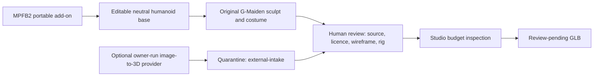

# CR-026 — MPFB2 Character Authoring and Guarded Image-to-3D Import

## Approved decision

The owner approved installation of **MPFB2 2.0.16** into the existing portable Blender 4.5.12 toolchain on
G:, solely to create an editable humanoid base mesh for the original G-Maiden source. Also approve
a guarded manual-import lane for a user-owned image-to-3D provider result, but do not authorize an
API integration, automatic cloud upload, or API-key storage. Final asset review and landing
publication authority are provided separately by approved CR-028.

## Evidence and selection

- MPFB2 is maintained by MakeHuman Community as a free/open-source human generator and its current
  repository states that MPFB 2.x requires Blender 4.2 or later; Blender 4.5.12 satisfies that
  minimum. The current release is `v2.0.16` (2026-06-13).
- MB-Lab was rejected: its upstream repository is archived and its README identifies 1.8.1 as the
  final version, making it a poor production base despite nominal Blender 4.0 support.
- A cloud image-to-3D provider may produce a faster rough base, but it requires a separate owner
  account/credit/licence decision. Meshy is a concrete optional example: API usage requires Pro or
  higher, and free-plan output is CC BY 4.0 while paid output is owner-controlled. This CR does not
  select, sign in to, or call Meshy.

## Classification

| Area | Complexity | Risk |
| --- | --- | --- |
| External Blender extension, source-asset provenance, optional cloud asset intake | C-3 | High |

## Installation and storage contract

| Item | Exact G: boundary | Rule |
| --- | --- | --- |
| MPFB2 release archive and licence record | `G:\G-Maiden-3D-Studio\third_party\mpfb2\2.0.16\` | Download only from the MakeHuman Community release; record URL, tag, SHA-256, and licence text. |
| MakeHuman system assets | `G:\G-Maiden-3D-Studio\third_party\mpfb-assets\` | Preserve the downloaded CC0 archive, SHA-256, source URL, and portable-profile extraction boundary. |
| Portable Blender extension configuration | `G:\Tools\Blender\blender-4.5.12-windows-x64\portable\` | Enable only in the existing portable Blender profile; no C: install, PATH edit, or global registration. |
| MPFB2 source project | `G:\G-Maiden-3D-Studio\workspace\gmaiden-ice-mage\source\` | Keep editable `.blend`, base-mesh provenance, and human-review state. |
| External image-to-3D intake | `...\workspace\gmaiden-ice-mage\source\external-intake\` | Store download, provider task receipt, input hash, output hash, licence/plan evidence, and reviewer decision. Never overwrite original source. |

## Allowed workflow

1. Create a neutral adult humanoid base with MPFB2; do not use generated clothing, hair, facial
   presets, or third-party textures as the final G-Maiden appearance without separate provenance.
2. Transform it into the original G-Maiden character through original sculpt/costume/material work.
3. If the owner elects to use an image-to-3D provider, the owner performs sign-in/upload/generation.
   The Studio accepts only an explicit downloaded result plus its receipt into `external-intake`.
4. The Studio keeps imported/external material quarantined and untrusted until a human records a
   review decision. It has no provider API key, network call, auto-import, auto-rig, export, or
   landing-deploy capability.
5. A base created or transformed under this CR must retain the Studio source metadata
   `review-pending` and `export_status: disabled_pending_human_review`. A GLB may be produced only
   as a review-pending inspection artifact; it cannot be promoted to the landing or released until
   the CR-023/CR-024 human review gate records approval.

## Security, licence, and provenance controls

- Do not submit a Valve/Dota/Crystal Maiden image, asset, name, logo, texture, voice, or derivative
  prompt to MPFB2 or any cloud provider.
- Do not add an API key to source, `.env`, Tauri config, logs, or Studio state. Provider interactions
  are owner-operated until a separate security/consent CR is approved.
- Every external candidate must record provider, plan/licence, attribution obligation, source input
  hash, output hash, task/receipt id, import date, and reviewer decision. Missing evidence = reject.
- An MPFB2-generated neutral base is tooling input, not evidence that the final G-Maiden character
  itself is original. The final source and transformed art remain subject to CR-023 AC-01.

## Acceptance criteria

| ID | Criterion |
| --- | --- |
| AC-01 | MPFB2 archive, licence, tag, URL, and SHA-256 are recorded under the G: third-party boundary before enablement. |
| AC-02 | Blender 4.5.12 loads MPFB2 from the portable profile and can create one neutral humanoid base in a test `.blend`. |
| AC-03 | No MPFB2 executable/configuration/asset source is installed under C:, and no global PATH/file association changes occur. |
| AC-04 | The base source is marked review-pending and has no GLB export or landing integration. |
| AC-05 | External image-to-3D candidates can enter only the quarantine path with complete provenance evidence; no Studio provider API integration exists. |
| AC-06 | Disable/remove procedure restores the portable profile without modifying G-Maiden game runtime or the reviewed Studio project sources. |

## Execution evidence — 2026-07-21

| Gate | Verified result |
| --- | --- |
| MPFB2 archive | `mpfb2-v2.0.16-source.zip`, SHA-256 `201A6C39E495862D564B74B2829DE333E401AE99687445AFAC1E1FD3D6F2C4A9`; source and GPL-3.0-or-later record are stored under the approved G: boundary. |
| System assets | `makehuman_system_assets_cc0.zip`, 280,737,770 bytes, SHA-256 `B542127A8E25547C7C29C19F2D1D2ADB9A664C80396ECD694095DBC8028A0107`; CC0 provenance is recorded. |
| Portable enablement | Blender 4.5.12 loaded `bl_ext.user_default.mpfb` version 2.0.16 from `G:\Tools\Blender\blender-4.5.12-windows-x64\portable\extensions\user_default\mpfb`. |
| Storage boundary | Add-on code, user data, source, archives, and outputs are all on G:; no global PATH or file association was changed. |
| Source outcome | MPFB produced the editable humanoid and rig foundation used by CR-028. The final transformed source remains in the Studio workspace with its provenance and review metadata. |
| External provider lane | No image-to-3D provider, API key, cloud upload, or automated external import was used. |

AC-04 was satisfied at the CR-026 base-authoring stage. The later GLB and landing promotion did not
bypass this gate: it occurred only after the independent CR-028 rights, visual, format, budget,
build, and browser review recorded approval.

## Rollback

Disable the MPFB2 extension from portable Blender and move only the exact installed extension folder
to a dated quarantine directory under `G:\G-Maiden-3D-Studio\third_party\quarantine\`; retain the
archive, checksum, licence and audit record. Do not delete source projects or provenance records.

## Out of scope

- Automated Meshy or other provider calls, authentication, subscription purchase, credit spend, API
  key handling, or a web-facing Studio integration.
- Shipping MPFB2 assets unmodified as G-Maiden, publishing a GLB, changing the landing, or bypassing
  CR-023/024 review gates.
- Installing MakeHuman, MB-Lab, MPFB2, or Blender configuration under C:.

## Approval gates

1. Approve this install/provenance boundary. **Approved by owner on 2026-07-21.**
2. Download, hash, install, and smoke-test MPFB2 on G:.
3. Create the neutral base source and review its licence/provenance packet.
4. Approve original transformation work before any final rig/export/landing handoff.

## CHANGELOG

| Version | Date | Status | Summary | Commit Hash | Agent |
| --- | --- | --- | --- | --- | --- |
| 0.3.0b | 2026-07-21 | beta | Recorded the verified G:-only MPFB2/system-assets installation, hashes, licence provenance, portable enablement, and handoff into the separately approved CR-028 review gate. | null | ATHER |
| 0.2.0b | 2026-07-21 | beta | Owner approved the MPFB2 2.0.16 install/provenance boundary and autonomous execution through the downstream CR-028 landing handoff. | null | ATHER |
| 0.1.1b | 2026-07-21 | candidate | Explicitly preserved the existing Studio review-pending and disabled-export contract. | null | ATHER |
| 0.1.0b | 2026-07-21 | candidate | Proposed portable MPFB2 installation as the maintained Blender-compatible character-authoring route, with a provider-neutral external image-to-3D quarantine lane. | null | ATHER |
