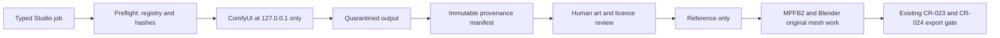

# CR-027 — ComfyUI Local Generation and Provenance Bridge

## Decision requested

Approve an opt-in, local-only adapter between G-Maiden 3D Studio and the existing `G:\ComfyUI`
runtime. The first permitted workload is **2D original concept, turn-around, and texture-reference
generation**. This does not approve model/node download, remote API, automatic mesh creation,
source promotion, GLB export, landing deployment, or bypassing CR-023, CR-024, or CR-026.

## Evidence and classification

- The ComfyUI source at `G:\ComfyUI\resources\ComfyUI` identifies core version `0.22.3`, but two
  Desktop-layout trees exist; a launch smoke must identify the active runtime rather than assume it.
- No actual checkpoint, LoRA, VAE, ControlNet, image-to-3D model, or image-to-3D custom node is
  installed. There was no running process/listener at assessment time.
- RTX 3060 / 12 GB VRAM is present; CUDA/PyTorch readiness remains a launch-smoke requirement.
- The source defaults to `127.0.0.1:8188`; a bare `--listen`, wildcard CORS, and API nodes are
  prohibited for the initial profile.

| Area | Complexity | Risk |
| --- | --- | --- |
| Local generative runtime, model licence governance, filesystem intake, Studio API boundary | C-3 | High |

## Architecture boundary

The adapter may call only local prompt queue, history lookup, and read-only output retrieval. It
must reject DNS/non-loopback URLs, redirects, and user-supplied endpoint/path values; use bounded
queue, time, pixel, output-count, and byte limits; and fail closed for a bad version/hash, timeout,
or unavailable runtime. Typed input is `{ project_id, workflow_id, approved_model_ids,
prompt_template_id, seed }`; arbitrary workflow JSON, graph, prompt text, path, shell/Python,
custom-node action, and publish request are rejected.

## Registry and provenance contract

Read-only Studio registries live at `G:\G-Maiden-3D-Studio\registry\` and reference, never move,
files below `G:\ComfyUI`.

| Record | Mandatory fields |
| --- | --- |
| Model/LoRA/VAE/ControlNet | ID, G:-relative path, SHA-256, source/acquisition receipt, license name/version/URL, commercial restriction, attribution, owner approval, lifecycle `allowed`/`quarantined`/`rejected`. |
| Workflow | ID, JSON SHA-256, ComfyUI version/core revision, allowed node types, model-slot IDs, output budget. |
| Job | Project/job IDs, creator/reviewer/timestamps, runtime/workflow/node hashes, model IDs/hashes, resolved prompt and negative prompt, seed/settings/resolution, input/output hashes, queue/history receipt, license/review decision. |

Unknown, unlicensed, hash-mismatched, or quarantined input blocks the job. Custom nodes are denied
by default; network, URL/file-loader, downloader, model-manager, and cloud/API nodes are forbidden.
Missing provenance rejects the result.

## Asset and rights controls

- Never use Valve/Dota/Crystal Maiden names, images, assets, logos, textures, voices, or derivative
  prompts/reference input.
- Output is a reference only, not proof of rights and not a substitute for MPFB2/Blender topology,
  UV, rig, and human review.
- Every result begins in Studio quarantine with `review-pending` and
  `export_status: disabled_pending_human_review`; it cannot become `.blend`, GLB, or landing asset
  automatically.
- No account, match, CV, G-Log, voice-pack, or game-runtime data enters this pipeline.

## Phased execution

1. Snapshot the selected existing runtime and create empty registry schemas; do not alter ComfyUI or
   download models.
2. Add a health probe and fail-closed non-generating adapter.
3. After a separately recorded model-license/owner approval, enable one offline 2D workflow for an
   original text-only reference.
4. Review its evidence, then separately approve MPFB2/Blender transformation.
5. Image-to-3D is a future quarantined stage only after topology, UV, rig, license, and benchmark
   acceptance; it never substitutes for base-mesh authoring.

## Acceptance criteria

| ID | Criterion |
| --- | --- |
| AC-01 | Studio detects and records existing `G:\ComfyUI` without reinstalling, relocating, or modifying it. |
| AC-02 | Non-loopback, unavailable, unexpected, hash-mismatched, or unlicensed runtime/model/workflow fails closed. |
| AC-03 | An approved offline workflow produces a quarantined 2D reference with a complete hash-verifiable provenance manifest. |
| AC-04 | Studio cannot download/install models/nodes, expose ComfyUI, call remote services, or submit arbitrary workflow/prompt/path content. |
| AC-05 | No result creates a GLB or landing artifact; human review and original-asset gates remain required. |
| AC-06 | Stop/timeout/corrupt output/rejected license retains audit evidence and creates no promoted asset. |
| AC-07 | Studio build/typecheck is green and the G-Maiden game client remains unchanged. |

## Rollback and approval gates

Disable the adapter and registry allowlist, stop only adapter-created queued work, and move only
adapter output to dated Studio quarantine. Retain manifests/hashes/receipts; do not mutate
`G:\ComfyUI`, its models, or the game client.

1. Approve this boundary.
2. Snapshot/launch-smoke ComfyUI and implement the non-generating adapter.
3. Approve a specific model and license record before download/enablement.
4. Run one neutral original 2D job and review its evidence.
5. Approve MPFB2/Blender transformation separately before rig/export/landing handoff.

## Out of scope

Model/node downloads, ComfyUI Manager, cloud/API keys, external listeners, wildcard CORS, public
sharing, image-to-3D production, direct Blender import, GLB export, landing deployment, accounts,
gameplay, telemetry, and game-client integration.

## CHANGELOG

| Version | Date | Status | Summary | Commit Hash | Agent |
| --- | --- | --- | --- | --- | --- |
| 0.1.0b | 2026-07-21 | candidate | Proposed a local-only ComfyUI concept-generation adapter with registry and immutable provenance. | null | ATHER |
