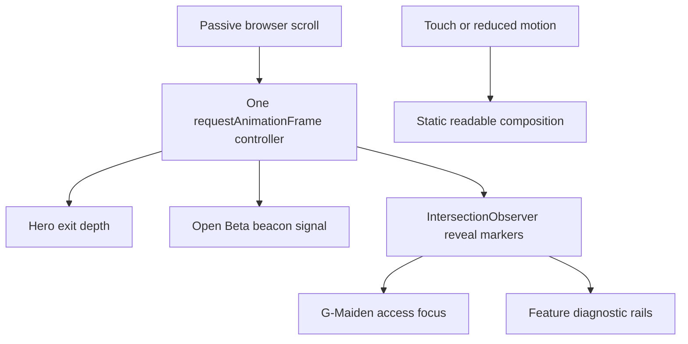

# CR-030: Scroll-Driven Cinematic Narrative

## Approved decision

Boss approved a premium, scroll-driven landing narrative that makes the existing original
G-Maiden Hero, Open Beta countdown, G-Maiden access, and feature rails feel connected as one cinematic
sequence. The work borrows only the interaction quality expected from award-winning marketing sites.
It does not copy a specific website, external media, layout, branding, or source code.

## Classification

| Area | Complexity | Risk |
| --- | --- | --- |
| Public landing motion across four existing sections | C-3 | MEDIUM |

This change does not alter OAuth, GID, terms, entitlement, Supabase, queue data, or the desktop app.

## Motion architecture

1. A single passive scroll listener schedules at most one animation frame and writes bounded CSS
   custom properties to the landing root.
2. Hero exit uses only opacity and transform on the existing art, scrim, and content planes.
3. The Open Beta beacon receives a bounded ice-signal sweep that tracks Hero exit progress.
4. G-Maiden access and feature content remain visible by default. `IntersectionObserver` adds an enhancement
   class only after each section enters view, then unobserves it.
5. No scroll pinning, scroll hijacking, autoplay audio, WebGL, new remote media, or animation
   library is allowed.

## Accessibility and performance contract

- `prefers-reduced-motion: reduce`, coarse pointers, and touch devices keep the static composition.
- The document remains scrollable with browser-native behavior, keyboard navigation, and anchor links.
- Motion must not gate reading, focus, CTA availability, GID enrollment, or G-Maiden queue checking.
- Use composited transform, opacity, and filter only; do not animate layout properties or poll
  scroll synchronously on every event.
- Do not add a runtime dependency. The landing bundle must remain free of Three.js and WebGL.

## Acceptance criteria

| ID | Criterion |
| --- | --- |
| AC-01 | One controller drives bounded Hero and countdown progress without scroll pinning or hijacking. |
| AC-02 | G-Maiden access and feature rails have visible-by-default, observer-enhanced scroll states. |
| AC-03 | Touch and reduced-motion paths disable decorative scroll transforms. |
| AC-04 | Existing GID, G-Maiden access, Terms, privacy, navigation, and mobile-menu flows remain unchanged. |
| AC-05 | Landing typecheck, tests, build, reduced-motion review, visual QA, and CodeDoc Aligner pass. |
| AC-06 | Production deployment is browser-checked at desktop and mobile viewports. |

## Implementation record

- `landing/src/scrollNarrative.ts` owns the only passive scroll progress controller for the landing
  root and the one-time `IntersectionObserver` reveal path.
- `landing/src/HeroMedia25D.tsx` retains fine-pointer parallax only and no longer registers a
  scroll listener.
- `landing/src/index.css` binds Hero exit depth, beacon sweep, G-Maiden access enhancement, and feature-rail
  reveal states to CSS custom properties and observer classes.
- `landing/src/App.tsx` marks the landing root plus G-Maiden access and feature sections for the bounded
  motion states without changing navigation, GID, G-Maiden access, Terms, or privacy flows.

## Rollback

Remove the scroll-narrative hook and CSS selectors. The existing semantic content and static Hero
composition remain usable without a data migration or release artifact change.

## CHANGELOG

| Version | Date | Status | Summary | Commit Hash | Agent |
| --- | --- | --- | --- | --- | --- |
| 1.1.1b | 2026-07-22 | accepted | Normalized reader-facing motion-copy references from GMAD to G-Maiden while preserving technical anchors and file paths. | null | ATHER |
| 1.1.0b | 2026-07-21 | accepted | Added implementation record and finalized the approved bounded scroll-motion contract for verification and deploy. | null | ATHER |
| 1.0.0b | 2026-07-21 | accepted | Owner approved bounded cinematic scroll narrative for the landing page. | null | ATHER |
