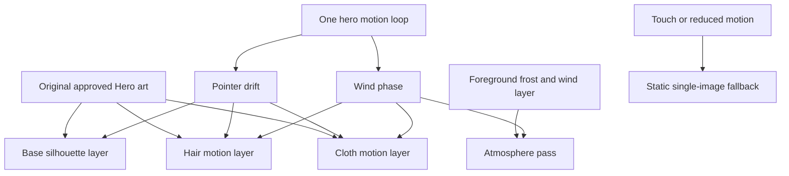

# CR-031: Layer-Separated Hero Wind Motion

## Approved decision

Boss approved a Hero upgrade that separates the current G-Maiden key art into authored motion
layers so the character can feel affected by wind instead of moving as one flat slab. The landing
must keep the current original art direction and convert it into a layered motion stack for base
silhouette, hair, cloth, and frost atmosphere.

## Classification

| Area | Complexity | Risk |
| --- | --- | --- |
| Hero media architecture and premium motion treatment | C-3 | HIGH |

This change stays inside the Hero media surface. It does not alter navigation, OAuth, GID,
entitlement, G-Maiden queue logic, Terms, privacy, or desktop app flows.

## Motion architecture

1. The Hero uses a DOM-separated render stack instead of one flat `<picture>` plane.
2. The same approved art source is reused across masked layers to preserve provenance and avoid new
   copyrighted inputs.
3. One animation loop controls pointer drift plus wind-phase variables so the layers stay
   choreographed as one motion system.
4. Hair and cloth move at different amplitudes and rotation responses so the scene reads as wind,
   not as a rigid poster translation.
5. Touch and `prefers-reduced-motion: reduce` collapse the Hero back to the static base image.
6. If the approved art is not cut into true authored parts, localized edge masks and atmosphere
   passes must be used instead of moving multiple whole-frame duplicates.

## Accessibility and performance contract

- No WebGL, Three.js, skeletal rigging, canvas particle engine, autoplay audio, or remote runtime generation.
- Motion remains decorative only; content, CTA, countdown, and navigation stay semantic HTML above the image.
- The Hero still honors `prefers-reduced-motion: reduce` and coarse-pointer static fallback behavior.
- The layered motion stack uses transform, opacity, filter, clip-path, and bounded glow only.
- The layer separation must not introduce horizontal overflow or scroll hijacking.

## Acceptance criteria

| ID | Criterion |
| --- | --- |
| AC-01 | Hero media is rendered as separate base, hair, cloth, and frost layers. |
| AC-02 | Hair and cloth move independently with different wind amplitudes and timing behavior. |
| AC-03 | One Hero animation loop controls pointer drift and wind-phase variables. |
| AC-04 | Touch and reduced-motion paths collapse to the static Hero composition without duplicate layer ghosting. |
| AC-05 | Landing typecheck, tests, build, visual QA, and CodeDoc Aligner pass. |
| AC-06 | Production deployment is browser-checked at desktop and mobile viewports. |

## Implementation record

- `landing/src/HeroMedia25D.tsx` now renders a stable base Hero plus localized hair/cloth edge
  passes and exports a deterministic wind sampler for tests.
- `landing/src/index.css` defines the localized edge masks, atmospheric highlights, and static
  mobile/reduced-motion fallback behavior.
- `landing/src/HeroMedia25D.test.ts` verifies the authored wind envelope and non-frozen phase evolution.

## Rollback

Revert the Hero media component back to the prior single-image 2.5D layer. No data migration,
backend change, or URL contract is involved.

## CHANGELOG

| Version | Date | Status | Summary | Commit Hash | Agent |
| --- | --- | --- | --- | --- | --- |
| 1.1.2b | 2026-07-22 | accepted | Normalized reader-facing queue references from GMAD to G-Maiden while preserving technical identifiers. | null | ATHER |
| 1.1.1b | 2026-07-21 | accepted | Refined CR-031 after owner UAT to require localized edge masks instead of transforming multiple whole-frame duplicate planes. | null | ATHER |
| 1.1.0b | 2026-07-21 | accepted | Added the approved implementation contract for layer-separated Hero wind motion. | null | ATHER |
| 1.0.0b | 2026-07-21 | accepted | Owner approved layered Hero wind motion for the landing page. | null | ATHER |
