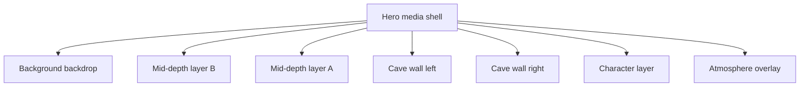
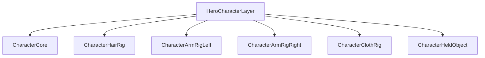

# CR-032: Landing Hero Scene-Depth and Character-Rig Decomposition

## Approved decision

Boss approved the next Hero foundation pass before a deeper animation pass. The landing Hero must be
re-authored as:

1. a scene-depth stack with separate cave layers
2. one dedicated character layer
3. a decomposed character component tree inside that single character layer

This pass is for structure first. It prepares the DOM/component hierarchy, layer order, masks, and
pivot ownership so later motion can target the correct pieces instead of trying to animate one flat
figure.

## Classification

| Area | Complexity | Risk |
| --- | --- | --- |
| Hero scene-depth architecture and character rig scaffold | C-3 | HIGH |

## Scene-depth stack

Required layer order from farthest to nearest:

1. `HeroBackgroundBackdrop`
2. `HeroMidDepthLayerB`
3. `HeroMidDepthLayerA`
4. `HeroCaveWallLeft`
5. `HeroCaveWallRight`
6. `HeroCharacterLayer`
7. `HeroAtmosphereOverlay`

## Character layer decomposition

The CM / G-Maiden figure remains one visual layer in the scene, but inside that character layer the
component tree must be decomposed for later rig-style motion authoring.

Required component groups:

- `CharacterCore`
  - `CharacterHead`
  - `CharacterFace`
  - `CharacterTorso`
  - `CharacterHipBase`
- `CharacterHairRig`
  - `HairFrontStrandA`
  - `HairFrontStrandB`
  - `HairSideLeft`
  - `HairSideRight`
  - `HairBackMass`
- `CharacterArmRigLeft`
  - `LeftUpperArm`
  - `LeftForearm`
  - `LeftHand`
- `CharacterArmRigRight`
  - `RightUpperArm`
  - `RightForearm`
  - `RightHand`
- `CharacterClothRig`
  - `ShoulderCapeLeft`
  - `ShoulderCapeRight`
  - `FrontClothPanelA`
  - `FrontClothPanelB`
  - `SideClothLeft`
  - `SideClothRight`
- `CharacterHeldObject`
  - `HeldCrystalCore`
  - `HeldCrystalRing`
  - `HeldCrystalGlow`

## Pivot and skeleton ownership

This pass does not claim full skeletal animation yet. It defines ownership and transform anchors so
the next animation pass can target stable pivots.

Required primary pivots:

- `root`
- `neck`
- `head`
- `shoulder_left`
- `elbow_left`
- `wrist_left`
- `shoulder_right`
- `elbow_right`
- `wrist_right`
- `chest`
- `pelvis`

Required secondary pivots:

- `hair_root_front`
- `hair_root_side_left`
- `hair_root_side_right`
- `cape_root_left`
- `cape_root_right`
- `object_anchor`

## Implementation contract

- The current approved Hero art may still be reused as the source image for masked subcomponents.
- This pass may use DOM masks and repeated art slices as authoring scaffolds, but it must expose the
  final layer/component order explicitly in code.
- This pass does **not** need to complete high-fidelity bone animation yet.
- This pass does **not** need to change CTA, copy, countdown, G-Maiden access, auth, or routing.
- Motion may remain bounded or minimal, but the DOM ownership must be ready for a later animation pass.

## Acceptance criteria

| ID | Criterion |
| --- | --- |
| AC-01 | Hero scene order is explicitly represented in code as separate scene components or layers. |
| AC-02 | The character layer is decomposed into core, hair, left arm, right arm, cloth, and held-object component groups. |
| AC-03 | The code exposes named pivot ownership for later rig-style motion work. |
| AC-04 | The current landing still builds and renders without horizontal overflow regressions. |
| AC-05 | Landing tests, build, and CodeDoc Aligner pass for the affected Hero files. |
| AC-06 | This pass makes no false claim that full skeletal animation is already complete. |

## Rollback

Revert the Hero back to the CR-031 localized-layer structure. No backend, data, or URL contract is
involved.

## CHANGELOG

| Version | Date | Status | Summary | Commit Hash | Agent |
| --- | --- | --- | --- | --- | --- |
| 1.0.1b | 2026-07-22 | accepted | Normalized reader-facing access references from GMAD to G-Maiden while preserving technical identifiers. | null | ATHER |
| 1.0.0b | 2026-07-21 | accepted | Owner approved scene-depth and character-rig decomposition as the next Hero foundation pass before a deeper animation pass. | null | ATHER |
