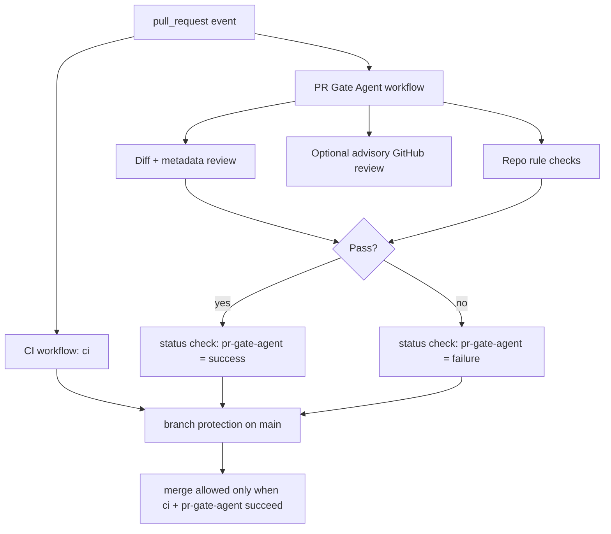

# CR-033: PR gate agent with required status review gate

## Decision requested

Introduce one automated PR gate agent for `main` that acts as the first-line merge gate for this
repository.

The gate must not rely on a human approval click from Boss for routine PR flow. Instead, it must:

1. evaluate every PR against explicit repository rules
2. publish one required status check named `pr-gate-agent`
3. optionally post a visible GitHub review (`APPROVE` or `REQUEST_CHANGES`)
4. work with branch protection so merge is blocked when the gate fails or cannot complete

## Root problem

As of **Thursday, July 23, 2026**, this repository can merge PRs without a true GitHub enforcement
gate beyond the existing `ci` workflow result.

Observed gaps:

- `main` has no active branch protection or ruleset
- no CODEOWNERS-based required reviewer path exists
- a bot review alone would be advisory only and would not block merge
- the current internal orchestration/reviewer logic is not wired into a GitHub-required check

## Classification

| Area | Complexity | Risk |
| --- | --- | --- |
| GitHub merge governance, automated review, and branch protection | C-3 | HIGH |

## Non-negotiable decision

The enforcement layer must be a **required status check**, not a cosmetic bot approval.

Why:

1. GitHub branch protection can require named checks
2. a required check fails closed when the agent is unavailable
3. a review comment is useful for humans, but not strong enough as the sole control
4. this preserves a clear separation between machine judgement and merge authority

## Proposed architecture



## Scope

### In scope

- new workflow: `.github/workflows/pr-gate-agent.yml`
- new gate script(s) under `tools/pr-gate-agent/`
- explicit pass/fail contract for PR review outcomes
- branch protection update on `main`
- optional GitHub review posting from the agent account
- fail-closed behavior when provider/auth/runtime is unavailable

### Out of scope

- replacing the existing `ci` workflow
- automatic merge-to-main on green
- rewriting product CI logic
- granting the agent broader repository admin powers than needed
- approving releases/tags automatically

## Required behavior

### 1. Trigger surface

The gate must run on:

- `pull_request`
- `pull_request_review`
- `pull_request.synchronize`
- `pull_request.ready_for_review`

### 2. Required output

The workflow must publish exactly one stable required check name:

```text
pr-gate-agent
```

Branch protection must require:

- `ci`
- `pr-gate-agent`

### 3. Review semantics

The agent must classify results into:

- `PASS`
  - status check = success
  - optional GitHub review = approve
- `FAIL`
  - status check = failure
  - optional GitHub review = request changes
- `INDETERMINATE`
  - status check = failure
  - no optimistic approval allowed

### 4. Minimum rule pack

The first shipped rule pack must verify:

1. PR is not draft when merge is expected
2. required repo checks are green
3. no unresolved merge conflict exists
4. changed files stay within a declared scope or provide explicit rationale
5. doc/code governance rules required by this repo are satisfied
6. the gate can explain failure in human-readable terms

### 5. Failure mode

The agent must fail closed when:

- provider auth is missing
- review runtime crashes
- model output is unparsable
- GitHub API posting fails after the gate logic finishes
- required evidence cannot be collected

## Security and authority boundary

The gate agent must use a dedicated machine identity or token with the smallest set of permissions
required to:

- read PR metadata and files
- create check runs or write workflow results
- optionally submit PR reviews

It must not require:

- tag/release creation
- secret administration
- workflow deletion
- repository transfer or owner-level administration

## Branch protection target state

After implementation is verified, `main` should enforce:

1. pull request required before merge
2. required checks: `ci`, `pr-gate-agent`
3. stale checks dismissed on new commits
4. direct push to `main` disallowed except explicit admin override

## Rollout plan

### Batch 1 — documentation and contract

- approve this CR
- define exact check name and failure semantics
- define token/identity boundary

### Batch 2 — workflow and local script

- add `pr-gate-agent` workflow
- add deterministic review script
- prove pass/fail/inconclusive handling

### Batch 3 — GitHub protection rollout

- enable branch protection on `main`
- require `ci` and `pr-gate-agent`
- validate merge block/unblock behavior on real PRs

## Implementation record

Approved by Boss on **Thursday, July 23, 2026**. The first implementation pass wires:

- `.github/workflows/pr-gate-agent.yml`
- `tools/pr-gate-agent/run.mjs`
- `tools/pr-gate-agent/rules.mjs`
- `tools/pr-gate-agent/rules.test.mjs`

This first pass is intentionally deterministic and runner-safe:

- required check output comes from the workflow/job named `pr-gate-agent`
- advisory GitHub review posting is optional and only activates when
  `PR_GATE_AGENT_REVIEW_TOKEN` exists
- doc-governance PRs additionally run `tools/doc-graph/ci-gate.mjs`
- merge authority enforcement on `main` still depends on branch protection rollout

## Acceptance criteria

- every PR to `main` gets a `pr-gate-agent` result
- merge is blocked when `pr-gate-agent` fails
- merge is blocked when `pr-gate-agent` cannot complete
- merge is allowed when both `ci` and `pr-gate-agent` succeed
- the gate leaves a readable reason trail for failure

## Open questions

1. Should the first version use a local script + GitHub Actions only, or call the internal orchestration reviewer chain directly?
2. Should the agent post `APPROVE` on pass, or remain status-check-only in v1?
3. Should a manual admin bypass be documented as a formal emergency path?

## Implementation note

No workflow, branch protection change, or GitHub automation should be implemented until this CR is
approved, because it changes repository merge authority and can block all contributors if miswired.

## Changelog

| Version | Date | Summary |
| --- | --- | --- |
| 0.2.0b | 2026-07-23 | Recorded approval and first deterministic implementation pass: workflow, rule engine, tests, and optional advisory review token path. |
| 0.1.0b | 2026-07-23 | Initial C-3/HIGH proposal for a required-status PR gate agent with optional advisory review output. |
