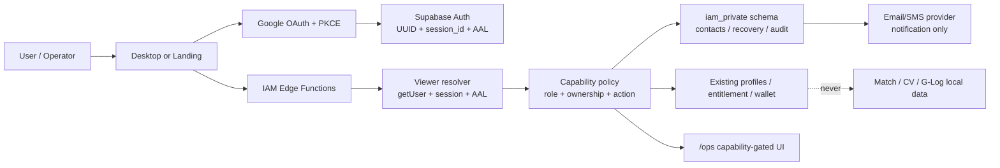

# CR-034 — GID IAM Production Completion

## 1. Decision requested

ขออนุมัติปิดช่องว่างระหว่างระบบ Accounts/GID ที่ใช้งานอยู่กับ IAM ระดับ production โดยทำเป็น
phased rollout ที่ fail closed และมีหลักฐานก่อน promotion ทุกระยะ

CR นี้ไม่ถือว่าคำว่า “มี Google login” เท่ากับ “IAM สมบูรณ์” ระบบจะถือว่า complete ต่อเมื่อ
authentication, authorization, session/device controls, MFA, recovery, security activity,
operator access, RLS และ production UAT ผ่าน exit criteria ใน §15 ครบทั้งหมด

> **Documentation-first gate:** Boss อนุมัติ Phase 1 และ Phase 2 เฉพาะ implementation ที่ review ได้ใน
> local repository แล้ว การ apply migration, deploy Edge Function, เปลี่ยน Supabase Auth/provider,
> สร้าง production secret, เปิด `/ops`, ส่ง email/SMS หรือเริ่ม Phase 3–6 ยังต้องผ่าน gate แยกและ
> external decisions ใน §16

## 2. Classification and success criteria

| Area | Classification | Risk |
| --- | --- | --- |
| Identity, authorization, sessions, MFA, recovery, PII, operator access | C-3 | HIGH |

### Success criteria

1. ผู้ใช้ปกติเข้าระบบผ่าน Google OAuth + PKCE เท่านั้น และ GID/Steam/email/phone ไม่สามารถใช้เป็น
   normal sign-in credential ได้
2. สิทธิ์ทุกอย่าง derive จาก server-owned UUID, role/capability, current session และ current
   entitlement; client payload หรือ `user_metadata` เพิ่มสิทธิ์ไม่ได้
3. Admin/owner และทุก security-sensitive action ต้องใช้ session ที่ยังมีอยู่จริงและ AAL2
4. ผู้ใช้จัดการ MFA, recovery contacts, sessions และ security activity ของตนเองได้
5. Recovery ใช้ปัจจัยอิสระอย่างน้อยสองอย่าง, ไม่ปล่อย product session ระหว่าง recovery และการผูก
   Google identity ใหม่มี hold 24 ชั่วโมงพร้อม alert/cancel path
6. `/ops` ใช้งานได้จริงสำหรับ owner/admin ตาม capability matrix และมี audit trail
7. pgTAP/RLS negative tests, Security Advisor, local CI-equivalent, controlled production UAT และ
   rollback drill ผ่าน โดยไม่มี known HIGH/CRITICAL finding

## 3. Current verified baseline and gaps

### Implemented baseline to preserve

- Google OAuth Authorization Code + PKCE ผ่าน loopback callback
- single-use/time-boxed OAuth `state` gate
- `skipBrowserRedirect: true` ให้ Rust เปิด authorization URL ใน system browser เองเท่านั้น;
  ไม่ได้ข้าม Google consent หรือ provider interaction
- `http://127.0.0.1:3000/auth/callback` เป็น production loopback redirect ของ packaged desktop
  ที่ลงทะเบียนแบบ exact allow-list ไม่ใช่ dev-only callback
- Supabase UUID เป็น internal identity; GID เป็น immutable human-facing identifier
- DPAPI storage สำหรับ access/refresh material บน packaged Windows app
- `profiles` own-row RLS และ column-level lock สำหรับ GID/generation/role/email/id
- roles `user`, `creator`, `admin`, `owner`; owner-only delegation backend
- server-authoritative Terms + entitlement + signed-download decision
- release build ล็อก native runtime จน entitlement decision ผ่าน

### Gaps that this CR owns

1. ไม่มี Account Security surface สำหรับ MFA, sessions, recovery และ security activity
2. ไม่มี policy กลางที่บังคับ AAL2 + live `session_id` สำหรับ privileged actions
3. ไม่มี authoritative capability matrix; controller หลายจุดตรวจ role แบบเฉพาะฟังก์ชัน
4. `/ops` frontend route ยังไม่พร้อมใช้จริง แม้ backend บางส่วนมีแล้ว
5. ไม่มี verified recovery-email/phone contract และไม่มี Google rebind implementation ที่ผ่าน
   provider capability proof
6. ไม่มี evidence ล่าสุดว่ารัน `sec001_identity_lock.sql` + Supabase Security Advisor แล้วปิด findings
7. เอกสาร CR-021/CR-022/SEC-001/CLAUDE.md บางส่วนมี lifecycle/status drift
8. ยังไม่มี authenticated production UAT ครบ same account, wrong account, revoke, role change,
   MFA, session revoke และ recovery
9. AAL2 is enforced on `gmad.batch.manage` while zero MFA factors exist and no enrollment surface
   ships, so admin/owner operations are unusable in production — ดูแผน T1/T6 ใน
   `docs/operations/EXEC-PLAN-CR-034-iam-remediation.md`

## 4. Non-negotiable boundaries

1. **Google remains the sole normal primary sign-in.** ห้ามเพิ่ม password, GID login, Steam login,
   email magic-link login หรือ phone login ลง normal sign-in UI
2. Recovery email และ phone เป็น recovery/MFA factors เท่านั้น ไม่ใช่ entitlement หรือ identity key
3. GID, Steam ID, installer, signed URL, client state และ JWT `user_metadata` ไม่ใช่ authorization truth
4. ห้ามเก็บ role/capability/recovery/security state ใน public profile หรือ client-writable auth metadata
5. ห้าม expose `service_role`/secret key ไปยัง browser, desktop webview หรือ logs
6. match state, CV detections และ G-Log ไม่เข้า IAM database และยัง local-only ตามเดิม
7. ห้ามสร้าง custom objects ใน `auth`, `storage` หรือ `realtime` schema; private IAM objects อยู่ใน
   non-exposed schema และใช้ explicit grants
8. ห้ามเขียน/ลบ `auth.sessions` หรือ `auth.identities` โดยตรง ถ้าไม่มี Supabase-supported API/proof
9. Recovery transaction ไม่สามารถเรียก product APIs, download, wallet, entitlement หรือ role actions ได้
10. Public profile และ `GID Shield` badge เป็นคนละ CR; CR นี้สร้างเฉพาะ private source-of-truth state

## 5. Requirements (EARS)

### IAM-REQ-01 — Canonical identity

- WHEN a Google OAuth exchange succeeds THEN the system SHALL resolve exactly one Supabase UUID and
  its immutable GID
- IF the authenticated UUID has no valid server-owned GID THEN the system SHALL fail closed and SHALL
  NOT accept a typed GID or Steam ID as repair evidence
- WHEN a Google identity change is requested THEN the system SHALL use the recovery/rebind process in
  IAM-REQ-07 and SHALL NOT merge accounts automatically by matching email alone

### IAM-REQ-02 — Authentication and session provenance

- WHEN a normal product session is created THEN the system SHALL require Google OAuth + PKCE and a
  valid single-use state transaction
- WHEN a protected Edge Function receives a bearer token THEN it SHALL resolve the caller with
  `auth.getUser()` or equivalent server verification; decoded client claims alone are insufficient
- WHEN a security-sensitive action is requested THEN the system SHALL verify the JWT `session_id`
  maps to an active server session before any side effect

### IAM-REQ-03 — Authorization

- WHEN any protected read or mutation runs THEN the system SHALL derive authorization from
  server-owned role/capability and resource ownership
- IF role/capability data exists only in `user_metadata`, client input or stale UI state THEN the
  system SHALL ignore it
- WHEN an owner delegates a role THEN the system SHALL reject self-change, owner-to-owner delegation,
  unknown roles and every non-owner caller, then write an immutable audit event

### IAM-REQ-04 — Session and device management

- WHEN a user opens Account Security THEN the system SHALL show the current session and only the
  device/session data the provider can prove authoritatively
- WHEN a user signs out the current session THEN local DPAPI material SHALL be deleted and the native
  runtime SHALL lock before remote sign-out completes
- WHEN a user selects “sign out other sessions” THEN the system SHALL use a Supabase-supported scope
  and SHALL NOT pretend that app-observed device rows alone revoke JWTs
- IF individual-session revoke is not supported by the current provider/API THEN the UI SHALL omit
  that action; a capability spike must close the gap before adding it

### IAM-REQ-05 — MFA and step-up

- WHEN a user enrolls TOTP or phone MFA THEN enrollment SHALL begin from a verified Google session and
  SHALL finish only after challenge + verify succeeds
- IF an account has an enrolled factor and the session is AAL1 while the next level is AAL2 THEN the
  app SHALL require challenge before unlocking account-gated product access
- WHEN admin/owner, factor removal, recovery-contact change, role delegation or Google rebind is
  requested THEN the system SHALL require a fresh AAL2 session
- WHEN MFA verification fails repeatedly THEN the system SHALL rate-limit, audit and fail closed

### IAM-REQ-06 — Private recovery contacts

- WHEN a recovery email or phone is added THEN the system SHALL verify ownership before marking it active
- WHEN contact data is persisted THEN it SHALL live in a non-exposed private schema, encrypted at the
  application boundary where feasible, with a normalized HMAC for lookup/uniqueness
- WHEN contact data is displayed THEN the system SHALL return only masked values
- WHEN contact data changes THEN the system SHALL require fresh AAL2 and notify every previously verified
  contact without exposing the new value

### IAM-REQ-07 — Account recovery and Google rebind

- WHEN recovery starts THEN the system SHALL return the same generic response for existing and unknown
  accounts and SHALL rate-limit by account, destination, network and device risk signal
- WHEN a recovery link is issued THEN only a hash of the one-time token SHALL be stored; it SHALL expire
  within 15 minutes and SHALL be consumed once
- WHEN the first recovery factor succeeds THEN the system SHALL create only an opaque, action-scoped
  recovery transaction, never a normal Supabase product session
- WHEN automated recovery continues THEN it SHALL require a second independent verified factor
- IF the account has no supported second factor THEN the system SHALL route to manual support review;
  phone alone, email alone, GID and Steam SHALL never recover or move the account
- WHEN a new Google identity is proposed THEN the system SHALL impose a 24-hour hold, alert all verified
  contacts/current sessions, provide a cancel path and apply the rebind only through a provider-supported
  operation proven in Phase 0

### IAM-REQ-08 — Security activity and notification

- WHEN login, logout, MFA, recovery, contact, session, entitlement, role or rebind security state changes
  THEN the server SHALL write an append-only structured security event
- WHEN a user reads security activity THEN the system SHALL return only their own redacted events
- WHEN an owner reads operator audit THEN the system SHALL require AAL2 and an owner/admin capability
- WHEN retention expires THEN the system SHALL purge or anonymize events according to an approved
  legal/privacy schedule without deleting evidence under an active investigation hold

### IAM-REQ-09 — Privacy and deletion

- WHEN IAM data is collected THEN the system SHALL minimize it to identity/security operation needs
- IF an IAM field is public-profile, analytics, match, CV or G-Log data THEN the system SHALL reject the
  cross-domain write
- WHEN account deletion is approved THEN the system SHALL revoke sessions first, remove recoverable PII,
  preserve only legally required pseudonymized audit evidence and prevent orphaned entitlement/wallet rows

### IAM-REQ-10 — Operations and production evidence

- WHEN `/ops` loads THEN unauthenticated/user/creator callers SHALL be denied; admin receives batch
  operations only; owner receives audited role delegation and approved recovery-review actions
- WHEN any production IAM change is promoted THEN migrations, Edge Functions, Auth settings, redirect
  allow-lists, secrets and the exact artifact SHA SHALL have recorded evidence
- IF any required UAT fixture, SMS/email provider, counsel decision or rollback proof is absent THEN the
  affected phase SHALL remain blocked and SHALL NOT be reported complete

## 6. Threat model

| Threat | Required control |
| --- | --- |
| Login CSRF, callback replay, PKCE mix-up | exact redirect allow-list, PKCE, single-use state, expiry, replay test |
| GID/role forgery through REST or metadata | server-owned fields, column grants, RLS, reject `user_metadata` authority |
| Stolen refresh token or copied WebView data | DPAPI, refresh rotation, runtime lock, remote session controls |
| Signed-out JWT reused before expiry | live `session_id` check on sensitive actions, bounded JWT lifetime |
| Owner/admin privilege escalation | centralized capability policy, AAL2, negative tests, audit |
| Recovery enumeration or token theft | generic response, hashed one-time token, short TTL, rate limit, two factors |
| SIM swap / recycled phone | phone never sufficient alone; alerts, delay, manual review |
| Email takeover | email never sufficient alone; action-scoped transaction, no product session |
| Malicious recovery support/operator | least privilege, dual evidence, immutable audit, no secret visibility |
| Direct database/API bypass | private schema, no client grants, RLS defense in depth, advisor/pgTAP tests |
| PII leakage through logs/UI | masking, allow-listed audit fields, no tokens/codes/contacts in logs |
| External provider outage | fail closed for security mutations; gameplay core remains local and unaffected |

## 7. Target architecture



### Central authorization seam

Every new IAM Edge Function must converge on one server-side authorization context:

```text
Authorization bearer
  -> verify issuer token / auth.getUser()
  -> read session_id + AAL
  -> verify live session for sensitive action
  -> load server-owned role/capabilities
  -> verify subject/resource ownership
  -> authorize action
  -> execute mutation
  -> append audit event
```

No endpoint may duplicate a weaker subset of this sequence.

## 8. Authorization policy

| Capability | user | creator | admin | owner | Required assurance |
| --- | ---: | ---: | ---: | ---: | --- |
| Read own security state | yes | yes | yes | yes | valid session |
| Manage own factors/contacts | yes | yes | yes | yes | fresh AAL2 for removal/change |
| Sign out own/other sessions | yes | yes | yes | yes | valid session; AAL2 for others |
| Closed Beta batch operations | no | no | yes | yes | fresh AAL2 |
| Read redacted operator audit | no | no | yes | yes | fresh AAL2 |
| Delegate user/creator/admin | no | no | no | yes | fresh AAL2 |
| Create/change owner | no | no | no | no | break-glass platform operation only |
| Approve Google rebind exception | no | no | no | owner + support evidence | fresh AAL2 + hold |

Capabilities are server constants or server-owned rows. They are not copied into client-writable metadata.

## 9. Private data model (conceptual; Phase 1/2 local migrations only)

All tables below belong in `iam_private`. Phase 0 confirms that keeping this schema outside the Data
API requires a direct Postgres connection from Edge Functions; the alternative is to expose the schema
to PostgREST while granting it only to `service_role`. The access-path decision is an explicit Phase 1
approval item and must not be selected silently.

| Object | Minimum data | Client access |
| --- | --- | --- |
| `security_events` | actor, subject, event type, result, redacted context, timestamp | own redacted view through Edge Function only |
| `recovery_contacts` | user, kind, encrypted value, normalized HMAC, verified_at, status | masked projection only |
| `recovery_transactions` | opaque id, subject, token hash, factor state, attempts, expiry, consumed_at | action-scoped Edge Function only |
| `google_rebind_requests` | subject, old/new provider refs hash, requested/execute/cancel times, status | safe state projection only |
| `device_registry` | user, provider session reference, user-chosen label, first/last seen, revoked marker | own projection only; never authority by itself |
| `notification_outbox` | template id, destination ref, retry state, provider receipt, no raw secret | service only |

Rules:

- RLS enabled as defense in depth; `anon`/`authenticated` receive no direct table grants
- no `SECURITY DEFINER` helper in an exposed schema
- if a private helper is necessary, pin `search_path = ''`, fully qualify objects, revoke `PUBLIC`
- Edge Functions may use service credentials only after authenticating and authorizing the caller
- migrations must explicitly account for Supabase Data API auto-exposure settings

## 10. MFA and recovery design decisions

### MFA

- TOTP is the required first implementation and mandatory for `admin`/`owner`
- Phone MFA is an additional factor for GID Shield/recovery; it is not phone login
- An account with enrolled MFA must reach AAL2 before account-gated runtime unlock
- factor removal and recovery-contact changes require fresh AAL2 and audit/notification

### Recovery quarantine

Supabase native TOTP/Phone MFA normally starts from an AAL1 session. A user who lost Google does not
automatically possess that session. Therefore Phase 0 must prove the recovery path; it must not solve
the gap by enabling normal email/phone login or by creating a custom long-lived JWT.

Recommended v1 automated recovery:

1. verified recovery-email one-time link creates an opaque recovery transaction
2. verified phone OTP supplies the second independent factor
3. transaction requests a new Google binding
4. 24-hour hold + multi-channel alerts + cancel path
5. provider-supported rebind operation or manual support action after hold

TOTP may replace phone in recovery only if the capability spike proves a supported verification path
that does not grant a normal product session. Otherwise TOTP remains login step-up and no-phone cases
use manual support review.

## 11. External dependencies and current platform constraints

1. Supabase TOTP MFA is available through enroll/challenge/verify and AAL claims
2. Phone MFA needs a supported SMS provider or Send SMS Hook and carries platform/provider cost
3. session lifetime/number controls depend on Supabase plan; default sessions are unlimited and indefinite
4. current Supabase auth schemas disallow custom objects/unsafe direct modification
5. Node.js 20 support has ended for current Supabase client libraries; verification runtime must use Node 22+
6. production phone/recovery requires approved consent, retention, support and incident-response wording

Official references checked 2026-08-23:

- https://supabase.com/docs/guides/auth/sessions
- https://supabase.com/docs/guides/auth/auth-mfa
- https://supabase.com/docs/guides/auth/auth-mfa/totp
- https://supabase.com/docs/guides/auth/auth-mfa/phone
- https://supabase.com/docs/guides/database/postgres/row-level-security
- https://supabase.com/changelog.md

## 12. Delivery plan

### Phase 0 — reconcile and prove capabilities

- reconcile CR-008/016/019/021/022, SEC-001, CLAUDE.md and AGENTS.md lifecycle/status claims
- read-only live inventory: project/plan, Auth settings, redirect allow-list, JWT TTL, hooks, providers,
  migrations, functions, RLS/grants, Security Advisor and deployed `/ops`
- prove supported session revoke semantics without direct `auth.sessions` mutation
- prove recovery transaction and Google rebind path on a non-production fixture
- select SMS/email provider, cost ceiling, retention and support escalation owner
- output exact DDL/API contract and rollback SQL; stop for Phase 0 approval if the provider proof changes
  this CR materially

#### Phase 0 evidence snapshot — 2026-08-23

Boss approved Phase 0 on 2026-08-23. The inspection remained read-only: no migration, provider setting,
secret, user, factor, session, recovery record, email/SMS send, deployment or production data was changed.

| Evidence area | FACT | Evidence tier |
| --- | --- | --- |
| Repository | Google OAuth PKCE uses the fixed loopback callback; desktop refresh material uses DPAPI; GID/role fields are server-owned and column-locked | source + existing tests |
| Existing authorization | Edge Functions call `auth.getUser()` and load `profiles.role`, but each function implements its own subset; no common session/AAL/capability resolver exists | source |
| Production Auth public settings | Google enabled; email auth enabled; phone disabled; anonymous sign-in disabled; signup globally allowed; SMS provider label is Twilio but phone auth/MFA capability is not enabled/proven | live public read-only endpoint |
| Repository Auth config | JWT expiry 3600 seconds and refresh rotation/reuse interval 10 seconds; TOTP and phone MFA disabled; no session timebox/inactivity timeout | committed config |
| Redirects/hooks/plan | Public settings do not disclose Site URL, redirect allow-list, hooks, plan or full MFA settings | blocked pending authenticated Management API/Dashboard read |
| Database | Linked project metadata reports Postgres 17.6.1.141, GoTrue v2.193.1 and PostgREST v14.5; exact remote migrations, grants, RLS and `auth.sessions` cannot be read with current credentials/tooling | local linked metadata; live verification blocked |
| Data API | Anonymous `profiles` read returned 401 | live unauthenticated negative probe |
| Edge Functions | Entitlement/download endpoints reject a publishable-key-only caller; this proves fail-closed unauth behavior only, not role/AAL/session correctness | live negative probe |
| Landing | `/` returned 200; `/ops` returned 404. Current `landing/vercel.json` has no rewrite and current root routing has no `OpsPage` branch | live + source |
| Policy tests | Deno IAM/GID/entitlement policy tests: 19 passed, 0 failed at Phase 0; **24 passed, 0 failed** on re-run 2026-08-28 after Phase 2 added cases | local test |
| Frontend tests | Phase 0 recorded both Vitest processes stalling before collection with no pass result. **Superseded 2026-08-28:** both suites run clean — desktop 268 passed (27 files, ~21 s), landing 14 passed (4 files, ~2.3 s), and `cargo test --locked` 291 passed / 0 failed / 5 ignored. The stall did not reproduce across nine consecutive runs, including under 11-of-12-core CPU saturation and during an active `cargo` compile; four candidate causes were tested and refuted. Treat a future stall as an environment condition to capture live, not a standing blocker | local test |

Material findings:

1. **Google-only is not enforced at the provider boundary.** The shipped UIs expose Google only, but
   production Auth reports email enabled and signup allowed. Phase 1 must block non-Google user creation
   with a `before-user-created` hook and inventory/remediate any existing non-Google identities. Standard
   Supabase email magic links must not implement recovery because they create a normal Auth session.
2. **CR-018 has regressed.** Its implemented/deployed claim no longer matches source or production:
   `/ops` is 404 and the SPA renders only Landing/PublicDemo. CR-018 must be reconciled before IAM-T19.
3. **Provider-grade session inventory is unavailable to the current client.** V1 Account Security will
   show the current verified session plus explicitly labelled app-observed devices. It will support
   provider `signOut` scopes, but omit individual-session revoke unless a later supported API spike proves it.
4. **A revoked refresh session can leave its short-lived JWT usable until expiry.** Every sensitive Edge
   Function therefore needs a live `session_id` existence check, while ordinary low-risk reads retain
   normal JWT validation to avoid unnecessary Auth/database coupling.
5. **A truly non-exposed `iam_private` schema is not reachable through `supabase-js` Data API.** The
   recommended path is a parameterized direct Postgres connection over the transaction pooler with a
   dedicated least-privilege runtime role. Exposing `iam_private` to PostgREST with `service_role`-only
   grants is the lower-complexity alternative and requires an explicit security trade-off approval.

#### Exact DDL contract — no migration applied

The implementation migration must create the following objects exactly; names, ownership, nullability,
checks, uniqueness and grants are part of the contract. Contact ciphertext uses AES-256-GCM in the Edge
Function with a versioned secret; lookup values use a separate HMAC-SHA-256 key. Raw contact values,
tokens, OTPs, TOTP secrets and Google subject identifiers are never stored in plaintext audit context.

| Object | Required columns and constraints | Required indexes/access |
| --- | --- | --- |
| `iam_private.security_events` | `id uuid PK`, nullable `actor_user_id`/`subject_user_id` FKs `auth.users ON DELETE SET NULL`, stable actor/subject HMACs, `event_type`, `outcome in (success,denied,failure)`, `source`, nullable `session_id`, allow-listed `context jsonb`, `occurred_at`, `retention_until`, `legal_hold` | indexes on subject/time, actor/time and type/time; runtime `SELECT,INSERT` only; no `UPDATE,DELETE` |
| `iam_private.recovery_contacts` | `id uuid PK`, `user_id FK auth.users ON DELETE CASCADE`, `kind in (email,phone)`, `ciphertext`, `nonce`, `key_version`, `normalized_hmac`, `display_mask`, `status in (pending,verified,revoked)`, consent/version timestamps | unique active `(user_id,kind,normalized_hmac)`; runtime CRUD only through authorized transaction code |
| `iam_private.recovery_transactions` | `id uuid PK`, `public_id_hash unique`, `subject_user_id FK auth.users ON DELETE CASCADE`, `state`, first/second factor types, one-time `token_hash`, attempts, expiry, consumed/canceled timestamps, created/updated timestamps | indexes on subject/state and expiry; no raw token; state transition check/trigger |
| `iam_private.google_rebind_requests` | `id uuid PK`, transaction/subject FKs, old/new Google subject HMACs, `status in (pending_hold,canceled,approved,applied,failed)`, requested/execute/cancel/applied timestamps, approver and redacted reason | unique one active request per subject; execute time must be at least 24 hours after request |
| `iam_private.device_registry` | `id uuid PK`, user FK, provider `session_id`, user label, platform/app version, first/last seen and revoked timestamps | unique `(user_id,session_id)`; informational only; never grants authority |
| `iam_private.notification_outbox` | `id uuid PK`, subject/contact refs, allow-listed template id, encrypted/minimal payload, status, attempts, next-attempt time, provider receipt hash, created/sent timestamps | indexes on pending schedule and subject/time; service runtime only |

Common DDL rules:

```sql
create schema if not exists iam_private;
revoke all on schema iam_private from public, anon, authenticated;
revoke all on all tables in schema iam_private from public, anon, authenticated;
alter default privileges in schema iam_private
  revoke all on tables from public, anon, authenticated;
```

- every table has RLS enabled as defense in depth and zero `anon`/`authenticated` policy
- no IAM object is created in `auth`, `storage`, `realtime` or `public`
- no `SECURITY DEFINER` routine is created in an exposed schema
- deployment asserts `iam_private` is absent from Data API exposed schemas when the recommended direct
  Postgres path is chosen
- runtime grants are applied only after the access-path decision and must be tested with the exact runtime role

#### Exact API contract — Phase 2 local routes implemented

Every authenticated endpoint first calls one shared `_shared/iam.ts` resolver that performs
`getUser` -> JWT `session_id`/AAL extraction -> live session check when required -> server role ->
ownership -> capability. Responses never include raw provider/contact/token values.

| Endpoint | Auth/assurance | Contract |
| --- | --- | --- |
| `iam-security-state` | valid Google session | `GET`; own current session, AAL/factor summary, masked contacts and labelled observed devices |
| `iam-session-action` | valid session; fresh AAL2 for `others` | `POST {scope: current|others}`; `current` maps only to Supabase `local`, `others` maps only to Supabase `others`; runtime locks locally first for current; no individual revoke in v1 |
| `iam-security-events` | valid session for own view; operator capability reserved for the later operator view | `GET` cursor pagination using the pair `before` + `before_id`; response returns `next_before` + `next_before_id`; Phase 2 returns own redacted events only |
| `iam-recovery-contact` | fresh AAL2 | `POST/DELETE`; enroll, verify or revoke one masked private contact; notification + audit required |
| `iam-recovery-start` | public, rate-limited | `POST`; identical generic response; returns no account existence or product session |
| `iam-recovery-verify` | opaque recovery transaction | `POST`; consumes one factor once, advances state only, never mints normal Auth JWT |
| `iam-google-rebind` | two-factor recovery or trusted fresh AAL2 | `POST`; creates/cancels/reads 24-hour hold; application is a separate privileged operation |
| `admin-gmad-controller` | admin/owner + fresh AAL2 + live session | existing behavior through common resolver; owner-only delegation; immutable security event |

The runtime error vocabulary is fixed: `401 invalid_session`, `403 step_up_required`,
`403 capability_denied`, `404 not_found`, `409 invalid_state`, `429 rate_limited`, and generic `503
security_dependency_unavailable`. Internal provider/SQL messages never cross the response boundary.

#### Exact test and rollback contract

Before Phase 1 promotion, add pgTAP tests proving schema absence from exposed grants, zero direct client
access, append-only events, state constraints, owner invariants and cross-user isolation. Add Deno tests
for every resolver failure step, AAL1/AAL2, missing/revoked `session_id`, metadata-role forgery and
redaction. IAM-T01–IAM-T22 remain the end-to-end matrix.

Rollback order is fixed:

1. disable new IAM routes and provider sends; cancel pending recovery/rebind work
2. restore existing `admin-gmad-controller` only if its previous role checks and fail-closed behavior pass
3. revoke runtime IAM grants and remove IAM runtime secrets/connection access
4. preserve `security_events`; export/purge other private rows only under retention approval
5. drop tables in dependency order: outbox -> rebind -> transactions -> contacts -> devices; retain or
   archive events, then drop `iam_private` only when empty
6. never enable email/phone/GID/Steam login, restore client-writable identity/role columns, or expose PII

#### Phase 0 exit decision

Phase 0 is complete but **material assumptions changed**, so Phase 1 remains blocked pending review of
this `0.2.0b` revision. Required decisions are:

1. approve the recommended direct-Postgres private-schema path, or explicitly accept the
   service-role-only exposed-schema alternative
2. authorize a read-only Supabase Dashboard/Management API session for exact plan, hooks, redirects,
   migrations, grants, Security Advisor and existing-provider inventory
3. approve disabling normal email auth/signup and using a separate action-scoped recovery mail channel
4. assign SMS/email provider, budget, retention and support owner before Phase 4 (these do not block a
   separately approved Phase 1–3)

### Phase 1 — authorization and private foundation

- add centralized authorization context/capability policy
- add private schema, security events and negative RLS/privilege tests
- migrate existing controller checks to the common seam without changing allowed behavior
- enforce live session check + AAL2 on privileged operations

#### Phase 1 local implementation record — 2026-08-24

สถานะ: **implemented locally; not deployed; not production-verified**

1. เพิ่ม common authorization resolver ที่ตรวจ verified Google identity, JWT `session_id`, live
   session, AAL2 และ server-owned role/capability ตามลำดับ พร้อม fail-closed error vocabulary
2. ย้าย `admin-gmad-controller` มาใช้ common resolver; `change_role` ต้อง owner capability และ action
   อื่นต้อง admin/owner capability; provider/SQL error detail ไม่ถูกส่งกลับ client
3. เพิ่ม migration สำหรับ `iam_private.security_events`, RLS, append-only runtime role และ
   `before-user-created` hook ที่อนุญาตเฉพาะ Google identities
4. ลดสิทธิ์ runtime ด้วย `SECURITY DEFINER` projections ที่ `search_path = ''`; runtime ไม่มี direct
   `SELECT` บน `auth.sessions` หรือ `public.profiles`
5. เพิ่ม local config ให้ email signup ปิด, Google-only hook เปิด และ admin controller ใช้ gateway
   JWT verification; production config ยังไม่ถูกเปลี่ยน
6. เพิ่ม Deno resolver/policy tests 9 รายการและ pgTAP 25 assertions; migration ถูกพิสูจน์กับ isolated
   Supabase PostgreSQL `17.6.1.141`

ข้อจำกัดก่อน live promotion:

- ต้องสร้าง credential ของ login role ที่เป็นสมาชิก `gmaiden_iam_runtime` แบบ out-of-band แล้วเก็บ
  connection string ใน `IAM_DATABASE_URL`; migration จงใจสร้าง runtime role เป็น `NOLOGIN`
- ต้องตั้ง `IAM_AUDIT_HMAC_KEY` และทบทวน `IAM_AUDIT_RETENTION_DAYS` (default 365 วัน) ใน secret store
- ต้อง inventory/remediate existing non-Google identities และยืนยัน hook/provider settings จาก
  Dashboard/Management API แบบ read-only ก่อน apply
- MFA ยัง disabled ดังนั้น AAL2 admin flow ยังไม่มี production UAT; ห้าม deploy controller change
  แบบแยกส่วนก่อน rollout plan ของ Phase 3 พร้อม

### Phase 2 — session and security activity

- add Account Security UI and safe session/device projection
- current sign-out, sign-out-others and runtime-lock behavior
- own redacted security activity and notification baseline
- prove stale/copied JWT behavior on sensitive actions

#### Phase 2 local implementation record — 2026-08-24

สถานะ: **implemented locally; not deployed; not production-verified**

1. เพิ่ม `iam_private.device_registry` พร้อม RLS, zero client grants และ bounded runtime projections
   สำหรับ app-observed devices; projection ติดป้าย informational และไม่ใช้เป็น authorization authority
2. เพิ่ม `iam_private.security_events_for_user` ที่คืนเฉพาะ activity ของ subject/actor ที่ตรงกับ caller
   และไม่คืน actor/subject ids, HMAC references, raw contacts หรือ token fields; เพิ่ม append-only
   `session_signout` event จาก session action
3. เพิ่ม Edge Functions `iam-security-state`, `iam-session-action` และ `iam-security-events` โดยทุก
   route ใช้ common IAM resolver; own state/activity ใช้ valid session และ AAL1 ได้ ส่วน `others`
   ต้อง fresh AAL2; provider sign-out ใช้ Supabase `local` เฉพาะ `current` และ `others` เฉพาะ
   `others` (ไม่ใช้ `global`)
4. เพิ่ม Account Security tab แสดง current provider session/AAL, provider factor summary, app-observed
   devices และ own redacted activity; recovery contacts แสดงว่า Phase 4 ยังไม่เปิดใช้งานและไม่อนุมาน
   ว่ามี contact อยู่
5. ย้าย current sign-out ให้ native `lock_gmad_runtime` สำเร็จก่อน provider action; หาก lock ยืนยันไม่ได้
   จะไม่เรียก sign-out ต่อ และการ sign-out ของ `others` จะไม่ปลดล็อก runtime ปัจจุบัน
6. เพิ่ม RED/GREEN tests สำหรับ scope mapping, redaction, cross-user projection, AAL boundary และ
   runtime-lock ordering; isolated PostgreSQL pgTAP Phase 2 ผ่าน 26/26 assertions; Deno shared tests
   ผ่าน 24/24 และ frontend security-session tests ผ่าน 3/3; `tsc`, ESLint และ Edge `deno check` ผ่าน
   Outbound security notifications are intentionally not enabled; the Phase 2 baseline is the
   append-only redacted activity surface and is handed to the provider/consent work in Phase 4.
7. Fixed the activity cursor to carry both ordering columns (`occurred_at` and event `id`); tied
   timestamps now have a pgTAP regression fixture and cannot disappear between pages.

ข้อจำกัดก่อน live promotion:

- migration/Edge Functions ยังไม่ถูก apply/deploy ไป Supabase project และยังไม่มี production
  `IAM_DATABASE_URL`/`IAM_AUDIT_HMAC_KEY` ที่ verified
- endpoint action/state ต้อง UAT กับ real current/other sessions เพื่อยืนยัน provider scope และ stale
  JWT behavior; local unit/pgTAP ไม่แทน production evidence
- TOTP/MFA enrollment, recovery contacts, notification sends, recovery/rebind และ `/ops` ยังคงเป็น
  Phase 3–5 และต้อง approval/ผู้ให้บริการ/กฎหมายแยกตาม §16

### Phase 3 — TOTP MFA

- enrollment, challenge, verify, list and guarded unenroll
- mandatory AAL2 for admin/owner and opted-in users
- recovery-contact and factor-change notifications
- desktop + landing state-machine tests

### Phase 4 — recovery email and phone MFA

- private contact enrollment/verification
- provider-backed phone MFA with consent, rate limits and abuse controls
- recovery quarantine transaction and generic anti-enumeration responses
- manual-support fallback for insufficient factors

### Phase 5 — Google rebind and `/ops`

- 24-hour pending rebind, alerts and cancel path
- supported provider rebind or audited manual support operation
- `/ops` route, role/capability UI, owner delegation and recovery-review surface
- no owner creation/deletion in the application UI

### Phase 6 — verification and rollout

- local CI-equivalent, pgTAP, advisor, CodeDoc and security review
- controlled non-production fixtures for every state
- production canary with real user/owner accounts and rollback drill
- evidence record, known issues, incident runbook and explicit promotion approval

## 13. Test and UAT matrix

| ID | Scenario | Expected result |
| --- | --- | --- |
| IAM-T01 | Google PKCE happy path | one UUID/GID; no token/code in UI/logs |
| IAM-T02 | wrong/missing/replayed OAuth state | no session; actionable retry |
| IAM-T03 | typed GID/Steam/signed URL/email/phone presented as login | rejected; no entitlement |
| IAM-T04 | client writes GID/generation/role/email or `user_metadata.role` | denied; no authority change |
| IAM-T05 | user/creator calls admin/owner actions | 403; no side effect; safe audit |
| IAM-T06 | stale or signed-out JWT calls privileged action | rejected by live session check |
| IAM-T07 | admin/owner at AAL1 calls privileged action | step-up required; no mutation |
| IAM-T08 | TOTP enroll/challenge/verify and replay | valid reaches AAL2; replay/invalid fails |
| IAM-T09 | factor/contact removal without fresh AAL2 | rejected; state unchanged |
| IAM-T10 | list own sessions/activity vs another user | own only; cross-user hidden/denied |
| IAM-T11 | sign out current / sign out others | intended sessions end; runtime locks appropriately |
| IAM-T12 | unknown/existing recovery address | indistinguishable response/timing envelope |
| IAM-T13 | expired/replayed recovery token | rejected; no normal session |
| IAM-T14 | email-only, phone-only, GID-only or Steam-only recovery | rejected / manual review |
| IAM-T15 | two-factor recovery + new Google | 24-hour pending; alerts; no early access |
| IAM-T16 | cancel pending rebind from trusted session/contact | request canceled; old binding retained |
| IAM-T17 | owner delegates allowed role | role changed once; immutable audit event |
| IAM-T18 | owner self-change or owner-to-owner delegation | rejected; owner invariant preserved |
| IAM-T19 | `/ops` unauth/user/creator/admin/owner matrix | exact capability matrix; no hidden bypass |
| IAM-T20 | Supabase/email/SMS outage | security mutation fails closed; local gameplay core unaffected |
| IAM-T21 | account deletion | sessions revoked first; PII removed; referential integrity preserved |
| IAM-T22 | logs/database dump inspection | no token, OTP, TOTP secret, raw recovery token or unmasked contact leakage |

## 14. Acceptance criteria

| ID | Criterion |
| --- | --- |
| AC-01 | Normal sign-in remains Google OAuth + PKCE only on desktop and landing. |
| AC-02 | Every privileged endpoint uses the common authorization context and checks role/capability, ownership, AAL2 and live session as specified. |
| AC-03 | TOTP enrollment/challenge/verify/unenroll works with negative/replay tests; admin/owner cannot remain active without required MFA policy. |
| AC-04 | Session UI never overclaims provider state; current/others sign-out behavior is verified with real sessions. |
| AC-05 | Recovery requires two independent factors, creates no product session, resists enumeration/replay and enforces the 24-hour Google rebind hold. |
| AC-06 | Recovery contacts and security activity stay private, masked, minimal and outside public/client-readable metadata. |
| AC-07 | `/ops` is deployed and passes the full unauth/user/creator/admin/owner capability matrix. |
| AC-08 | Role, recovery, contact, session and MFA security events are immutable, redacted and queryable only by the authorized subject/operator. |
| AC-09 | `sec001_identity_lock.sql`, all new pgTAP tests and Supabase Security Advisor show no unresolved HIGH/CRITICAL issue. |
| AC-10 | Full Rust/Vitest/ESLint/TypeScript/Tauri smoke gates and RWANG CodeDoc alignment pass on the exact release commit. |
| AC-11 | Controlled production UAT covers IAM-T01–IAM-T22 or records an evidenced not-applicable decision approved by owner/security reviewer. |
| AC-12 | Rollback drill succeeds without restoring a revoked role/session or deleting required audit evidence. |

## 15. Definition of Done and exit criteria

IAM may be reported **complete** only when all are true:

- this CR and any Phase 0 material revision are explicitly approved
- provider, privacy/consent, retention, support and incident-response decisions are recorded
- implementation and migration are on the approved branch/commit with no unrelated changes
- all acceptance criteria and IAM-T01–IAM-T22 pass
- `cargo test`
- `cargo clippy --all-targets -- -D warnings`
- `pnpm -C src exec eslint .`
- `pnpm -C src exec tsc --noEmit`
- `pnpm -C src test -- --run`
- unsigned Tauri `--no-bundle` smoke build
- Edge Function unit/integration tests and database pgTAP/RLS/privilege tests pass
- Supabase Security Advisor has no unresolved HIGH/CRITICAL finding in scope
- production Auth/provider settings and exact deployed Function/migration versions are verified
- real account + owner UAT and recovery/rebind timing evidence exist
- rollback and incident runbooks are exercised
- docs/index/ledger/CodeDoc alignment are updated
- no known regression or undocumented external gate remains

Local tests, repository merge or unauthenticated `401` probes alone do not satisfy production completion.

## 16. External decisions required before implementation phases

Boss must approve or supply:

1. SMS provider and monthly/incident cost ceiling (supported native options include Twilio,
   MessageBird and Vonage; no provider is selected by this CR)
2. outbound email provider/template authority for recovery/security alerts
3. legal/privacy retention periods for recovery contacts, security events and provider receipts
4. support owner and acceptable manual-recovery evidence/process
5. Supabase plan/features allowed for session controls and Phone MFA add-on
6. whether `GID Shield` is opt-in for users while mandatory for admin/owner (recommended), or mandatory
   for every account

## 17. Rollback strategy

1. Disable new IAM entry points and notification sends; keep normal Google sign-in and existing
   entitlement fail-closed behavior
2. Revoke new Edge Function routes/hooks/provider settings before reverting UI
3. Revert capability enforcement only to the previously verified role checks; never introduce an
   allow-all bypass
4. Preserve security/audit/recovery evidence; cancel pending recovery/rebind transactions
5. Remove private tables only after export/retention review and after no active transaction remains
6. Never rollback by restoring plaintext token storage, client-writable role/GID, email/phone login,
   direct auth-schema writes or public PII

## 18. Out of scope

- public profile and public `GID Shield` badge rendering
- passkeys while Supabase support remains beta
- SSO/SAML or enterprise organization tenancy
- GID/password, email/password, phone login, Steam login
- cross-account merge based on matching email
- sharing desktop refresh tokens with mobile/G-AnnStudio
- match/CV/G-Log cloud upload or analytics
- wallet/payment redesign

## 19. Approval gate

Approval recorded for **Phase 0**, **Phase 1 local/reviewable implementation**, and **Phase 2
local/reviewable implementation only**. It does not authorize production migration, Edge Function
deployment, Auth/provider changes, production secrets, SMS/email sends, recovery/rebind, `/ops`
promotion or Phase 3–6 implementation. Phase 2 must return with local verification and outstanding
live blockers before any production promotion decision.

> **Production state note (2026-08-28).** Migrations `20260823221844` and `20260824024920` are
> applied on production, and Edge Functions `iam-security-state`, `iam-security-events`,
> `iam-session-action` plus `admin-gmad-controller` v4 are deployed (2026-08-27). This is ahead
> of the approval recorded in this section. Production promotion of the remaining phases still
> requires an explicit gate. `iam_private.security_events` is empty, so no production UAT
> evidence exists yet — see `docs/operations/EXEC-PLAN-CR-034-iam-remediation.md`.

## CHANGELOG

| Version | Date | Status | Summary | Commit Hash | Agent |
| --- | --- | --- | --- | --- | --- |
| 0.1.1b | 2026-08-23 | draft | Clarified that `skipBrowserRedirect` delegates system-browser launch without bypassing consent and that the fixed loopback callback is the packaged-desktop production pattern, resolving RWANG false-positive ambiguity. | null | ATHER |
| 0.1.0b | 2026-08-23 | candidate | Initial C-3/HIGH IAM completion contract covering identity, authorization, sessions, MFA, recovery, audit, operator access, testing and rollback. | null | ATHER |
| 0.2.0b | 2026-08-23 | draft | Recorded approved Phase 0 read-only evidence, material production/source drift, exact DDL/API/test/rollback contracts and the private-schema access decision required before Phase 1. | null | ATHER |
| 0.3.0b | 2026-08-24 | draft | Recorded approved Phase 1 local IAM foundation: common capability resolver, live-session/AAL2 enforcement, private append-only audit, Google-only signup hook, least-privilege runtime projections and local test evidence; production promotion remains blocked. | null | ATHER |
| 0.4.0b | 2026-08-24 | draft | Recorded Boss approval and local Phase 2 implementation: private device/activity projections, scoped session actions, Account Security UI, redaction/cross-user tests and native runtime-lock ordering; deployment and live session UAT remain blocked. | null | ATHER |
| 0.4.1b | 2026-08-24 | draft | Clarified that Phase 2 exposes own activity only, keeps operator audit for a later phase, and treats append-only activity as the notification baseline without outbound sends. | null | ATHER |
| 0.4.2b | 2026-08-24 | draft | Fixed Phase 2 activity pagination to use a composite timestamp plus event-id cursor and added a tied-timestamp pgTAP regression. | null | ATHER |
| 0.4.3b | 2026-08-24 | draft | Made the current-to-local and others-to-others provider sign-out mapping explicit for CodeDoc review. | null | ATHER |
| 0.4.4b | 2026-08-28 | draft | Superseded the Phase 0 frontend-test blocker: desktop, landing, Rust and Deno suites all run clean, and the recorded Vitest stall did not reproduce across nine runs with four candidate causes refuted. Remaining Phase 0 status/lifecycle drift is owned by EXEC-PLAN CR-034 task T2. | null | Claude (Opus 5) |
| 0.5.0b | 2026-08-28 | draft | Recorded verified production deployment state, the AAL2/no-MFA lockout, and the partial IAM coverage of the entitlement path. | null | Codex (lane A1) |
