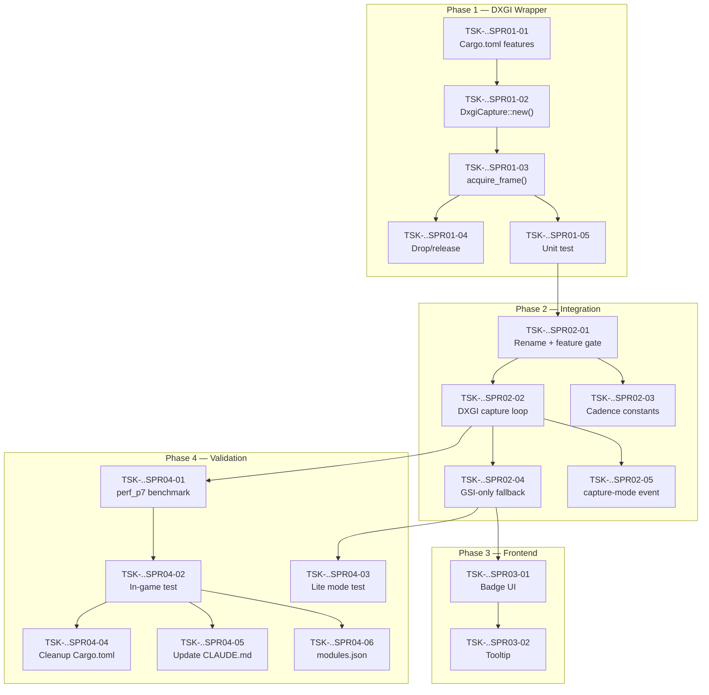

# IMPLEMENTATION PLAN: DXGI Desktop Duplication Migration

## 1. Overview

เปลี่ยน screen capture backend ของ G-Maiden จาก **WGC (Windows Graphics Capture)** เป็น **DXGI Desktop Duplication** เพื่อแก้ปัญหา CPU 8% + frame time 1,300–2,300ms ที่พบจาก in-game test (evidence: `error.log` 2026-06-28, 1,294 SLOW frame entries)

ดู rationale เต็มที่ [[ADR-13-dxgi-capture-migration|ADR-13]]

## 2. Source and Target

| Source | Target | Scope |
|---|---|---|
| [`src-tauri/src/capture.rs`](file:///g:/G-Maiden/src-tauri/src/capture.rs) (WGC via `windows-capture` crate) | [`src-tauri/src/dxgi.rs`](file:///g:/G-Maiden/src-tauri/src/dxgi.rs) (new) + `capture.rs` (refactored) | 1 new file (~250 LOC), 1 major refactor, 3 minor edits |
| `windows-capture` dependency in `Cargo.toml` | `windows` crate (DXGI + D3D11 features) | dependency swap |
| WGC `GraphicsCaptureApiHandler` trait | Custom `DxgiCapture` struct with `acquire_frame()` | API change |

## 3. Rollback Plan

- `capture.rs` เก่าถูก rename เป็น [`capture_wgc.rs`](file:///g:/G-Maiden/src-tauri/src/capture_wgc.rs) (ไม่ลบ)
- Feature flag `--features wgc` สลับกลับได้ถ้า DXGI มีปัญหา
- `windows-capture` crate ยังอยู่ใน `Cargo.toml` ใน `[features]` จนกว่า DXGI ผ่าน validation

## 4. Risks

| Risk | Impact | Mitigation |
|---|---|---|
| DXGI ไม่รองรับ exclusive fullscreen | CV pipeline หยุด | GSI-only fallback (Lite mode) ทำงานทันที |
| Multi-monitor ตรวจจอผิด | Capture ผิดจอ | Auto-detect Dota window position → เลือก output index |
| DXGI acquire timeout ทำให้ thread ค้าง | CPU spike | Timeout 100ms + retry backoff |
| `windows` crate API เปลี่ยนใน future version | Build break | Pin version ใน Cargo.toml |

---

## ⚙️ Conventions

| Symbol | Meaning |
|--------|---------|
| `🔓 LOCK` | Dependency blocked — ต้องรอ task ที่ระบุเสร็จก่อน |
| `🔀 PARALLEL` | สามารถทำพร้อมกันได้กับ task อื่นในกลุ่มเดียวกัน |
| `⛓️ SERIAL` | ต้องทำลำดับ ไม่สามารถ parallel ได้ |

### Definition of Done (DoD) — ทุก Task

```
■ Acceptance Criteria
  [_] Code compiles: `cargo check` pass
  [_] ไม่ break existing tests: `cargo test` pass
■ Success Criteria
  [_] Code complete — ไม่มี TODO/FIXME
  [_] `cargo clippy` — no warnings
■ Exit Criteria
  [_] Regression free — modules อื่นยังทำงานปกติ
  [_] Changed lines trace to task scope only
```

---

## Phase 1 — DXGI Capture Wrapper

> **Goal**: สร้าง `dxgi.rs` ที่ acquire frame จาก Desktop Duplication API ได้ ส่ง BGRA buffer ออกมา
> **Sprint**: S1 (1–2 days)

### [Epic EP01] DXGI Low-Level Wrapper

| Task ID | Task | Pt | Mode | Dependency | Target File | Details |
|---------|------|----|------|------------|-------------|---------|
| **TSK-GMMP01P01EP01SPR01-01** | เพิ่ม `windows` crate features ใน Cargo.toml | 1 | ⛓️ SERIAL | — | `src-tauri/Cargo.toml` | เพิ่ม features: `Win32_Graphics_Dxgi`, `Win32_Graphics_Direct3D11`, `Win32_Graphics_Dxgi_Common`, `Win32_Security` ใน `[dependencies.windows]` |
| **TSK-GMMP01P01EP01SPR01-02** | สร้าง `DxgiCapture::new()` — init D3D11 device + output duplication | 5 | ⛓️ SERIAL | SPR01-01 | `src-tauri/src/dxgi.rs` | สร้าง `D3D11CreateDevice()` → get `IDXGIDevice` → `IDXGIAdapter` → `IDXGIOutput` → `IDXGIOutput1::DuplicateOutput()`. Store `IDXGIOutputDuplication` + staging `ID3D11Texture2D`. รับ `monitor_index: u32` เป็น parameter. Return `Result<DxgiCapture, String>` |
| **TSK-GMMP01P01EP01SPR01-03** | สร้าง `DxgiCapture::acquire_frame()` → `Option<(Vec<u8>, u32, u32)>` | 5 | ⛓️ SERIAL | SPR01-02 | `src-tauri/src/dxgi.rs` | เรียก `AcquireNextFrame(timeout_ms=100)` → copy texture to staging → `Map()` → copy BGRA bytes ออกมา → `Unmap()` → `ReleaseFrame()`. Return `None` ถ้า timeout (ไม่มี frame ใหม่). Return `Some((bgra_bytes, width, height))` |
| **TSK-GMMP01P01EP01SPR01-04** | สร้าง `DxgiCapture::release()` — cleanup resources | 1 | ⛓️ SERIAL | SPR01-03 | `src-tauri/src/dxgi.rs` | Implement `Drop` trait: release duplication, device, staging texture. ป้องกัน resource leak |
| **TSK-GMMP01P01EP01SPR01-05** | Unit test: capture 10 frames, assert BGRA format + dimensions | 3 | ⛓️ SERIAL | SPR01-03 | `src-tauri/src/dxgi.rs` (`#[cfg(test)]`) | Test ใน `#[test] fn capture_10_frames()`: init DxgiCapture → loop 10 ครั้ง acquire_frame → assert width > 0, height > 0, buffer.len() == w*h*4, first 4 bytes ไม่ใช่ 0 ทั้งหมด |

#### Sub-Tasks สำหรับ TSK-GMMP01P01EP01SPR01-02 (LLM-ready breakdown)

| Sub-Task ID | Task | Details |
|---|---|---|
| **S-TSK-GMMP01P01EP01SPR01-02a** | สร้าง `create_d3d11_device()` helper function | เรียก `D3D11CreateDevice(None, D3D_DRIVER_TYPE_HARDWARE, None, D3D11_CREATE_DEVICE_BGRA_SUPPORT, &[D3D_FEATURE_LEVEL_11_0], D3D11_SDK_VERSION)`. Return `(ID3D11Device, ID3D11DeviceContext)`. ใช้ `unsafe` block. Handle error ด้วย `.map_err()` |
| **S-TSK-GMMP01P01EP01SPR01-02b** | สร้าง `get_dxgi_output(device, monitor_index)` helper | จาก `ID3D11Device` → `QueryInterface::<IDXGIDevice>()` → `GetAdapter()` → `EnumOutputs(monitor_index)` → cast เป็น `IDXGIOutput1`. Return `Result<IDXGIOutput1, String>` |
| **S-TSK-GMMP01P01EP01SPR01-02c** | สร้าง `create_staging_texture(device, width, height)` helper | สร้าง `D3D11_TEXTURE2D_DESC` ด้วย `Usage = D3D11_USAGE_STAGING`, `CPUAccessFlags = D3D11_CPU_ACCESS_READ`, `Format = DXGI_FORMAT_B8G8R8A8_UNORM`, `BindFlags = 0`. Return `ID3D11Texture2D` |
| **S-TSK-GMMP01P01EP01SPR01-02d** | ประกอบทุก helper เข้า `DxgiCapture::new()` | Struct fields: `duplication: IDXGIOutputDuplication`, `device: ID3D11Device`, `context: ID3D11DeviceContext`, `staging: ID3D11Texture2D`, `width: u32`, `height: u32` |

#### Sub-Tasks สำหรับ TSK-GMMP01P01EP01SPR01-03 (LLM-ready breakdown)

| Sub-Task ID | Task | Details |
|---|---|---|
| **S-TSK-GMMP01P01EP01SPR01-03a** | เขียน `acquire_frame()` — AcquireNextFrame + error handling | `self.duplication.AcquireNextFrame(100)` → ได้ `(DXGI_OUTDUPL_FRAME_INFO, IDXGIResource)`. ถ้า `DXGI_ERROR_WAIT_TIMEOUT` → return `None`. ถ้า error อื่น → `eprintln!` + return `None` |
| **S-TSK-GMMP01P01EP01SPR01-03b** | เขียน texture copy logic | `resource.cast::<ID3D11Texture2D>()` → `self.context.CopyResource(&self.staging, &texture)` — copy GPU texture ไป staging (CPU-readable) |
| **S-TSK-GMMP01P01EP01SPR01-03c** | เขียน Map → copy bytes → Unmap | `self.context.Map(&self.staging, 0, D3D11_MAP_READ, 0)` → `mapped.pData` as `*const u8` → copy `height * mapped.RowPitch` bytes ไป `Vec<u8>` (ต้อง handle stride/padding: copy row-by-row ถ้า `RowPitch != width * 4`) → `self.context.Unmap(&self.staging, 0)` → `self.duplication.ReleaseFrame()` |

#### DoD — Phase 1
```
■ Acceptance
  [_] `cargo check` pass (dxgi.rs compiles)
  [_] `cargo test capture_10_frames` pass — 10 frames captured
■ Success
  [_] Frame dimensions match primary monitor resolution
  [_] BGRA bytes non-zero (not blank frames)
  [_] No resource leak (Drop implemented)
■ Exit
  [_] `cargo clippy` clean
  [_] Existing tests still pass
```

---

## Phase 2 — Integration กับ Capture Pipeline

> **Goal**: แทนที่ WGC ด้วย DXGI ใน capture.rs, เพิ่ม GSI-only fallback
> **Sprint**: S2 (1 day)

### [Epic EP02] Capture Pipeline Refactor

| Task ID | Task | Pt | Mode | Dependency | Target File | Details |
|---------|------|----|------|------------|-------------|---------|
| **TSK-GMMP01P02EP02SPR02-01** | Rename `capture.rs` → `capture_wgc.rs`, สร้าง `capture.rs` ใหม่ | 2 | ⛓️ SERIAL | Phase 1 done | `src-tauri/src/` | Move `capture.rs` → `capture_wgc.rs`. สร้าง `capture.rs` ใหม่ที่ re-export `pub fn start(app)`. Feature-gate: `#[cfg(feature = "wgc")] mod capture_wgc;` |
| **TSK-GMMP01P02EP02SPR02-02** | เขียน DXGI capture loop ใน `capture.rs` | 8 | ⛓️ SERIAL | SPR02-01 | `src-tauri/src/capture.rs` | สร้าง `fn dxgi_loop(app, region)` ที่วนทำ: `dxgi.acquire_frame()` → crop minimap region → `Frame::from_bgra()` → prefilter → detect → sentry → motion → signal → emit events. ใช้ `std::thread::sleep()` สำหรับ cadence control แทน WGC callback |
| **TSK-GMMP01P02EP02SPR02-03** | ปรับ cadence constants | 1 | 🔀 PARALLEL | SPR02-01 | `src-tauri/src/capture.rs` | `NORMAL_INTERVAL_MS: 250` (4 Hz), `ALERT_INTERVAL_MS: 125` (8 Hz), `THROTTLE_INTERVAL_MS: 500` (2 Hz). ใช้ governor `cpu_throttle()` flag เลือก interval |
| **TSK-GMMP01P02EP02SPR02-04** | เพิ่ม GSI-only fallback (Lite mode) | 3 | ⛓️ SERIAL | SPR02-02 | `src-tauri/src/capture.rs` | ใน `start()`: try `DxgiCapture::new()` → ถ้า fail → `app.emit("capture-mode", "lite")` + log warning + return (ไม่ spawn thread). Frontend จะรับ event นี้แสดง badge |
| **TSK-GMMP01P02EP02SPR02-05** | Emit `capture-mode` event เมื่อ DXGI start สำเร็จ | 1 | 🔀 PARALLEL | SPR02-02 | `src-tauri/src/capture.rs` | `app.emit("capture-mode", "dxgi")` ตอน init สำเร็จ |

#### Sub-Tasks สำหรับ TSK-GMMP01P02EP02SPR02-02 (LLM-ready breakdown)

| Sub-Task ID | Task | Details |
|---|---|---|
| **S-TSK-GMMP01P02EP02SPR02-02a** | สร้าง `CaptureState` struct (แทน `MinimapCapture`) | Fields เหมือน `MinimapCapture` เดิม: `app`, `region`, `icon`, `detector`, `sentry`, `motion`, `signal`, `start`, `last_processed`, `last_emit`, `last_calib`. ไม่ implement `GraphicsCaptureApiHandler` trait แล้ว — เป็น plain struct |
| **S-TSK-GMMP01P02EP02SPR02-02b** | Extract `fn process_frame(state, bgra, w, h)` | ย้าย logic จาก `on_frame_arrived()` L140-265 เดิมมาเป็น standalone function. รับ `&mut CaptureState` + raw BGRA bytes. Logic: gate `in_game()` → calibration feed → adaptive throttle → crop → prefilter → detect → sentry → motion → signal → emit. **ไม่ต้องเปลี่ยน logic ข้างใน — ย้ายมาเท่าที่เดิม** |
| **S-TSK-GMMP01P02EP02SPR02-02c** | เขียน `fn dxgi_loop(app, region)` main loop | `let mut dxgi = DxgiCapture::new(0)?` → `let mut state = CaptureState::new(app, region)` → `loop { match dxgi.acquire_frame() { Some((buf, w, h)) => process_frame(&mut state, &buf, w, h), None => {} } sleep(interval) }`. Interval เลือกจาก `suspicious` flag + `cpu_throttle()` |
| **S-TSK-GMMP01P02EP02SPR02-02d** | DXGI frame crop: ตัดเฉพาะ minimap region ก่อนส่งเข้า pipeline | จาก full-screen BGRA buffer → crop ตาม `MinimapRegion { x, y, side }`. Copy row-by-row: `for row in 0..side { src[((y+row)*stride + x*4)..((y+row)*stride + (x+side)*4)] → dst }`. สร้าง `fn crop_bgra(buf, full_w, region) -> Vec<u8>` |

#### DoD — Phase 2
```
■ Acceptance
  [_] `cargo check` pass
  [_] `capture::start()` launches DXGI loop (log: "[capture] DXGI capture started")
  [_] Fallback: ถ้า DXGI fail → log "[capture] DXGI unavailable, running in Lite mode"
■ Success
  [_] `minimap-cv` events emit ที่ ~4 Hz (ตรวจจาก calibration mode)
  [_] `capture-mode` event ส่งไป frontend
  [_] Existing CV pipeline (prefilter/detect/sentry/motion/signal) ทำงานเหมือนเดิม
■ Exit
  [_] `cargo clippy` clean
  [_] `cargo test` ทั้งหมด pass
```

---

## Phase 3 — Frontend Capture Mode Badge

> **Goal**: UI แสดง capture mode (DXGI/Lite/WGC) ให้ user เห็น
> **Sprint**: S3 (0.5 day)

### [Epic EP03] Capture Mode UI

| Task ID | Task | Pt | Mode | Dependency | Target File | Details |
|---------|------|----|------|------------|-------------|---------|
| **TSK-GMMP01P03EP03SPR03-01** | Listen `capture-mode` event ใน App.tsx | 2 | ⛓️ SERIAL | Phase 2 done | `src/src/App.tsx` | เพิ่ม `listen<string>("capture-mode")` → เก็บใน state. แสดง badge ใน System card ของ control panel: "DXGI" (เขียว) / "Lite" (เหลือง) / "WGC" (แดง) |
| **TSK-GMMP01P03EP03SPR03-02** | Lite mode tooltip อธิบาย limitation | 1 | 🔀 PARALLEL | SPR03-01 | `src/src/App.tsx` | Hover badge "Lite" → tooltip: "Minimap detection ปิดอยู่ — Gank prediction ใช้ GSI data เท่านั้น ใช้ borderless fullscreen เพื่อเปิด full detection" |

#### DoD — Phase 3
```
■ Acceptance
  [_] Badge แสดงถูกต้องตาม capture mode
  [_] Tooltip อ่านได้ชัด
■ Success
  [_] `pnpm -C src exec tsc --noEmit` pass
■ Exit
  [_] ไม่ break UI อื่น
```

---

## Phase 4 — Validation & Cleanup

> **Goal**: พิสูจน์ว่า CPU ≤ 2.5%, frame time <50ms, gank detection ยังทำงาน
> **Sprint**: S4 (1–2 days)

### [Epic EP04] Performance Validation

| Task ID | Task | Pt | Mode | Dependency | Target File | Details |
|---------|------|----|------|------------|-------------|---------|
| **TSK-GMMP01P04EP04SPR04-01** | Run `perf_p7` benchmark: assert CPU ≤ 2.5%, RAM ≤ 400 MB | 3 | ⛓️ SERIAL | Phase 2 done | `tests/perf/src/bin/perf_p7.rs` | `cargo run --release --bin perf_p7` ขณะรัน Dota 2 borderless + G-Maiden. ต้อง PASS ทั้ง RAM + CPU gate |
| **TSK-GMMP01P04EP04SPR04-02** | In-game test: Dota 2 borderless + G-Maiden + OBS | 5 | ⛓️ SERIAL | SPR04-01 | manual test | เล่น 1 match เต็ม. ตรวจ: (1) error.log ไม่มี SLOW frame, (2) gank alert trigger ภายใน 3s ของ hero หาย, (3) OBS stream ไม่กระตุก, (4) FPS ไม่ตก > 5 จากปกติ |
| **TSK-GMMP01P04EP04SPR04-03** | Verify GSI-only fallback ทำงาน | 2 | 🔀 PARALLEL | Phase 2 done | manual test | รัน G-Maiden ขณะ Dota exclusive fullscreen → ตรวจว่า badge แสดง "Lite" + announcer/overlay/advice ยังทำงาน + ไม่ crash |
| **TSK-GMMP01P04EP04SPR04-04** | Cleanup: ลบ `windows-capture` จาก default dependencies | 1 | ⛓️ SERIAL | SPR04-02 pass | `src-tauri/Cargo.toml` | ย้าย `windows-capture` ไป `[features] wgc = ["dep:windows-capture"]`. Default ใช้ DXGI เท่านั้น |
| **TSK-GMMP01P04EP04SPR04-05** | Update CLAUDE.md gotcha #2 | 1 | 🔀 PARALLEL | SPR04-02 pass | `CLAUDE.md` | เปลี่ยน "Load audio via bytes" section → เพิ่มข้อ: capture ใช้ DXGI Desktop Duplication (ไม่ใช่ WGC). ต้อง borderless fullscreen. Lite mode ถ้า exclusive fullscreen |
| **TSK-GMMP01P04EP04SPR04-06** | Update modules.json version | 1 | 🔀 PARALLEL | SPR04-02 pass | `modules.json` | Bump capture module version |

#### DoD — Phase 4 (Final)
```
■ Acceptance
  [_] perf_p7 PASS — CPU ≤ 2.5%, RAM ≤ 400 MB
  [_] In-game test: 0 SLOW frames in error.log
  [_] In-game test: gank alert fires within 3s
■ Success
  [_] OBS stream smooth ขณะ G-Maiden + Dota 2
  [_] GSI-only fallback ทำงานถูกต้อง
  [_] CLAUDE.md + modules.json updated
■ Exit
  [_] `cargo build --release` สำเร็จ
  [_] `cargo test` ทั้งหมด pass
  [_] `windows-capture` ไม่อยู่ใน default features
```

---

## Dependency Graph



---

## Sprint Planning Summary

| Sprint | Phase | Tasks | Total Points | Duration Est. | Parallel Slots |
|--------|-------|-------|-------------|--------------|----------------|
| **S1** | DXGI Wrapper | TSK-..SPR01-01 – SPR01-05 | 15 | 1–2 days | serial (build chain) |
| **S2** | Integration | TSK-..SPR02-01 – SPR02-05 | 15 | 1 day | 2 parallel after SPR02-01 |
| **S3** | Frontend | TSK-..SPR03-01 – SPR03-02 | 3 | 0.5 day | 1 parallel |
| **S4** | Validation | TSK-..SPR04-01 – SPR04-06 | 13 | 1–2 days | 3 parallel after SPR04-02 |
| | | **18 tasks + 7 sub-tasks** | **46 pts** | **~3–5 days** | |

---

## Agent Assignment Guide

เมื่อ assign task ให้ local LLM (Ollama/Claude CLI) ให้ระบุ:

```yaml
task_id: TSK-GMMP01P01EP01SPR01-02
target_file: "src-tauri/src/dxgi.rs"
reference_files:
  - "src-tauri/src/capture.rs"          # existing WGC impl for pattern reference
  - "src-tauri/src/cv/prefilter.rs"     # downstream consumer of BGRA frames
  - "src-tauri/Cargo.toml"              # dependency management
dependencies:
  - TSK-GMMP01P01EP01SPR01-01 (must be DONE)
sub_tasks:
  - S-TSK-GMMP01P01EP01SPR01-02a  # create_d3d11_device()
  - S-TSK-GMMP01P01EP01SPR01-02b  # get_dxgi_output()
  - S-TSK-GMMP01P01EP01SPR01-02c  # create_staging_texture()
  - S-TSK-GMMP01P01EP01SPR01-02d  # assemble DxgiCapture::new()
dod_gates: [acceptance, success, exit]
context: |
  G-Maiden ใช้ Tauri v2 + Rust. Capture จะถูกเรียกจาก dedicated thread.
  Output ต้องเป็น BGRA bytes (ตรงกับ cv::Frame::from_bgra).
  ดู capture.rs เดิมเป็น pattern ของ error handling + logging style.
  ใช้ `unsafe` blocks สำหรับ Windows API calls.
  ต้องใช้ `CREATE_NO_WINDOW` pattern ถ้า spawn process.
```

### Task Prompt Template สำหรับ Local LLM

```
คุณเป็น Rust developer ที่ทำงานใน G-Maiden project (Tauri v2 desktop app).

## Task
{task_description}

## Context
- Target file: {target_file}
- Reference files: {reference_files}
- Dependency: {dependency_task} ต้องเสร็จแล้ว

## Requirements
{detailed_requirements_from_sub_tasks}

## Output Format
ส่ง code block ของไฟล์ที่สร้าง/แก้ไข พร้อม comment อธิบาย unsafe blocks.

## Constraints
- ใช้ `windows` crate (ไม่ใช่ `winapi`)
- Error handling ด้วย `.map_err(|e| format!(...))` — ไม่ใช้ `.unwrap()`
- Log ด้วย `eprintln!("[capture] ...")` สำหรับ debug
- Log ด้วย `crate::log::error(...)` สำหรับ persistent log
- `#[cfg(windows)]` guard ถ้ามี platform-specific code
```

---

## Backlog (Out of Scope — Future)

| ID | Item | Note |
|----|------|------|
| BL-001 | Auto-detect Dota window → select correct DXGI output | ต้อง `EnumWindows` + match "Dota 2" title → get monitor |
| BL-002 | GPU-accelerated minimap crop (D3D11 shader) | ปัจจุบัน CPU crop พอ — optimize เมื่อ profiling ชี้ |
| BL-003 | Shared frame with OBS (IPC/shared memory) | ถ้าต้องการ zero-copy frame sharing |
| BL-004 | WGC re-enable สำหรับ Windows 11 | WGC อาจ perform ดีกว่าบน Win11 — A/B test ในอนาคต |
| BL-005 | DXGI capture สำหรับ secondary monitor | รองรับ multi-monitor setup |

---

## Changelog

| Version | Date | Summary |
|---|---|---|
| 0.1.0 | 2026-06-28 | Initial plan — 4 phases, 18 tasks, 7 sub-tasks, ~46 story points |
