> **Geometry clarification (2026-07-19):** คำว่า "panel world (1280×720)" ในเอกสารนี้หมายถึง
> **panel-local clip world เท่านั้น** — Deck stage จริงที่ authored คือ **1420×760** (scaled-to-fit;
> ส่วนต่างเป็น effects expansion zone) ยึด [[03-layout]] STAGE-LOCK invariant + [`CommandDeck.tsx`](file:///g:/G-Maiden/src/src/CommandDeck.tsx) เป็นหลัก.
# 05 — Sitemap & Information Architecture

> ระดับ product-boundary/flow เดิมอยู่ที่ [[g-maiden-ui-sitemap-flow-board|docs/architecture/g-maiden-ui-sitemap-flow-board.md]]
> ไฟล์นี้ลง IA ของ **UI จริง** (Command Deck v2) ให้ตรงกับ layout ไฟล์ 03

## 1. Window model

G-Maiden มี **2 หน้าต่าง** (routing ใน [`src/src/App.tsx`](file:///g:/G-Maiden/src/src/App.tsx)):

| window | คือ | design surface |
| --- | --- | --- |
| **Control** | Command Deck (หน้าต่างหลัก) | glass Subtract panel + FAB |
| **Overlay** | Combat HUD (โปร่ง, click-through, บนเกม) | widget เบา เฉพาะที่จำเป็น |

Overlay ไม่ใช้ chrome ของ Deck — แชร์แค่ token (สี/type/สถานะ) เพื่อความต่อเนื่องทางสายตา
Design contract ของ overlay อยู่ที่ [[07-combat-hud|07-combat-hud.md]]

## 2. Navigation model

**สามแกน อย่าปนกัน:**

1. **Sidebar FAB (I)** = navigation จริง → สลับ *page* ใน Command Deck
2. **Audio rail** (แทน P1–P5 anchor rail เดิม — ดู [[03-layout|03-layout §5.6]]) = ไม่ใช่ nav →
   master volume + ANN/SIGNAL toggle บนหน้า dashboard
3. **แกนเฟส (CR-011 §D/§E, shipped waves P1–P3)** = ไม่ใช่ nav และไม่ขยับ layout —
   เนื้อหาใน sector เดิมของ dashboard สลับตามสถานะแมตช์
   `standby → prep → live → debrief` (อัตโนมัติจาก GSI) — ดู §2.1 ด้านล่าง

**Command palette ("Maiden Line", CR-011 §L/§M, shipped CR011-P4a):** `Ctrl+K`
ลอยเหนือ stage (window space, ไม่ใช่ scaled stage) — ทางลัดครอบทุกแกนโดยไม่แตะ
geometry; `Ctrl+/` หรือ `?` เปิด shortcut sheet คู่กัน (รายละเอียด anatomy:
[[04-components|04-components.md]] §10a/§10b)

### 2.2 ONE CANVAS laws (CR-013 — accepted 2026-07-16, shipped W1–W5)

กฎสามข้อที่ทุกหน้าใน Command Deck ต้องเคารพ (บังคับเชิงกลไก + ตรวจใน RWANG gate):

- **R1 — One Canvas:** ทุกหน้า = canvas ตายตัวใน panel world (1280×720) เหมือน
  dashboard **ห้ามมี scrollbar ระดับหน้า** ทุกขนาดหน้าต่างที่ stage รองรับ
  (`.g-deck-panel .surface` = `overflow:hidden`). scroll ที่ยอมได้คือ region
  ย่อยที่มีขอบเขต (feed list, tab body) เท่านั้น ไม่ใช่ทั้งหน้า
- **R2 — Overflow → Tab / Paginate:** เนื้อหาเกิน canvas → แตกเป็น segmented tab
  ([`DeckTabs`](file:///g:/G-Maiden/src/src/CommandDeck.tsx#L42)) หรือ paginate ในกรอบสูงคงที่ผ่าน helper แบบ [`rowsThatFit()`](file:///g:/G-Maiden/src/src/StorePage.tsx#L80)
  ([`StorePage.tsx`](file:///g:/G-Maiden/src/src/StorePage.tsx), [`HistoryPage`](file:///g:/G-Maiden/src/src/CompanionPages.tsx#L196)) — ห้ามยืดหน้า/ย่อ font หนี
- **R3 — One Language:** ทุกหน้าใช้ภาษา COLD BOOTH (sector frame, instrument
  matte, `--g-*` token) — legacy inline-hex `C` palette / CR-003 navy-cyan
  "second blue" ห้ามโผล่ใน deck surface (Overlay window แยกต่างหาก, ใช้ `C` ได้)

CR-013 ยังยุบ nav 8→7: **Build พับเข้า Live เป็น tab** (`[สด | บิลด์]`),
**History พับเข้า Insights** (`[ภาพรวม | ประวัติ]`), และ **G-Store** ได้ที่นั่ง
nav ของตัวเอง (economy 4 tab). Settings รื้อใหม่เป็น iOS split view (7 หมวด).

### 2.1 Phase axis (CR-011 §D/§E — [`src/src/live/phase.ts`](file:///g:/G-Maiden/src/src/live/phase.ts))

Match phase คือ derived state จาก GSI signal ที่มีอยู่แล้ว (ไม่มี concept ใหม่ฝั่ง
backend) — คำนวณด้วย [`stepPhase()`](file:///g:/G-Maiden/src/src/live/phase.ts#L71) ทุกครั้งที่มี GSI tick ใหม่ ผลลัพธ์คือ
`MatchPhase = "standby" | "prep" | "live" | "debrief"`:

```
standby ──(draft/hero-select/loading state)──▶ prep
   ▲                                              │
   │                                    (live state / inGame)
   │                                              ▼
   └────(GSI offline, no prior debrief)──── live ─┐
                                                   │ (post-game state, or
                                                   │  live→disconnect w/o
   debrief ◀─────────────────────────────────────┘   explicit POST_GAME)
      │
      └── sticky: stays "debrief" across GSI going offline (Dota closing) or
          any unrecognized state, until the next real prep/live tick
```

**Geometry-frozen, content-swap only** — the sectors that swap content per phase
never move or resize; only what renders *inside* the frozen box changes:

| phase | `.gm-battle-grid` content (was: hero columns + minimap) | `.gm-agent-card` content |
| --- | --- | --- |
| `standby` / `prep` | **Readiness rundown** ([`ReadinessRundown`](file:///g:/G-Maiden/src/src/CommandDeck.tsx), [[04-components|04-components]] §9d) — honest checklist of what's actually ready (GSI, voice pack, G-Signal, ANN, volume); optional "กำลังดราฟต์" note during `prep` | ON AIR console ([[04-components|04-components]] §9b) — unaffected by phase, always the utterance ledger |
| `live` | hero columns + minimap (unchanged, pre-CR-011 content) | ON AIR console |
| `debrief` | **Debrief timeline** ([`DebriefTimeline`](file:///g:/G-Maiden/src/src/CommandDeck.tsx), [[04-components|04-components]] §9e) — most-recently-archived match's event log, sticky (survives GSI dropping) until the user goes "back to live" or a new prep/live tick arrives | ON AIR console |

The score header's **phase chip** ([`.gm-phase-chip`](file:///g:/G-Maiden/src/src/styles.css#L3078), [[04-components|04-components]] §6b) is the one
persistent on-screen indicator of the current phase across all four states —
absolutely positioned at the header's right edge, never shifting the centered
clock/score.

## 3. Sitemap (Command Deck pages)

```mermaid
flowchart TD
  Deck["Command Deck (Control window) — 7 nav pages (CR-013)"]
  Deck --> Dash["Dashboard — สรุปสด (default)"]
  Deck --> Live["Live — battlefield + logs · tab [สด | บิลด์] (Build folded in)"]
  Deck --> Voice["Voice Packs — announcer packs · หาแพ็กเพิ่ม → G-Store"]
  Deck --> Store["G-Store — economy · tab [ร้านค้า | กระเป๋า | คลัง | บันทึก] (CR-003)"]
  Deck --> Insights["Insights — posture/tempo · tab [ภาพรวม | ประวัติ] (History folded in)"]
  Deck --> Account["Account — GID + Steam link"]
  Deck --> Settings["Settings — iOS split view, 7 หมวด"]

  Overlay["Combat HUD (Overlay window) — ดู 07-combat-hud.md"]
  Overlay --> Sig["Signal: gank banner + belief-revision echo + G-Meter + enemy missing"]
  Overlay --> Banner["Announcer: kill/streak card + pack banner + voice toast"]
  Overlay --> Comp["Companion: Maiden presence + advice (G-Master)"]
  Overlay --> Stats["Stat modules: clock/KDA/gold/GPM/XPM/NW/score/HP-mana (Full tier)"]
```



## 4. Page inventory

7 nav pages (CR-013). Build/History are no longer standalone pages — they are
in-page tabs; `SettingsPage`/`CompanionPage` from [`CompanionPages.tsx`](file:///g:/G-Maiden/src/src/CompanionPages.tsx) were
deleted (Settings is now Control's category render; Companion was dissolved in
CR-011 §C).

| page | โมดูล/ไฟล์ | เนื้อหาหลัก | สถานะ |
| --- | --- | --- | --- |
| **Dashboard** | `Dashboard.tsx` | scoreboard, G-Signal pulse, companion state, 5 bento | live-wired |
| **Live** | [`CompanionPages.tsx`](file:///g:/G-Maiden/src/src/CompanionPages.tsx) [`LiveMatchPage`](file:///g:/G-Maiden/src/src/CompanionPages.tsx#L17) + [`BuildAdvisorPage`](file:///g:/G-Maiden/src/src/CompanionPages.tsx#L126) | tab `[สด | บิลด์]` — objective board, enemy visibility, feeds / build path | live + scaffold |
| **Voice Packs** | [`VoicePacksPage.tsx`](file:///g:/G-Maiden/src/src/VoicePacksPage.tsx) / [`VoiceInventory.tsx`](file:///g:/G-Maiden/src/src/VoiceInventory.tsx) | announcer pack inventory + active; "หาแพ็กเพิ่ม →" cross-links G-Store | live |
| **G-Store** | `CommandDeck` store tab → [`StorePage`](file:///g:/G-Maiden/src/src/StorePage.tsx) / [`WalletTab`](file:///g:/G-Maiden/src/src/WalletTab.tsx) / [`InventoryTab`](file:///g:/G-Maiden/src/src/InventoryTab.tsx) / [`LedgerTab`](file:///g:/G-Maiden/src/src/LedgerTab.tsx) | tab `[ร้านค้า | กระเป๋า | คลัง | บันทึก]` (CR-003 economy) | catalog degrades until `catalog_items` deploys |
| **Insights** | [`CompanionPages.tsx`](file:///g:/G-Maiden/src/src/CompanionPages.tsx) [`InsightsPage`](file:///g:/G-Maiden/src/src/CompanionPages.tsx#L153) + [`HistoryPage`](file:///g:/G-Maiden/src/src/CompanionPages.tsx#L196) | tab `[ภาพรวม | ประวัติ]` — power/win/ward + weekly / paginated G-Log history | scaffold (OpenDota) |
| **Account** | [`AccountPage.tsx`](file:///g:/G-Maiden/src/src/AccountPage.tsx) / [`AuthPanel.tsx`](file:///g:/G-Maiden/src/src/AuthPanel.tsx) / [`SteamLink.tsx`](file:///g:/G-Maiden/src/src/SteamLink.tsx) | GID, Google OAuth, Steam link — UX spec: [[08-account-gid|08-account-gid.md]] | live (ADR-14) |
| **Settings** | `App.tsx` [`Control`](file:///g:/G-Maiden/src/src/App.tsx#L5) (category render) + `CommandDeck` split shell | iOS split view, 7 หมวด: ทั่วไป / Overlay / เสียง & เตือน / AI / โมดูล & CV / ความเป็นส่วนตัว / ระบบ | live |

## 5. Core flows

### 5.1 First run → GSI ready (onboarding)
```
launch → Deck (Dashboard, GSI Offline) → Settings/Onboarding: install GSI cfg
→ start Dota 2 → GSI live (dot lime) → scoreboard/stats เดิน
```

### 5.2 In-match (peripheral)
```
GSI tick → Dashboard/HUD update → G-Signal คำนวณ → ถ้า gank ≥85%:
persona voice interrupt + overlay banner + signal card E (lime) escalate
```

### 5.3 Sign-in (optional, additive)
```
Account → Google OAuth (PKCE, callback :3000/auth/callback) → GID ออก
→ link Steam → ดึง public OpenDota profile + baselines (Insights/weekly)
```
Deck ใช้งานได้เต็มแบบ signed-out/offline — sign-in เป็น additive (ADR-14)

### 5.4 Voice pack activate
```
Voice Packs → เลือก pack → active → POST /announcer/install (:3000)
→ in-game event fired → play mapped clip + overlay banner
```

## 6. Hotkeys (global — ทำงานแม้ Dota focus)

| hotkey | action |
| --- | --- |
| Ctrl+Alt+S | ซ่อน/แสดง overlay |
| Alt+↑ / Alt+↓ | เสียง +10% / −10% |
| Alt+M | mute toggle |

(นิยามใน [`src-tauri/src/main.rs`](file:///g:/G-Maiden/src-tauri/src/main.rs) — ดู [`CLAUDE.md`](file:///g:/G-Maiden/CLAUDE.md); CR-004 เสนอเพิ่ม Alt+V/G/N/P สำหรับ voice command)

## Changelog
| Version | Date | Summary |
| --- | --- | --- |
| 2.3.1-draft | 2026-07-19 | + geometry clarification banner (1280×720 = panel-local เท่านั้น, stage จริง 1420×760) — จากผล design-doc audit |
| 2.3.2-draft | 2026-07-19 | symbol-link coverage extension (G1.5) |
