# 05 — Sitemap & Information Architecture

> ระดับ product-boundary/flow เดิมอยู่ที่ `docs/architecture/g-maiden-ui-sitemap-flow-board.md`
> ไฟล์นี้ลง IA ของ **UI จริง** (Command Deck v2) ให้ตรงกับ layout ไฟล์ 03

## 1. Window model

G-Maiden มี **2 หน้าต่าง** (routing ใน `src/src/App.tsx`):

| window | คือ | design surface |
| --- | --- | --- |
| **Control** | Command Deck (หน้าต่างหลัก) | glass Subtract panel + FAB |
| **Overlay** | Combat HUD (โปร่ง, click-through, บนเกม) | widget เบา เฉพาะที่จำเป็น |

Overlay ไม่ใช้ chrome ของ Deck — แชร์แค่ token (สี/type/สถานะ) เพื่อความต่อเนื่องทางสายตา
Design contract ของ overlay อยู่ที่ [`07-combat-hud.md`](07-combat-hud.md)

## 2. Navigation model

**สามแกน อย่าปนกัน:**

1. **Sidebar FAB (I)** = navigation จริง → สลับ *page* ใน Command Deck
2. **Audio rail** (แทน P1–P5 anchor rail เดิม — ดู 03-layout §5.6) = ไม่ใช่ nav →
   master volume + ANN/SIGNAL toggle บนหน้า dashboard
3. **แกนเฟส (CR-007, pending)** = ไม่ใช่ nav และไม่ขยับ layout — เนื้อหาใน sector เดิม
   ของ dashboard สลับตามสถานะแมตช์ `standby → prep → live → debrief`
   (อัตโนมัติจาก GSI, override มือได้) — สเปกเต็มอยู่ใน CR-007 §WP-5

**Command palette (CR-007 WP-6, pending):** `Ctrl+K` overlay ลอยเหนือ stage —
ทางลัดครอบทุกแกนโดยไม่แตะ geometry

## 3. Sitemap (Command Deck pages)

```mermaid
flowchart TD
  Deck["Command Deck (Control window)"]
  Deck --> Dash["Dashboard — สรุปสด (default)"]
  Deck --> Live["Live Match — battlefield + logs"]
  Deck --> Voice["Voice Packs — announcer packs"]
  Deck --> Build["Build Advisor — item/skill path"]
  Deck --> Insights["Insights — posture, tempo, weekly"]
  Deck --> History["History — past sessions (G-Log)"]
  Deck --> Account["Account — GID + Steam link"]
  Deck --> Settings["Settings — window/privacy/system"]

  Overlay["Combat HUD (Overlay window) — ดู 07-combat-hud.md"]
  Overlay --> Sig["Signal: gank banner + belief-revision echo + G-Meter + enemy missing"]
  Overlay --> Banner["Announcer: kill/streak card + pack banner + voice toast"]
  Overlay --> Comp["Companion: Maiden presence + advice (G-Master)"]
  Overlay --> Stats["Stat modules: clock/KDA/gold/GPM/XPM/NW/score/HP-mana (Full tier)"]
```



## 4. Page inventory

| page | โมดูล/ไฟล์ | เนื้อหาหลัก | สถานะ |
| --- | --- | --- | --- |
| **Dashboard** | `Dashboard.tsx` | scoreboard, G-Signal pulse, companion state, 5 bento | live-wired |
| **Live Match** | `CompanionPages.tsx` `LiveMatchPage` | objective board, enemy visibility, activity/event feed | live |
| **Voice Packs** | `VoicePacksPage.tsx` / `VoiceInventory.tsx` | announcer pack inventory + active | live |
| **Build Advisor** | `CompanionPages.tsx` `BuildAdvisorPage` | item path, advisor notes | scaffold |
| **Insights** | `CompanionPages.tsx` `InsightsPage` | power/win/objective/ward + weekly report | scaffold (OpenDota) |
| **History** | `CompanionPages.tsx` `HistoryPage` | recent sessions (local G-Log) | scaffold |
| **Account** | `AccountPage.tsx` / `AuthPanel.tsx` / `SteamLink.tsx` | GID, Google OAuth, Steam link — UX spec: [`08-account-gid.md`](08-account-gid.md) | live (ADR-14) |
| **Settings** | `CompanionPages.tsx` `SettingsPage` | window preset, privacy, system health | live |
| **Companion** | `CompanionPages.tsx` `CompanionPage` | overlay/voice/alert behavior, hotkeys | live |

## 5. Core flows

### 5.1 First run → GSI ready (onboarding)
```
launch → Deck (Dashboard, GSI Offline) → Settings/Onboarding: install GSI cfg
→ start Dota 2 → GSI live (dot lime) → scoreboard/stats เดิน
```

### 5.2 In-match (peripheral)
```
GSI tick → Dashboard/HUD update → G-Signal คำนวณ → ถ้า gank ≥85%:
persona voice interrupt + overlay banner + signal card E (lime) escalate
```

### 5.3 Sign-in (optional, additive)
```
Account → Google OAuth (PKCE, callback :3000/auth/callback) → GID ออก
→ link Steam → ดึง public OpenDota profile + baselines (Insights/weekly)
```
Deck ใช้งานได้เต็มแบบ signed-out/offline — sign-in เป็น additive (ADR-14)

### 5.4 Voice pack activate
```
Voice Packs → เลือก pack → active → POST /announcer/install (:3000)
→ in-game event fired → play mapped clip + overlay banner
```

## 6. Hotkeys (global — ทำงานแม้ Dota focus)

| hotkey | action |
| --- | --- |
| Ctrl+Alt+S | ซ่อน/แสดง overlay |
| Alt+↑ / Alt+↓ | เสียง +10% / −10% |
| Alt+M | mute toggle |

(นิยามใน `src-tauri/src/main.rs` — ดู CLAUDE.md; CR-004 เสนอเพิ่ม Alt+V/G/N/P สำหรับ voice command)
