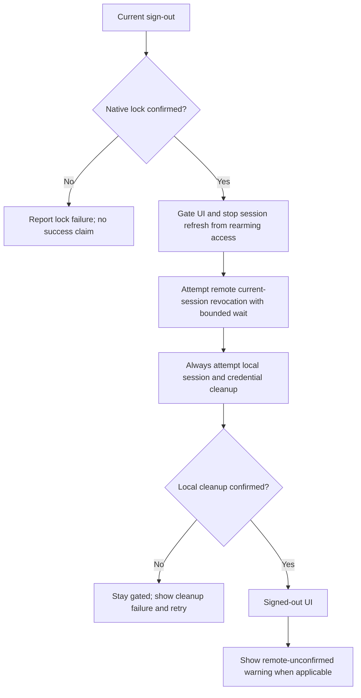

# ข้อเสนอแก้ Auth failure — GAP-01/02

Boss อนุมัติด้วยข้อความ “approve” วันที่ 2026-09-12: local implementation GAP-01/02 รวม process-local grace ตาม §2. ไม่อนุมัติ production mutation หรือ D1–D4.
Baseline `a4a75542c857beaac68267b90e16707ad3263a45`, application `0.13.2`.

## 1. เป้าหมายและขอบเขต

ผู้ใช้สั่ง “แก้ไข” ต่อจาก [Gap Analysis](../audits/gap-analysis-2026-09-12.md).
เสนอทำรอบแรกเฉพาะ GAP-01/02 ที่มี [RCA](../../.brain/rca/2026-09-12-auth-failure-state-gaps.md) ยืนยันกลไกแล้ว:

1. Current sign-out ต้องพยายามล้าง session/credential ในเครื่อง แม้ security service ล้มเหลว และรายงานผล local/remote ตามจริง.
2. UI ต้องเลิกแสดง eligible เมื่อ native entitlement check ยืนยันสิทธิ์ไม่ได้และล็อก runtime แล้ว โดยไม่กระพริบ loading ระหว่าง routine refresh ที่ยังสำเร็จ.
3. ครอบคลุม error จากการลบ DPAPI/legacy credential เพราะเป็นเงื่อนไขจำเป็นของการยืนยัน local cleanup.

ยังไม่ปิด GAP-03–23. MFA, Google-session method, entitlement live-session policy, G-Orchestra, CI expansion และ Voice/Memory/Coach ต้องมี slice/contract ของตนเอง. การอนุมัติเอกสารนี้ไม่เลือก D1–D4 และไม่อนุมัติ production mutation, release หรือ provider setup.

## 2. Parent/peer review และความขัดแย้งที่ต้องอนุมัติ

| เอกสาร | ข้อผูกพัน/ผลต่อข้อเสนอ |
| --- | --- |
| [CR-034](../change%20request/CR-034-gid-iam-production-completion.md) §5 และ Phase 2 | Native lock ก่อน current sign-out; ลบ DPAPI material; current/others แยก scope; remote success ต้องมีหลักฐาน |
| [EXEC-PLAN CR-034](EXEC-PLAN-CR-034-iam-remediation.md) §3 | GAP-01 ใช้งานเดิม T10; ตารางนี้ยังเป็น task-state authority ไม่สร้าง board ซ้ำหรือทำเครื่องหมาย DONE ใน proposal |
| [CR-022](../change%20request/CR-022-gmad-desktop-first-run-entitlement-account-handoff.md) §6, AC-04, UAT-12 | ระบุ no-grace/online-only แต่ native ปัจจุบันมี process-local grace 24 ชั่วโมง เป็น policy drift ที่ต้องเปิดเผย |
| [Native runtime](../../src-tauri/src/runtime.rs) / [verification command](../../src-tauri/src/lib.rs#L160) | Grace ใช้ได้คืน Ok(stale); ใช้ไม่ได้ล็อกแล้วคืน Err; cold start ไม่มี durable receipt |
| [First-run gate](../../src/src/GmadFirstRunGate.tsx) / [account auth](../../src/src/auth.ts#L124) | Warning หลัง sign-out ต้องปรากฏบนหน้าที่ผู้ใช้เห็นจริง ไม่ถูกติดป้ายว่าเป็น login failure |

**ข้อเสนอ policy สำหรับอนุมัติรอบนี้:** รักษา grace 24 ชั่วโมงที่มีอยู่เฉพาะ process เดิมหลัง fresh verification; ไม่เพิ่มเวลา ไม่ persist receipt และไม่ปลดล็อก cold start. เมื่ออนุมัติ ให้บันทึกข้อยกเว้นนี้ใน CR-022 พร้อมปรับ UAT-12 ให้แยก within-grace กับ no-valid-grace ก่อน code change. ห้ามถือว่า CR-022 เดิมอนุมัติ grace อยู่แล้ว. GAP-02 ไม่อ้างว่า expiry ถูกบังคับด้วย timer ที่ทำงานตลอดเวลา: ขอบเขตนี้คือผลของ verification call.

## 3. Root cause ที่ยืนยันได้บน baseline ก่อนแก้

**GAP-01:** [auth.ts](../../src/src/auth.ts#L124) เรียก remote security action ก่อน local sign-out ใน try เดียว เมื่อ remote throw จึงข้าม cleanup. [secureStorage.removeItem](../../src/src/secureStorage.ts) ยังกลืน native deletion failure ทำให้ caller แยก cleanup สำเร็จ/ล้มเหลวไม่ได้. Source probe ของ adapter เมื่อ mock `secret_delete` reject ยังคง resolve; ไม่ได้ลบ credential จริงในการตรวจนี้.

**GAP-02:** [gmadEntitlement.ts](../../src/src/gmadEntitlement.ts) กับ [gmadFirstRun.ts](../../src/src/gmadFirstRun.ts) ใช้ everEligible กลืน background rejection แม้ native ให้ grace ผ่าน success branch ไปแล้ว. UI จึงเก็บ decision เก่าในกรณีที่ native ล็อก.

## 4. Contract — current sign-out

- รักษา native-lock-first. ถ้า lock invoke fail ห้ามเรียกขั้น sign-out ต่อหรืออ้างว่า runtime ปลอดภัยแล้ว.
- เมื่อ lock สำเร็จ UI ต้องออกจาก eligible ทันที และระหว่าง transaction ห้าม routine refresh กลับมาปลดล็อก. Late async results จาก transaction/session เก่าต้องไม่คืน session หรือ eligible state.
- Remote revocation เป็น best effort ของ **current** เท่านั้น: รอไม่เกิน 5 วินาที แล้ว abort request และไป cleanup; timeout/503/401/403 ต้องไม่ข้าม local cleanup. ไม่ retry remote อัตโนมัติและไม่ queue token ลง disk.
- หลัง remote attempt ทุกผลลัพธ์ ต้องพยายามล้าง local SDK session, refresh/access-token persistence, PKCE verifier และ legacy plaintext copies ที่เป็นของ auth client นี้เท่านั้น. ห้ามลบ secret อื่นหรือ local settings/G-Log.
- ตรวจ behavior ของ pinned Supabase SDK ก่อนเลือกวิธี cleanup: `scope: local` เพียงอย่างเดียวไม่ใช่หลักฐานว่าล้างข้อมูลได้แม้ offline. Provider request ที่ cleanup ใช้ต้องมี bounded abort เช่นเดียวกัน และต้องมี fallback cleanup ของ auth storage เมื่อ provider error. ห้ามแก้ด้วย Promise.race ที่ปล่อยคำขอเดิมกลับมาเปลี่ยน state ภายหลัง.
- Native delete สำเร็จหรือไฟล์ไม่อยู่แล้วถือว่าลบสำเร็จ; access denied/I/O error ต้องส่งต่อเป็น cleanup failure. ยังคงพยายามลบ credential keys อื่นและ legacy copies แม้หนึ่งรายการล้มเหลว แล้วรวมผลให้ caller ทราบ. ห้ามใช้ getItem ที่กลืน read error เป็นหลักฐานว่าไม่มี credential.
- Local cleanup failure: runtime/UI คง gated, แสดง “ล้างข้อมูลเข้าสู่ระบบในเครื่องไม่สำเร็จ กรุณาลองอีกครั้ง”; ห้ามแสดง signed-out success และห้ามเริ่ม Google sign-in ใหม่จน cleanup จบ. ไม่แสดง secret path/token ใน error.
- Local success + remote failure: แสดง “ออกจากระบบในเครื่องแล้ว แต่ยังยืนยันการยกเลิก session บนเซิร์ฟเวอร์ไม่ได้”. Warning ต้องยังเห็นได้หลังเปลี่ยนหน้า; ห้ามใช้ข้อความ login failed และห้ามอ้างว่า sessions อื่นถูกยกเลิก.
- Local success + remote success: แสดง signed-out state; ไม่รับรอง audit row เพิ่มเติมนอกเหนือ API contract. Backend เป็นผู้บันทึก audit; client ไม่สร้าง success event ปลอม.
- `others` ใช้ behavior/AAL2 contract เดิม ไม่ล้าง credential หรือ lock เครื่องปัจจุบัน.

## 5. Contract — entitlement refresh

ใช้ response shape เดิมให้มากที่สุด ไม่จำเป็นต้องเพิ่ม IPC endpoint เพียงเพื่อแยก stale กับ error.

| Native/IPC result | UI result | Runtime assertion ในการทดสอบ |
| --- | --- | --- |
| Fresh eligible | eligible, decision ใหม่ | armed ตาม native decision |
| Ok eligible + stale=true | eligible, แสดง stale ตาม UI contract เดิม | grace ที่ native ยอมรับยังมีผล |
| Explicit denial | state ตาม denial, ห้ามเก็บ eligible decision | locked; cache ใช้คืนสิทธิ์ไม่ได้ |
| Command Err หลัง fallback ใช้ไม่ได้ | offline_or_unavailable, decision=null, reset everEligible | native locked ก่อนคืน Err |
| IPC transport rejection ไม่ทราบ native outcome | offline_or_unavailable; ไม่อ้างว่า native lock สำเร็จโดยไม่มีผลยืนยัน | พยายาม lock; lock failure ต้องรายงานตามจริง |
| Sign-out/account change | reset decision/everEligible; ไม่รับผลจาก session เดิม | old in-flight result ต้องไม่ rearm หลัง lock |

Background token refresh ที่กำลังรอยังไม่เปลี่ยนหน้าเป็น loading; เมื่อผล reject ต้องแสดง unavailable ไม่ว่าเคย eligible หรือไม่. Stale grace เป็น success result เท่านั้น. Retry ที่สำเร็จคืน eligible ได้ตาม native authority.

## 6. Implementation scope หลังอนุมัติ

| จุดแก้ | เหตุผล |
| --- | --- |
| auth.ts / securitySession.ts / securityApi.ts | ลำดับ transaction, timeout/abort และผล local/remote แยกกัน |
| secureStorage.ts และ auth client wiring เฉพาะที่จำเป็น | ส่ง deletion error และล้างเฉพาะ auth keys แม้ provider ใช้งานไม่ได้ |
| gmadEntitlement.ts / gmadFirstRun.ts | gate ตาม rejection, reset eligibility และป้องกัน obsolete results |
| GmadFirstRunGate.tsx / sign-out error surface ที่ใช้อยู่ | แสดง cleanup/remote warning บนหน้าที่ถูกต้องและมี retry |
| Native lib.rs/runtime.rs เฉพาะหาก regression test ยืนยันว่าผล verify เก่าปลดล็อกหลัง sign-out | ปิด transaction race โดยมี RCA เพิ่มก่อนแก้; ไม่ถือว่า race นี้พิสูจน์แล้ว |
| Existing auth/storage/gate tests และ integration tests | ใช้ real composition แทน callback จำลองเพียงชั้นเดียว |
| CR-022, CR-034 execution record, RCA, llms และ generated doc graph | ปรับเฉพาะ contract/implementation/evidence ที่เปลี่ยน; ไม่ประกาศปิด gap ก่อนตรวจผ่าน |

ทำ T10 ก่อน แล้ว GAP-02 แยก diff ที่ review ได้. ไม่ bump app version หรือแก้ dependency version เพื่อความสะดวก. Task-state เปลี่ยนใน EXEC-PLAN หลังอนุมัติ/เริ่ม implementation พร้อม evidence เท่านั้น.

## 7. Acceptance และ verification

| ID | Scenario | ต้องพิสูจน์ |
| --- | --- | --- |
| A1 | Remote 503, 401/403, reject และ timeout | Native lock ก่อน; cleanup ยังทำ; local success แสดง remote-unconfirmed warning |
| A2 | Provider sign-out error/offline | Fallback local cleanup ครบ; SDK/session ไม่กลับมาเองจาก token refresh |
| A3 | Native lock reject | ไม่มี remote/local sign-out ต่อ; error ไม่อ้างสำเร็จ |
| A4 | DPAPI delete denied, legacy delete fail, absent key | ไม่กลืน failure; absent idempotent; keys อื่นยังถูกพยายามลบ; retry สำเร็จได้ |
| A5 | Current กับ others | current ล็อก/ล้างเฉพาะเครื่อง; others ไม่เปลี่ยน local auth/runtime และรักษา AAL2 |
| A6 | Sign-out success/partial failure ใน gate และ Account UI | ข้อความปรากฏหลัง navigation จริง; busy/retry ถูกต้อง; ไม่ติดป้าย login failure |
| B1 | Cold start outage | unavailable, ไม่ใช้ cache/durable receipt ปลดล็อก |
| B2 | Token rotation + within-grace outage | ไม่กระพริบ loading; รับ Ok(stale) และคง eligible |
| B3 | Background outage ที่ grace หมด | Native locked + UI unavailable/decision=null; ไม่กลืน rejection |
| B4 | Denial แล้ว outage / retry success | ไม่คืนสิทธิ์จาก cache หลัง denial; fresh successful retry คืน UI ได้ |
| B5 | Sign-out/account change ระหว่าง verify | Deferred old result ไม่คืน eligible/session หรือ rearm native หลัง lock |

ขั้นตอน: regression tests ต้อง fail บน behavior เดิมใน A1/A4/B3 → แก้ implementation → targeted tests + desktop Vitest/TypeScript/lint → Rust tests/clippy ตามไฟล์ที่กระทบและ gate ของ repo → Tauri/WebView smoke ของ sign-out กับ expired-grace โดยใช้ controlled fixtures → doc graph + CodeDoc review.

ใช้ fake time และ mocked network สำหรับ outage/expiry tests; ห้ามใช้ token จริงใน fixtures/logs. Hook/render test ต้องผ่าน auth/storage/gate composition จริง ไม่เพียง import predicate. Native timing/state tests แยกจาก WebView integration และห้ามอ้างว่าชุดหนึ่งแทนอีกชุดได้. ไม่ weaken assertions เพื่อให้ผ่าน.

**Exit criteria:** acceptance ที่อยู่ใน slice ผ่าน, docs ตรง behavior, diff อยู่ในขอบเขต, regression ที่พบถูกแก้หรือกลับมาขอปรับ scope พร้อม RCA; ระบุ checks ที่ยังรันไม่ได้. Local implementation complete แยกจาก production acceptance/release readiness เสมอ.

## 8. Proposal verification และ approval boundary

ตรวจ source/parent/peer docs ปัจจุบันแล้ว; source probe ยืนยัน adapter กลืน native deletion error; local links ใน proposal/RCA 24 จุดตรวจ path/line anchors ผ่าน. Doc gate รอบแรกพบ status `candidate` ไม่อยู่ใน enum ของ operations docs จึงปรับเป็น `draft` โดยไม่เปลี่ยนกฎตรวจ. CodeDoc preflight ยังขาด default Mellum model จึง INDETERMINATE; ไม่อ้าง semantic alignment. ผล doc gate รอบสุดท้ายรายงานพร้อมส่งเอกสาร ไม่ถือว่า proposal ถูก implement แล้วจากผล structural gate.

อนุมัติแล้ว: **local implementation ของ GAP-01/02 ตาม §4–7 รวมข้อยกเว้น process-local grace ใน §2**. การอนุมัติให้แก้ parent docs ตามข้อเสนอนี้ก่อน implementation ไม่ได้เป็นการยืนยัน production behavior. งาน GAP-03–23 และ D1–D4 ยังคงเปิดอยู่.

## 9. Local implementation record — 2026-09-12

Committed as `56f9fbd` on branch `fix/auth-failure-state`; application remains `0.13.2`. This is local verification, not production approval or full native/WebView UAT closure.

- `securitySession.signOutCurrent` shares pending/failure/warning state across hook instances. Native lock is first; remote current-session revocation uses a five-second abort deadline and captured access token. `others` preserves the existing upstream authorization and failure behavior.
- `supabase.cleanupLocalSession` stops auto-refresh, aborts and drains active auth fetches and pending storage operations, attempts all three known auth keys, then invokes the real pinned SDK against blocked/empty storage to finalize local sign-out. No private SDK method or fake provider success response is used. Native/legacy deletion failures remain visible and retryable. Other secrets/settings/logs are preserved.
- SDK 2.110 can finish its internal 30-second retry loop after a transport abort; while logout blocks auth, these retries are rejected locally without new outgoing fetches. A fake-clock test runs that loop and proves credentials stay absent. No server revocation retry is queued.
- `gmadEntitlement` rejects stale UI results, resets on failures/account changes and keeps Ok(stale) quiet. The release Account panel shares the gate context. Native request generations serialize result commits and sign-out invalidation; old responses cannot rearm the runtime.
- Added `jsdom` 24.1.3 as a development dependency for actual React hook/DOM composition tests. Existing dependency versions are retained; lockfile generated with repository pnpm 9.0.0. No runtime dependency upgrade.

| Verification | Result / boundary |
| --- | --- |
| Red regression run before fixes | Four assertions failed as expected: real SDK local credentials retained after remote 503, native-delete error swallowed, legacy-delete error swallowed, background failure predicate swallowed |
| Desktop unit/composition suites | 284 passed in 29 files; includes real SDK with mocked network/storage and actual first-run gate/Account panel DOM transitions |
| TypeScript + ESLint | Passed across desktop source |
| Rust tests | 293 passed, 0 failed, 5 existing ignored; includes two request-generation tests and existing grace/denial/DPAPI tests |
| Clippy | `cargo clippy --manifest-path src-tauri/Cargo.toml --all-targets --locked -- -D warnings`: exit 0 |
| Release build | Final Tauri `build --no-bundle -- --locked` succeeded; existing CSS-comment parser/bundle-size warnings remain in untouched frontend styling; no installer signing, publishing or deployment |
| Doc graph | Wrapper PASS, 215 tests; 14 existing error-severity items checklist-covered, zero uncovered; strict scan remains exit 1 |
| CodeDoc | Process exit 2, required default model absent; manual source/parent/peer review performed, no model-alignment pass claimed |
| Native/WebView smoke (2026-09-13) | Release executable cold-start Google gate, native lock IPC, actual DPAPI fixture roundtrip, file-held deletion rejection, retry and absent-key deletion passed; [evidence](../../.brain/verification/gap01-02-webview-2026-09-13/README.md). No synthetic session/entitlement response injected. |
| Not exercised | Packaged native/WebView sign-out and expired-grace UAT with controlled real sessions; hosted CI and production behavior |

The new native race is documented in RCA Case C. Initial source probes, rendered DOM tests, native unit tests and a release build are distinct evidence layers. T10/T11 retain pending acceptance work in the execution board rather than marking the audit gaps completely closed.

## 10. Version diff for this implementation

| Document/application | Before approval turn | Delivered |
| --- | --- | --- |
| Remediation contract | 0.1.0b | 0.2.0b |
| CR-022 | 0.8.2b | 0.9.0b |
| CR-034 | 0.4.4b | 0.5.0b |
| EXEC-PLAN CR-034 | 0.5.0b | 0.6.0b |
| Auth RCA | 0.2.0 | 0.4.0 |
| Gap audit | 0.1.0 | 0.1.1 (historical source links only) |
| llms.txt / llms-full.txt | 0.1.0 | 0.2.0 |
| Application | 0.13.2 | 0.13.2 (unchanged) |

Final local link/path checks: 163 references across the audit, RCA, proposal and two LLM reference files resolve; historical source line anchors are pinned to the audited commit. Whitespace checks pass. Implementation committed as `56f9fbd`; no push, release or deployment. This evidence follow-up changes the proposal from `0.2.0b` to `0.2.1b`, execution plan from `0.6.0b` to `0.6.1b`, and LLM references from `0.2.0` to `0.2.1`; application stays `0.13.2`.

## Changelog

| Version | Date | Summary |
| --- | --- | --- |
| 0.1.0b | 2026-09-12 | เสนอ contract แก้ GAP-01/02, credential cleanup failure, UI/native state, parent grace-policy exception และ acceptance tests; รอ approval ก่อน application code. |
| 0.1.1b | 2026-09-12 | บันทึก Boss approval ของ GAP-01/02 และ grace exception; เริ่ม local implementation. |
| 0.2.0b | 2026-09-12 | Record approved local implementation, SDK abort/storage behavior, generation guard and local validation; retain native/WebView and CodeDoc limitations. |
| 0.2.1b | 2026-09-13 | Record implementation commit and bounded release WebView/native DPAPI smoke; retain session UAT and missing-model CodeDoc gate. |
