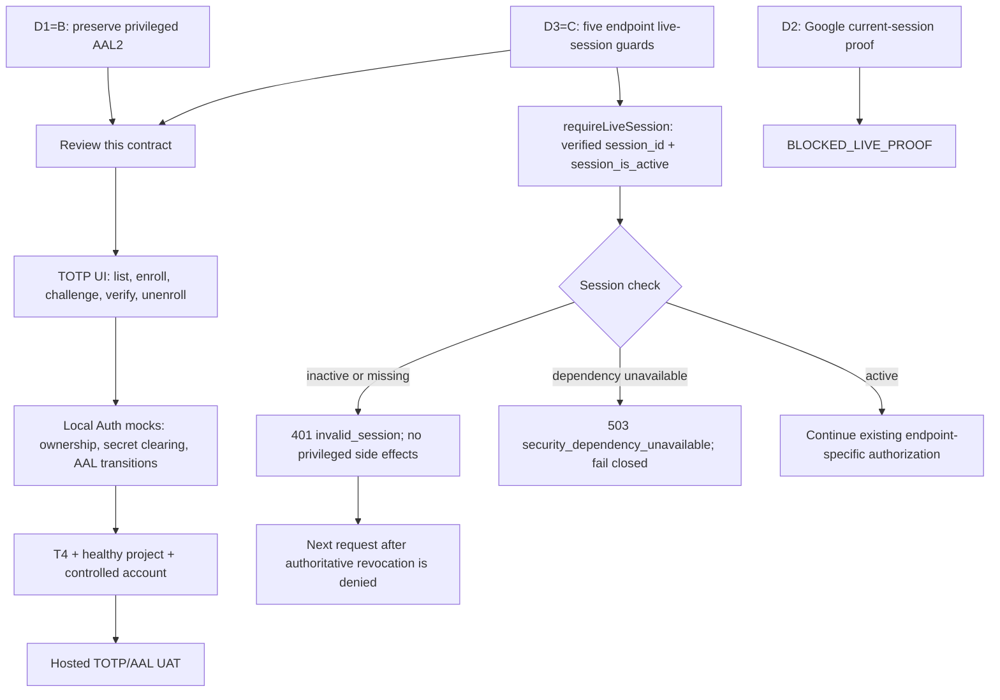

# IAM Enrollment and Live-Session Contract

**Class:** C-3 / HIGH — authentication, MFA, session revocation, and privileged-action boundaries.
**Contract state:** REVIEW. This is a local design artifact, not implementation or hosted acceptance.
**Source baseline:** `2d969ac643533b4b8e24494356da2e818eac874f` (`origin/main` at assignment).
**Environment:** gstore main / Production was observed PAUSED by the orchestrator on 2026-10-01. Hosted provider proof and UAT are blocked; local design, fixtures, and code review remain available.

## 1. Purpose and authority

This contract makes the approved CR-034 choices implementable without widening account scope:

- **D1=B:** preserve AAL2 for capabilities that already require step-up. Implement TOTP enrollment and verification; do not lower assurance or add an admin bypass.
- **D2:** Google remains the only permitted primary account policy, but linked Google identity is not proof that Google authenticated the current session. The session-method predicate remains `BLOCKED_LIVE_PROOF`.
- **D3=C:** require an active-session check at all five named beta/account endpoints, with revocation denied on the next request and dependency failure closed.
- **D4=B:** no `/ops` route is introduced by this contract.

The Product Owner has already decided D1–D4. No new product decision is requested for the bounded local technical details below. This document is pending contract review; review does not authorize provider configuration, schema changes, deployment, release, or production changes.

A healthy disposable project and an operator-approved, bounded UAT window are real prerequisites for hosted acceptance. Legal review remains outside this IAM scope. No agent may enable MFA, change auth settings, alter provider configuration, run migrations, deploy, release, or merge under this contract.

## 2. Source evidence

The references below identify the governing decisions and the checked implementation seams at the pinned baseline.

| Source | Relevant evidence |
| --- | --- |
| [CR-034 IAM requirements](../../change%20request/CR-034-gid-iam-production-completion.md) | Server-derived identity, session, AAL, role, and capability; private IAM; fail-closed requirements. |
| [CR-034 threat model and gates](../../change%20request/CR-034-gid-iam-production-completion.md) | Session replay, privilege escalation, outage behavior, step-up, and MFA scope. |
| [CR-022 desktop handoff](../../change%20request/CR-022-gmad-desktop-first-run-entitlement-account-handoff.md) | Server-owned identity/entitlement; download URLs are short-lived artifacts, not durable credentials. |
| [Product SRS privacy requirements](../../product/software-requirements-specification.md) | G-Memory and G-Log data remain local; account security work must not export match data. |
| [CR-034 execution plan, T5](../EXEC-PLAN-CR-034-iam-remediation.md) | Proposed `requireLiveSession` contract, status/error semantics, and no service-role work before the guard. |
| [CR-034 execution plan, T6](../EXEC-PLAN-CR-034-iam-remediation.md) | TOTP implementation preserves AAL2; local mocked checks are distinct from hosted acceptance. |
| [CR-034 execution plan, T7](../EXEC-PLAN-CR-034-iam-remediation.md) | Current-session method proof is separate and blocked pending supported evidence. |
| [Accepted Product Owner decisions](../gap-closure-product-owner-decisions.md) | D1=B, D2 Google-only policy with session proof deferred, D3=C for all five endpoints, D4=B. |
| [Gap-closure evidence contract](../gap-closure-evidence-contract.md) | Existing Google predicate proves account linkage; current IAM resolver uses server session/AAL/role/capability; D3 endpoints lack a shared active-session check. |
| [Shared IAM resolver](../../../supabase/functions/_shared/iam.ts#L57) | Capability map; `decodeClaims` and `resolveIamContext` enforce verified user, live session, AAL2, and server role. |
| [IAM runtime adapters](../../../supabase/functions/_shared/iam_runtime.ts#L155) | Auth user verification and the no-cache `iam_private.session_is_active` check. |
| [Session activity SQL](../../../supabase/migrations/20260823221844_cr034_iam_phase1_foundation.sql#L61) | Least-privilege check matches both session id and user id. |
| [Account security view](../../../src/src/AccountSecurity.tsx#L21) | Existing factor/assurance display; no enrollment flow at baseline. |
| [Security-state function](../../../supabase/functions/iam-security-state/index.ts#L17) | Own security read uses the common resolver and reads factor state from the caller's Auth client. |
| [Local Supabase auth config](../../../supabase/config.toml#L302) | Local TOTP and phone enrollment are disabled in this config; this says nothing about hosted project settings. |
| [Supabase TOTP guide](https://supabase.com/docs/guides/auth/auth-mfa/totp) | Provider flow and factor semantics: enroll, challenge, verify, assurance level, factor listing, and refresh after unenrollment. |
| [Supabase MFA JavaScript reference](https://supabase.com/docs/reference/javascript/auth-mfa) | Supported client MFA operations; provider behavior must still be verified against the controlled hosted project. |

The five D3 endpoint source anchors are [`mint-gid` auth check](../../../supabase/functions/mint-gid/index.ts#L17), [`check-gmad-queue` auth check](../../../supabase/functions/check-gmad-queue/index.ts#L17), [`accept-closed-beta-terms` auth check](../../../supabase/functions/accept-closed-beta-terms/index.ts#L19), [`get-gmad-desktop-entitlement` auth check](../../../supabase/functions/get-gmad-desktop-entitlement/index.ts#L8), and [`request-gmad-download` auth check](../../../supabase/functions/request-gmad-download/index.ts#L8). These references locate the existing handler order and checked baseline behavior; the D3 guard is proposed contract, not shipped behavior.

## 3. Contract flow

## 4. D1 — TOTP enrollment, step-up, and removal

### 4.1 Required behavior

1. Google remains the account's primary sign-in policy. TOTP is a second factor, not a replacement login, recovery credential, or identity rebind.
2. Keep current AAL2 requirements for privileged capabilities. The common resolver remains authoritative: verified user → active session → AAL2 where required → server-owned role/capability. An AAL1 privileged request returns `403 step_up_required`; a user role lacking a privileged capability returns `403 capability_denied`, even at AAL2.
3. Use Supabase Auth MFA operations: list the current user's factors, enroll a TOTP factor, challenge that factor, verify the challenge, and query current/next assurance. Do not build a custom TOTP algorithm or locally verify codes.
4. For initial enrollment, challenge and verify only the pending factor id returned by the current enrollment operation, fenced to that same user/session; that factor is not yet verified. For later step-up or unenrollment, select only a currently listed, verified TOTP factor belonging to the current authenticated user. If multiple verified factors are listed, the user selects among them; never accept an arbitrary caller-supplied factor id as ownership proof.
5. Enroll and verify using the authenticated user's Supabase client. A successful provider verification is required before presenting the factor as enrolled or step-up as complete. Provider Auth remains the source of truth; do not duplicate factor state into public profile, user metadata, application tables, or a recovery table.
6. Unenrollment requires a fresh AAL2 session and a currently listed verified TOTP factor owned by that user. After provider removal, refresh the current session and reload factors/assurance before showing completion. If refresh or assurance reconciliation fails, clear local factor material, stop privileged UI actions, and require reauthentication; do not claim the stale AAL2 token remains valid proof.
7. Preserve the existing recovery row and recovery policy. No phone OTP, recovery codes, contact changes, recovery workflow, account rebind, or global MFA enforcement is added here.
8. Follow provider-documented session effects of enrollment/unenrollment. The [Supabase enrollment reference](https://supabase.com/docs/reference/javascript/auth-mfa-enroll) states that successful TOTP verification promotes the current session to AAL2 and logs out the other sessions. Explain that expected other-device sign-out before enrollment verification; confirm both current-session promotion and other-session rejection in healthy-project hosted UAT. The vendor documentation does not establish current gstore behavior or configuration.

### 4.2 Secret handling and identity fencing

The TOTP secret, QR/URI representation, OTP code, challenge id, and factor id are temporary provider-flow material:

- Keep them only in component memory for the active operation. Never place them in local/session storage, persisted state, URLs, files, Rust IPC, analytics, logs, telemetry, error strings, screenshots, or another backend/provider.
- The Auth API is the expected direct transport for enrollment/challenge/verification. No second egress or app-side factor copy is allowed. Render the QR as a non-executable image; do not inject provider text as HTML.
- Clear secret, code, QR, challenge, and selection on cancel, completion, error, sign-out, or identity/session change. Redact provider errors before rendering.
- Fence each async operation by captured user id and auth/session generation. If the account changes while a promise is pending, discard its result, clear all operation material, and do not apply it to the new account or automatically retry as that account.
- A stale `aal2` JWT after factor removal is a negative case. Refresh before presenting a settled state. If a privileged server action still succeeds using a token that should have been downgraded, record a failure and keep hosted acceptance blocked until its behavior is resolved; do not infer revocation from a refreshed UI alone.

### 4.3 Normal-user and negative outcomes

| Case | Required result |
| --- | --- |
| Normal user enrolls or removes their own verified TOTP | Allowed only through their verified current session and the provider's required assurance. It grants no role or capability. |
| Normal user submits another user's factor id or identity | Reject; no other user's factor is listed, challenged, or changed. |
| AAL1 caller invokes an AAL2-protected operation | `403 step_up_required`; no privileged side effect. |
| AAL2 user-role caller invokes an admin/owner-only capability | `403 capability_denied`; no role inference from metadata or factor enrollment. |
| Invalid, replayed, cancelled, or expired challenge | No success state; clear temporary material; allow only provider-defined retry semantics. |
| Pending enrollment factor vs existing unverified factor | Only the current operation's pending factor may complete enrollment verification; an unrelated unverified factor cannot serve step-up or removal. |
| Account switches before an async result returns | Ignore the late result; clear factor/challenge material; do not attach it to the new account. |
| Unenrollment leaves stale AAL2 in memory or refresh fails | Do not mark step-down complete or permit client-side privileged action; reauthenticate and verify hosted server behavior. |
| Successful enrollment verification affects other sessions | Mock the expected other-session sign-out and account UX; hosted UAT must confirm those sessions are rejected and the current session reaches AAL2. Do not infer this from a local mock. |
| Auth/provider dependency is unavailable | No local success simulation in hosted mode; retain a clear retryable failure and make no privileged mutation. |

## 5. D3 — active-session guard on the five endpoints

### 5.1 Shared guard

Add one narrow `requireLiveSession(authorization)` seam as specified in CR-034 T5. It verifies the bearer with the existing Auth user-verification path, derives `sub` and `session_id` from verified claims, and checks `iam_private.session_is_active(user_id, session_id)`. Do not trust body/query identity, metadata, client role, or client session id.

Run the guard immediately after the Authorization-header check and before creating/using a service-role client, reading protected data, or performing any mutation. It checks session existence only: it does not add an endpoint capability, role, Google-method, or AAL requirement. Each endpoint retains its current business authorization and eligibility checks after the live-session guard passes.

| Endpoint | Existing action that must not happen on inactive/unavailable session |
| --- | --- |
| `mint-gid` | Profile lookup/creation, GID issuance, or audit write. |
| `check-gmad-queue` | Queue/profile lookup, queue state change, or audit write. |
| `accept-closed-beta-terms` | Terms receipt, enrollment, grant, or audit mutation. |
| `get-gmad-desktop-entitlement` | Entitlement/Terms/grant reads that disclose account state, or audit mutation. |
| `request-gmad-download` | Grant eligibility disclosure, signed URL issuance, or audit mutation. |

### 5.2 Status and revocation semantics

- Missing, malformed, mismatched, or authoritatively inactive session: return `401` with `{"error":"invalid_session"}`. Do not proceed to privileged data or side effects.
- Session-check dependency unavailable or query error: return `503` with `{"error":"security_dependency_unavailable"}`. Do not fail open, cache a positive answer, or proceed to privileged data or side effects.
- Active session: continue with existing endpoint-specific Google account policy and existing eligibility, Terms, ownership, and download rules. Preserve their route-specific outcomes.
- Once the authoritative active-session query reports revoked, the next request to each endpoint is denied before effects. No propagation-time guarantee is made for revocation before the authority reflects it.
- Keep endpoint-specific authorization: a successful live-session check is not entitlement, Google current-session proof, role, AAL2, ownership of a caller-selected GID, or permission to mint another user's artifact.

### 5.3 Endpoint-specific negative cases

For each of the five handlers, local adapter tests must prove active → existing behavior; revoked → exact 401/no privileged effect; session query unavailable → exact 503/no privileged effect; and identity in the body cannot override verified claims. Also assert existing business denials remain intact after an active session: unentitled users do not receive downloads, Terms are not bypassed, and a normal user does not gain admin capability. Do not force AAL2 onto ordinary user-level queue, Terms, or entitlement flows unless the existing endpoint contract requires it.

## 6. D2 — current-session Google proof remains blocked

The existing `isGoogleIdentity` predicate checks account linkage (app metadata/provider list); it does not prove which method authenticated the current session. A generic `amr: oauth` claim is not Google-specific proof. Do not treat a linked Google identity as a fallback when the current session lacks supported proof, and do not add a generic OAuth/AMR predicate, alter provider configuration, or change sign-in behavior in this contract.

D2 remains `BLOCKED_LIVE_PROOF` until sanitized evidence from a healthy controlled project establishes a server-verifiable signal across Google-only, email-only, dual-linked account signing in with email, and refresh of the same session. The exact predicate then requires a recorded Product Owner decision before implementation. D3 live-session checks and D1 local TOTP work are separately bounded and do not silently resolve D2.

## 7. Local implementation boundary and acceptance

| Lane | Smallest implementable slice after contract review | Verification boundary |
| --- | --- | --- |
| TOTP local | AccountSecurity enrollment/challenge/verify/unenroll state flow using Auth MFA methods; operation fencing; no-secret handling; preserve existing role/capability resolver and recovery UI. | Vitest with mocked Auth responses, account-switch races, factor ownership, invalid/replay cases, AAL refresh/stale-token cases; TypeScript and ESLint. No hosted claim. |
| D3 local | Shared active-session helper, then the five thin endpoint integrations before service-role work; no D2 policy change. | Deno shared-function tests plus per-handler injected session active/revoked/unavailable cases and side-effect spies. No hosted claim. |
| D2 | No implementation slice yet. Capture sanitized evidence only when project is healthy and a controlled probe is approved. | Remains blocked until the evidence and exact predicate decision exist. |
| Hosted acceptance | Controlled TOTP lifecycle and AAL step-up/step-down; active then revoked bearer against all five endpoint guards; dependency failure fail-closed. | Requires healthy gstore, disposable test identities, operator-approved test window, pinned app/function revisions, and sanitized response-only evidence. Currently blocked by paused project. |

Required local check commands for a later implementation task (not run by this documentation task):

- `pnpm -C src test -- --run`
- `pnpm -C src exec tsc --noEmit`
- `pnpm -C src exec eslint .`
- `deno test --allow-env --allow-net supabase/functions/_shared/` plus focused endpoint tests.

## 8. Threat model, checks, and exit criteria

Threats addressed: stale/revoked JWT replay; factor-id substitution across accounts; normal-user privilege escalation; TOTP secret/code exposure; late promise binding after account switch; fail-open behavior during Auth/database outage; and signed-download or entitlement side effects after revocation.

Contract review passes when all are true:

1. The reviewer confirms this document matches accepted D1=B, D2 blocked, D3=C, and D4=B without reopening those product choices.
2. Every D3 endpoint has the same pre-service-role live-session invariant and exact inactive/unavailable outcomes.
3. D1 preserves AAL2, normal-user capability denial, provider-backed factor ownership, secret clearing, and stale-AAL handling.
4. Local mocked checks and hosted UAT are clearly separate; no unavailable hosted evidence is described as passed.
5. D2 remains blocked and no migration, recovery, provider configuration, deployment, release, or production action is in scope.

Contract exit is **reviewed/accepted with no unresolved contract ambiguity**. That exit permits a separately dispatched local implementation slice; it does not mean code is implemented, tests pass, hosted UAT is complete, or the initiative is released. Implementation exit requires all local checks and endpoint-specific negative cases above. Hosted acceptance exit additionally requires a healthy project and controlled UAT evidence. Neither exit authorizes release or production promotion.

## 9. Write scope and exclusions

This contract authorizes documentation only in its leased path: `docs/operations/contracts/gap-iam-contract.md`. A later implementation dispatch may separately lease `src/src/AccountSecurity.tsx`, shared IAM code, and the five endpoint handlers. Shared generated artifacts and operational task state remain root-owned.

Excluded: authentication/provider setting changes; new database schema or migrations; recovery/phone flows; public profile changes; new Google-session-method logic; service-role permission changes; hosted tests against production accounts; deployment, release, merge, or production promotion.

## Changelog

| Version | Date | Change |
| --- | --- | --- |
| 0.1.0 | 2026-10-01 | Define reviewed IAM contract for D1 TOTP/AAL2 and D3 live-session revocation; preserve D2 live-proof block. |
