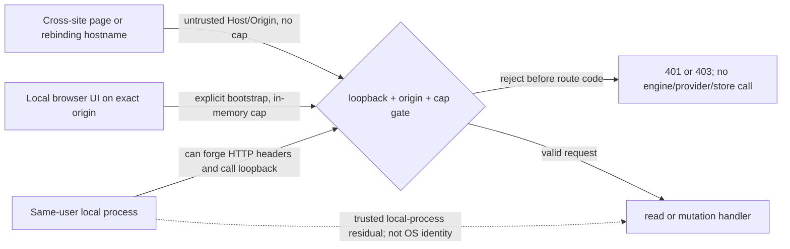

# G-Orchestra local HTTP security contract

This C-3/HIGH contract defines the legacy Node HTTP boundary for GAP-06. It is design only: D5 keeps
G-Orchestra a local developer tool and does not authorize remote management, server changes, tests,
or dispatch. The tool is separate from G-Maiden's player runtime; this contract makes no release claim.

## 1. Authority and current source

D5 in `docs/operations/gap-closure-product-owner-decisions.md` controls. It requires explicit
loopback binding, an unguessable per-process mutation capability, and Origin/Host checks. Source
review found sensitive reads and provider/store effects behind GET/POST, so this contract applies the
gate to every API route. Older docs describing an unauthenticated REST/automation surface are
superseded for this local HTTP boundary only. ADR-18 and engineering-spec §7 establish the tool/runtime separation and provider-dispatch context; this contract does not change engine semantics. It is DAG node ORCH-CONTRACT for GAP-06, uses evidence classes/statuses from `docs/operations/gap-closure-evidence-contract.md`, and does not complete ORCH-CODE or ORCH-LOCAL-CHECK.

| Source | Verified source fact |
| --- | --- |
| `orchestration/server.mjs:15-17,33-34,139-140` | Configurable port; request Host is used to construct URL; listener has no explicit host and prints `localhost`. |
| `orchestration/server.mjs:29-30` | Body buffering is unbounded; malformed JSON silently becomes `{}`. |
| `orchestration/server.mjs:39-84` | GET exposes snapshots, provider health, knowledge rows, logs, registered-project snapshots, graph metadata, and graph-listed document text. |
| `orchestration/server.mjs:87-109` | POST routes write/query knowledge and run semantic search. |
| `orchestration/server.mjs:111-136` | `/api/cmd` mutates state, can dispatch/stop a pool, changes auth/tier, confirms, resets; raw error messages may be returned. |
| `orchestration/engine.mjs:309-348,528-540,838-848` | Snapshot reloads/reaps state and returns task/provider/usage metadata; health reads can contact providers and reveal hosts/models; logs return raw agent output. |
| `orchestration/studio/vite.config.ts:4-13`; `orchestration/src-tauri/tauri.conf.json:6-10` | Studio dev URL is `http://localhost:5599`, `/api` proxies to engine `:4577`; production uses `studio/dist`. |
| `orchestration/src-tauri/src/main.rs:17-43,48-63` | Tauri supervises the Node sidecar in current source; bundled resource/origin behavior is not established. |

Source evidence is pinned to `a5e43a46321cf51ee2ba9e0fa2752efb944fa161`; it does not prove current socket exposure or deployed state.

## 2. Protected data and side effects

Every application `/api/*` route requires the capability, except `POST /api/session`, the explicit bootstrap. Bootstrap still requires the reviewed Host/Origin/Fetch Metadata checks and returns only the process capability with no protected data or handler effects. Protected reads include task titles/acceptance text, owners/workers, provider names/capabilities, model names/hosts, usage, raw logs, failure-memory rows, registered-project task data, and repository graph/document text. Snapshot returns only an API-key-available boolean; the other data remains private.

`GET /api/providers` and `/api/ollama` call health checks; `/api/search` can run semantic retrieval; `/api/node`, `/api/edge`, and `/api/query-nodes` access the knowledge store. `/api/cmd` may dispatch/spend credits, mutate state, or reset it. Reject before any handler, engine, provider, request-triggered private-file read, semantic import, or store call.

## 3. Threat model

The defended remote threat is cross-site browser reads/writes, including DNS rebinding; loopback excludes LAN peers. A same-user process is trusted: it can call loopback, spoof Origin/Fetch Metadata, request bootstrap, or inspect the browser. This capability is not OS authentication. Same-user malware isolation needs a separate OS-level IPC/credential decision.

## 4. Address, Host, Origin, and browser policy

- Bind only to IPv4 `127.0.0.1` at the configured port. Never bind `0.0.0.0`, `::`, an interface
  address, or a DNS-resolved hostname. Print the numeric loopback URL.
- IPv6 is unsupported in this version: do not bind `::1` or dual-stack; reject Host `[::1]`. Enabling
  IPv6 later requires separate dual-stack and port-collision tests.
- For direct legacy UI traffic, accept only Host `127.0.0.1:<active-port>` or exact
  `localhost:<active-port>`. Reject missing/multiple Host, mismatched ports, arbitrary names or
  subdomains, trailing-dot variants, userinfo, and forwarded-host headers. Validate Host before
  parsing the request target; parse against a fixed local base, never the caller's Host.
- Direct UI Origin must exactly be `http://127.0.0.1:<active-port>` or
  `http://localhost:<active-port>`. Studio dev may use only `http://localhost:5599` paired with the
  engine Host on numeric loopback `:4577`, after the proxy checks below pass. No wildcard ports or
  `*.localhost`/attacker-controlled hostname.
- Keep Studio calls same-origin through Vite. Proxy `/api` to `http://127.0.0.1:4577` with
  `changeOrigin: true`, preserving browser Origin. Verify actual Host/Origin pairing; reject and
  block Studio if it differs. Never bypass checks in `DEV` or because traffic came through a proxy.
- A direct UI top-level GET may omit Origin only with `Sec-Fetch-Site: none`; same-origin API GETs
  without Origin require `Sec-Fetch-Site: same-origin`. Reject cross-site, `none` on APIs,
  `Origin: null`, foreign schemes, and missing Origin on state-changing requests. Present Origin must
  be an exact allowlisted scheme/host/port tuple.
- Packaged Tauri origin/API transport is unverified. Do not guess `tauri://`, `tauri.localhost`,
  wildcard ports, or generic localhost Origins. Capture the actual origin and transport in controlled
  local UAT before adding one exact reviewed pair.
- Send no CORS allow headers; deny `OPTIONS` and cross-origin preflights. Do not trust
  `X-Forwarded-*`, Referer as authorization, or arbitrary DNS names resolving to loopback.

## 5. Per-process capability and browser delivery

Generate one 32-byte capability with Node `crypto.randomBytes` per server process; keep it in memory and invalidate it on exit. Never source it from config, env, CLI, files, providers, or fixed test values. Compare fixed-length decoded bytes with `timingSafeEqual`. All approved UI sessions receive that same generation's capability; it is not user identity or remote auth.

Use actual clients and an explicit bootstrap, never a development bypass:

1. Direct same-origin `GET /` serves only static UI with `no-store`; permit top-level `Sec-Fetch-Site: none` or exact same-origin navigation, and reject cross-site navigation. No capability appears in URL/history/logs.
2. Existing legacy and Studio clients use `apiFetch`: explicitly `POST /api/session` before API calls, keep the returned capability in module memory, and send `X-GOrch-Capability` on every route. Bootstrap returns the same per-process capability and calls no handler. Require exact Host/Origin; for Studio also require `Sec-Fetch-Site: same-origin` and the reviewed Vite Host/Origin pair. Origin alone is not authentication.
3. No global, DOM, URL, history, console, local/session storage, IndexedDB, or persisted cookie carries the capability. Do not log body/header values. If bootstrap or proxy checks fail, block with no retry or auth bypass.
4. Every allowed page may retrieve the same active process-generation capability; repeat bootstrap does not rotate it, while restart invalidates it. Packaged Tauri remains blocked pending observed origin/transport.

The capability is readable by trusted same-origin JavaScript and visible in browser developer tools
while inspected. Memory-only handling and no-store reduce accidental persistence but cannot hide it
from same-user browser tooling. Same-origin XSS/script compromise is outside this boundary.

## 6. Request handling and fail-closed responses

Check Host, request target, Origin/Fetch Metadata, and capability before route-specific work. Then
check method, route, content type, declared and streamed body size, and strict JSON shape before a
handler. Enforce limits while streaming as well as from Content-Length. Reject malformed JSON,
arrays/null where an object is required, duplicate security headers, unsupported content types, and
unknown actions; never silently substitute `{}`.

| Body-bearing route | Maximum UTF-8 JSON body |
| --- | ---: |
| `/api/session`, `/api/cmd`, `/api/query-nodes`, `/api/search` | 64 KiB |
| `/api/node`, `/api/edge` | 256 KiB |

Return `401` for missing/invalid capability, `403` for Host/Origin/Fetch Metadata rejection, `400`
for malformed requests, `413` for oversized bodies, `404` for unknown routes, and `405` for unsupported
methods. Use fixed sanitized errors; do not return exception text, stacks, filesystem roots, config,
provider responses, or secrets. All responses, including HTML/errors/bootstrap, are `no-store`.
Never log request bodies, capability headers, or credentials. `OPTIONS` gets no CORS exception.

## 7. Route contract

Source inventory reflects current routes. `POST /api/session` is proposed and is the sole bootstrap exception; it returns no application data. All other routes use the common gate. Unknown `/api/*` paths fail before file or engine access.

| Method and route | Current consumer/effect after authorization |
| --- | --- |
| `GET /` | Legacy `public/index.html`; static UI only, no API snapshot. |
| `POST /api/session` (proposed) | Explicit bootstrap for legacy page and Studio `apiFetch`; no engine/provider call. |
| `GET /api/state` | Studio `store.ts`/`DevProgress.tsx` and legacy page; calls `E.snapshot()`. |
| `GET /api/ollama`, `GET /api/providers` | Legacy page; may call local/provider health endpoints. |
| `GET /api/knowledge`, `GET /api/personas` | Studio `Memory.tsx`/`DevProgress.tsx`; returns failure-memory rows/personas. |
| `GET /api/rwang/state` | Studio `RwangIngest.tsx`/`GOrchestraAligner.tsx` and legacy page; fixed registered project, no caller-supplied root. |
| `GET /api/log` | Legacy page/Studio `DevProgress.tsx`; returns task output that may contain paths/prompts. |
| `GET /api/doc-graph`, `GET /api/doc-content` | Studio `GOrchestraAligner.tsx`; doc-content is graph-membership-limited, but repository docs remain protected. |
| `POST /api/node`, `POST /api/edge` | Studio `NodeDbCanvas.tsx` uses `/api/node`; both routes can write the configured store. |
| `POST /api/query-nodes` | Studio `NodeDbCanvas.tsx`; may invoke store/model embedding and search. |
| `POST /api/search` | Studio `GOrchestraAligner.tsx`; semantic retrieval may invoke a backend. |
| `POST /api/cmd` | `store.ts`/Copilot/legacy page; claim/done/fail/release/assign/assignowner/dispatch/run/stop/setauth/reset/killswitch/settier/setdeps/confirm/unconfirm. |

Keep current action semantics behind the gate. Do not add actions or change their governance here.

## 8. Minimal implementation and acceptance boundary

Bounded code set: `orchestration/server.mjs` for explicit bind and production dependency wiring; a
new dependency-injected `orchestration/http-handler.mjs` for auth/routing/body/error policy; the
legacy `orchestration/public/index.html` caller wrapper; `orchestration/studio/src/api.ts` plus
migration of direct API fetch callers; and `orchestration/studio/vite.config.ts` for the fixed
loopback proxy. Add only `orchestration/server.security.test.mjs`. Do not change providers, engine
algorithms, game runtime, Supabase, release paths, or add a remote auth platform.

The test imports only `http-handler.mjs` with fake engine/provider/store/document dependencies; it
must not import real engine/config, launch providers, read real logs/state, or dispatch. A test factory
may inject deterministic capability bytes; production remains CSPRNG-only. Use a local ephemeral
`127.0.0.1` listener only in the test suite.

Exact isolated command from repository root: `node --test orchestration/server.security.test.mjs`.
Required cases:

- Missing/invalid cap on every application API route except `POST /api/session`, including an unknown path, returns 401 before any spy; assert zero engine/provider/store/semantic-import/request-triggered private-file reads. Include providers, Ollama, semantic search, query-nodes, and `/api/cmd` dispatch/run/reset.
- Bootstrap returns only the process capability, no-store, and invokes no handler; repeat bootstrap returns the same generation value. A valid cap reaches only the requested dependency.
- Reject wrong Host/port, foreign/rebinding hosts, `[::1]`, foreign/null/missing Origin, cross-site or
  wrong Fetch Metadata, missing cap, and OPTIONS. Require zero CORS allow headers.
- Direct legacy origin and exact Studio `localhost:5599` dev-proxy pairing work only with a cap;
  verify proxy Host rewrite to `127.0.0.1:4577`. Reject packaged Tauri until its origin is observed.
- Malformed/oversized/chunked JSON, bad content type, unknown action, and handler errors return
  bounded sanitized responses; no request/cap data appears in captured logs.
- Static check confirms all client fetches use `apiFetch`; no DEV bypass or persistent/URL capability.

These are future checks, not checks run here. Controlled browser UAT must confirm bootstrap, no-store,
memory-only use, and the actual proxy/WebView origin before marking those UI surfaces accepted.
Unauthorized-route tests do not prove same-user process isolation or deployment.

## 9. Open evidence and status

| Claim | Current status | Required next evidence |
| --- | --- | --- |
| Source route inventory | `SOURCE / PASS` at `a5e43a46321cf51ee2ba9e0fa2752efb944fa161` | Recheck exact SHA when implementation begins. |
| Listener is loopback-only | `NOT_VERIFIED` | Controlled socket observation after implementation. |
| Legacy boot/capability flow | `NOT_RUN` | Headless HTTP suite, then controlled browser UAT. |
| Studio Vite proxy/Origin preservation | `NOT_RUN` | Observe exact Host/Origin pair; block UI if it differs. |
| Packaged Tauri origin/API transport | `INDETERMINATE` | Observe real `window.location.origin` and request path before allowlisting. |
| Same-user process isolation | `NOT_RUN / residual` | Separate OS-level mechanism and PO decision if required. |
| Provider/network, remote-management, release acceptance | `NOT_RUN / not authorized` | No provider call, dispatch, server start, deployment, or release here. |

D5 is the only product decision used. Packaged-origin compatibility and same-user process isolation
remain unresolved evidence/design boundaries, not permission to widen the API. Status stays `draft`
until the exact contract hash receives Product Owner/security-owner review. No route is claimed
hardened by this document.

## Changelog

| Version | Date | Summary | Owner |
| --- | --- | --- | --- |
| 0.1.0 | 2026-10-01 | Initial D5-aligned local HTTP threat model, route inventory, capability flow, and isolated acceptance contract. | RWANG |
