# Execution DAG — Gap Closure

## 1. Purpose and source boundary

This C-3 / HIGH plan turns the 23 identifiers in `docs/audits/gap-analysis-2026-09-12.md` into a dependency-ordered execution DAG. It separates local evidence and contract work from code, live service checks, release acceptance, and owner-controlled actions. The machine-readable task records are in [execution-dag-gap-closure.json](execution-dag-gap-closure.json).

The immutable application baseline is `origin/main` at `2d969ac643533b4b8e24494356da2e818eac874f`. The UI remediation commit `1b352527ddc84a5c4ce0c2a2239f322cfb29bb00` belongs to Draft PR #50 and is not in this baseline. Do not mix its tree, evidence, or generated reports into main-baseline claims; it is not a released change.

The JSON defines dependencies, ownership, acceptance, and initial node statuses. Runtime status overrides and review gates live in root-owned `.brain/execution/gap-closure-2026-10-01/workflow-state.json`; dispatch requires verified dependencies and recorded approvals. A node status does not assert live acceptance or release. Current implementation and environment facts are separate in `current_real_state`. Model fields describe supporting Luna Max workers; root retains its current orchestrator configuration.

## 2. Current state and evidence boundary

| Area | Current evidence | Boundary |
| --- | --- | --- |
| IAM and entitlement | The CR-034 execution plan records sign-out and expired-entitlement changes at `56f9fbd`; local tests and a native/WebView smoke are recorded, while real expired-grace/session UAT remains open. The delegated Product Owner decision record selects D1=B and D3=C; D2's session-method mechanism remains blocked on live evidence. Root reconciled the CR-034 decision board in version 0.7.0b; task implementation/UAT states are preserved. | Treat GAP-01/02 as code-present, acceptance-pending. Delegated choices do not make CR-034 tasks `DONE` or prove production behavior. |
| Live services | The orchestrator reports that the authenticated `gstore` production project is **PAUSED**. Root-owned browser evidence is at `F:\gm-gap-execution\.brain\execution\gap-closure-2026-10-01\browser-evidence.json`. | This blocks provider settings, live IAM/provider probes, and live UAT only. It does not block local planning, static review, or isolated fixtures. Do not resume the project. |
| Code-Doc semantic check | The configured Mellum model is absent from the current 34-model Ollama inventory. The semantic alignment verdict is **INDETERMINATE**. | Do not substitute a model or call the alignment gate passed/failed. Other local document and contract work can proceed. |
| Strict document graph | Root reports a fresh scan of the pinned main baseline: **217 findings, 161 raw blockers**, including 14 severity errors covered by the existing checklist. The distinct Draft PR #50 scan reported **216 findings, 160 raw blockers**. | Checklist coverage is an exception mechanism, not a clean graph. Keep these snapshots separate. Root owns any scan, generated outputs, and final reconciliation. |
| Release state | The pinned `dev.json` says `0.13.1` from source `53083075a1d7f5be1bf54fcab05628267f3fc308`; current source guidance says `0.13.2`. The checked-in release-channel architecture also describes tag-triggered publication, while `CLAUDE.md` is the current release-workflow authority and says workflows are manual dispatch. | Record as manifest/documentation drift for release-owner review. Do not rewrite a manifest, tag, publish, promote, or claim the newer version released. |
| G-Series scope | The historical audit records Lite mode without CV gank detection; Motion is a missing-time/heading heuristic and replay fitting is not an adopted calibration lifecycle. The delegated Product Owner keeps Motion's current heuristic as the capability claim and sequences Memory → Voice → Coach behind privacy contracts. Voice, Memory, and Stream lack the product paths in their SRS contracts; Coach is partial. Enemy economy/OCR/Damage evidence is incomplete. | Keep implemented, partial, absent, and unverified states distinct. SRS examples do not prove shipped behavior. |

The delegated Product Owner decision record is `F:\gm-gap-execution\docs\operations\gap-closure-product-owner-decisions.md`; its choices are evidence, not task state. The JSON evidence registry contains SHA-256 hashes for source documents and manifests inspected for this plan. Orchestrator-only browser and scanner reports remain root-custodied; their hashes must be captured by root when integrating the evidence packet.

## 3. Complexity, risk, and authority

The initiative is **C-3 / HIGH** because it combines identity authorization, a management HTTP surface, local game-runtime safety, private player data, payment readiness, release/update behavior, and cross-repository CI. Lane risk is assessed at the smallest level that accurately describes that lane: documentation/source inventory is LOW; CI and post-match Coach checks are MEDIUM; IAM, HTTP management, live runtime, player-memory/voice/stream privacy, billing activation, and release promotion are HIGH.

`READY` means local work can start under its stated read/write boundary. `PLANNED` means sequenced but not yet ready. `RUNNING` means an assigned worker has started. `REVIEW` means evidence is submitted for review. `VERIFIED` means the node's listed acceptance checks passed against its stated baseline. `BLOCKED` means a named prerequisite is missing. `DEFERRED` means the Product Owner has explicitly moved the scope to a later milestone. A blocked or deferred node is never a pass.

The delegated Product Owner may decide product scope, priority, acceptance contracts, and D1–D9 within the delegated decision packet. D1–D9 are recorded; root reconciled the CR-034 board in version 0.7.0b. That authority does not include production/provider configuration, resuming Supabase, secrets, migrations, deployments, paid-provider activation, legal approval, artifact signing/promotion, merge, or release. Those remain with the named external owner. A PO decision can unblock a bounded local contract; it cannot substitute for the relevant security, service, legal, release, or production approval.

No task in this DAG authorizes production mutations, migrations, provider-console changes, deploys, payments, release publication/promotion, or merge. Workers use isolated worktrees outside the repository, based on the pinned baseline, and return `TASK <id> | STATUS | evidence` to root. Root alone updates shared task state and generated documentation outputs.

## 4. Ownership and worktree boundaries

| Lane | Initial owner | Worktree / branch | Exclusive source write set after contract approval |
| --- | --- | --- | --- |
| IAM / account security | Luna Max IAM lane | `F:\gm-gap-iam` / `wip/gap-iam` | `src/src/auth.ts`, `src/src/securitySession.ts`, `src/src/gmadEntitlement.ts`, `src/src/AccountSecurity.tsx`, `supabase/functions/_shared/iam.ts`, `supabase/functions/_shared/iam_runtime.ts`, `supabase/functions/_shared/entitlement.ts`, and the explicitly listed entitlement/IAM function entrypoints. |
| G-Orchestra HTTP boundary | Luna Max Orchestra lane | `F:\gm-gap-orchestra` / `wip/gap-orchestra-http-boundary` | `orchestration/server.mjs` and its dedicated server-security tests. |
| CI coverage | Luna Max CI lane | `F:\gm-gap-ci` / `wip/gap-ci-coverage` | `.github/workflows/ci.yml` and dedicated workflow files for landing, Deno, isolated SQL/RLS, and Orchestra checks. |
| Landing route contract | Luna Max landing lane | `F:\gm-gap-landing-routes` / `wip/gap-landing-routes` | `landing/src/main.tsx`, `landing/vercel.json`, and `landing/src/OpsPage.tsx` only if D4 selects the build option. |
| CV / Lite mode | Luna Max runtime-CV lane | `F:\gm-gap-lite-cv` / `wip/gap-lite-cv` | `src-tauri/src/capture.rs`, `src-tauri/src/cv/`, `src-tauri/src/sentry.rs`, and `src-tauri/src/signal.rs`. |
| Motion / fit lifecycle | Luna Max Motion lane | `F:\gm-gap-motion` / `wip/gap-motion-fit` | `src-tauri/src/motion.rs` and `tests/perf/src/bin/replay_fit.rs`. |
| Master / enemy data | Luna Max G-Master lane | `F:\gm-gap-master-data` / `wip/gap-master-data` | `src-tauri/src/master.rs`, `slm.rs`, `ocr.rs`, `damage.rs`, `items.rs`, `counter_advice.rs`, plus specifically approved model assets. |
| Voice | Luna Max Voice lane | `F:\gm-gap-voice` / `wip/gap-voice` | `src-tauri/src/voice_api.rs`, `src-tauri/src/tts.rs`, and the isolated voice-input module path approved by its contract. |
| Memory | Luna Max Memory lane | `F:\gm-gap-memory` / `wip/gap-memory` | A dedicated memory module and its tests; root owns any shared G-Master prompt integration. |
| Coach | Luna Max Coach lane | `F:\gm-gap-coach` / `wip/gap-coach` | A dedicated post-match Coach builder/module and its tests; root owns deck navigation/integration. |
| Stream privacy | Luna Max Stream lane | `F:\gm-gap-stream` / `wip/gap-stream` | Dedicated stream-mask modules and tests; root owns overlay/runtime integration. |
| Billing/economy | Luna Max economy lane | `F:\gm-gap-economy` / `wip/gap-economy` | The specifically approved billing/share function entrypoints and isolated SQL tests; production migrations/config remain owner-controlled. |
| Release evidence | Luna Max release-evidence lane | `F:\gm-gap-release-evidence` / `wip/gap-release-evidence` | Read-only evidence packet and candidate-scoped release evidence; no channel manifest or release mutation without release-owner approval. |

All future lane worktrees in the table are planned and have not been created. The current team uses F:\gm-gap-po (Product Owner), F:\gm-gap-plan (DAG worker), and F:\gm-gap-evidence (evidence worker); root integrates in F:\gm-gap-execution. The following remain root-owned shared integration/state paths: `src-tauri/src/main.rs`, `src-tauri/Cargo.toml`, `Cargo.lock`, `src/src/CommandDeck.tsx`, `src/src/App.tsx`, root and frontend lockfiles, the execution-plan state board, this DAG's task state, all generated doc-graph/ledger/index/orphan-report outputs, and the consolidated release evidence index. Lane agents must not edit them. Only one task per lane runs at a time. A path is assigned to one lane at a time; any newly discovered overlap pauses that lane for root reassignment.

## 5. Dependency DAG

```mermaid
flowchart TD
  BASELINE["Pin and reconcile source/evidence baselines [VERIFIED]"]
  PO_DECISIONS["Record delegated Product Owner choices D1-D9 [REVIEW]"]
  EVIDENCE_CONTRACT["Apply the evidence-class and sanitized-UAT contract [REVIEW]"]
  LIVE_ENV_GATE["Wait for owner-controlled live project availability [BLOCKED]"]
  AUTH_LOCAL["Review existing sign-out and entitlement-state source/local-test evidence [REVIEW]"]
  AUTH_NATIVE_UAT["Run controlled auth, native-lock, and expired-grace UAT [BLOCKED]"]
  IAM_CONTRACT["Prepare bounded IAM, TOTP, and five-endpoint revocation contract [PLANNED]"]
  IAM_SESSION_PROOF["Collect sanitized Google session-method and provider evidence [BLOCKED]"]
  IAM_LIVE_UAT["Run owner-controlled IAM and revocation UAT [BLOCKED]"]
  ORCH_CONTRACT["Specify local-only G-Orchestra HTTP security contract [PLANNED]"]
  ORCH_CODE["Harden G-Orchestra server to the approved local-only contract [BLOCKED]"]
  ORCH_LOCAL_CHECK["Verify local G-Orchestra caller and socket boundary [BLOCKED]"]
  OPS_DOCS["Reconcile /ops claims to D4 without building a route [PLANNED]"]
  OPS_IMPLEMENTATION["Future /ops implementation (not in this wave) [DEFERRED]"]
  CI_MATRIX["Create path-to-check CI coverage matrix [PLANNED]"]
  CI_CODE["Implement accepted path-specific PR checks [BLOCKED]"]
  RELEASE_MATRIX["Define Full/Lite, native, performance, and update acceptance matrix [PLANNED]"]
  MANIFEST_REVIEW["Reconcile release manifest and release-workflow documentation (read-only) [PLANNED]"]
  RELEASE_UAT["Run exact-artifact native, performance, install, and update acceptance [BLOCKED]"]
  LITE_CONTRACT["Specify Full/Lite/model-missing capability and user-facing limits [PLANNED]"]
  LITE_CODE["Implement approved Lite/CV capability behavior and tests [BLOCKED]"]
  MOTION_CONTRACT["Reconcile heuristic wording and fit adoption policy [PLANNED]"]
  MOTION_CODE["Future Motion model or fit-adoption implementation [DEFERRED]"]
  MASTER_CONTRACT["Define observable enemy economy, OCR/Damage, provider, and persona contracts [PLANNED]"]
  MASTER_CODE["Implement approved G-Master data, OCR, Damage, and persona scope [BLOCKED]"]
  MEMORY_CONTRACT["Specify local-only G-Memory storage, provenance, retention, deletion, and retrieval [PLANNED]"]
  MEMORY_CODE["Implement approved local G-Memory path [BLOCKED]"]
  VOICE_CONTRACT["Specify explicit local push-to-talk voice interaction [PLANNED]"]
  VOICE_CODE["Implement approved PTT voice/STT path [BLOCKED]"]
  COACH_CONTRACT["Specify post-match local G-Coach decision-point analysis [PLANNED]"]
  COACH_CODE["Implement approved post-match G-Coach builder [BLOCKED]"]
  STREAM_CONTRACT["Specify stream privacy masking and co-host scope [PLANNED]"]
  STREAM_CODE["Implement approved stream masking/co-host surface [BLOCKED]"]
  BILLING_LOCAL["Review isolated billing/share evidence and local test coverage [PLANNED]"]
  BILLING_CODE["Implement approved billing correctness changes using isolated fixtures [BLOCKED]"]
  BILLING_LIVE["Owner-controlled payment sandbox and paid-economy acceptance [BLOCKED]"]
  DOCS_RECON["Reconcile source-backed docs, privacy wording, and release workflow claims [PLANNED]"]
  DOC_GRAPH_ROOT["Root-owned doc-graph structural gate after approved doc edits [PLANNED]"]
  CODEDOC_ALIGN["Configured-model semantic Code-Doc alignment [BLOCKED]"]
  ROOT_STATE["Root review, integrate decisions, and update canonical task state [REVIEW]"]
  IAM_CORE_CODE["Implement approved TOTP enrollment and five-endpoint revocation coverage [BLOCKED]"]
  IAM_SESSION_METHOD_CODE["Implement only the evidence-backed Google current-session method predicate [BLOCKED]"]
  T4_LIVE_PROBE["CR-034 T4 owner-controlled live IAM/provider probe [BLOCKED]"]
  BASELINE --> PO_DECISIONS
  BASELINE --> EVIDENCE_CONTRACT
  EVIDENCE_CONTRACT --> LIVE_ENV_GATE
  BASELINE --> AUTH_LOCAL
  EVIDENCE_CONTRACT --> AUTH_LOCAL
  AUTH_LOCAL --> AUTH_NATIVE_UAT
  LIVE_ENV_GATE --> AUTH_NATIVE_UAT
  PO_DECISIONS --> IAM_CONTRACT
  EVIDENCE_CONTRACT --> IAM_CONTRACT
  LIVE_ENV_GATE --> IAM_SESSION_PROOF
  IAM_CONTRACT --> IAM_SESSION_PROOF
  IAM_CORE_CODE --> IAM_LIVE_UAT
  IAM_SESSION_METHOD_CODE --> IAM_LIVE_UAT
  IAM_SESSION_PROOF --> IAM_LIVE_UAT
  T4_LIVE_PROBE --> IAM_LIVE_UAT
  LIVE_ENV_GATE --> IAM_LIVE_UAT
  PO_DECISIONS --> ORCH_CONTRACT
  EVIDENCE_CONTRACT --> ORCH_CONTRACT
  ORCH_CONTRACT --> ORCH_CODE
  ORCH_CODE --> ORCH_LOCAL_CHECK
  PO_DECISIONS --> OPS_DOCS
  EVIDENCE_CONTRACT --> OPS_DOCS
  OPS_DOCS --> OPS_IMPLEMENTATION
  PO_DECISIONS --> CI_MATRIX
  EVIDENCE_CONTRACT --> CI_MATRIX
  CI_MATRIX --> CI_CODE
  PO_DECISIONS --> RELEASE_MATRIX
  EVIDENCE_CONTRACT --> RELEASE_MATRIX
  BASELINE --> MANIFEST_REVIEW
  RELEASE_MATRIX --> MANIFEST_REVIEW
  RELEASE_MATRIX --> RELEASE_UAT
  MANIFEST_REVIEW --> RELEASE_UAT
  RELEASE_MATRIX --> LITE_CONTRACT
  PO_DECISIONS --> LITE_CONTRACT
  LITE_CONTRACT --> LITE_CODE
  PO_DECISIONS --> MOTION_CONTRACT
  EVIDENCE_CONTRACT --> MOTION_CONTRACT
  MOTION_CONTRACT --> MOTION_CODE
  PO_DECISIONS --> MASTER_CONTRACT
  EVIDENCE_CONTRACT --> MASTER_CONTRACT
  MASTER_CONTRACT --> MASTER_CODE
  PO_DECISIONS --> MEMORY_CONTRACT
  EVIDENCE_CONTRACT --> MEMORY_CONTRACT
  MEMORY_CONTRACT --> MEMORY_CODE
  MEMORY_CONTRACT --> VOICE_CONTRACT
  PO_DECISIONS --> VOICE_CONTRACT
  VOICE_CONTRACT --> VOICE_CODE
  MEMORY_CODE --> VOICE_CODE
  VOICE_CONTRACT --> COACH_CONTRACT
  PO_DECISIONS --> COACH_CONTRACT
  COACH_CONTRACT --> COACH_CODE
  VOICE_CODE --> COACH_CODE
  PO_DECISIONS --> STREAM_CONTRACT
  EVIDENCE_CONTRACT --> STREAM_CONTRACT
  STREAM_CONTRACT --> STREAM_CODE
  BASELINE --> BILLING_LOCAL
  EVIDENCE_CONTRACT --> BILLING_LOCAL
  BILLING_LOCAL --> BILLING_CODE
  BILLING_CODE --> BILLING_LIVE
  LIVE_ENV_GATE --> BILLING_LIVE
  PO_DECISIONS --> DOCS_RECON
  EVIDENCE_CONTRACT --> DOCS_RECON
  MANIFEST_REVIEW --> DOCS_RECON
  DOCS_RECON --> DOC_GRAPH_ROOT
  DOCS_RECON --> CODEDOC_ALIGN
  BASELINE --> ROOT_STATE
  PO_DECISIONS --> ROOT_STATE
  EVIDENCE_CONTRACT --> ROOT_STATE
  IAM_CONTRACT --> IAM_CORE_CODE
  IAM_CONTRACT --> IAM_SESSION_METHOD_CODE
  IAM_SESSION_PROOF --> IAM_SESSION_METHOD_CODE
  LIVE_ENV_GATE --> T4_LIVE_PROBE
  IAM_CONTRACT --> T4_LIVE_PROBE
```

`LIVE` gates only work that requires an active production project/provider state or live user session. It does not gate source inspection, fixtures, local tests, or contract preparation. The JSON dependency graph is authoritative if this diagram and the machine file ever differ. OPS-IMPLEMENTATION is deferred under D4=B. ROOT-STATE closes the current DAG packet; initiative and release exit remain separate. Runtime readiness is computed from verified dependencies in the state file, not initial status alone.

## 6. Work sequence and acceptance

### Wave 0 — Evidence and documentation/contract work

The PO decision record has made D1–D9 choices. Root reviews the decision record, owns the CR-034 state-board reconciliation, and accepts the operational DAG. Read-only baseline review, auth local evidence review, CI coverage mapping, release/mode acceptance mapping, manifest/documentation drift analysis, and the local-only Orchestra threat contract can proceed while the hosted project remains paused. The gap audit stays historical; do not rewrite its original findings.

### Wave 1 — Contract-approved implementation

No feature-code node is dispatchable in the present wave. Root may dispatch a future bounded code slice only after its feature contract, file ownership, local checks, and review gate are recorded. D1 keeps AAL2 until enrollment passes; D3 requires live-session checks on all five user endpoints. D2's Google session-method implementation waits for sanitized live session/provider evidence; `amr.oauth` alone is not Google proof and missing evidence does not fall back to linked identity. D4 chooses docs correction and no `/ops` build. D5 requires Orchestra loopback binding, per-process unguessable mutation capability, and Origin/Host checks. D6 keeps Motion described as a heuristic and defers learned route modeling. D7 sequences local-only Memory → explicit local push-to-talk Voice → post-match local Coach; cloud use of live GSI, Memory, or raw G-Log stays blocked pending a separate egress/consent decision. D8 is a path-to-check matrix only; workflow edits need a separately accepted implementation scope. D9 forbids version/release churn in this wave.

### Wave 2 — Verification and external acceptance

Run local checks on each implementation branch first. Keep landing, Deno, SQL/RLS, and Orchestra CI coverage tied to the path/check matrix; SQL tests use isolated fixtures. Native auth UAT, live IAM probes, live provider checks, and any paid-provider evidence wait for the appropriate live environment and human owner approval. Native capture/performance/updater acceptance must be tied to the exact installer and source SHA, hardware, Dota/display/audio settings, process-tree scope, and measured-versus-skipped hops. A skipped live metric is not `PASS`.

### Wave 3 — Root integration and closure

Workers return task status plus command/evidence hashes; they do not edit shared state. Root integrates disjoint changes and the accepted decision record, updates the execution plan/DAG state, and owns generated documentation artifacts and any graph gate. Code-Doc semantic status remains `INDETERMINATE`. No branch merge, release, promotion, version bump, migration, provider change, payment, or production configuration is included in this DAG's delegated execution.

## 7. Success, acceptance, and exit criteria

**DAG success** requires all 23 historical identifiers to appear exactly once in the coverage register; every work node has a valid dependency path and required schema fields; the graph is acyclic; each writable path has one lane owner; all source pins and available SHA-256 evidence are recorded; D1–D9 are represented as delegated choices without implying human/external approval; and root accepts the plan.

**Gap acceptance** requires the node-specific checks and acceptance statements in the JSON, evidence from the pinned revision or a separately identified descendant, negative cases for security boundaries, and review by the required owner. Local code/tests, fixture results, browser state, hosted CI, native runtime, deployment, and production are distinct evidence classes. A code node cannot become `VERIFIED` on unit tests alone when its contract calls for native/live/runtime acceptance.

**Initiative exit** requires each of GAP01–GAP23 to be either `VERIFIED` against its acceptance criteria or explicitly `DEFERRED` by the Product Owner with scope, user-visible claim, owner, and target milestone. All release-critical gaps must be verified before a release decision; deferred product features remain disclosed and are not relabeled complete. Release exit separately requires the Wave 0/selected channel gates, exact artifact signatures/hashes, native performance and updater evidence, and owner approval recorded for that artifact.

## 8. Historical gap coverage

| Gap | Tracked concern | DAG node(s) |
| --- | --- | --- |
| GAP-01 | Sign-out must report local cleanup and remote revocation separately. | `AUTH-LOCAL`, `AUTH-NATIVE-UAT` |
| GAP-02 | Expired entitlement UI must agree with native lock state. | `AUTH-LOCAL`, `AUTH-NATIVE-UAT` |
| GAP-03 | Prove the current session method is Google; linked Google identity alone is insufficient. | `LIVE-ENV-GATE`, `IAM-CONTRACT`, `IAM-SESSION-PROOF`, `IAM-LIVE-UAT`, `IAM-SESSION-METHOD-CODE`, `T4-LIVE-PROBE` |
| GAP-04 | Define and test entitlement-path live-session/revocation coverage. | `LIVE-ENV-GATE`, `IAM-CONTRACT`, `IAM-LIVE-UAT`, `IAM-CORE-CODE`, `T4-LIVE-PROBE` |
| GAP-05 | Complete MFA enrollment/step-up while preserving capability-specific assurance. | `LIVE-ENV-GATE`, `IAM-CONTRACT`, `IAM-LIVE-UAT`, `IAM-CORE-CODE`, `T4-LIVE-PROBE` |
| GAP-06 | Establish G-Orchestra bind, caller authentication, Origin, and mutation boundaries. | `ORCH-CONTRACT`, `ORCH-CODE`, `ORCH-LOCAL-CHECK` |
| GAP-07 | Produce exact-artifact native/performance/update acceptance evidence. | `RELEASE-MATRIX`, `MANIFEST-REVIEW`, `RELEASE-UAT` |
| GAP-08 | Cover landing, Deno, isolated SQL/RLS, and Orchestra checks in PR CI. | `CI-MATRIX`, `CI-CODE` |
| GAP-09 | Decide and build a privacy-safe Thai/English PTT/STT/advice/voice path. | `VOICE-CONTRACT`, `VOICE-CODE` |
| GAP-10 | Specify local persistent Memory, provenance, retention, delete, and retrieval. | `MEMORY-CONTRACT`, `MEMORY-CODE` |
| GAP-11 | Add evidence-linked post-match Coach decision-point analysis. | `COACH-CONTRACT`, `COACH-CODE` |
| GAP-12 | Decide whether Motion remains a named heuristic or gains an authorized route model. | `MOTION-CONTRACT`, `MOTION-CODE` |
| GAP-13 | Establish observable enemy economy inputs, OCR/model readiness, and honest Damage advice. | `MASTER-CONTRACT`, `MASTER-CODE` |
| GAP-14 | Decide whether replay-fit remains manual or becomes an approved, versioned adoption path. | `MOTION-CONTRACT`, `MOTION-CODE` |
| GAP-15 | Resolve `/ops` and production deep-route claims through D4 and route acceptance. | `OPS-DOCS`, `OPS-IMPLEMENTATION` |
| GAP-16 | Confirm Auto/Claude/Ollama scope; Gemini remains deferred unless a new contract approves it. | `MASTER-CONTRACT`, `MASTER-CODE` |
| GAP-17 | Verify persona behavior across presets, advice, announcer, and critical interrupts. | `MASTER-CONTRACT`, `MASTER-CODE`, `VOICE-CONTRACT`, `VOICE-CODE` |
| GAP-18 | State Full/Lite/model-missing capability and asset readiness; Lite has no CV gank chain today. | `RELEASE-MATRIX`, `RELEASE-UAT`, `LITE-CONTRACT`, `LITE-CODE` |
| GAP-19 | Separate local billing evidence from paid-provider/production activation. | `LIVE-ENV-GATE`, `BILLING-LOCAL`, `BILLING-CODE`, `BILLING-LIVE` |
| GAP-20 | Reconcile ledger/docs/release-workflow claims; do not rewrite historical audit evidence. | `MANIFEST-REVIEW`, `DOCS-RECON`, `DOC-GRAPH-ROOT` |
| GAP-21 | Keep account identity, cloud advice, opt-in contribution, and local game data boundaries explicit. | `MEMORY-CONTRACT`, `MEMORY-CODE`, `VOICE-CONTRACT`, `VOICE-CODE`, `COACH-CONTRACT`, `COACH-CODE`, `STREAM-CONTRACT`, `STREAM-CODE`, `DOCS-RECON` |
| GAP-22 | Define stream masking/co-host surface and prove sensitive-field masking. | `STREAM-CONTRACT`, `STREAM-CODE` |
| GAP-23 | Keep link/schema validation separate from semantic Code-Doc verdict. | `DOCS-RECON`, `DOC-GRAPH-ROOT`, `CODEDOC-ALIGN` |

## Changelog

| Version | Date | Summary |
| --- | --- | --- |
| 0.1.0 | 2026-10-01 | Initial pinned-baseline execution DAG, approval boundaries, lane ownership, acceptance criteria, and complete GAP01–GAP23 crosswalk. |
