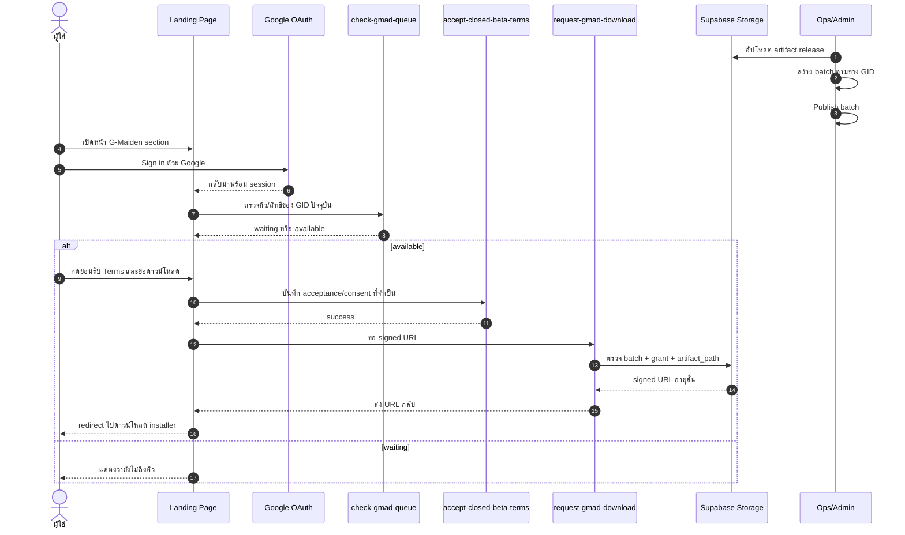
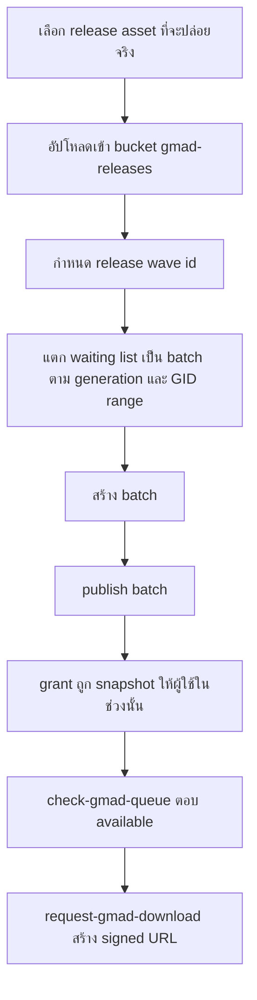

# G-Maiden Closed Beta Release Playbook

เอกสารนี้เป็น archived playbook สำหรับทีมที่เคยใช้ปล่อยสิทธิ์ดาวน์โหลด G-Maiden Closed Beta ผ่าน landing page
โดยเก็บ implementation reference จาก `landing/` + Supabase project สำหรับการทบทวนย้อนหลังและงาน operator ภายใน

> สถานะล่าสุด ณ 2026-07-23: public landing page ถูกถอด flow เช็กคิวดาวน์โหลด, route `/ops`,
> และหน้า Terms/Privacy สำหรับ Closed Beta ออกจากหน้าเว็บสาธารณะแล้ว เพื่อเตรียมรับ roadmap
> การปล่อยโปรดักต์รอบถัดไป ส่วน backend artifacts/functions เดิมยังคงเก็บไว้เป็นโครงปฏิบัติการภายใน
> จนกว่าจะมีเอกสาร supersede ชุดใหม่

## 1. เป้าหมายของระบบเดิมนี้

ระบบ Closed Beta เดิมมีหน้าที่ 3 อย่าง:

1. คุมว่าใคร “ถึงคิวดาวน์โหลด” ผ่าน grant ฝั่ง backend
2. แจกไฟล์ installer ผ่าน signed URL ระยะสั้นเท่านั้น
3. แยก reader-facing release wave ออกจาก technical storage path / function name ได้

ระบบนี้ไม่ได้ใช้:

- email เป็น bearer download link
- GID ที่พิมพ์เองเป็น credential
- public file URL แบบถาวร

## 2. ข้อเท็จจริงเชิงระบบที่ต้องจำ

### 2.1 หนึ่ง batch ครอบได้แค่ generation เดียว

`gmad_download_batches` บังคับว่า:

- `gid_start` และ `gid_end` ต้องอยู่ generation เดียวกัน
- `cohort_seq_start` ต้องน้อยกว่าหรือเท่ากับ `cohort_seq_end`

ดังนั้น release wave เดียวอาจแตกเป็นหลาย batches ได้ หาก waiting list กระจายหลาย generation

### 2.2 ผู้ใช้จะเปลี่ยนจาก `waiting` เป็น `available` ก็ต่อเมื่อครบทุกเงื่อนไขใน flow เดิม

ต้องมีพร้อมกันทั้งหมด:

1. artifact ถูกอัปโหลดเข้า private bucket `gmad-releases`
2. มี batch ที่ชี้มาที่ `artifact_path` นั้น
3. batch ถูก publish แล้ว
4. มี grant ของ user คนนั้นใน `gmad_download_grants`

ถ้าขาดข้อใดข้อหนึ่ง `check-gmad-queue` จะยังไม่ปล่อยให้โหลด

### 2.3 `artifact_path` เป็น relative path ภายใน bucket

ค่า `artifact_path` ต้อง:

- ไม่ขึ้นต้นด้วย `/`
- ไม่มี `..`
- เป็น key ภายใน bucket `gmad-releases`

ตัวอย่างที่ถูกต้อง:

`windows/closed-beta/2026-07-22/gmaiden-cb-2026-07-22-v0-13-0/g-maiden-0.13.0-x64-setup.exe`

## 3. Sequence diagram ของ flow เดิมก่อน retirement

> หมายเหตุ: sequence นี้เก็บไว้เป็น reference สำหรับ backend/operator flow เดิมเท่านั้น
> ไม่ได้สะท้อน public landing page ปัจจุบันแล้ว



## 4. Operator flow สำหรับปล่อย Closed Beta (dormant reference)



## 5. Naming convention ที่ใช้ต่อจากนี้

### 5.1 Release wave id

ใช้สำหรับ “รอบปล่อย” ระดับธุรกิจ/ปฏิบัติการ

รูปแบบ:

`gmaiden-cb-YYYY-MM-DD-vX-Y-Z`

ตัวอย่าง:

`gmaiden-cb-2026-07-22-v0-13-0`

### 5.2 Batch release_id

ใช้สำหรับ batch ที่ publish จริงใน generation ใด generation หนึ่ง

รูปแบบ:

`<release-wave-id>-<generation-lower>`

ตัวอย่าง:

- `gmaiden-cb-2026-07-22-v0-13-0-b`
- `gmaiden-cb-2026-07-22-v0-13-0-f`

### 5.3 Artifact path

รูปแบบ:

`windows/closed-beta/YYYY-MM-DD/<release-wave-id>/g-maiden-<version>-x64-setup.exe`

ตัวอย่าง:

`windows/closed-beta/2026-07-22/gmaiden-cb-2026-07-22-v0-13-0/g-maiden-0.13.0-x64-setup.exe`

ไฟล์ signature ให้ใช้ path เดียวกันและเติม `.sig`

## 6. ขั้นตอนปล่อย release wave ใหม่ (dormant operator runbook)

1. ยืนยันว่า asset ที่จะปล่อย “ดาวน์โหลดได้จริง”
   - แนะนำให้ใช้ asset จาก GitHub Release ที่ publish แล้ว
   - ถ้าไฟล์ local ใหญ่กว่า storage limit ของ project ให้ตรวจ size limit ก่อน

2. อัปโหลดไฟล์เข้า bucket `gmad-releases`
   - installer
   - signature (`.sig`) ถ้ามี

3. ตรวจ waiting roster
   - list GID
   - generation
   - cohort sequence

4. group เป็น batches
   - หนึ่ง batch ต่อหนึ่ง generation
   - หนึ่ง batch ต่อหนึ่งช่วง `gid_start -> gid_end`

5. สร้าง/publish batches
   - `label`
   - `release_id`
   - `artifact_path`
   - `gid_start`
   - `gid_end`

6. verify หลังปล่อย
   - object อยู่ใน bucket
   - batch เป็น `published`
   - grants ถูกสร้างครบ
   - ผู้ใช้ในช่วงนั้น `check-gmad-queue` ได้สถานะ `available`

## 7. ความต่างระหว่าง Closed Beta กับ Open Beta

### Closed Beta

- เข้าถึงผ่าน waiting list / invite / grant
- ต้องมี batch publish ให้ก่อน
- signed URL ออกให้เฉพาะผู้ใช้ที่ผ่าน entitlement

### Open Beta

- วันที่เปิดตามแผนปัจจุบันคือ `2026-07-24 18:00 ICT`
- public landing ปิด queue gate และ download gate ชั่วคราวแล้ว
- แต่ยังควรคงการตรวจ Terms / entitlement shape / signed URL policy ถ้ายังไม่ต้องการ public mirror

## 8. Release log ที่ยืนยันแล้ว ณ 2026-07-22

รอบปล่อยจริงชุดแรกที่ verify แล้ว:

### Release wave

- `gmaiden-cb-2026-07-22-v0-13-0`

### Artifact

- `windows/closed-beta/2026-07-22/gmaiden-cb-2026-07-22-v0-13-0/g-maiden-0.13.0-x64-setup.exe`
- `windows/closed-beta/2026-07-22/gmaiden-cb-2026-07-22-v0-13-0/g-maiden-0.13.0-x64-setup.exe.sig`

### Published batches

- `gmaiden-cb-2026-07-22-v0-13-0-b`
  - Gen B
  - `G-B4A8G3AS7` -> `G-B4AKAR5G9`
- `gmaiden-cb-2026-07-22-v0-13-0-f`
  - Gen F
  - `G-F496Z2TUG` -> `G-F496Z2TUG`

### Waiting list ที่ถูกปล่อยแล้วในรอบนี้

- `G-B4A8G3AS7`
- `G-B4A8G3ATF`
- `G-B4AKAR5G9`
- `G-F496Z2TUG`

## 9. ข้อควรระวัง

1. อย่าคิดว่า release wave หนึ่งเท่ากับหนึ่ง batch เสมอ
2. อย่าผูก download link ถาวรไว้ใน email
3. อย่าใช้ typed GID เป็นตัวตัดสินสิทธิ์แทน authenticated user + grant
4. อย่าปล่อย object เข้าพาธที่อ่านไม่ออกจากชื่ออย่างเดียว
5. อย่าข้ามขั้น verify ว่า object อยู่ใน bucket จริงก่อน publish

## 10. Checklist สั้นก่อนกดปล่อย

- [ ] เลือก asset release ถูก version
- [ ] ตั้ง release wave id แล้ว
- [ ] อัปโหลด `.exe` แล้ว
- [ ] อัปโหลด `.sig` แล้ว
- [ ] แยก waiting roster ตาม generation แล้ว
- [ ] ตั้ง `release_id` ของแต่ละ batch แล้ว
- [ ] ตั้ง `artifact_path` ตรงกับ object จริงแล้ว
- [ ] publish batch แล้ว
- [ ] ตรวจ grants แล้ว
- [ ] ทดสอบ user state ว่าเป็น `available` แล้ว

## 11. Operator snapshot เดิมบน `/ops`

route `/ops` ถูกถอดออกจาก public landing แล้ว แต่รายละเอียดด้านล่างยังเก็บไว้เป็น reference
สำหรับ operator tooling ภายใน หากในอนาคตมีการนำ controller surface กลับมาใช้ใหม่:

- current release wave จาก `release_id` ของ published batch ล่าสุด
- `artifact_path` ของ wave ที่กำลังปล่อย
- เวลาที่ publish ล่าสุด
- จำนวน batch ที่ published / draft / paused
- coverage ของ roster ที่โหลดมา เทียบกับ published batches ปัจจุบัน
- checklist สำหรับบอกว่า wave ปัจจุบันพร้อม, ยังมี draft ค้าง, หรือยังมี GID ที่ roster ที่โหลดมายังไม่ถูกครอบ

หลักคิด:

1. หน้า `/ops` ใช้เพื่อ “คุมสถานะการปล่อย” ไม่ใช่แค่สร้าง draft
2. ค่าที่แสดงต้องคำนวณจาก payload จริงของ `admin-gmad-controller`
3. ถ้า roster ที่โหลดมาไม่ครบทั้งหมด ต้องเตือนชัดว่า coverage ที่เห็นเป็น coverage ของชุดข้อมูลที่โหลดมา ไม่ใช่ทั้งระบบ

## IAM live probe

สำหรับ Boss เท่านั้น: หลัง sign in ใน G-Maiden desktop ให้เปิด DevTools และอ่าน Supabase session
เพื่อคัดลอกค่า `access_token` ของ session นั้นเท่านั้น ห้ามใส่ token ในเอกสาร, issue, chat หรือ
คำสั่งที่ commit ลง shell history จากนั้นรัน probe ใน PowerShell แบบชั่วคราว:

```powershell
$env:GMAD_ACCESS_TOKEN = Read-Host -MaskInput "Paste Supabase access token"
try { node scripts/iam-live-probe.mjs } finally { Remove-Item Env:GMAD_ACCESS_TOKEN -ErrorAction SilentlyContinue }
```

สคริปต์ใช้ค่า public Supabase URL/publishable key จาก `src/src/supabase.ts` เป็นค่าเริ่มต้น และเรียก
เฉพาะ `iam-security-state`, `iam-security-events` และ `admin-gmad-controller` action `list`
แบบอ่านอย่างเดียว ผลลัพธ์แต่ละบรรทัดจะแสดงเฉพาะ `status`, error code ที่อ่านได้ และ verdict;
จะไม่แสดง token, headers, response body หรือ identifiers. รหัส exit เป็น `0` เมื่อทั้งสามผลลัพธ์
อยู่ใน verdict ที่รู้จัก และเป็น `1` เมื่อมีผลลัพธ์ไม่รู้จักหรือเชื่อมต่อไม่ได้

## Changelog

| Version | Date | Status | Summary | Commit Hash | Agent |
| --- | --- | --- | --- | --- | --- |
| 0.2.2 | 2026-07-23 | active | Reframed this document as an archived/dormant operator reference so it no longer describes the removed public landing queue/download flow as current behavior. | null | ATHER |
| 0.2.1 | 2026-07-23 | active | Marked the public landing Closed Beta queue/download flow, `/ops`, and Terms/Privacy routes as retired while backend release infrastructure remains dormant for the next roadmap. | null | ATHER |
| 0.2.0 | 2026-07-22 | active | Added the `/ops` operator snapshot contract: current release wave, artifact path, publish recency, loaded-roster coverage, and checklist expectations. | null | ATHER |
| 0.1.0 | 2026-07-22 | active | Added the operational playbook for G-Maiden Closed Beta release flow, sequence diagram, naming convention, release checklist, and the verified 2026-07-22 release log. | null | ATHER |
| 0.2.3 | 2026-08-28 | active | Added the read-only IAM live probe procedure and safe verdict/exit-code interpretation for CR-034 T3. | null | Codex lane A2 |
| 0.2.4 | 2026-08-28 | active | Masked transient IAM probe token input in PowerShell while preserving environment cleanup. | null | Codex lane A2 |
