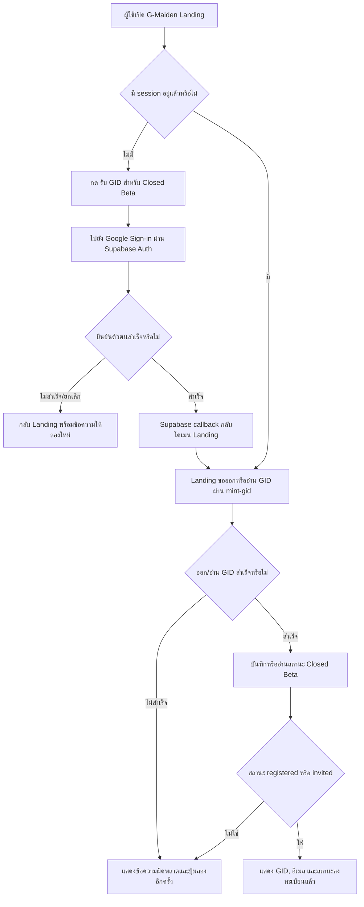
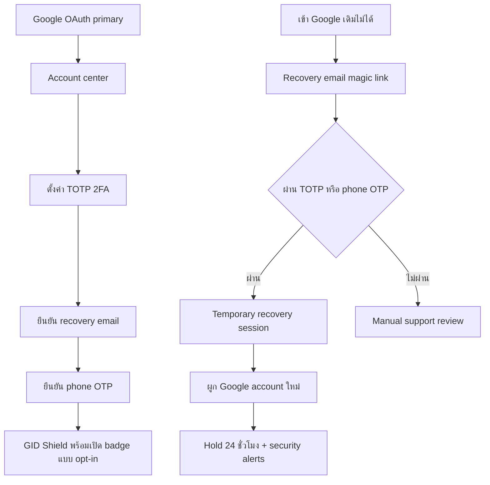

# G-Maiden Thai-first Landing — Design System

> **Implementation status:** approved and deployed to production for beta validation on 2026-07-20

## 1. Objective

แทนที่ fake-door landing เดิมด้วย landing ที่เปิดด้วย fullscreen hero สำหรับ **G-Maiden** โดยใช้
โครง composition จาก brief “VANGUARD” เท่านั้น ได้แก่ full-bleed video, transparent navigation,
display headline 3 บรรทัด, CTA, proof row และ mobile menu overlay

สิ่งที่ **ไม่** นำมาจาก VANGUARD: ชื่อแบรนด์, creative-agency positioning, claims, สี และภาพลักษณ์
ทั้งหมดต้องเป็น G-Maiden และอ้าง product truth ใน repo

## 2. Complexity and risk

- **Complexity:** C-3 — Architecture-Driven Implementation (`Text → Doc → Diagram → Code`)
- **Risk:** HIGH — Hero ใช้ reviewed GLB, lazy WebGL runtime, accessibility fallback และ production asset provenance
- **Parent alignment:** ใช้ product truth จาก `docs/product/product-requirements.md` และ
  `docs/product/software-requirements-specification.md`
- **Peer alignment:** ใช้ COLD BOOTH palette จาก `docs/design-system/02-tokens.md` แต่แยก namespace
  ของ landing เพื่อไม่ชนกับ Command Deck
- **Known impact:** pricing/waitlist fake-door UI และ `tier_click` analytics ใน landing เดิมถูกถอดออก;
  อนุญาตเฉพาะ Vercel Web Analytics แบบ aggregate page view ตาม §11.1 โดยไม่มี custom event และไม่แตะ
  Tauri app, overlay, GSI, auth หรือ release version

## 3. Accepted concept

- Native concept size: `1672 × 941` (ประมาณ 16:9)
- Concept มีหน้าที่ล็อก composition, hierarchy, density และ G-Maiden color direction
- Production background ต้องใช้ video URL ที่ผู้ใช้ระบุ ไม่ใช้ภาพ arena ใน concept เป็น asset จริง
- VANGUARD ใช้เป็น structural reference เท่านั้น และต้องไม่มีคำว่า `VANGUARD` ในหน้า production

## 4. Page anatomy

หน้าเดียวสูง `100svh`/`100dvh` โดยไม่เกิด page scroll ใน viewport ปกติ:

1. Fullscreen looping background video
2. Readability layer แบบ neutral black เฉพาะบริเวณที่จำเป็น ห้าม tint วิดีโอเป็นสีน้ำเงิน
3. Navbar ด้านบน
4. Hero content ชิดซ้ายและกึ่งกลางแนวตั้ง
5. Proof metrics ด้านล่างของ content column
6. Mobile menu overlay ด้านบนสุดเมื่อเปิด

Container เป็น open/full-bleed composition — ไม่มี card, glass panel, bento grid หรือ rounded shell

## 5. Visible-copy lock

ข้อความเหนือ fold ที่อนุญาตมีเฉพาะรายการนี้:

| Role | Copy |
| --- | --- |
| Brand | `G-MAIDEN` |
| Desktop/mobile nav | `FEATURES`, `HOW IT WORKS`, `PRIVACY`, `FAQ` |
| Nav action | `JOIN THE BETA` |
| Hero label | `REAL-TIME AI COMPANION FOR DOTA 2` |
| H1 line 1 | `SEE DANGER.` |
| H1 line 2 | `REACT FASTER.` |
| H1 line 3 | `STAY ALIVE.` |
| Supporting copy | `Maiden watches the match, warns you by voice, and keeps your focus where it belongs — in the game.` |
| Primary CTA | `SEE HOW IT WORKS` |
| Trust proof | `LOCAL-FIRST` / `PRIVACY BY DEFAULT` |
| Metric 1 | `≤300MS` / `SIGNAL LATENCY` |
| Metric 2 | `≤2.5%` / `BACKGROUND CPU` |
| Metric 3 | `LOCAL` / `MATCH DATA` |

ห้ามเพิ่ม eyebrow, badge, testimonial, pricing, social proof หรือ product claim อื่นใน hero โดยไม่แก้
เอกสารและขออนุมัติใหม่

## 6. Design tokens

### 6.1 Color

| Token | Value | Role |
| --- | --- | --- |
| `--landing-void` | `#06070A` | fallback/background edge |
| `--landing-text` | `#EEF4FB` | primary text |
| `--landing-text-dim` | `rgba(238, 244, 251, 0.70)` | body/supporting text |
| `--landing-text-mute` | `rgba(238, 244, 251, 0.50)` | labels and proof captions |
| `--landing-ice` | `#8FD4FF` | brand/action/focus accent |
| `--landing-ice-bright` | `#9BE7FF` | icon/highlight |
| `--landing-action` | `#226CFF` | primary CTA fill |
| `--landing-signal` | `#A3E635` | tiny live/signal marker only |
| `--landing-border` | `rgba(207, 236, 255, 0.30)` | outline action |
| `--landing-scrim` | `rgba(0, 0, 0, 0.95)` | mobile menu |

**Color lock:** dark/blue-biased black + ice palette; lime ใช้เฉพาะ attention signal ไม่ใช่ CTA หลัก

### 6.2 Typography

| Role | Family | Weight | Scale / treatment |
| --- | --- | --- | --- |
| Brand + display | `FSP DEMO - PODIUM Sharp 4.11`, condensed fallback | 700 | uppercase, sharp, `clamp(2.8rem, 8vw, 7rem)` for H1 |
| UI + body | `Inter`, system sans-serif | 400–700 | uppercase UI with wide tracking; readable body copy |
| H1 | Podium | 700 | line-height `0.92`, tight tracking |
| Hero label | Inter | 500 | `12–14px`, tracking `0.3em` |
| Body | Inter | 400 | `14–16px`, relaxed line-height |
| Metric value | Inter | 700 | `24–48px`, tabular numerals |
| Metric label | Inter | 500 | `9–12px`, uppercase, wide tracking |

Font loading follows the supplied brief in `index.html`. Production release must confirm that the
Podium demo webfont license permits this deployment; if not, approval is required before substituting
another condensed display face.

### 6.3 Spacing and geometry

- Viewport gutter: `24px` mobile, `40px` small desktop, `64px` large desktop
- Navbar vertical padding: `20px` mobile, `28px` large desktop
- Hero content max width: `min(46rem, 58vw)` desktop; full available width mobile
- Vertical rhythm: `16 · 24 · 32 · 40 · 56px`
- Buttons: square/near-square corners (`0–2px`), never pill
- Border: `1px` translucent ice-white
- No card radius/elevation system because the accepted container model has no cards

## 7. Media treatment

- Source: original G-Maiden Ice Mage จาก MPFB2 2.0.16 base และ MakeHuman system assets ที่เป็น CC0; ไม่มี Valve/Dota model, costume, logo หรือ asset
- Production delivery: GLB `1,625,728 bytes` + transparent WebP fallback `34,400 bytes` ภายใต้ CR-026/CR-028 provenance gate
- Motion: Three.js lazy-load, baked guardian idle 1 clip, bounded cursor parallax และ passive scroll response
- Runtime gate: เปิด WebGL เฉพาะ `pointer: fine`, ไม่เปิดเมื่อ `prefers-reduced-motion: reduce` และ fallback อัตโนมัติเมื่อโหลดไม่ได้
- Fit: character อยู่ฝั่งขวาและไม่รับ pointer event; headline, Countdown และ CTA เป็น semantic HTML นอก canvas
- Background: CSS-only cold-stage gradient, particle layer และ perspective floor grid; ไม่ใช้ภาพตัวละครเก่าใน production runtime
- Readability: neutral black left-edge scrim รักษา text-safe zone และ contrast ของ CTA
- Prohibited: external copyrighted character media, runtime physics, audio, gameplay animation หรือ canvas ที่บัง interaction

## 8. Components and states

### Navbar

- Desktop (`md+`): brand left, four links centered, one outlined action right
- Mobile (`<md`): brand left, three-bar menu button right
- All interactive elements receive visible ice focus rings and minimum 44px hit targets

### Mobile menu

- Fixed fullscreen `z-50`, black 95% + restrained backdrop blur
- Brand + close icon in header row
- Nav links centered vertically in Podium at `40–48px`
- Items enter with `80ms` stagger; close returns focus to menu trigger
- `Escape` closes the menu; body scroll is locked while open

### Hero actions

- Primary CTA: `รับ GID สำหรับ Closed Beta` → Google OAuth PKCE บน Supabase `gstore`
- Secondary CTA: `ดูการทำงาน` → technical design document
- Signed-in state: แสดง immutable GID + account email และข้อความให้ใช้ Google account เดียวกันใน desktop app
- Loading/error/signed-out/registered เป็น honest states; control ที่กำลังทำงานถูก disable
- Vercel Web Analytics เก็บเฉพาะ aggregate page view ตาม §11.1; enrollment เก็บ identity status เท่านั้น

### Closed Beta identity

- Google OAuth only ตาม ADR-14; browser callback กลับ origin/path เดิมบน Vercel
- signup ใหม่หลังเปิด beta ได้ generation `B`; GID เดิม `F/P` ไม่เปลี่ยน
- landing เรียก Edge Function `mint-gid`; ห้ามเขียน `gid_code`/`generation` จาก browser
- `closed_beta_enrollments` เปิด RLS: anon ไม่มีสิทธิ์, authenticated select/insert เฉพาะ row ตัวเอง,
  ไม่มี update grant จึง self-approve เป็น `invited` ไม่ได้
- web session ไม่ถูกส่งเข้า desktop ผ่าน URL; desktop login ด้วย Google account เดิมแล้ว resolve UUID/GID เดิม

### User journey: สมัครและเข้าสู่ระบบ Closed Beta

### GID Security และ Web Profile (ข้อกำหนดที่เสนอ — ยังไม่พัฒนา)

- Google OAuth ยังคงเป็นวิธี sign-in หลักเพียงวิธีเดียว; ไม่มี username/password สำหรับ login และ GID
  เป็นรหัสระบุตัวตนถาวร ไม่ใช่ credential หรือ recovery factor
- Landing มีสองพื้นที่ที่แยกหน้าที่ชัดเจน: public profile (`/u/<handle-or-gid>`) แสดงเฉพาะข้อมูลที่เจ้าของ
  เลือกเผยแพร่ และ account center (`/account`) สำหรับเจ้าของที่ sign-in แล้ว เพื่อจัดการ display name,
  avatar, Steam link, การแจ้งเตือน และความปลอดภัย. Display name แก้ได้จาก Desktop หรือ account center;
  การเปลี่ยนต้องสะท้อน identity เดียวกัน
- Public profile ห้ามแสดง email, เบอร์โทร, recovery email, ประวัติ security activity, session, GID secret
  material หรือข้อมูล match/CV/G-Log. การมีหน้า profile ไม่เปลี่ยนหลักการ local-first ของข้อมูลเกม
- `GID Shield` เป็น badge ที่ผู้ใช้เลือกแสดงบน public profile ได้. Badge หมายถึงเปิด Google primary,
  TOTP 2FA, recovery email ที่ยืนยันแล้ว และ phone OTP ที่ยืนยันแล้วเท่านั้น; ไม่ใช่การยืนยันตัวตนทางกฎหมาย
  หรือการรับรองระดับฝีมือ. สถานะ security เริ่มต้นเป็น private
- TOTP เป็น second factor หลัก. Phone OTP ใช้เป็น recovery/contact factor เท่านั้น และต้องมี rate limit,
  consent, E.164 normalization และ SMS provider ที่ได้รับอนุมัติก่อนทำจริง; ห้ามใช้เบอร์โทรเพียงอย่างเดียว
  เพื่อย้ายบัญชีหรือเปลี่ยน Google identity
- Recovery email ใช้ passwordless magic link. เมื่อเข้า Google เดิมไม่ได้ ต้องผ่าน recovery email และ
  TOTP หรือ phone OTP เพื่อออก recovery session ชั่วคราว; การผูก Google account ใหม่มี hold 24 ชั่วโมง
  และส่ง security alert ไปยังช่องทางเดิม/สำรอง. หากหายทุก factor ต้องเข้าสู่ manual support review;
  Steam หรือ GID อย่างเดียวไม่พอสำหรับ recovery
- Security activity ที่ต้องแจ้งทันที: login/new device, เริ่มหรือจบ recovery, เปลี่ยน Google identity,
  TOTP, phone หรือ recovery email. ข่าวสารผลิตภัณฑ์เป็น opt-in แยกต่างหากและยกเลิกได้. ห้ามส่ง raw match,
  CV หรือ G-Log ออกนอกเครื่องในทุกกรณี
- ข้อมูล phone/recovery/security ต้องแยกจาก public `profiles`, จำกัดด้วย RLS และไม่เก็บ secret หรือ
  authorization state ใน client-accessible user metadata. ต้องมี threat model และ schema/migration review
  ก่อน implementation เพราะเป็นการเปลี่ยนระดับ C-3 / HIGH

- Google เป็นช่องทางยืนยันตัวตนช่องทางเดียวของ Landing และไม่ส่ง session/token เข้า desktop ผ่าน URL
- `mint-gid` ต้องรับ browser preflight และตอบ CORS headers ทุกสถานะ ก่อนตรวจ JWT และออก GID
- ผู้ใช้ที่กลับมาอีกครั้งใช้ flow เดิมเพื่ออ่าน GID และสถานะเดิม ไม่ออก GID ซ้ำ

### Icons

ใช้ `lucide-react` เท่านั้น:

| Icon | Use | Size | Stroke |
| --- | --- | --- | --- |
| `ArrowUpRight` | nav and primary CTA | `16px` | default Lucide outline |
| `Crown` | hero label | `16px` | ice-bright, 70% opacity |
| `Award` | local-first trust proof | `32px` | text-mute |
| `X` | close mobile menu | `24px` | white |

Hamburger ใช้สาม CSS bars ตาม brief ไม่เพิ่ม icon dependency อื่น

## 9. Motion

| Token | Value | Use |
| --- | --- | --- |
| `--landing-enter` | `800ms ease-out` | fade-up hero elements |
| `--landing-stagger` | `200ms` | hero sequence |
| `--landing-menu` | `500ms ease-out` | menu visibility |
| `--landing-menu-stagger` | `80ms` | menu link sequence |
| `--landing-hover` | `200ms ease-out` | border/color/icon movement |

ลำดับ hero: label `0ms` → H1 `200ms` → supporting copy `400ms` → CTA `600ms` → metrics `800ms`.
ภายใต้ `prefers-reduced-motion: reduce` ให้ยกเลิก transform/stagger และแสดง content ทันที

## 10. Responsive behavior

- Breakpoints: `sm 640px`, `md 768px`, `lg 1024px`
- Desktop nav และ action แสดงที่ `md+`; mobile menu trigger แสดงต่ำกว่า `md`
- Award proof ซ่อนต่ำกว่า `sm`
- CTA และ metrics ใช้ `flex-wrap`; ห้าม horizontal overflow ที่ `320px`
- H1 ใช้ clamp และต้องไม่ชน CTA/metrics บน laptop viewport `1366 × 768`
- Mobile viewport ใช้ `100svh` เพื่อหลีกเลี่ยง browser chrome ตัด content

## 11. Implementation inventory

Landing ใช้ React + Vite + TypeScript + Tailwind แยกจาก app หลัก:

- `landing/package.json`
- `landing/index.html`
- `landing/vite.config.ts`
- `landing/tailwind.config.js`
- `landing/postcss.config.js`
- `landing/tsconfig*.json`
- `landing/src/main.tsx`
- `landing/src/App.tsx` — component เดียวตาม brief, `useState` สำหรับ mobile menu
- `landing/src/beta.ts` — Google OAuth PKCE + server-authoritative GID/enrollment state
- `landing/src/index.css`
- `landing/assets/hero/g-maiden-sea-captain-stone-titan-v1.webp` — optimized production hero art
- `landing/README.md` — local dev/build/deploy instructions
- `supabase/migrations/20260720183000_cr005_closed_beta_registration.sql`
- `supabase/migrations/20260720184500_cr005_beta_rls_initplan.sql`
- `supabase/tests/cr005_closed_beta_registration.sql`

Dependencies จำกัดไว้ที่ React, Vite, TypeScript, Tailwind/PostCSS/Autoprefixer, `lucide-react` และ
`@supabase/supabase-js` กับ `@vercel/analytics` แบบ pinned. ไม่เพิ่ม router หรือ state library

### 11.1 Web Analytics privacy boundary

- ใช้ `@vercel/analytics/react` สำหรับ React + Vite; ห้ามใช้ entrypoint `/next`
- เก็บเฉพาะ page view แบบ aggregate และไม่สร้าง custom event
- `beforeSend` ต้องตัด query string และ fragment ออกจาก URL ก่อนส่งทุกครั้ง
- ห้ามส่ง email, GID, OAuth code/token, Supabase session, account state, match state, CV detection หรือ G-Log
- Analytics เป็นของ public landing เท่านั้นและไม่ถูกนำเข้า desktop application
- Production source คือ private repository `Freshair129/g-maiden-landing`; branch `main` deploy production
  ผ่าน Vercel Git integration และ branch อื่นใช้ preview deployment

## 12. Acceptance, success, and exit criteria

### Acceptance criteria

- ชื่อและ copy ทั้งหมดเป็น G-Maiden; ไม่มี VANGUARD production copy
- ใช้ exact CloudFront video URL และ media attributes ตาม brief
- Desktop/mobile composition และ mobile menu ตรง spec
- Color/type/icon/motion ใช้ tokens และ component rules ในเอกสารนี้
- Keyboard navigation, `Escape`, focus return และ reduced-motion ทำงาน
- CTA Google OAuth ทำงานจริง; successful signup แสดง GID และลง enrollment แบบ idempotent
- Analytics ส่งเฉพาะ redacted page view และไม่ส่ง query/fragment หรือข้อมูล account/game
- signup ใหม่เป็น generation `B`; existing GID ไม่ถูกเปลี่ยน
- anon/cross-user/self-approve ถูก RLS/grants ปฏิเสธ
- public profile ไม่เผยข้อมูลติดต่อหรือข้อมูลเกมภายในเครื่อง และ public badge ต้อง opt-in
- ไม่มี password login; GID/Steam เพียงอย่างเดียวใช้ recovery หรือเปลี่ยน Google identity ไม่ได้
- recovery ต้องบังคับ recovery email ร่วมกับ TOTP หรือ phone OTP, ทำ hold 24 ชั่วโมงก่อน rebind identity
  และบันทึก/แจ้ง security activity

### Success criteria

- Build และ TypeScript ผ่านโดยไม่มี error
- ไม่มี overflow ที่ `320 × 568`, `390 × 844`, `768 × 1024`, `1366 × 768`, `1440 × 900`
- Primary content ไม่ถูกตัดใน viewport เล็ก
- Video error มี dark fallback และ content ยังอ่านได้
- hero artwork ≤250 KB และไม่มี external background-video request
- production callback กลับ landing origin ที่อยู่ใน Supabase redirect allow list

### Exit criteria

- ตรวจ browser จริงทั้ง desktop/mobile และเปิด/ปิด mobile menu
- จับ screenshot ที่ native concept ratio เมื่อทำได้
- เปรียบเทียบ concept กับ render อย่างน้อย 5 จุด: copy, composition, typography, palette,
  media treatment, spacing, responsive behavior และ motion
- ทำ above-the-fold copy diff ได้ผลตรงกับ §5
- รัน `codedoc-aligner`; exit `2` ถือว่า gate ไม่ผ่าน ไม่ใช่ aligned
- ไม่แตะ/รวมไฟล์ dirty เดิมที่อยู่นอก `landing/`

## 13. Thai-first feature signal rails

- ภาษาไทยเป็นภาษาหลักของ navigation, hero, metrics, state และ feature copy
- Section `#features` ต่อจาก hero ด้วย numbered signal rails 01–04 แบบเปิดโล่ง ไม่ใช้ card grid
- Positioning หลักคือบัดดี้ที่คอย `watch your back` และช่วยเก็บตกสัญญาณที่อาจพลาด
- ห้ามสื่อว่าเห็นเกมล่วงหน้า เข้าถึงข้อมูลที่ผู้เล่นทั่วไปไม่เห็น หรือทำนายเส้นทาง/เจตนาศัตรู
- Diagnostic proof ใช้เฉพาะ observed state: missing timer, threshold, advice context, local log/resource status
- Source concept: `assets/concepts/g-maiden-feature-signal-rails-v2.png`; production สร้างด้วย semantic HTML/CSS

## 14. Out of scope

- การเปลี่ยน Command Deck, overlay หรือ Rust backend
- pricing, custom-event analytics, social graph, invite admin dashboard และ email campaign
- Desktop app version bump, GitHub release และ tag; Landing production deploy อยู่ภายใต้ CR-028 เท่านั้น
- การใช้ concept image เป็น production background
- prediction percentage, hidden-information claim และ future path projection
- การ implement MFA, SMS provider, schema migration, recovery workflow หรือ public-profile routes ก่อนผ่าน
  threat-model และ approval gate

## CHANGELOG

| Version | Date | Status | Summary | Commit Hash | Agent |
| --- | --- | --- | --- | --- | --- |
| 0.1.0b | 2026-07-20 | candidate | Initial G-Maiden landing design-system proposal using the VANGUARD brief as structural reference | — | ATHER |
| 0.2.0b | 2026-07-20 | beta | Approved implementation; added production cold video grade and Vercel deployment state | — | ATHER |
| 0.3.0b | 2026-07-20 | beta | Original cinematic hero, Closed Beta Google OAuth/GID enrollment, RLS contract and production verification gates | — | ATHER |
| 0.4.0b | 2026-07-20 | beta | Thai-first hero and open feature rails; watch-your-back positioning without prediction overclaims | — | ATHER |
| 0.4.1b | 2026-07-20 | beta | Production asset isolation and verified Vercel deployment | — | ATHER |
| 0.5.0b | 2026-07-20 | beta | Approved aggregate Vercel page-view analytics with URL redaction and standalone Git deployment contract | — | ATHER |
| 0.5.1b | 2026-07-21 | beta | Added Closed Beta signup and login user-flow diagram, including callback, GID, registration, and recoverable failure states | - | ATHER |
| 0.6.0b | 2026-07-21 | beta | Added proposed GID Shield, 2FA, phone/recovery, security notification, and privacy-safe web-profile contract | - | ATHER |
| 0.7.0b | 2026-07-21 | beta | Replaced the static two-character Hero with the reviewed MPFB2 G-Maiden GLB, accessible fallback, bounded cursor/scroll motion, and CR-028 production handoff | - | ATHER |
